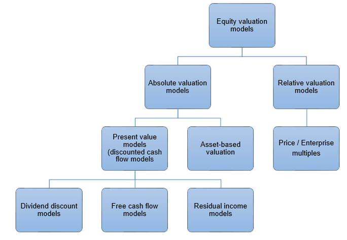

Financial analysis is a fundamental component of investment decision-making, providing investors with the tools necessary to evaluate financial data and make informed choices. It involves the examination of financial statements, such as balance sheets, income statements, and cash flow statements, to assess a company's performance and predict future financial health. By analyzing key financial ratios and trends, investors can identify potential investment opportunities and risks, ultimately guiding the allocation of capital in a way that maximizes returns and minimizes losses.

Valuation models play a critical role in financial analysis by helping determine the intrinsic value of a financial asset. These models aid investors in understanding whether an asset is overvalued, undervalued, or fairly valued relative to its market price. Valuation models can be categorized into two main types: absolute valuation models, which focus on deriving an asset’s intrinsic value without direct comparison to other assets, and relative valuation models, which compare the asset in question to others within the same sector or market. These models utilize various financial metrics and ratios to evaluate an asset’s worth, assisting investors in making strategic investment decisions.



Algorithmic trading represents a significant technological advancement in the financial markets, utilizing automated systems and complex algorithms to execute trades at high speeds and volumes. This method of trading has revolutionized how financial markets operate, contributing to greater market efficiency and liquidity. Algorithmic trading strategies often leverage quantitative data and predictive analytics, allowing traders to capitalize on market inefficiencies and arbitrage opportunities. By reacting swiftly to market conditions, algorithmic trading enhances price discovery and improves the overall functioning of financial markets.

The purpose of this article is to explore the intersection of relative valuation models and algorithmic trading, examining how these two components interact to influence investment strategies and market dynamics. By understanding the synergy between valuation techniques and algorithmic trading, investors can better navigate the complexities of modern financial markets, optimizing their strategies to achieve advantageous outcomes. This article will delve into the intricacies of both relative valuation and algorithmic trading, providing insights into their combined effect on asset valuation and market performance.

## Table of Contents

## Understanding Relative Valuation Models

Valuation models are tools used by investors and analysts to estimate the value of financial assets such as stocks, bonds, and real estate. These models are crucial for making informed investment decisions. Valuation models can be broadly categorized into absolute and relative valuation models. Absolute valuation models, such as the Discounted Cash Flow (DCF) model, estimate an asset's intrinsic value based on its expected future cash flows, independent of external market conditions. In contrast, relative valuation models determine an asset's value by comparing it with similar assets using financial ratios.

Relative valuation models are popular due to their simplicity and effectiveness in comparing companies of similar characteristics within the same industry. Some common relative valuation models include:

1. **Price to Earnings (P/E) Ratio**: This ratio measures a company's current share price relative to its per-share earnings. It is calculated using the formula:
$$
   \text{P/E Ratio} = \frac{\text{Market Value per Share}}{\text{Earnings per Share (EPS)}}

$$

2. **Price to Book (P/B) Ratio**: It compares a company's market value to its book value. The P/B ratio is calculated as follows:
$$
   \text{P/B Ratio} = \frac{\text{Market Value per Share}}{\text{Book Value per Share}}

$$

3. **Enterprise Value to EBITDA (EV/EBITDA) Ratio**: This ratio assesses a company's valuation relative to its earnings before interest, taxes, depreciation, and amortization. It is calculated by:
$$
   \text{EV/EBITDA Ratio} = \frac{\text{Enterprise Value (EV)}}{\text{EBITDA}}

$$

These models offer several advantages. They provide benchmarks for valuing a company relative to peers, making it easier to identify undervalued or overvalued stocks. Relative valuation models also incorporate market sentiment and are useful when absolute valuation is challenging due to uncertain future cash flows.

However, there are limitations to using relative valuation models. They assume that the peer companies used for comparison are fairly valued and that market conditions remain stable, which may not always be the case. Additionally, differences in accounting practices across firms can result in inaccuracies in financial ratios.

In financial analysis, relative valuation models are frequently applied to benchmark a company against its industry peers. For instance, investors may use the P/E ratio to compare companies within the technology sector, identifying potential investment opportunities. Financial statements, such as income statements and balance sheets, play an essential role in providing the necessary data for these valuations. Industry benchmarks and market trends are likewise important, as they provide contextual framework to interpret the relative valuation metrics, ensuring that the analysis reflects both company performance and broader economic factors.

## Financial Analysis Techniques Using Valuation Models

Financial analysis using valuation models is a critical process that allows investors to determine the relative attractiveness of companies within the same sector. This is achieved by evaluating the financial data of these companies and employing certain valuation metrics to assess comparative value. Among the most common relative valuation models are the Price to Earnings (P/E), Price to Book (P/B), and Enterprise Value to EBITDA (EV/EBITDA) ratios. 

When conducting financial analysis with these models, investors begin by gathering and organizing financial data. This data is primarily sourced from financial statements, including income statements and balance sheets. The income statement provides insights into a company's profitability over a specific period, while the balance sheet offers a snapshot of the company's financial position at a point in time. By analyzing metrics such as net income, total assets, and equity, investors can calculate the relevant valuation ratios.

### Example
Consider a scenario where investors are comparing two companies within the technology sector using the P/E ratio. The P/E ratio is calculated as follows:

$$
\text{P/E Ratio} = \frac{\text{Market Price per Share}}{\text{Earnings per Share (EPS)}}
$$

By calculating the P/E ratios for both companies, investors can assess which company might be overvalued or undervalued relative to its peers. A lower P/E ratio may suggest that a company is undervalued, assuming the companies being compared have similar growth prospects and risk profiles. 

The role of financial statements in supporting valuation analyses cannot be overstated. These documents provide the raw data necessary for calculating valuation metrics and are crucial for understanding the financial health and operational performance of a business. Income statements reveal how revenue is transformed into net income, while balance sheets indicate the company's assets, liabilities, and shareholder equity.

Industry benchmarks and market trends play a significant role in relative valuation. Benchmarks provide a standard against which companies are assessed, helping investors to determine whether a company is performing above or below the industry average. Market trends, such as changes in consumer demand, technological advancements, or regulatory shifts, can also impact the valuation process. Investors need to account for these factors to make informed comparisons and evaluations.

In conclusion, the integration of financial analysis techniques with valuation models enables investors to make more informed investment decisions. By leveraging financial statements and considering industry benchmarks and trends, investors can effectively utilize relative valuation models to assess the comparative value of companies within the same industry.

## Algorithmic Trading and Its Influence on Valuation

Algorithmic trading, also known as algo trading, refers to the use of computer algorithms to automate trading decisions. It gained traction in the financial markets due to its ability to execute orders at speeds and efficiencies unattainable by human traders. The growth of powerful computing technologies and sophisticated algorithms has propelled the rapid rise of [algorithmic trading](/wiki/algorithmic-trading). According to data by Statista, algorithmic trading accounted for approximately 60-75% of trading [volume](/wiki/volume-trading-strategy) in the US equity markets by the early 2020s, highlighting its significance in contemporary finance.

Algorithmic trading strategies often incorporate valuation models to enhance decision-making processes. Fundamentally, valuation models provide a framework to determine the relative worth of an asset. When combined with algorithmic models, these valuations facilitate traders in making informed decisions quickly and accurately. For instance, relative valuation models, such as Price to Earnings (P/E) or Price to Book (P/B) ratios, offer a quantitative foundation that algorithms can leverage to identify mispricings across securities.

One typical use case is in [arbitrage](/wiki/arbitrage) opportunities. Algorithmic traders use quantitative data derived from relative valuation models to exploit price differentials in the market. For example, if a stock is undervalued compared to its peers based on its P/E ratio, an algorithm might initiate a buy order. Simultaneously, it might sell short a stock deemed overvalued, anticipating corrections that lead to a profit. This process, known as [statistical arbitrage](/wiki/statistical-arbitrage), reveals how algo trading utilizes valuation data for competitive gains.

The integration of algorithmic trading has notable impacts on market efficiency and price discovery, particularly concerning asset valuation. Market efficiency refers to the degree to which asset prices reflect all available information. Algorithmic trading contributes to this by significantly increasing trading volumes and enhancing [liquidity](/wiki/liquidity-risk-premium), facilitating faster incorporation of information into asset prices. This increased efficiency aids in accurate price discovery—where asset prices align closely with intrinsic values derived from [fundamental analysis](/wiki/fundamental-analysis).

However, the influence of algorithmic trading on valuation is not without challenges. The majority of these algorithms are predicated on historical data, which could pose risks if market conditions evolve unexpectedly. Additionally, high-frequency trading, a subset of algorithmic trading, has been scrutinized for potentially increasing market [volatility](/wiki/volatility-trading-strategies). Nonetheless, the prevalent use of algorithmic trading underscores its profound role in shaping contemporary financial markets and valuation practices, offering opportunities for more precise and efficient trading methodologies.

## Integrating Relative Valuation with Algo Trading

Combining relative valuation models with algorithmic trading offers a sophisticated approach to modern investing, capitalizing on the strengths of both methodologies to enhance portfolio performance. This integration requires strategies that effectively utilize valuation metrics within algorithmic frameworks, while also addressing inherent challenges and considerations.

**Strategies for Integration**

One common strategy for integrating relative valuation models with algorithmic trading involves quantifying standard valuation metrics into algorithmic decision-making processes. For instance, an algorithm can be programmed to buy stocks with lower Price to Earnings (P/E) ratios compared to industry averages, suggesting undervaluation. Similarly, stocks with favorable Enterprise Value to EBITDA (EV/EBITDA) ratios could be prioritized in trading models, indicating potential value relative to peers.

Here is a basic Python pseudocode snippet illustrating how an algorithm might incorporate P/E ratios:

```python
def select_stocks_based_on_PE(stock_data):
    selected_stocks = []
    industry_average_pe = calculate_industry_average_PE(stock_data)

    for stock in stock_data:
        if stock['PE_ratio'] < industry_average_pe:
            selected_stocks.append(stock['ticker'])

    return selected_stocks

def calculate_industry_average_PE(stock_data):
    total_pe = sum(stock['PE_ratio'] for stock in stock_data)
    return total_pe / len(stock_data)
```

**Challenges and Considerations**

Integrating these models is not without challenges. A primary consideration is the quality and accuracy of the input data. Given that the performance of relative valuation metrics is contingent upon reliable data, discrepancies or outdated financial information can lead to erroneous valuations and poor trading decisions.

Another challenge is the model's dependence on market conditions; relative valuation is inherently comparative, meaning market fluctuations can distort relative metrics. Additionally, quantitative signals generated by these integrated models could sometimes lead to overcrowded trades, where multiple algorithms identify the same opportunity, increasing volatility.

**Future Trends and Technological Advancements**

The landscape of finance is continuously evolving, with advancements in technology promising to enhance the integration of relative valuation models with algorithmic trading. Machine learning and [artificial intelligence](/wiki/ai-artificial-intelligence) (AI) present opportunities to refine these strategies. AI systems can process vast amounts of data, potentially identifying more nuanced relationships in valuation metrics beyond traditional methods.

Moreover, developments in natural language processing (NLP) can enable algorithms to incorporate qualitative aspects, such as sentiment analysis from financial news, into their trading models, offering a more holistic view of valuation.

As data analytic tools and computational technologies continue to advance, they are likely to improve the accuracy and efficiency of hybrid strategies, providing investors with more robust tools for navigating financial markets. These innovations will facilitate more dynamic and adaptive models, seamlessly integrating valuation insights with algorithmic execution to optimize trading outcomes.

## Case Studies and Real-World Applications

In recent years, a number of financial firms have successfully blended relative valuation models with algorithmic trading strategies, yielding notable benefits, including improved market timing and enhanced investment returns. This section will explore several case studies to illuminate the practical applications and outcomes of such integration, as well as discuss the implications for investors and analysts.

### Case Study 1: Renaissance Technologies

Renaissance Technologies, a quantitative investment management company, exemplifies a successful integration of algorithmic trading with relative valuation metrics. The firm's Medallion Fund, managed by a team of scientists and mathematicians, reportedly incorporates relative valuation signals among its numerous inputs to capitalize on short-term market inefficiencies. By using high-frequency trading algorithms, Renaissance can swiftly exploit discrepancies in valuation ratios such as the P/E and EV/EBITDA across different stocks within the same sector.

**Practical Benefits and Outcomes:**
- **Enhanced Arbitrage Opportunities:** Using algorithmic trading allows Renaissance Technologies to react to valuation discrepancies faster than traditional methods.
- **Increased Trading Volume and Liquidity:** The speed and efficiency of the algorithms contribute to increased market liquidity, often resulting in tighter bid-ask spreads.

**Lessons Learned:**
- **Data-Driven Approaches:** Renaissance Technologies exemplifies how data-driven strategies provide a competitive edge in modern finance.
- **Complex Model Integration:** Successfully integrating valuation models with trading systems requires sophisticated modeling and robust computational infrastructure.

### Case Study 2: Two Sigma Investments 

Two Sigma Investments is another firm that applies [machine learning](/wiki/machine-learning) and statistical models to integrate relative valuation data within their quantitative strategies. Their approach involves the real-time analysis of large datasets to identify pricing inefficiencies across various financial instruments, capitalizing on differing valuation ratios across global markets.

**Practical Benefits and Outcomes:**
- **Global Market Insights:** By considering relative valuation models in their quantitative strategies, Two Sigma gains a better understanding of global market dynamics and can execute arbitrage strategies around the clock.
- **Risk Management Enhancements:** The integration helps in identifying over- or under-valued assets, assisting in risk-adjusted return optimization.

**Lessons Learned:**
- **Global Data Utilization:** Effective use of global datasets can enhance the accuracy of valuation assessments and improve strategy execution.
- **Continuous Model Evolution:** Financial markets are dynamic; hence, constant refinement and adaptation of models are critical to maintaining their efficacy.

### Case Study 3: AQR Capital Management

AQR Capital Management employs relative valuation metrics within its systematic investment strategies, focusing on quantitative assessments across asset classes. By integrating these models, AQR seeks to exploit inefficiencies and pursue both absolute and relative value opportunities.

**Practical Benefits and Outcomes:**
- **Diversification of Strategies:** Combining valuation models with algorithmic trading enables multi-strategy approaches, enhancing portfolio diversification.
- **Enhanced Return Potential:** Targeting undervalued assets through systematic evaluation can contribute to robust long-term returns.

**Lessons Learned:**
- **Complex Strategy Design:** Successful hybrid strategies require careful design and continuous validation to ensure alignment with market conditions.
- **Importance of Multi-Asset Class Analysis:** Understanding valuation across different asset classes can provide a comprehensive perspective on global investment opportunities.

### Implications for Investors and Analysts

The integration of relative valuation models with algorithmic trading underscores the critical need for robust analytical frameworks and technological infrastructure to remain competitive. As these case studies demonstrate, firms that effectively leverage quantitative techniques can capitalize on market inefficiencies, leading to significant investment gains. However, the complexity of integrating such models necessitates continual learning and technological adaptation by investors and analysts. With ongoing advancements in artificial intelligence and machine learning, the potential for even more refined and responsive trading strategies is substantial, heralding a new era for financial analysis and investment management.

## Conclusion

In this article, we have explored the complementary roles of relative valuation models and algorithmic trading in financial analysis. Understanding relative valuation models is crucial for assessing the value of financial assets by comparing them to similar entities. This approach aids investors in making informed investment decisions based on market benchmarks and industry-specific metrics, such as price-to-earnings (P/E) and enterprise value-to-EBITDA (EV/EBITDA) ratios.

The integration of algorithmic trading with valuation models represents a significant advancement in financial markets, offering increased efficiency and precision. Algorithmic trading leverages quantitative data to execute trades at speeds and frequencies that surpass human capabilities, thus enhancing market efficiency and the price discovery process. This synergy between valuation models and algorithms not only assists in identifying arbitrage opportunities but also plays a role in stabilizing market dynamics.

As financial markets continue to evolve with rapid technological advancements, understanding both of these tools becomes imperative for investors, analysts, and traders. The landscape is characterized by the interplay of complex systems, requiring continuous learning and adaptation. Embracing these developments is essential for maximizing investment strategies and maintaining a competitive edge.

In conclusion, the fusion of relative valuation models with algorithmic trading strategies underscores the transformation of modern financial practices. This evolution reflects not only the necessity for comprehensive analytical approaches but also the ongoing need for professional growth in adapting to new financial technologies. As such, financial professionals are encouraged to continually enhance their skills and understanding of these methodologies to navigate this dynamic environment effectively.

## References

- Damodaran, A. (2012). *Investment Valuation: Tools and Techniques for Determining the Value of Any Asset*. Wiley. This book provides comprehensive coverage of valuation techniques and is a fundamental resource for understanding both absolute and relative valuation models.

- Fabozzi, F. J., Focardi, S. M., & Kumar, P. N. (2006). *The Basics of Valuation Models*. Wiley. This text outlines the basic principles of valuation models, comparing both absolute and relative valuation techniques.

- Chan, L. K. C., & Lakonishok, J. (2004). "Value and Growth Investing: Review and Update". *Financial Analysts Journal*, 60(1), 71-86. This article examines various investment strategies, focusing on the effectiveness of value investing compared to growth investing, with evaluations based on relative valuation metrics.

- Pardo, R. (2008). *The Evaluation and Optimization of Trading Strategies*. Wiley. This book explores the principles of algorithmic trading and the quantitative methods used in developing trading strategies.

- Hasbrouck, J. (2003). "Intraday Price Formation in U.S. Equity Markets". *The Journal of Finance*, 58(6), 2375-2399. This paper studies the impact of algorithmic trading on price formation and market efficiency, offering insights into how valuation data is used by traders.

- Narang, R. K. (2009). *Inside the Black Box: The Simple Truth About Quantitative Trading*. Wiley. Narang discusses the intricacies of algorithmic trading, including the relationship between trading strategies and valuation models.

- Bloomberg, J. (2011). *The Agile Architecture Revolution: How Cloud Computing, REST-Based SOA, and Mobile Computing Are Changing Enterprise IT*. Wiley. While not directly related to trading and valuation, this book provides context for understanding technological advancements that influence algorithmic trading.

- Yves, H. (2010). "Algorithmic Trading in Practice: Real Strategy Friendly Environments". *The Journal of Trading*, 5(4), 19-27. It offers practical examples of how algorithmic trading is implemented with a focus on conditions that affect the success of these strategies.

For additional exploration of the topics discussed, readers might consider engaging with specific industry journals such as the *Journal of Finance*, *Financial Analysts Journal*, and other finance-related publications that provide ongoing research and discussion on advanced financial analysis tools and techniques.

## References & Further Reading

[1]: Damodaran, A. (2012). [Investment Valuation: Tools and Techniques for Determining the Value of Any Asset](https://books.google.com/books/about/Investment_Valuation.html?id=5SRHAAAAQBAJ). Wiley.

[2]: Fabozzi, F. J., Focardi, S. M., & Kolm, P. N. (2006). [The Basics of Valuation Models](https://onlinelibrary.wiley.com/doi/book/10.1002/9781119202172). Wiley.

[3]: Narang, R. K. (2009). [Inside the Black Box: The Simple Truth About Quantitative Trading](https://onlinelibrary.wiley.com/doi/book/10.1002/9781118267738). Wiley.

[4]: Chan, L. K. C., & Lakonishok, J. (2004). ["Value and Growth Investing: Review and Update"](https://www.nber.org/papers/w7223). Financial Analysts Journal, 60(1), 71-86.

[5]: Pardo, R. (2008). [The Evaluation and Optimization of Trading Strategies](https://onlinelibrary.wiley.com/doi/book/10.1002/9781119196969). Wiley.

[6]: Hasbrouck, J. (2003). ["Intraday Price Formation in U.S. Equity Markets"](https://onlinelibrary.wiley.com/doi/10.1046/j.1540-6261.2003.00609.x). The Journal of Finance, 58(6), 2375-2399.

[7]: Yves, H. (2010). ["Algorithmic Trading in Practice: Real Strategy Friendly Environments"](https://academic.oup.com/edited-volume/41262/chapter/350850196). The Journal of Trading, 5(4), 19-27.