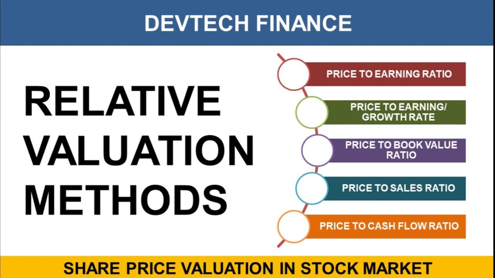

## Table of Contents

## What is a relative valuation model?

A relative valuation model is a way to figure out how much a company or an asset is worth by comparing it to similar companies or assets. Instead of trying to find the exact value of something, this method looks at how it stacks up against others in the same group. For example, if you want to know the value of a house, you might look at the prices of other houses in the same neighborhood that are similar in size and style.

This approach is popular because it's simpler and quicker than other methods that try to calculate an exact value from scratch. People often use ratios like the price-to-earnings (P/E) ratio to make these comparisons. If a company's P/E ratio is lower than its competitors, it might be seen as a good deal. However, it's important to remember that this method relies on the idea that the market values of similar companies are correct, which isn't always the case. So, while relative valuation can be a useful tool, it should be used carefully and with other methods to get a full picture.

## How does relative valuation differ from absolute valuation?

Relative valuation and absolute valuation are two different ways to figure out how much a company or an asset is worth. Relative valuation looks at how a company compares to others in the same industry. It uses ratios like the price-to-earnings (P/E) ratio to see if a company is priced higher or lower than its peers. This method is easier and quicker because it doesn't try to find an exact value from scratch. Instead, it relies on the idea that the market prices of similar companies are a good guide.

On the other hand, absolute valuation tries to find the exact value of a company on its own, without comparing it to others. This method uses detailed financial models and forecasts to calculate what a company is really worth. Common techniques include the discounted cash flow (DCF) model, which looks at the future cash flows a company is expected to generate and discounts them back to today's value. Absolute valuation is more complex and time-consuming, but it can give a more precise picture of a company's value because it's based on its own financials, not just how it stacks up against others.

Both methods have their place, and they can be used together to get a fuller understanding of a company's worth. Relative valuation is great for quick comparisons and can help spot companies that might be undervalued or overvalued compared to their peers. Absolute valuation, however, is better for understanding the intrinsic value of a company based on its own financial performance and future prospects. Choosing between the two often depends on the specific needs of the analysis and the resources available.

## What are the main steps involved in using a relative valuation model?

Using a relative valuation model starts with [picking](/wiki/asset-class-picking) a group of similar companies or assets to compare. This group should be in the same industry and have similar business models, sizes, and growth rates. Once you have your group, you need to gather financial data like earnings, sales, and market values for all the companies. This data will help you calculate valuation ratios, such as the price-to-earnings (P/E) ratio, price-to-sales (P/S) ratio, or price-to-book (P/B) ratio. These ratios show how much investors are willing to pay for a company's earnings, sales, or book value compared to its peers.

After calculating these ratios, you compare them across the group to see where your company stands. If your company's P/E ratio is lower than the average of the group, it might be undervalued, meaning it could be a good buy. On the other hand, if it's higher, it might be overvalued. It's important to look at more than one ratio to get a full picture, as different ratios can tell different stories. Once you've made your comparisons, you can use the average or median ratios of the group to estimate what your company should be worth. This gives you a relative value that you can use to make investment decisions or to see if the market price is fair.

## What are the most common types of relative valuation models?

Relative valuation models come in different forms, but the most common ones are based on comparing financial ratios. The price-to-earnings (P/E) ratio is one of the most popular. It compares a company's stock price to its earnings per share. If a company has a lower P/E ratio than its peers, it might be seen as a good deal. Another common model uses the price-to-sales (P/S) ratio, which looks at the stock price compared to the company's revenue. This can be useful for companies that aren't making profits yet but are growing their sales.

Another type of relative valuation model is the price-to-book (P/B) ratio, which compares the market value of a company to its book value, or the value of its assets minus liabilities. This can be helpful for understanding how the market values a company's net worth. The enterprise value-to-EBITDA (EV/EBITDA) ratio is also widely used. It compares the total value of a company, including debt, to its earnings before interest, taxes, depreciation, and amortization. This ratio is good for comparing companies with different levels of debt. Each of these models helps investors see if a company is priced fairly compared to others in its industry.

## Can you explain how to use the Price-to-Earnings (P/E) ratio in relative valuation?

The Price-to-Earnings (P/E) ratio is a simple way to see if a company's stock is priced fairly compared to others in its industry. To use the P/E ratio in relative valuation, you first need to pick a group of similar companies. These should be in the same business and have similar sizes and growth rates. Once you have your group, you calculate the P/E ratio for each company by dividing its stock price by its earnings per share. Then, you compare these ratios. If a company's P/E ratio is lower than the average of the group, it might be undervalued, which means it could be a good buy. If it's higher, it might be overvalued.

After you've made these comparisons, you can use the average or median P/E ratio of the group to estimate what your company should be worth. For example, if the average P/E ratio of the group is 15 and your company's earnings per share are $2, you could estimate that your company's stock should be worth around $30 (15 times $2). This gives you a relative value that you can use to see if the market price of your company's stock is fair. Keep in mind that while the P/E ratio is a useful tool, it's best to use it along with other valuation methods to get a full picture of a company's worth.

## What is the Price-to-Book (P/B) ratio and how is it applied in relative valuation?

The Price-to-Book (P/B) ratio is a way to figure out if a company's stock is priced right by comparing its market value to its book value. The book value is what the company would be worth if it sold all its assets and paid off all its debts. You find the P/B ratio by dividing the stock's market price by its book value per share. If a company's P/B ratio is lower than the average of similar companies, it might be a good deal because the market isn't valuing it as highly as its peers.

To use the P/B ratio in relative valuation, you first pick a group of companies that are similar in size and type of business. Then, you calculate the P/B ratio for each company in the group. If your company's P/B ratio is lower than the group's average, it might be undervalued. On the other hand, if it's higher, it might be overvalued. You can use the average P/B ratio of the group to estimate what your company should be worth. For example, if the average P/B ratio is 2 and your company's book value per share is $10, you could estimate that your company's stock should be worth around $20 (2 times $10). This helps you see if the market price is fair compared to other companies.

## How do analysts choose the right comparable companies for relative valuation?

Analysts pick the right comparable companies by looking for businesses that are similar in a few key ways. They want companies that are in the same industry because that means they face similar market conditions and have similar business models. Size is another important [factor](/wiki/factor-investing); they try to compare companies that are about the same size in terms of revenue or market value. Growth rates are also considered, as companies with similar growth rates are likely to be valued similarly by the market. By focusing on these similarities, analysts can make sure they're comparing apples to apples.

Once analysts have a list of possible comparable companies, they might need to narrow it down further. They look at things like the company's business focus, geographic location, and financial health. For example, if one company only sells in one country and another sells worldwide, they might not be the best match. Analysts also check if the companies have similar profit margins and debt levels, as these can affect how the market values them. By carefully choosing the right comparables, analysts can get a more accurate picture of how their company stacks up against others in the industry.

## What are the advantages of using relative valuation models over other valuation methods?

Relative valuation models are popular because they are easy to use and understand. They let you compare a company to others in the same industry, which helps you see if it's a good deal or not. You don't need to build complicated financial models from scratch. Instead, you just look at simple ratios like the P/E ratio or the P/B ratio. This makes it quick to figure out if a company's stock is priced right compared to its peers. It's like shopping for a house and checking prices of similar homes in the neighborhood to see if you're getting a fair price.

Another big advantage of relative valuation is that it uses real market data. When you compare a company to others, you're looking at what investors are actually willing to pay for similar businesses. This can give you a good sense of what the market thinks a company is worth. While other methods like discounted cash flow models try to guess future earnings, relative valuation relies on current market values. This can be more reliable because it's based on what's happening right now, not on predictions about the future. However, it's important to use relative valuation carefully and along with other methods to get the full picture.

## What are the limitations and potential pitfalls of relative valuation models?

Relative valuation models have some problems that can make them tricky to use. One big issue is that they assume the market values of similar companies are right. But what if the whole industry is overvalued or undervalued? If you compare your company to others in a bubble, you might think it's a good deal when it's really not. Also, finding the right companies to compare can be hard. If the companies you pick aren't really similar, your valuation won't be accurate. For example, if you compare a small startup to a big, established company, you might not get a fair picture.

Another problem is that relative valuation doesn't look at the whole story. It focuses on simple ratios like P/E or P/B, but it doesn't consider things like future growth, management quality, or industry changes. These things can make a big difference in a company's value. Plus, relative valuation can be affected by short-term market trends or news, which might not reflect the company's true worth. So, while relative valuation is quick and easy, it's important to use it along with other methods to get a complete view of a company's value.

## How can adjustments be made to account for differences between companies in relative valuation?

When using relative valuation, you might find that the companies you're comparing aren't exactly the same. To make a fair comparison, you can make adjustments to account for these differences. For example, if one company has a lot more debt than the others, you might adjust its valuation ratios to see what they would look like without that extra debt. Or if one company is growing faster than the others, you might adjust its ratios to reflect that growth. These adjustments help you compare apples to apples, even if the companies aren't identical.

It's also important to consider things like different business models or geographic locations. If one company operates in a different country with different economic conditions, you might need to adjust its valuation to account for those differences. You can also look at industry-specific factors, like how much a company spends on research and development or how it handles its inventory. By making these adjustments, you get a clearer picture of how the companies stack up against each other, even if they're not exactly the same.

## What advanced techniques can be used to enhance the accuracy of relative valuation models?

To make relative valuation models more accurate, you can use something called regression analysis. This is a fancy way of finding out how different factors affect a company's value. For example, you might look at how things like growth rates, profit margins, or debt levels change the P/E ratio. By using regression, you can see which factors matter most and adjust your valuations to be more precise. This helps you compare companies that might look different on the surface but are actually similar in important ways.

Another advanced technique is to use multiples based on future earnings instead of just looking at past or current numbers. This means you predict what a company's earnings will be in the future and use those numbers to calculate valuation ratios. This can give you a better idea of a company's true value, especially if it's growing quickly or going through changes. By combining these future-based multiples with regression analysis, you can get a more detailed and accurate picture of how a company should be valued compared to its peers.

## How do macroeconomic factors influence the effectiveness of relative valuation models?

Macroeconomic factors can really change how well relative valuation models work. Things like interest rates, inflation, and economic growth can affect how investors see the value of companies. For example, if interest rates go up, borrowing money becomes more expensive, which can slow down a company's growth. This might make investors less willing to pay high prices for stocks, which can change the valuation ratios like P/E or P/B. So, when you're using relative valuation, you need to think about what's happening in the economy and how it might be affecting the companies you're comparing.

Also, different industries can be hit differently by macroeconomic changes. If the economy is doing well, industries like tech or consumer goods might see their stock prices go up because people are spending more money. But if the economy is struggling, industries like manufacturing or real estate might see their values drop. This means that when you're comparing companies, you need to make sure you're looking at how the big economic picture is affecting each one. By keeping an eye on these macroeconomic factors, you can make your relative valuation more accurate and useful.

## What are Relative Valuation Models and How Do They Work?

Valuation models are tools used by investors and analysts to estimate the value of financial assets such as stocks, bonds, and real estate. These models are crucial for making informed investment decisions. Valuation models can be broadly categorized into absolute and relative valuation models. Absolute valuation models, such as the Discounted Cash Flow (DCF) model, estimate an asset's intrinsic value based on its expected future cash flows, independent of external market conditions. In contrast, relative valuation models determine an asset's value by comparing it with similar assets using financial ratios.

Relative valuation models are popular due to their simplicity and effectiveness in comparing companies of similar characteristics within the same industry. Some common relative valuation models include:

1. **Price to Earnings (P/E) Ratio**: This ratio measures a company's current share price relative to its per-share earnings. It is calculated using the formula:
$$
   \text{P/E Ratio} = \frac{\text{Market Value per Share}}{\text{Earnings per Share (EPS)}}

$$

2. **Price to Book (P/B) Ratio**: It compares a company's market value to its book value. The P/B ratio is calculated as follows:
$$
   \text{P/B Ratio} = \frac{\text{Market Value per Share}}{\text{Book Value per Share}}

$$

3. **Enterprise Value to EBITDA (EV/EBITDA) Ratio**: This ratio assesses a company's valuation relative to its earnings before interest, taxes, depreciation, and amortization. It is calculated by:
$$
   \text{EV/EBITDA Ratio} = \frac{\text{Enterprise Value (EV)}}{\text{EBITDA}}

$$

These models offer several advantages. They provide benchmarks for valuing a company relative to peers, making it easier to identify undervalued or overvalued stocks. Relative valuation models also incorporate market sentiment and are useful when absolute valuation is challenging due to uncertain future cash flows.

However, there are limitations to using relative valuation models. They assume that the peer companies used for comparison are fairly valued and that market conditions remain stable, which may not always be the case. Additionally, differences in accounting practices across firms can result in inaccuracies in financial ratios.

In financial analysis, relative valuation models are frequently applied to benchmark a company against its industry peers. For instance, investors may use the P/E ratio to compare companies within the technology sector, identifying potential investment opportunities. Financial statements, such as income statements and balance sheets, play an essential role in providing the necessary data for these valuations. Industry benchmarks and market trends are likewise important, as they provide contextual framework to interpret the relative valuation metrics, ensuring that the analysis reflects both company performance and broader economic factors.

## What are Financial Analysis Techniques Using Valuation Models?

Financial analysis using valuation models is a critical process that allows investors to determine the relative attractiveness of companies within the same sector. This is achieved by evaluating the financial data of these companies and employing certain valuation metrics to assess comparative value. Among the most common relative valuation models are the Price to Earnings (P/E), Price to Book (P/B), and Enterprise Value to EBITDA (EV/EBITDA) ratios. 

When conducting financial analysis with these models, investors begin by gathering and organizing financial data. This data is primarily sourced from financial statements, including income statements and balance sheets. The income statement provides insights into a company's profitability over a specific period, while the balance sheet offers a snapshot of the company's financial position at a point in time. By analyzing metrics such as net income, total assets, and equity, investors can calculate the relevant valuation ratios.

### Example
Consider a scenario where investors are comparing two companies within the technology sector using the P/E ratio. The P/E ratio is calculated as follows:

$$
\text{P/E Ratio} = \frac{\text{Market Price per Share}}{\text{Earnings per Share (EPS)}}
$$

By calculating the P/E ratios for both companies, investors can assess which company might be overvalued or undervalued relative to its peers. A lower P/E ratio may suggest that a company is undervalued, assuming the companies being compared have similar growth prospects and risk profiles. 

The role of financial statements in supporting valuation analyses cannot be overstated. These documents provide the raw data necessary for calculating valuation metrics and are crucial for understanding the financial health and operational performance of a business. Income statements reveal how revenue is transformed into net income, while balance sheets indicate the company's assets, liabilities, and shareholder equity.

Industry benchmarks and market trends play a significant role in relative valuation. Benchmarks provide a standard against which companies are assessed, helping investors to determine whether a company is performing above or below the industry average. Market trends, such as changes in consumer demand, technological advancements, or regulatory shifts, can also impact the valuation process. Investors need to account for these factors to make informed comparisons and evaluations.

In conclusion, the integration of financial analysis techniques with valuation models enables investors to make more informed investment decisions. By leveraging financial statements and considering industry benchmarks and trends, investors can effectively utilize relative valuation models to assess the comparative value of companies within the same industry.

## References & Further Reading

[1]: Damodaran, A. (2012). [Investment Valuation: Tools and Techniques for Determining the Value of Any Asset](https://books.google.com/books/about/Investment_Valuation.html?id=5SRHAAAAQBAJ). Wiley.

[2]: Fabozzi, F. J., Focardi, S. M., & Kolm, P. N. (2006). [The Basics of Valuation Models](https://onlinelibrary.wiley.com/doi/book/10.1002/9781119202172). Wiley.

[3]: Narang, R. K. (2009). [Inside the Black Box: The Simple Truth About Quantitative Trading](https://onlinelibrary.wiley.com/doi/book/10.1002/9781118267738). Wiley.

[4]: Chan, L. K. C., & Lakonishok, J. (2004). ["Value and Growth Investing: Review and Update"](https://www.nber.org/papers/w7223). Financial Analysts Journal, 60(1), 71-86.

[5]: Pardo, R. (2008). [The Evaluation and Optimization of Trading Strategies](https://onlinelibrary.wiley.com/doi/book/10.1002/9781119196969). Wiley.

[6]: Hasbrouck, J. (2003). ["Intraday Price Formation in U.S. Equity Markets"](https://onlinelibrary.wiley.com/doi/10.1046/j.1540-6261.2003.00609.x). The Journal of Finance, 58(6), 2375-2399.

[7]: Yves, H. (2010). ["Algorithmic Trading in Practice: Real Strategy Friendly Environments"](https://academic.oup.com/edited-volume/41262/chapter/350850196). The Journal of Trading, 5(4), 19-27.