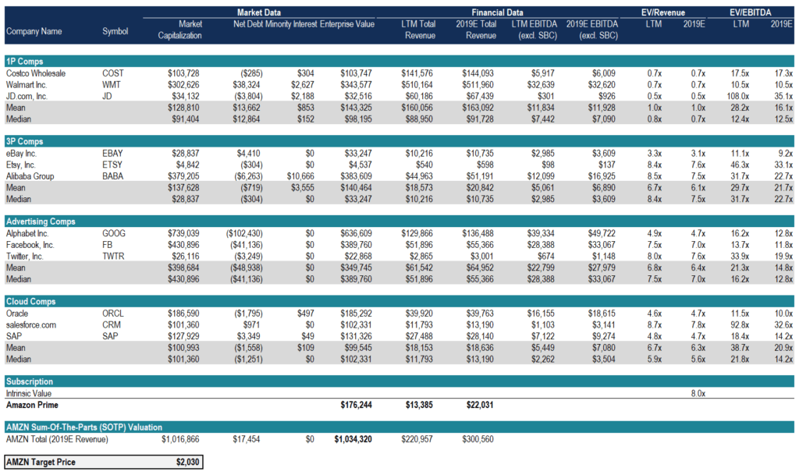

## Table of Contents

## What is relative valuation of stocks?

Relative valuation of stocks is a method used to determine the value of a stock by comparing it to other similar stocks or to the market as a whole. Instead of trying to find the exact value of a stock, it looks at how a stock is priced compared to others. For example, if one stock is cheaper than another similar stock, it might be a good buy. This method uses ratios like the price-to-earnings (P/E) ratio, which compares a company's stock price to its earnings per share.

People use relative valuation because it's easier and quicker than other methods. It doesn't need a lot of detailed financial analysis. Instead, it uses simple comparisons that anyone can understand. However, it's not perfect. Just because a stock is cheaper than others doesn't always mean it's a good investment. Sometimes, a stock might be cheap for a reason, like the company is not doing well. So, while relative valuation can be helpful, it's important to use it along with other methods to make smart investment choices.

## How does relative valuation differ from absolute valuation?

Relative valuation and absolute valuation are two different ways to figure out how much a stock is worth. Relative valuation looks at a stock by comparing it to other stocks or to the market. It uses ratios like the price-to-earnings (P/E) ratio to see if a stock is priced higher or lower than others. This method is easier and quicker because it doesn't need a lot of detailed financial analysis. You just compare numbers. But, it can be tricky because a stock might be cheap for a reason, like the company is struggling.

On the other hand, absolute valuation tries to find the exact value of a stock by looking at the company's financials in detail. It uses methods like discounted cash flow (DCF) analysis, which predicts how much money the company will make in the future and then figures out what that money is worth today. This method is more complex and takes more time, but it gives a clearer picture of a stock's true value. Absolute valuation is useful for understanding if a stock is really a good deal, but it requires more work and financial knowledge.

In summary, relative valuation is simpler and faster, focusing on comparisons, while absolute valuation is more detailed and time-consuming, aiming to find the stock's true worth. Both methods have their place in investing, and using them together can give a better overall view of a stock's value.

## What are the most common metrics used in relative valuation?

The most common metrics used in relative valuation are the price-to-earnings (P/E) ratio, the price-to-book (P/B) ratio, and the price-to-sales (P/S) ratio. The P/E ratio compares a company's stock price to its earnings per share. It shows how much investors are willing to pay for each dollar of earnings. A lower P/E might mean the stock is a good deal, but it could also mean the company is not doing well. The P/B ratio compares the stock price to the company's book value, which is the value of its assets minus liabilities. A lower P/B might suggest the stock is undervalued. The P/S ratio looks at the stock price compared to the company's sales. This can be useful for companies that aren't making profits yet.

These metrics help investors see how a stock is priced compared to others. For example, if a company's P/E ratio is lower than the average for its industry, it might be a good buy. But, it's important to use these metrics carefully. Just because a stock has a low P/E, P/B, or P/S ratio doesn't always mean it's a good investment. There might be reasons why the stock is cheap, like the company facing problems. So, while these metrics are useful, they should be used along with other information to make smart investment choices.

## How do you calculate the Price-to-Earnings (P/E) ratio?

The Price-to-Earnings (P/E) ratio is a simple way to see how much you're paying for a company's earnings. To calculate it, you take the current stock price and divide it by the company's earnings per share (EPS). The EPS is usually the company's total earnings for the last year, divided by the number of shares. So, if a stock is selling for $50 and the EPS is $5, the P/E ratio would be 10. That means you're paying $10 for every dollar of the company's earnings.

The P/E ratio can help you compare stocks. If one company has a P/E of 10 and another has a P/E of 20, the first one might seem like a better deal. But, you need to be careful. A low P/E might mean the company is not doing well, or it could be a good investment. It's important to look at other things too, like the company's growth and the industry it's in. The P/E ratio is just one piece of the puzzle when deciding if a stock is a good buy.

## What is the Price-to-Book (P/B) ratio and how is it used in stock valuation?

The Price-to-Book (P/B) ratio is a way to see if a stock is priced right by comparing its market value to its book value. The book value is what's left if a company sold everything it owns and paid off all its debts. To find the P/B ratio, you divide the stock's current price by its book value per share. For example, if a stock is selling for $20 and its book value per share is $10, the P/B ratio would be 2. This means you're paying $2 for every dollar of the company's book value.

The P/B ratio helps investors decide if a stock is a good deal. A lower P/B ratio might mean the stock is undervalued, which could be a good time to buy. But, like with any ratio, you need to be careful. A low P/B could also mean the company is struggling. It's important to look at other things too, like the company's earnings and what's happening in its industry. The P/B ratio is just one tool to help you figure out if a stock is worth buying.

## Can you explain the Price-to-Sales (P/S) ratio and its significance?

The Price-to-Sales (P/S) ratio is a way to figure out if a stock is a good deal by comparing its price to how much money the company makes from sales. To find the P/S ratio, you take the stock's current price and divide it by the company's revenue per share. For example, if a stock is selling for $15 and the company's revenue per share is $3, the P/S ratio would be 5. This means you're paying $5 for every dollar of the company's sales.

The P/S ratio is especially useful for looking at companies that aren't making profits yet, like new tech companies. If a company has a low P/S ratio compared to others in its industry, it might be a good buy. But, like any ratio, you need to be careful. A low P/S could mean the company is struggling or that its sales are not growing. It's important to look at other things too, like the company's growth and what's happening in its industry. The P/S ratio is just one piece of the puzzle when deciding if a stock is worth buying.

## How do investors use the Enterprise Value-to-EBITDA (EV/EBITDA) ratio?

Investors use the Enterprise Value-to-EBITDA (EV/EBITDA) ratio to figure out if a company is a good buy by comparing its total value to its earnings before interest, taxes, depreciation, and amortization (EBITDA). The enterprise value is what the company is worth, including its debt and cash. To find the EV/EBITDA ratio, you take the enterprise value and divide it by the EBITDA. If the ratio is low, it might mean the company is undervalued and could be a good investment. But, like any ratio, you need to be careful. A low EV/EBITDA could also mean the company is struggling.

This ratio is helpful because it looks at the company's value from a bigger picture, not just the stock price. It's especially useful for comparing companies in the same industry or for looking at companies with different amounts of debt. A company with a lower EV/EBITDA ratio than others in its industry might be a better deal. But, it's important to look at other things too, like the company's growth and what's happening in its industry. The EV/EBITDA ratio is just one tool to help you decide if a stock is worth buying.

## What are the limitations of using relative valuation metrics?

Using relative valuation metrics like P/E, P/B, P/S, and EV/EBITDA can be helpful, but they have some limitations. One big problem is that these ratios only tell part of the story. They compare a stock to others, but they don't look at the company's overall health or future growth. For example, a low P/E ratio might make a stock seem like a good deal, but if the company is losing money or facing big problems, it might not be a smart investment.

Another limitation is that these metrics can be influenced by different accounting practices. Companies might report their earnings or sales in different ways, which can make comparisons tricky. Also, these ratios don't take into account things like the company's debt or how fast it's growing. So, while relative valuation metrics can give you a quick way to compare stocks, they shouldn't be the only thing you look at. It's important to use them along with other methods and to understand the bigger picture of a company's situation.

## How can sector-specific metrics improve relative valuation analysis?

Sector-specific metrics can make relative valuation analysis better by giving more detailed information about companies in the same industry. Different industries have different ways of making money and growing, so using metrics that are important for that sector can help you see which companies are doing well compared to others. For example, in the tech industry, looking at metrics like revenue growth or user engagement can tell you a lot more than just looking at P/E ratios. These metrics help you understand if a company is keeping up with or doing better than its competitors in ways that matter for that industry.

Using sector-specific metrics also helps you avoid making mistakes that can happen when you only use general metrics. For instance, in the real estate sector, metrics like funds from operations (FFO) are more useful than P/E ratios because they give a clearer picture of a company's cash flow. By focusing on these specific metrics, you can get a better idea of which companies are undervalued or overvalued within their own industry. This can lead to smarter investment choices because you're looking at the right things for that sector.

## What role does the market environment play in interpreting relative valuation metrics?

The market environment is really important when you're trying to understand relative valuation metrics. These metrics, like P/E or P/B ratios, can change a lot depending on what's happening in the market. For example, during a bull market, when everyone is feeling good about the economy, stock prices might go up a lot. This can make P/E ratios higher because people are willing to pay more for the same amount of earnings. On the other hand, in a bear market, when people are worried, stock prices might drop, making P/E ratios lower even if the company's earnings haven't changed.

Because of this, it's a good idea to look at the bigger picture of the market when using these metrics. If you see a stock with a low P/E ratio during a bear market, it might not mean the stock is a great deal. It could just be that the whole market is down. So, it's important to compare the stock's metrics to the market's overall situation. This way, you can make better decisions about whether a stock is really undervalued or if it's just following the market's ups and downs.

## How can an investor adjust relative valuation metrics for growth and risk?

When investors want to adjust relative valuation metrics like P/E or P/B ratios for growth and risk, they need to look at how fast a company is growing and how risky it is. For growth, investors might use a metric called the PEG ratio, which is the P/E ratio divided by the company's expected growth rate. If a company is growing fast, it might be okay to pay a higher P/E ratio because the company's earnings could go up a lot in the future. On the other hand, if a company is not growing much, a high P/E might mean the stock is too expensive. So, by using the PEG ratio, investors can see if a stock's price makes sense given its growth.

For risk, investors can look at things like the company's debt levels, how stable its earnings are, and what's happening in its industry. A company with a lot of debt or in a risky industry might have a lower P/E ratio because investors want to be paid more for taking on that risk. To adjust for this, investors might compare the stock's P/E ratio to other companies in the same industry or look at the company's beta, which measures how much the stock's price moves compared to the market. By considering both growth and risk, investors can get a better idea of whether a stock's price is fair and make smarter investment choices.

## What advanced techniques can be used to refine relative valuation models?

To make relative valuation models better, investors can use something called regression analysis. This is a way to see how different things, like a company's growth or how much debt it has, affect its stock price. By using regression, investors can find out which factors are most important for figuring out if a stock is priced right. For example, they might find that for tech companies, how fast the company is growing is more important than how much debt it has. This helps them adjust their valuation metrics to focus on what really matters for each company.

Another advanced technique is using multi-factor models. These models look at lots of different things at the same time, like a company's earnings, sales, growth, and even things like how happy its customers are. By putting all these factors together, investors can get a fuller picture of what a stock is worth. This can help them see if a stock is a good deal or not, even if some of its metrics look bad. Using multi-factor models can make relative valuation more accurate and help investors make smarter choices.

## What is Understanding Relative Valuation?

Relative valuation is a fundamental approach in finance that involves assessing the value of an asset by comparing it to similar assets. This method is rooted in the principle that similar assets should possess comparable values, making it a practical strategy for investors aiming to gauge a stock’s market value. The approach primarily employs valuation multiples such as the Price-to-Earnings (P/E) ratio, Enterprise Value to EBITDA (EV/EBITDA) ratio, and Price-to-Book (P/B) ratio.

**Valuation Multiples**

1. **Price-to-Earnings (P/E) Ratio**: The P/E ratio is calculated by dividing the market price per share by the earnings per share (EPS). It indicates how much investors are willing to pay for a dollar of earnings, thus serving as a measure of market expectations regarding a company’s future growth and profitability. A higher P/E ratio may suggest that the market anticipates higher earnings growth in the future compared to companies with a lower P/E.
$$
   \text{P/E Ratio} = \frac{\text{Market Price per Share}}{\text{Earnings per Share (EPS)}}

$$

2. **Enterprise Value to EBITDA (EV/EBITDA) Ratio**: This multiple compares a company's total enterprise value (EV) to its earnings before interest, taxes, depreciation, and amortization (EBITDA). It offers insight into a company's operating profitability while ignoring non-operating factors. The EV/EBITDA ratio is especially useful in comparing companies with different capital structures.
$$
   \text{EV/EBITDA} = \frac{\text{Enterprise Value}}{\text{EBITDA}}

$$

3. **Price-to-Book (P/B) Ratio**: The P/B ratio is derived by dividing the market price per share by the book value per share. It reflects how much investors are willing to pay for each dollar of a company’s net assets. A lower P/B ratio may indicate that a stock is undervalued, assuming the company's fundamentals are strong.
$$
   \text{Price-to-Book Ratio} = \frac{\text{Market Price per Share}}{\text{Book Value per Share}}

$$

**Application of Metrics**

The effective application of these valuation multiples requires an understanding of the context in which they are used. For instance, comparing the P/E ratios of companies within the same industry can highlight which companies the market expects to grow faster or have higher profitability. However, it's essential to adjust for discrepancies in accounting practices, especially across different countries or industries where such standards may vary significantly.

**Advantages and Limitations**

One significant advantage of relative valuation methods is their simplicity and intuitiveness. Investors can quickly compare companies or identify mispriced stocks within an industry. However, these methods also come with limitations. They depend heavily on the choice of comparable companies, and the valuation might overlook intrinsic differences in growth potential, profitability, or risk.

Furthermore, economic cycles can distort relative valuations, affecting the accuracy of the conclusions drawn. It is also possible that the entire market or a particular sector may be overvalued, leading to misleading results if not properly contextualized.

**Real-World Examples**

In practice, investors often use relative valuation during mergers and acquisitions to determine fair buyout prices. For example, if Company A, operating in the technology sector, is considering acquiring Company B, it may employ P/E and EV/EBITDA ratios to assess whether Company B is valued reasonably compared to other tech firms. Similarly, investment analysts might use these metrics to identify potential investment opportunities by flagging stocks that appear undervalued relative to their peers. 

Overall, relative valuation is a vital tool in an investor's toolbox, but it requires thoughtful application and a keen awareness of its inherent limitations. By combining it with other valuation techniques and market analysis, investors can make more informed and balanced investment decisions.

## What are Stock Valuation Techniques?

Stock valuation plays a crucial role in determining the intrinsic value of a company's stock, enabling investors to make well-informed investment decisions. The most prominent techniques for assessing a stock's value are the Discounted Cash Flow (DCF) analysis and the Dividend Discount Model (DDM).

### Discounted Cash Flow (DCF) Analysis

DCF analysis estimates the value of an investment based on its expected future cash flows, adjusted for time value and risk. The core principle of DCF is that the value of a company is essentially the present value of its projected free cash flows over time. The formula for calculating DCF is:

$$

DCF = \sum_{t=1}^n \frac{CF_t}{(1 + r)^t} 
$$

where:
- $CF_t$ is the cash flow at time $t$
- $r$ is the discount rate
- $n$ is the total number of periods

Getting accurate results from DCF requires careful consideration of key assumptions, such as growth rates of cash flows and the appropriate discount rate, which often reflects the weighted average cost of capital (WACC). Fluctuating market conditions and economic scenarios necessitate constant adjustments and sensitivity analyses to ensure the reliability of DCF valuations.

### Dividend Discount Model (DDM)

The DDM is another popular way of valuing stocks, particularly those of companies that pay regular dividends. It evaluates a stock based on the present value of all future dividend payments. The simplest form of DDM, the Gordon Growth Model, is expressed as:

$$

P_0 = \frac{D_1}{r - g} 
$$

where:
- $P_0$ is the current stock price
- $D_1$ is the expected dividend in the next period
- $r$ is the required rate of return
- $g$ is the dividend growth rate

DDM assumes dividends grow at a constant rate, making it suitable for mature companies with predictable dividend patterns. However, the model's reliability diminishes for firms lacking consistent dividend payments or with fluctuating growth rates.

### Role of Market Sentiment and Macroeconomic Factors

Beyond intrinsic valuation models, external factors such as market sentiment and macroeconomic conditions significantly influence stock valuation. Investor perceptions and emotions can lead to market anomalies, driving stock prices away from their calculated intrinsic values. For example, bullish sentiment may overinflate stock prices, while bearish sentiment can undervalue them.

Macroeconomic indicators like interest rates, inflation, and GDP growth also impact stock valuation. Higher interest rates can increase the discount rate in DCF and DDM models, reducing the present value of future cash flows and dividends. Conversely, robust economic growth might enhance future cash flow projections, boosting stock value estimations.

### Incorporating External Factors for Comprehensive Analysis

To adapt stock valuations to real-world conditions, analysts may incorporate scenarios into their models that reflect varying market sentiments and macroeconomic conditions. Scenario analysis helps in understanding the potential range of stock values under different external environments, thus providing investors with a holistic view of the risks and opportunities associated with their investments.

## References & Further Reading

[1]: Hendershott, T., Jones, C. M., & Menkveld, A. J. (2011). ["Does Algorithmic Trading Improve Liquidity?"](https://onlinelibrary.wiley.com/doi/full/10.1111/j.1540-6261.2010.01624.x) Journal of Finance, 66(1), 1-33.

[2]: Kirilenko, A., Kyle, A. S., Samadi, M., & Tuzun, T. (2017). ["The Flash Crash: The Impact of High-Frequency Trading on an Electronic Market."](https://onlinelibrary.wiley.com/doi/abs/10.1111/jofi.12498) Journal of Finance, 72(3), 967-998.

[3]: Damodaran, A. (2012). ["Investment Valuation: Tools and Techniques for Determining the Value of Any Asset."](https://pages.stern.nyu.edu/~adamodar/New_Home_Page/Inv3ed.htm) John Wiley & Sons.

[4]: Fabozzi, F. J., & Markowitz, H. M. (2011). ["Equity Valuation and Portfolio Management."](https://onlinelibrary.wiley.com/doi/book/10.1002/9781118267028) Wiley Finance.

[5]: López de Prado, M. (2018). ["Advances in Financial Machine Learning."](https://www.amazon.com/Advances-Financial-Machine-Learning-Marcos/dp/1119482089) Wiley.