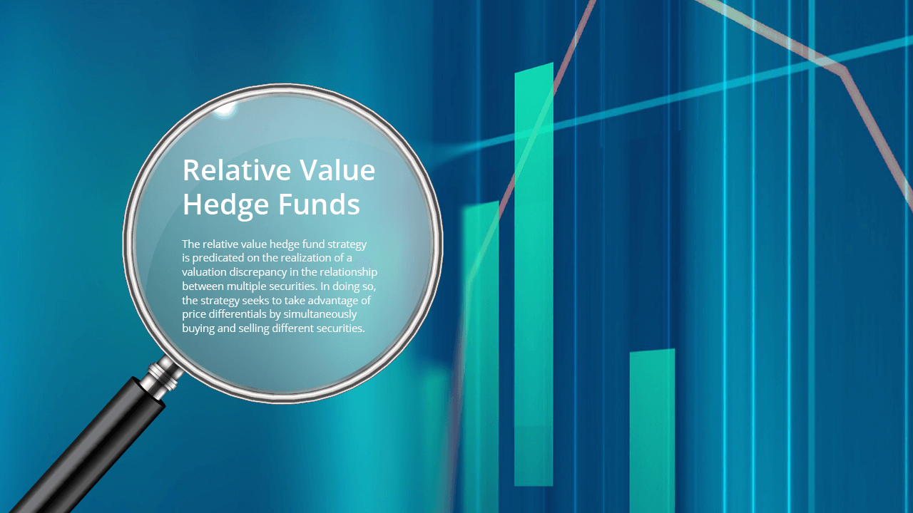

## Table of Contents

## What is a Relative Value Fund?

A Relative Value Fund is a type of investment fund that aims to take advantage of price differences between related financial instruments. These funds look for situations where one asset is priced higher or lower than another similar asset, and they try to profit from these differences. For example, if two similar bonds are not priced the same, the fund might buy the cheaper one and sell the more expensive one, expecting their prices to eventually even out.

These funds use a strategy called "arbitrage," which means they try to make money from small price differences. The goal is to make a profit no matter which way the market moves, as long as the price difference between the two assets closes. This makes relative value funds less risky than some other types of investments, but they still need careful management to be successful.

## How does a Relative Value Fund differ from other types of investment funds?

A Relative Value Fund is different from other investment funds because it focuses on finding and using price differences between similar financial instruments. While many funds might try to predict if the whole market will go up or down, a Relative Value Fund looks for situations where one thing is priced higher or lower than another similar thing. For example, if two similar stocks are not priced the same, the fund might buy the cheaper one and sell the more expensive one, hoping their prices will become equal later.

This strategy, called [arbitrage](/wiki/arbitrage), makes Relative Value Funds different from funds that just buy and hold stocks or bonds. These funds aim to make money no matter which way the market moves, as long as the price difference between the two assets closes. This can make them less risky than funds that bet on the market going up, but they still need careful management. Other funds, like growth funds or income funds, focus on different goals, like increasing in value over time or providing regular income, which makes them different from Relative Value Funds.

## What are the main strategies used by Relative Value Funds?

Relative Value Funds use a strategy called arbitrage. This means they look for times when two similar things are not priced the same. For example, if two similar stocks have different prices, the fund might buy the cheaper stock and sell the more expensive one. They hope that the prices will become the same later, and they can make money from the difference. This strategy tries to make money no matter if the market goes up or down, as long as the price difference between the two things gets smaller.

Another strategy used by Relative Value Funds is called pairs trading. This is a type of arbitrage where the fund picks two stocks that usually move together. If one stock starts to go up more than the other, the fund might sell the one that went up and buy the one that didn't. They expect that the two stocks will start moving together again, and they can make money from the difference. This strategy also tries to make money no matter what the market does, as long as the two stocks start moving together again.

Some Relative Value Funds also use convertible arbitrage. This strategy involves buying a company's convertible securities, like bonds that can be turned into stocks, and at the same time, selling short the company's stock. The fund hopes to make money from the difference between the price of the convertible security and the stock. This strategy can be more complex, but it also tries to make money no matter what the market does, as long as the price difference between the convertible security and the stock changes in a way that benefits the fund.

## Who typically invests in Relative Value Funds?

People who invest in Relative Value Funds are often looking for a way to make money that is not as risky as other types of investments. These investors might be big institutions like pension funds or insurance companies. They like Relative Value Funds because they try to make money no matter if the market goes up or down, as long as the price difference between two similar things gets smaller.

Sometimes, wealthy individuals also invest in Relative Value Funds. They might want to spread out their money in different types of investments to lower their risk. These investors understand that while Relative Value Funds can be less risky, they still need careful management to be successful.

## What are the potential benefits of investing in a Relative Value Fund?

One big benefit of investing in a Relative Value Fund is that it can be less risky than other types of investments. These funds try to make money by finding small price differences between similar things, like stocks or bonds. They don't just bet on the market going up or down. Instead, they try to make money no matter what the market does, as long as the price difference between the two things gets smaller. This can make them a good choice for people who want to be safer with their money.

Another benefit is that Relative Value Funds can help spread out your investments. When you put your money in different types of funds, you lower your risk. If one type of investment does badly, the others might do well and balance it out. Relative Value Funds can be a good part of this mix because they work differently from funds that just buy and hold stocks or bonds. This can help you keep your money safer while still trying to make a profit.

## What are the risks associated with Relative Value Funds?

One risk of investing in Relative Value Funds is that the price differences they rely on might not close as expected. Sometimes, the two similar things they are betting on might stay different for a long time, or even get more different. This can mean the fund loses money instead of making it. Also, these funds often use borrowed money to make bigger bets, which can increase both the possible profits and the possible losses.

Another risk is that Relative Value Funds need a lot of careful management. The people running the fund have to be good at finding the right price differences and making the right trades at the right time. If they make mistakes, the fund can lose money. This kind of investing can also be affected by big changes in the market or the economy, which can make it harder for the fund to make money.

## How is performance measured in a Relative Value Fund?

Performance in a Relative Value Fund is usually measured by looking at how much money the fund makes or loses over time. This is often shown as a percentage, called the return. The fund's managers compare this return to a benchmark, which is a standard that shows how well other similar investments are doing. If the fund's return is higher than the benchmark, it means the fund is doing well. If it's lower, the fund is not doing as well as it could.

Another way to measure performance is by looking at the risk the fund takes. Relative Value Funds try to make money with less risk than other types of investments, so it's important to see if they are successful at this. One way to do this is by looking at something called the Sharpe ratio. This number shows how much extra return the fund gets for each unit of risk it takes. A higher Sharpe ratio means the fund is doing a good job of making money while keeping risk low.

## Can you explain the concept of 'relative value' in the context of these funds?

Relative value in the context of these funds means looking at the price of one thing compared to something similar. For example, if two stocks are a lot alike but one is cheaper than the other, a Relative Value Fund might buy the cheaper stock and sell the more expensive one. They think the prices will eventually be the same, and they can make money from the difference. This idea is called 'relative value' because it's all about the value of one thing compared to another, not just its own price.

The goal of a Relative Value Fund is to find these price differences and use them to make money. They don't just bet on the market going up or down. Instead, they try to make money no matter what the market does, as long as the price difference between the two similar things gets smaller. This can make investing in these funds less risky than other types of investments, but it still needs careful management to work well.

## What role do arbitrage strategies play in Relative Value Funds?

Arbitrage strategies are very important in Relative Value Funds. They help the fund make money by finding small price differences between similar things, like stocks or bonds. For example, if two similar stocks are not priced the same, the fund might buy the cheaper stock and sell the more expensive one. They hope that the prices will become equal later, and they can make money from the difference. This is called arbitrage, and it's the main way Relative Value Funds try to make money.

The key thing about arbitrage strategies is that they try to make money no matter which way the market moves. As long as the price difference between the two things gets smaller, the fund can make a profit. This can make Relative Value Funds less risky than other types of investments. But, it still needs careful management to work well. The people running the fund have to be good at finding the right price differences and making the right trades at the right time. If they make mistakes, the fund can lose money.

## How do market conditions affect the strategies of Relative Value Funds?

Market conditions can have a big impact on the strategies used by Relative Value Funds. These funds look for price differences between similar things, like stocks or bonds, to make money. When the market is calm and stable, it's easier for these funds to find these price differences and use them to make profits. But when the market is moving a lot, like during big economic changes or crises, it can be harder to find these differences. The prices of things can change quickly, and the differences might not close in the way the fund expects. This can make it riskier for the fund to make money.

Also, during times of high market stress, the people running the fund might need to change their strategies. They might have to be more careful about the trades they make and how much money they use to make those trades. Sometimes, they might even need to hold off on making trades until the market calms down. This can affect how much money the fund makes, because they might miss out on some opportunities. But it's important for them to adjust their strategies to the market conditions to try and keep the fund safe and profitable.

## What are some historical examples of successful Relative Value Funds?

One well-known example of a successful Relative Value Fund is the Long-Term Capital Management (LTCM) fund, started in 1994. At first, LTCM did really well. They used arbitrage strategies to find small price differences between similar things like bonds and make money from them. The fund made big profits for a few years because they were good at finding these differences and using them to their advantage. But in 1998, things changed. The market got very unstable because of the Russian financial crisis, and the price differences LTCM was betting on didn't close like they expected. This led to big losses for the fund, and it almost caused problems for the whole financial system.

Another example is the Citadel Wellington Fund, managed by Citadel LLC. This fund has been successful over many years by using different arbitrage strategies. They look for price differences in things like stocks, bonds, and even currencies. Citadel Wellington has been good at managing these strategies even when the market is moving a lot. This has helped them make steady profits and keep their investors happy. Their success shows how important it is for Relative Value Funds to be flexible and adjust to changing market conditions.

## How can an investor evaluate the performance and strategy of a Relative Value Fund before investing?

Before investing in a Relative Value Fund, an investor should look at how the fund has done in the past. This means checking the fund's return, which is how much money it made or lost over time. The investor should compare this return to a benchmark, which is a standard that shows how well other similar investments did. If the fund's return is higher than the benchmark, it means the fund did well. Also, the investor should look at the risk the fund took to get that return. A good way to do this is by checking the Sharpe ratio, which shows how much extra return the fund got for each unit of risk it took. A higher Sharpe ratio means the fund did a good job of making money while keeping risk low.

The investor should also understand the strategy the fund uses. Relative Value Funds try to make money by finding small price differences between similar things, like stocks or bonds. They use a strategy called arbitrage, where they buy the cheaper thing and sell the more expensive one, hoping the prices will become equal later. The investor should find out how the fund finds these price differences and how it decides when to make trades. It's also important to see if the fund can change its strategy when the market changes. Talking to the fund managers or reading their reports can help the investor learn about the fund's strategy and decide if it's a good fit for their goals and how much risk they want to take.

## References & Further Reading

[1]: Burgess, A. N. (2010). ["The Art of High-Frequency Trading: Tools and Techniques for Algorithmic Trading."](https://www.tradebit.com/usr/ledsin/pub/9003/_excerpt_High-frequencyTrading.pdf) Wiley Trading.

[2]: ["Inside the Black Box: A Simple Guide to Quantitative and High Frequency Trading"](https://www.amazon.com/Inside-Black-Box-Quantitative-Frequency/dp/1118362411) by Rishi K. Narang

[3]: Gatev, E. G., Goetzmann, W. N., & Rouwenhorst, K. G. (2006). ["Pairs Trading: Performance of a Relative Value Arbitrage Rule."](https://www.nber.org/papers/w7032) Review of Financial Studies, 19(3), 797-827.

[4]: Jurek, J. W. & Stafford, E. (2015). ["The Cost of Capital for Alternative Investments."](https://www.hbs.edu/ris/Publication%20Files/Cost%20of%20Capital%20for%20Alternative%20Investments_c8bd7338-951c-4c36-bfee-3eec1659b227.pdf) National Bureau of Economic Research Working Paper No. 21789.

[5]: Naik, N. Y., & Prat, A. (2007). ["On Derivatives Trading and Specialization in the Financial Industry."](https://papers.ssrn.com/sol3/papers.cfm?abstract_id=1297050) Review of Financial Studies, 21(5), 2103–2127.