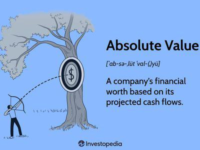

Value measurement plays a pivotal role in economic analysis and trading, serving as a foundational element for informed investment decisions and effective market strategies. In both traditional and algorithmic trading, understanding different valuation methods such as economic value and relative value is crucial. Economic value, often associated with metrics like Economic Value Added (EVA), assesses the true profitability of a company by comparing net operating profit after taxes with the cost of capital. Relative value, contrastingly, determines an asset's worth by comparing it against similar assets in the market, using metrics like price-to-earnings ratios and other comparative analyses.

These valuation concepts are integral to forming strategic insights, especially when applied to algorithmic trading. Characterized by its high speed and precision, algorithmic trading significantly benefits from incorporating comprehensive valuation metrics, offering traders a competitive edge. By synthesizing vast amounts of data into actionable insights, these metrics inform buy-sell decisions and portfolio adjustments. Historical data and predictive models work conjointly to optimize trading strategies, balancing risks and returns.



The discussion in this article will cover the principles, methodologies, and strategic implications of valuation approaches in financial markets. It will highlight how algorithmic trading systems use these valuation concepts to enhance decision-making, improve risk management, and potentially achieve superior financial returns. By integrating these advanced valuation principles, traders are better equipped to navigate the complex dynamics of modern financial markets, where data-driven decision-making is imperative for success.

## Table of Contents

## Understanding Economic Value and Relative Value

Economic Value Added (EVA) and Market Value Added (MVA) are pivotal financial metrics employed to assess a company's performance and its ability to generate value. EVA is a measure of a company's economic profit derived by evaluating the value created over the required return on capital. It underscores the intrinsic value creation within a firm, highlighting the efficiencies in resource utilization. Mathematically, EVA can be expressed as:

$$
\text{EVA} = \text{NOPAT} - (\text{Capital} \times \text{Cost of Capital})
$$

where NOPAT (Net Operating Profit After Taxes) indicates the profit generated from operations after adjusting for taxes, Capital refers to the invested capital in the business, and Cost of Capital represents the expected return rate by investors.

In contrast, relative value compares an asset's worth against similar assets, providing a market-based evaluation perspective. This approach shifts the focus from intrinsic assessments to market-driven analyses, facilitating investment decisions by benchmarking against industry peers or similar companies.

These metrics are crucial for investors seeking to understand whether a company is truly adding value beyond mere revenue generation. While revenue might show growth, EVA and MVA offer insights into the quality and sustainability of value generation. MVA is particularly useful in understanding long-term value creation by showing the difference between the market value and the capital invested in the company. An increasing MVA indicates that a company is generating value above the cumulative capital, suggesting superior performance in the market.

The combined use of EVA and relative value metrics allows for a multifaceted evaluation of a company's performance, integrating both intrinsic and market-based assessments. Such robust insights are invaluable for forming effective trading strategies, enabling investors to identify opportunities where a company's market price might not fully reflect its generated economic value. Utilizing these tools can significantly enhance decision-making processes in both investment and trading contexts.

## The Role of Algorithmic Trading in Value Measurement

Algorithmic trading relies on the use of computer algorithms to execute trades, enhancing speed, precision, and strategic advantage in financial markets. This method of trading revolutionizes the process of value measurement by integrating metrics such as Economic Value Added (EVA) and Market Value Added (MVA). These metrics are pivotal in understanding and leveraging both economic and relative valuation concepts within trading algorithms.

Economic Value Added (EVA) and Market Value Added (MVA) are integral to making informed and strategic trading decisions. EVA focuses on intrinsic value creation, measuring economic profit by assessing the value generated over the required return on capital. In contrast, MVA provides a market perspective by determining the difference between the market value of a company and the capital contributed by investors. In the context of [algorithmic trading](/wiki/algorithmic-trading), these metrics form the basis for identifying genuine investment opportunities. By incorporating EVA and MVA, algorithms can evaluate companies beyond mere profit figures, thus aligning trading strategies with intrinsic and relative value creation.

The inclusion of these valuation metrics into trading algorithms enhances the understanding of price dynamics, aiding in more precise market movement predictions. This accuracy is crucial in identifying [arbitrage](/wiki/arbitrage) opportunities, where price discrepancies can be exploited for profit. Through comprehensive analysis, algorithms can detect subtle nuances in market behaviors and respond effectively to maximize returns.

Risk management is another domain strengthened by integrating EVA and MVA into trading algorithms. The use of these metrics supports a more robust assessment and management of financial risks. By providing a clearer picture of a company's value generation capability, especially when juxtaposed with market expectations, these algorithms can adjust risk exposure accordingly. This capability ensures that trading strategies are not only profitable but also aligned with acceptable risk levels.

In conclusion, the role of algorithmic trading in value measurement is transformative, offering sophisticated tools to enhance trading decisions and risk management practices. By leveraging EVA and MVA, financial algorithms provide a more nuanced and comprehensive approach to trading, paving the way for more strategic and profitable engagements in the financial markets.

## Technological Impacts on Value Measurement

Technological advancements have increasingly optimized the precision and efficacy of evaluating Economic Value Added (EVA) and Market Value Added (MVA), primarily through the implementation of data analytics and [artificial intelligence](/wiki/ai-artificial-intelligence) (AI). The core impact of these technologies arises from their capability to process vast amounts of financial data in real-time, thereby supporting dynamic trading strategies that allow market participants to react almost instantaneously to fluctuating market conditions and trends.

Real-time data processing has revolutionized the way traders and analysts employ valuation models. By ensuring that the latest information is used in calculations, the accuracy and timeliness of valuations are improved. This capability is crucial in volatile markets, where the ability to make informed decisions quickly can significantly impact trading outcomes.

The automation of financial analytics minimizes human error, one of the most persistent challenges in financial assessments. Automated systems are designed to perform complex calculations and data analyses with consistent accuracy, thereby providing a more reliable reflection of a company’s financial status. This automation ensures that valuations are not only precise but also consistently aligned with the company’s current performance metrics.

Furthermore, simulations and [machine learning](/wiki/machine-learning) tools play pivotal roles in enhancing understanding and forecasting capabilities. Simulations enable analysts to explore various scenarios and their potential impacts on EVA and MVA metrics, thereby facilitating a more comprehensive risk assessment. Machine learning algorithms, on the other hand, excel in identifying patterns within vast datasets, capturing market sentiment, and predicting future trends. These capabilities allow for more nuanced and informed investment strategies.

Python has emerged as a popular tool in these applications due to its extensive libraries and frameworks that support data analysis and machine learning. For instance, Python’s libraries like Pandas for data manipulation, NumPy for numerical computations, and TensorFlow or PyTorch for machine learning facilitate the creation of sophisticated models for analyzing and predicting financial trends.

Here is a basic example of how Python can be used to calculate a simple financial metric using real-time data:

```python
import yfinance as yf  # For more datasets, visit: https://paperswithbacktest.com/datasets
import numpy as np

# Fetch real-time stock data
ticker = 'AAPL'
stock_data = yf.Ticker(ticker).history(period='1d', interval='1m')

# Calculate simple moving average as a proxy for real-time valuation
stock_data['SMA'] = stock_data['Close'].rolling(window=20).mean()

# Compute EVA based on hypothetical values
capital_invested = 500000  # example value
net_operating_profit_after_tax = 75000  # example NOPAT
cost_of_capital = 0.08  # 8%

eva = net_operating_profit_after_tax - (capital_invested * cost_of_capital)

print(f'EVA: {eva}')
```

As these technological tools evolve, they continue to make value measurements more responsive and actionable, thus empowering investors to better navigate and capitalize on fast-paced trading environments while managing risks more effectively.

## Challenges and Considerations in Implementing Value-Based Trading Strategies

Implementing value-based trading strategies requires a comprehensive understanding of both economic and relative valuation metrics. These strategies face numerous challenges, beginning with the need to ensure model accuracy and the selection of appropriate valuation methods. Accurate models are paramount as they influence trading decisions and ultimately impact financial performance. An inaccurate model can lead to suboptimal decisions, compromising a trader's ability to achieve desired outcomes.

One of the primary challenges in model construction is the accurate selection of valuation methods. This selection process must consider the specific context and objectives of the trading strategy. The economic value, i.e., Economic Value Added (EVA), and the relative value, such as Market Value Added (MVA), must be integrated carefully to reflect true asset worth. Handling data complexities, particularly with large datasets typical in financial markets, presents another layer of difficulty. Traders should ensure that data is clean, accurate, and representative of current and predictive market conditions.

A critical concern traders must remain cognizant of is model risk, especially issues like overfitting. Overfitting occurs when a model is excessively tailored to historical data, failing to generalize and perform effectively on new, unseen data. This risk highlights the importance of applying robust statistical methods and validation techniques. For example, techniques like cross-validation, regularization, and the use of holdout datasets can mitigate overfitting risks:

```python
from sklearn.model_selection import train_test_split, cross_val_score
from sklearn.linear_model import Ridge

# Sample data and model
X_train, X_test, y_train, y_test = train_test_split(X, y, test_size=0.2, random_state=42)
model = Ridge(alpha=1.0)  # Regularization to prevent overfitting
cross_val_score(model, X_train, y_train, cv=5)  # Cross-validation technique
```

Market dynamics, investor sentiment, and external economic factors heavily influence value perceptions. Market conditions can shift rapidly, influenced by factors such as geopolitical events, regulatory changes, or macroeconomic indicators. Therefore, strategies must be adaptable to these variables, incorporating tools such as sentiment analysis and macroeconomic models.

Traders should also consider the integration of continuous adaptation and technology to maintain effective and resilient trading strategies. The rapid evolution of trading technologies can be leveraged to enhance analysis and execution capabilities. For example, machine learning algorithms can be employed to analyze vast data sets for patterns and trends, offering predictive insights that inform strategic adjustments. Furthermore, the implementation of algorithmic solutions requires consistent updates and recalibrations to align with current market realities.

In summary, developing and implementing value-based trading strategies is complex, requiring a nuanced understanding of valuation metrics, careful model construction, and a proactive approach to integrating technological advancements. By addressing these challenges effectively, traders can enhance their strategies' robustness and adaptability, positioning themselves to capitalize on market opportunities.

## Conclusion and Strategic Implications

EVA and MVA, in conjunction with relative value analysis, offer critical insights into a company's performance, especially when considered from a trading standpoint. By incorporating these metrics into algorithmic trading strategies, traders gain a distinct advantage through informed decision-making. This integration not only refines trade execution but also enhances overall strategic development, ensuring that trades are based on robust, quantitative analysis rather than mere speculation.

The intersection of valuation metrics and trading technology significantly improves decision-making and risk management processes. By aligning EVA, MVA, and relative value calculations with the capabilities offered by modern trading technologies, investors can optimize their strategies for superior returns. Algorithmic trading platforms, equipped with real-time data analytics and sophisticated risk management tools, can leverage these metrics to predict market movements and capitalize on potential arbitrage opportunities.

As technological advancements continue to evolve, the precision and accuracy of calculating these metrics become increasingly vital. Innovations in AI and machine learning facilitate the continuous improvement of these calculations, enabling more dynamic responses to market conditions. Adaptations in technology not only enhance the accuracy of these metrics but also make them more actionable in the fast-paced trading environment.

Investors and traders must embrace these technological advancements proactively to maintain a competitive edge and foster capital efficiency. By continually adapting their strategies to incorporate these refined metrics, they ensure sustained growth and resilience against market fluctuations. This approach not only secures immediate trading benefits but also positions investors for long-term success in a rapidly changing financial landscape.

## References and Further Reading

For those seeking to deepen their understanding of economic and relative value metrics within financial contexts, several academic and professional resources stand out for their comprehensive analysis and practical applications.

1. **"Valuation: Measuring and Managing the Value of Companies" by McKinsey & Company Inc.**  
   This text provides a systematic approach to understanding company valuation, including detailed methodologies for assessing both economic and market value. It is particularly useful for grasping the fundamentals of Economic Value Added (EVA) and Market Value Added (MVA) in corporate finance.

2. **"Financial Management: Theory & Practice" by Eugene F. Brigham and Michael C. Ehrhardt**  
   This book highlights practical strategies for financial management, offering insights into how valuation metrics are applied in real-world scenarios. Concepts such as EVA and MVA are extensively covered, providing a solid foundation for those interested in applying these metrics to trading strategies.

3. **"Algorithmic Trading and DMA: An Introduction to Direct Access Trading Strategies" by Barry Johnson**  
   Johnson's work explores the world of algorithmic trading, presenting various strategies and the technology that underpins them. It includes discussions on integrating value metrics into trading algorithms for enhanced decision-making and strategic advantage.

4. **"Value-Based Management: Developing a Systematic Approach to Creating Shareholder Value" by James M. McTaggart, Peter W. Kontes, and Michael Mankins**  
   This book focuses on aligning corporate management with shareholder value creation, with a specific emphasis on value measurement metrics like EVA. It offers a strategic approach to management that is conducive to financial analysis and investment strategy development.

5. **Research papers and journals**  
   - **"The Real Value of EVA for Investment Management"** published in the Journal of Applied Corporate Finance investigates how EVA can be leveraged for improved investment management and strategy formation.
   - **Journal of Economic Perspectives** and **Journal of Financial Economics** often publish articles discussing advanced valuation techniques and their implications for market dynamics and trading strategies.

6. **Online Resources and Courses**  
   Websites like Coursera and edX offer online courses on algorithmic trading and financial analytics that incorporate valuation concepts, providing interactive and up-to-date learning experiences for professionals looking to enhance their skills.

These resources outline not only the theoretical underpinnings of economic and relative value metrics but also offer real-world applications in financial strategy and trading practices. They are invaluable for professionals aiming to excel in financial analysis, investment decision-making, and the development of effective trading algorithms.

## References & Further Reading

[1]: Koller, T., Goedhart, M., & Wessels, D. (2015). ["Valuation: Measuring and Managing the Value of Companies."](https://www.wiley.com/en-us/Valuation%3A+Measuring+and+Managing+the+Value+of+Companies%2C+7th+Edition-p-9781119610885) McKinsey & Company Inc.

[2]: Brigham, E. F., & Ehrhardt, M. C. (2016). ["Financial Management: Theory & Practice."](https://books.google.com/books/about/Financial_Management_Theory_Practice.html?id=yL4aCgAAQBAJ) Cengage Learning.

[3]: Johnson, B. (2010). ["Algorithmic Trading and DMA: An Introduction to Direct Access Trading Strategies."](https://archive.org/details/algorithmictradi0000john) 4Myeloma Press.

[4]: McTaggart, J. M., Kontes, P. W., & Mankins, M. (1994). ["Value-Based Management: Developing a Systematic Approach to Creating Shareholder Value."](https://www.semanticscholar.org/paper/The-Value-Imperative%3A-Managing-For-Superior-Returns-McTaggart-Kontes/60e7e5e0f0af8b9267cfd3b39649de3c895b60d3) Harvard Business Review Press.

[5]: Stewart, G. B. (1991). ["The Quest for Value: A Guide for Senior Managers."](https://archive.org/details/questforvalueg00stew) Harper Business.

[6]: Damodaran, A. (2012). ["Investment Valuation: Tools and Techniques for Determining the Value of any Asset."](https://books.google.com/books/about/Investment_Valuation.html?id=5SRHAAAAQBAJ) Wiley.

[7]: Rappaport, A. (1998). ["Creating Shareholder Value: A Guide for Managers and Investors."](https://archive.org/details/creatingshareho000rapp) Free Press.