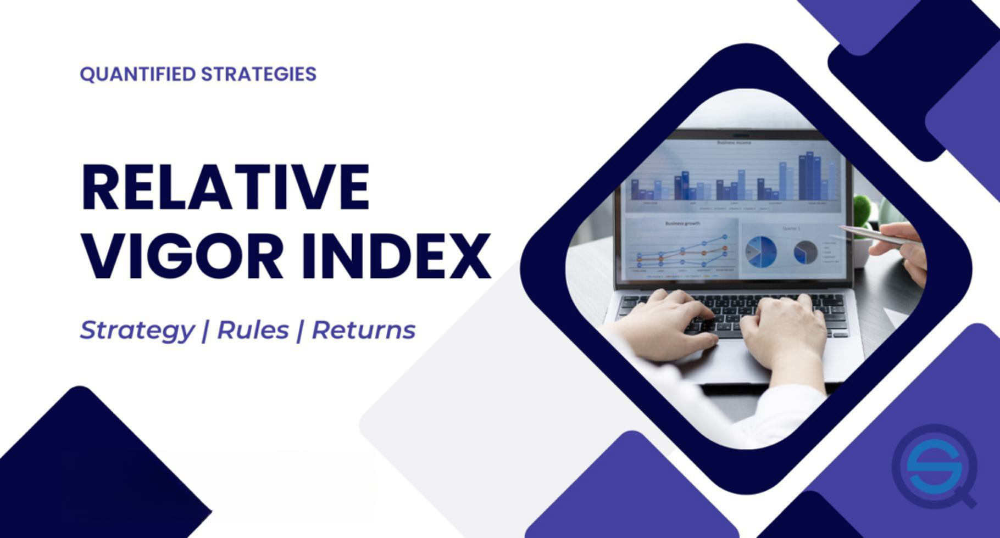

Understanding the intricacies of the forex market requires a blend of strategies and tools. The forex market, characterized by its high liquidity and round-the-clock availability, demands that traders employ sophisticated techniques to manage and predict price movements. One tool that has gained traction among traders for its predictive abilities is the Relative Vigor Index (RVI). 

The RVI serves as a technical indicator developed to measure the strength of a trend, allowing traders to make more informed decisions. Its utility lies in comparing the closing prices to the price range, thus shedding light on the momentum of price movements. This indicator becomes particularly significant when integrated into algorithmic trading platforms, which rely on systematic approaches and precise data analysis for trading decisions.



As this article progresses, the mechanics of the RVI will be examined to uncover its role in forex trading strategies. We will also explore how incorporating this indicator with others can significantly enhance the efficacy of trading algorithms. By understanding the interplay between RVI and additional market indicators, traders can refine their strategies, reducing the likelihood of false signals and improving their decision-making processes.

## Table of Contents

## What is the Relative Vigor Index (RVI)?

The Relative Vigor Index (RVI) is a technical analysis tool utilized by traders to measure the strength or vigor of a trend within the forex market. This indicator is based on the observation that in uptrending markets, closing prices tend to be higher than opening prices. Conversely, in downtrending markets, closing prices are generally lower than opening prices. 

The RVI operates as an oscillator, providing insights into the momentum of price movements by comparing the relationship between the closing prices and the trading ranges of assets. Essentially, it gauges whether the market sentiment supports continued movement in a particular direction by calculating how strongly prices are moving upwards or downwards.

To calculate the RVI, traders observe the following formula:

$$
RVI = \frac{(C - O)}{(H - L)}
$$

where:
- $C$ stands for the closing price,
- $O$ for the opening price,
- $H$ for the highest price,
- $L$ for the lowest price within the period.

This formula produces a value that oscillates above and below a centerline, which represents the degree of vigor in the current price trend. 

The RVI as an oscillator effectively highlights divergences in price trends and can be used to predict potential market turnarounds. It derives its readings by normalizing the price movement over a specified time frame and smoothing the data with a signal line to generate more reliable signals. These signals help traders make informed decisions by indicating potential reversals when the RVI values diverge from the underlying price movement.

Given its characteristics, the RVI is particularly useful in markets with consistent trends, where understanding [momentum](/wiki/momentum) can lead to more precise entry and [exit](/wiki/exit-strategy) strategies. Experimenting with the RVI alongside other indicators can enhance a trader's ability to ascertain market conditions reliably.

## Calculating the RVI

The Relative Vigor Index (RVI) is calculated using the formula: 

$$
\text{RVI} = \frac{\text{Close} - \text{Open}}{\text{High} - \text{Low}}
$$

This calculation is conducted for each period, and the RVI is averaged over a specified number of periods to smooth out short-term fluctuations.

This formula bears similarity to the calculation of the Stochastic Oscillator, which also utilizes the open, close, high, and low values of price data. In both cases, the goal is to measure momentum or the strength of market trends by analyzing price movements within a defined range. The RVI aims to capture the "vigor" of price changes by comparing the closing price to the trading range, while the Stochastic Oscillator compares closing prices to historical price ranges.

Moving averages play a pivotal role in the plotting of RVI lines. Typically, a simple moving average (SMA) or exponential moving average (EMA) is applied to the RVI calculations to produce a smoother line that is less sensitive to short-term market [volatility](/wiki/volatility-trading-strategies). The smoothed RVI is often paired with a signal line, which is another moving average of the RVI. Crossovers between the RVI line and its signal line are used by traders to identify potential entry and exit points in the market.

An example of Python code to calculate the RVI could look like this:

```python
import pandas as pd

def calculate_rvi(data, period=10):
    # Calculate the RVI using the provided formula
    close_open_diff = data['Close'] - data['Open']
    high_low_diff = data['High'] - data['Low']
    rvi_raw = close_open_diff / high_low_diff

    # Apply a moving average to smooth the RVI
    rvi = rvi_raw.rolling(window=period, min_periods=1).mean()

    return rvi

# Example usage with a DataFrame containing 'Open', 'Close', 'High', 'Low' columns
data = pd.DataFrame({
    'Open': [1.1, 1.2, 1.3],
    'Close': [1.2, 1.3, 1.4],
    'High': [1.25, 1.35, 1.45],
    'Low': [1.05, 1.15, 1.25]
})

rvi = calculate_rvi(data)
print(rvi)
```

This code demonstrates how to compute the RVI for a series of trading periods using Pandas. Adjusting the moving average period can tailor the smoothness of the RVI, aiding traders in assessing market momentum with greater precision.

## Incorporating RVI in Forex Trading Strategies

Traders use the Relative Vigor Index (RVI) as a key tool in Forex trading strategies due to its ability to provide insights into overbought and oversold conditions. The core idea is that the closing price tends to be higher than the opening price in a strong uptrend, and lower in a downtrend, reflecting market vigor or enthusiasm.

### Identifying Overbought and Oversold Conditions

The RVI helps traders identify potential overbought or oversold conditions in the market. When the RVI reaches extreme high values, it indicates that the market could be overbought, suggesting a potential reversal or correction. Conversely, extreme low values are indicative of an oversold market, which may lead to upward price movements. These conditions are particularly useful for traders looking to exit positions at optimal points or to anticipate market reversals.

### Significance of Crossovers Between RVI and Signal Lines

One of the most effective uses of the RVI in trading strategies is the monitoring of crossovers between the RVI line and its signal line, which is typically a moving average of the RVI. A bullish crossover occurs when the RVI line crosses above the signal line, indicating a potential buying opportunity. Conversely, a bearish crossover—where the RVI line crosses below the signal line—may signal a sell opportunity. These crossovers are crucial for identifying entry and exit points, enhancing decision-making by providing clear signals.

### Spotting Divergences for Counter-Trend Opportunities

Apart from crossovers, traders also use the RVI to spot divergences between the indicator and the price action. A divergence occurs when the price makes a new high or low, but the RVI does not confirm this movement, suggesting a weakening trend. For instance, if the price reaches a new high but the RVI forms a lower high, it can indicate bearish divergence, signaling a possible downward reversal. Similarly, a bullish divergence is identified when the price makes a new low but the RVI forms a higher low, indicating a potential upward reversal. These divergences offer traders counter-trend trading opportunities, allowing them to capitalize on price corrections.

By integrating the RVI into Forex trading strategies, traders can better navigate market conditions, take advantage of potential trend reversals, and optimize their trading performance. It is advisable to pair the RVI with other indicators to confirm signals and reduce the risk of false readings, thus refining the overall trading strategy.

## Combining RVI with Other Indicators

Combining the Relative Vigor Index (RVI) with other indicators can significantly enhance trading strategies by providing more reliable signals and reducing the likelihood of false positives. One effective combination is with the Relative Strength Index (RSI). The RSI measures the speed and change of price movements and is used to identify overbought or oversold conditions. When both the RVI and RSI align, confirming either an overbought or oversold condition, traders gain added confidence in the signal, potentially leading to more accurate trading decisions.

To implement this, traders look for scenarios where the RVI and RSI both indicate the same market condition. For example, if the RVI indicates a bullish trend and the RSI shows that the market is not overbought, this could corroborate a buy signal. Similarly, an RVI showing bearish conditions confirmed by an RSI in overbought territory strengthens the case for a sell signal.

Another strategy is to combine RVI with moving averages. The RVI provides insights into momentum, while moving averages can highlight trend directions and potential support or resistance levels. A common approach is to use a crossover strategy, where trades are triggered when the RVI crosses a moving average line. This can help filter out noise and confirm the strength of a trend.

The Moving Average Convergence Divergence (MACD) indicator is another tool that can offer valuable insights when used alongside the RVI. The MACD is a trend-following momentum indicator that displays the relationship between two moving averages of a security’s price. By combining the RVI, which focuses on price momentum, with the MACD, traders can identify imbalances between the momentum indicated by RVI and the trend indicated by MACD, thereby determining points of convergence or divergence for potential trade setups.

Bollinger Bands, which consist of a moving average and two standard deviation lines, can also complement the RVI by identifying volatility and potential price breakouts. By observing where the RVI intersects with the boundaries of the Bollinger Bands, traders can make predictions about price movements. For example, an RVI line moving towards one of the outer Bollinger Bands might suggest approaching heightened market intensity, warranting further investigation or possibly signaling an imminent [breakout](/wiki/breakout-trading).

Using multiple indicators reduces the risk of false signals since each serves as a filter for the others. By employing a confluence of signals, traders enhance their market assessment, leading to refined trade accuracy. Moreover, it underscores the importance of a systematic trading approach, where each indicator corroborates the others, providing a robust framework for decision-making. This multi-indicator strategy ensures that traders are not solely reliant on a single signal, which helps mitigate the risks associated with market variability and increases the probability of successful trade outcomes.

## Developing an Algorithmic Trading Strategy with RVI

Incorporating the Relative Vigor Index (RVI) into [algorithmic trading](/wiki/algorithmic-trading) platforms involves several key steps that require a blend of coding proficiency and quantitative analysis. The core of this integration is to allow for automated decision-making using the RVI as a primary indicator for assessing market trends and momentum.

### Coding Aspects and Backtesting Requirements

To integrate RVI into an algorithmic trading system, traders typically use platforms such as MetaTrader, TradingView, or custom setups using Python. The process begins with coding the RVI indicator using a trading platform's scripting language (MQL for MetaTrader) or utilizing a library like TA-Lib in Python. Here is a basic example of RVI calculation in Python using TA-Lib:

```python
import talib
import numpy as np

# Assuming close, open, high, low are numpy arrays of price data
rvi_numerator = talib.SMA(close - open, timeperiod=10)
rvi_denominator = talib.SMA(high - low, timeperiod=10)
rvi = rvi_numerator / rvi_denominator
```

Once the RVI is coded, [backtesting](/wiki/backtesting) becomes crucial. This involves using historical data to test how the RVI-based strategy would have performed. Key metrics such as return on investment (ROI), drawdown, and Sharpe ratio are assessed during the backtesting phase. Platforms like MetaTrader offer simulation environments for backtests, while Python users may use pandas and NumPy for sophisticated data manipulation during backtests.

### Continuous Monitoring and Adjustment

Automated trading systems depend heavily on continuous market surveillance and adaptations to maintain efficacy. The RVI strategy, once deployed, must be monitored in real time to ensure that it aligns with current market conditions, which can change due to volatility or market regime shifts.

Regular adjustments might include recalibrating the time period for moving averages used in the RVI calculation or modifying thresholds for entry and exit signals based on past performance data. Ensuring robust performance checks and maintaining a feedback loop from performance metrics into strategy tweaking is essential for sustained success.

Additionally, implementing [machine learning](/wiki/machine-learning) models that adaptively optimize the parameters of the RVI-based strategy based on historical and real-time data is a growing area of interest. These adaptive systems aim to keep the strategy aligned with evolving market dynamics without constant manual intervention.

In summary, developing an algorithmic trading strategy with the RVI involves meticulous coding, comprehensive backtesting, and ongoing refinements to stay responsive to market fluctuations. By balancing these aspects, traders can leverage RVI's strengths within automated systems to make informed trading decisions.

## Pros and Cons of Using the RVI Indicator

The Relative Vigor Index (RVI) stands out as a prominent tool among traders, particularly for its potential to act as a leading indicator in trending markets. One of the primary strengths of the RVI lies in its design; it capitalizes on the idea that prices tend to close higher than the open in bullish markets and vice versa in bearish markets. This characteristic makes the RVI effective in anticipating price movements, allowing traders to position themselves advantageously before a trend is fully established. 

However, despite its strengths, the RVI is not without limitations. In ranging or sideways markets, the likelihood of false signals increases significantly. The indicator, which works effectively in identifying overbought and oversold conditions in strong trends, may generate misleading signals when the market lacks a clear direction. This susceptibility arises from its construction, which can mistake minor price fluctuations for more significant movements in a non-trending environment.

To mitigate these limitations, traders often integrate the RVI with other technical tools and indicators. By adopting a more holistic approach, they can cross-verify signals and thereby increase their trading accuracy. For instance, complementing the RVI with the Relative Strength Index (RSI) or Moving Average Convergence Divergence (MACD) can provide additional context and help confirm trend strength or the likelihood of reversals. These combinations allow for a more comprehensive analysis. Techniques like signal crossovers or divergence spotting can be reinforced when multiple indicators align in their suggestions.

Moreover, developing a systematic approach by incorporating robust backtesting and continuous adjustment of strategies is crucial. By rigorously testing combinations of indicators under various market conditions, traders can refine strategies that minimize false signals and optimize for both trending and ranging markets. Continual monitoring and iterative modifications ensure that the RVI strategy remains aligned with evolving market dynamics. 

Ultimately, while the Relative Vigor Index offers valuable insights, its efficacy is amplified when used as a part of a broader analytical framework.

## Conclusion

The Relative Vigor Index (RVI) serves as a valuable tool in enhancing [forex](/wiki/forex-system) trading strategies by measuring the strength or vigor of price trends. As a technical indicator, the RVI's ability to provide insights into the momentum of price movements helps traders make informed decisions about market direction. By incorporating RVI, traders can better identify potential trend reversals and confirm existing trends, which is crucial in developing robust trading strategies.

The utility of the RVI is amplified when used in conjunction with other indicators. Leveraging a combination of tools such as the Relative Strength Index (RSI), moving averages, MACD, and Bollinger Bands, traders can refine their assessment of market conditions and increase the accuracy of trading signals. This multi-indicator approach helps to minimize the impact of false signals, thereby reducing the risk associated with trading in varying market conditions.

Adopting a systematic approach is essential for traders looking to harness the full potential of the RVI. Engaging in rigorous testing and backtesting of strategies allows traders to evaluate the effectiveness of RVI within different market environments and timeframes. This process of continuous adjustment is critical to aligning trading strategies with changing market dynamics. By continuously monitoring and refining their approach, traders can enhance their forex trading strategies, leading to improved results over time.

## References & Further Reading

[1]: Suttle, R., & Sweeney, T. (2012). ["Relative Vigor Index Indicator."](https://howtotrade.com/indicators/relative-vigor-index/) Investopedia. 

[2]: Wilder, J. W. (1978). ["New Concepts in Technical Trading Systems."](https://archive.org/details/newconceptsintec00wild) Trend Research.

[3]: Pring, M. J. (2002). ["Technical Analysis Explained: The Successful Investor's Guide to Spotting Investment Trends and Turning Points."](https://www.amazon.com/Technical-Analysis-Explained-Fifth-Successful/dp/0071825177) McGraw Hill.

[4]: Murphy, J. J. (1999). ["Technical Analysis of the Financial Markets: A Comprehensive Guide to Trading Methods and Applications."](https://archive.org/details/technicalanalysi0000murp) New York Institute of Finance.

[5]: Achelis, S. B. (2001). ["Technical Analysis from A to Z."](https://archive.org/details/technicalanalysi00ache) McGraw Hill.