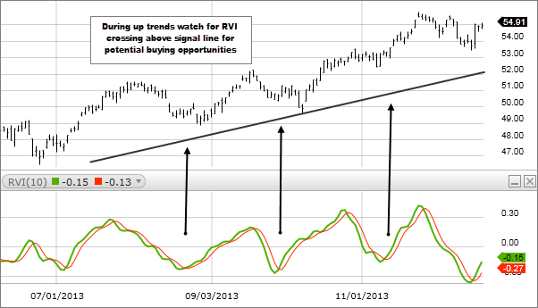

## Table of Contents

## What is the Relative Vigor Index (RVI) and how is it used in trading?

The Relative Vigor Index (RVI) is a technical indicator used in trading to measure the strength of a price trend by comparing the closing price to the trading range of a security. It is based on the idea that prices tend to close near the high in uptrends and near the low in downtrends. The RVI calculates this by taking the difference between the closing price and the opening price, and then dividing it by the difference between the high and the low of the period. This value is then smoothed over time to create the RVI line and a signal line, which traders use to identify potential buy and sell signals.

In trading, the RVI is used to confirm the strength of a trend and to spot potential reversals. When the RVI line crosses above the signal line, it is considered a bullish signal, suggesting that it might be a good time to buy. Conversely, when the RVI line crosses below the signal line, it is seen as a bearish signal, indicating a possible time to sell. Traders often look for divergences between the RVI and the price action as well. For instance, if the price is making new highs but the RVI is not, it could signal that the uptrend is losing strength and a reversal might be imminent. By using the RVI alongside other indicators and analysis tools, traders can make more informed decisions about when to enter or exit trades.

## How is the Relative Vigor Index calculated?

The Relative Vigor Index (RVI) is calculated by comparing the closing price of a security to its trading range. First, you take the difference between the closing price and the opening price. Then, you divide that by the difference between the high price and the low price of the same period. This gives you a raw RVI value. To smooth out this value and make it easier to use, you apply a simple moving average over a set number of periods, usually 10. This creates the RVI line.

Next, you create a signal line to go along with the RVI line. The signal line is made by taking a simple moving average of the RVI line itself, usually over 4 periods. This signal line helps traders see when the RVI is changing direction. When the RVI line crosses above the signal line, it suggests the price trend might be getting stronger. When it crosses below, it might mean the trend is weakening. By watching these lines, traders can get clues about when to buy or sell.

## What are the key components of the RVI formula?

The Relative Vigor Index (RVI) is calculated by comparing where the price closes compared to where it opened and the full range of prices during that time. You start by finding the difference between the closing price and the opening price. Then, you divide that by the difference between the highest price and the lowest price of the same period. This gives you a number that shows if the price closed closer to the high or the low of the range. To make this number smoother and easier to use, you calculate a simple average of these values over a set number of periods, usually 10. This smoothed value is what we call the RVI line.

To make the RVI more useful, we also create a signal line. The signal line is made by taking a simple average of the RVI line itself, usually over 4 periods. This signal line helps traders see when the RVI might be changing direction. When the RVI line goes above the signal line, it can mean the price trend is getting stronger. When it goes below, it might mean the trend is getting weaker. By watching how the RVI line and the signal line move compared to each other, traders can get hints about when to buy or sell.

## How can the RVI help in identifying trend directions?

The Relative Vigor Index (RVI) helps traders figure out the strength and direction of a price trend. It does this by comparing where the price closes compared to where it opened and the full range of prices during that time. If the RVI line goes up and crosses above the signal line, it suggests the price trend might be getting stronger and moving up. This can be a sign for traders to think about buying. On the other hand, if the RVI line goes down and crosses below the signal line, it might mean the trend is getting weaker and could be moving down. This could be a sign for traders to think about selling.

Traders also look at the RVI to spot when the trend might be changing direction. If the price is going up but the RVI is not following, it could mean the upward trend is losing strength and might reverse soon. The same goes for a downward trend; if the price keeps going down but the RVI starts to go up, it might mean the downward trend is losing steam and could turn around. By watching how the RVI and the price move together or apart, traders can get clues about when to enter or [exit](/wiki/exit-strategy) trades.

## What do the different RVI values indicate about market conditions?

The Relative Vigor Index (RVI) helps traders understand how strong a price trend is. When the RVI line is high and goes above the signal line, it means the price trend is getting stronger and might be moving up. This can be a good sign for traders to think about buying. On the other hand, when the RVI line is low and goes below the signal line, it means the trend might be getting weaker and could be moving down. This could be a sign for traders to think about selling.

Traders also use the RVI to spot when the market might be changing direction. If the price is going up but the RVI is not following, it could mean the upward trend is losing strength and might reverse soon. Similarly, if the price is going down but the RVI starts to go up, it might mean the downward trend is losing steam and could turn around. By watching how the RVI and the price move together or apart, traders can get clues about what the market might do next.

## How does the RVI differ from other momentum indicators like the RSI?

The Relative Vigor Index (RVI) and the Relative Strength Index (RSI) are both used to measure the strength of a price trend, but they do it in different ways. The RVI looks at where the price closes compared to where it opened and the full range of prices during that time. It then smooths this information over time to create an RVI line and a signal line. Traders use these lines to see if the trend is getting stronger or weaker. If the RVI line goes above the signal line, it might be a good time to buy because the trend could be getting stronger. If it goes below, it might be a good time to sell because the trend could be getting weaker.

The RSI, on the other hand, measures how fast and how much the price is changing. It does this by comparing the average gains and losses over a set number of periods, usually 14. The RSI gives a number between 0 and 100. If the RSI is above 70, it might mean the price is too high and could go down soon. If it's below 30, it might mean the price is too low and could go up soon. While both the RVI and RSI help traders understand the strength of a trend, the RVI focuses more on the closing price compared to the trading range, and the RSI focuses more on the speed of price changes.

## Can the RVI be used for both short-term and long-term trading strategies?

Yes, the Relative Vigor Index (RVI) can be used for both short-term and long-term trading strategies. For short-term trading, traders might look at the RVI on a daily or even hourly chart. They watch for the RVI line to cross above or below the signal line to make quick buy or sell decisions. If the RVI line goes above the signal line, it might be a good time to buy because the trend could be getting stronger. If it goes below, it might be a good time to sell because the trend could be getting weaker. This way, traders can take advantage of short-term price movements.

For long-term trading, traders might use the RVI on weekly or monthly charts to understand bigger trends. They look at how the RVI changes over longer periods to decide when to enter or exit a trade. If the RVI shows a strong upward trend over several weeks or months, it might be a good time to buy and hold for the long term. If the RVI shows a strong downward trend, it might be a good time to sell or stay out of the market. By using the RVI on different time frames, traders can adapt it to fit both short-term and long-term strategies.

## What are the common trading signals generated by the RVI?

The Relative Vigor Index (RVI) gives traders signals about when to buy or sell by looking at how strong a price trend is. One common signal happens when the RVI line crosses above the signal line. This means the price trend might be getting stronger and could be moving up. Traders see this as a good time to buy because the price might keep going up. On the other hand, when the RVI line crosses below the signal line, it means the trend might be getting weaker and could be moving down. Traders see this as a good time to sell because the price might keep going down.

Another signal traders look for is when the RVI and the price move in different directions. If the price is going up but the RVI is not following, it could mean the upward trend is losing strength and might reverse soon. This is called a bearish divergence and could be a sign to sell. If the price is going down but the RVI starts to go up, it might mean the downward trend is losing steam and could turn around. This is called a bullish divergence and could be a sign to buy. By watching these signals, traders can make better choices about when to enter or exit trades.

## How can traders use the RVI in conjunction with other technical indicators?

Traders can use the RVI along with other technical indicators to make better trading decisions. For example, they might use the RVI with the Moving Average Convergence Divergence (MACD). The RVI can show when a trend is getting stronger or weaker, and the MACD can confirm if there's a change in momentum. If the RVI line goes above the signal line and the MACD line crosses above its signal line too, it can be a strong sign to buy. If both indicators show the opposite, it can be a good time to sell. By using both together, traders get a clearer picture of what the market might do next.

Another way to use the RVI is with the Relative Strength Index (RSI). While the RVI looks at where the price closes compared to the trading range, the RSI measures how fast and how much the price is changing. If the RVI shows a strong trend and the RSI is not overbought or oversold, it can give traders more confidence in their decisions. For example, if the RVI line goes above the signal line and the RSI is below 70, it might be a good time to buy. If the RVI line goes below the signal line and the RSI is above 30, it might be a good time to sell. Combining the RVI with other indicators like the RSI can help traders spot better trading opportunities.

## What are the limitations and potential pitfalls of using the RVI in trading?

Using the RVI can have some limitations and pitfalls that traders should be aware of. One big problem is that the RVI can give false signals. Sometimes, it might look like the trend is getting stronger or weaker, but the price doesn't follow. This can lead traders to buy or sell at the wrong times, which can cost them money. Another issue is that the RVI works best in trending markets, but it can be less useful when the market is moving sideways. If the price isn't going up or down in a clear way, the RVI might not give clear signals, making it harder for traders to make good decisions.

Another limitation is that the RVI is just one tool, and it doesn't work well on its own. Traders need to use it with other indicators and analysis to get a better picture of what's happening in the market. Relying only on the RVI can lead to mistakes because it doesn't consider all the factors that can affect price movements. Also, the RVI settings, like the number of periods used for the moving averages, can be set differently by different traders. If the settings are not right for the market being traded, the signals might not be accurate. So, it's important for traders to understand these limitations and use the RVI carefully.

## How can the RVI be optimized for different market conditions?

To make the RVI work better in different market conditions, traders can change the number of periods they use for the moving averages. In fast-moving markets, traders might use shorter periods, like 5 or 7 days for the RVI line and 2 or 3 days for the signal line. This helps them catch quick changes in the trend. In slower-moving markets, they might use longer periods, like 14 or 21 days for the RVI line and 6 or 10 days for the signal line. This helps them see bigger trends and avoid getting fooled by small price movements.

Another way to optimize the RVI is to use it with other indicators that work well in the same market conditions. For example, in a trending market, traders might use the RVI with the MACD to confirm strong trends. In a market that's moving sideways, they might use the RVI with the Bollinger Bands to spot when the price might break out of the range. By adjusting the RVI settings and using it with other tools, traders can make better decisions no matter what the market is doing.

## What advanced techniques can be applied to enhance the effectiveness of the RVI in expert trading scenarios?

In expert trading scenarios, one advanced technique to enhance the effectiveness of the RVI is to use it in combination with other advanced indicators like the Average Directional Index (ADX). The ADX measures the strength of a trend, and when used with the RVI, it can help traders confirm if a trend is strong enough to act on. If the RVI shows a potential trend change and the ADX confirms a strong trend, traders can have more confidence in their trading decisions. Another technique is to apply different time frames for the RVI. For example, traders might look at the RVI on both a daily and a weekly chart to see if the signals align across different time frames, providing a more robust trading signal.

Another advanced technique involves using the RVI in conjunction with [volume](/wiki/volume-trading-strategy)-based indicators like the On-Balance Volume (OBV). The OBV can help traders understand the strength of a trend by looking at the volume of trades. If the RVI signals a trend change and the OBV supports this by showing increasing volume in the direction of the trend, it can reinforce the validity of the RVI signal. Additionally, expert traders might use custom algorithms or automated trading systems that incorporate the RVI with other technical analysis tools to generate more precise entry and exit points. By integrating these advanced techniques, traders can improve their ability to make informed decisions in complex market environments.

## What is the Relative Vigor Index (RVI)?

The Relative Vigor Index (RVI) is a technical momentum indicator used by traders to gauge the conviction behind recent price movements. RVI is particularly effective in identifying the direction of market trends and spotting potential market reversals. This indicator is grounded on the principle that, in bullish markets, prices tend to close higher than they open, while in bearish markets, they close lower. By quantifying these tendencies, the RVI assists traders in confirming existing trends and refining their trading strategies.

RVI is formulated by analyzing price changes over a specific period and is expressed mathematically as follows:

$$
\text{RVI} = \frac{\text{Close} - \text{Open}}{\text{High} - \text{Low}}
$$

This calculation captures the strength of price movements by measuring the difference between closing and opening prices relative to the trading range (high minus low). A positive RVI value suggests that, on average, prices are closing higher than they opened, indicating bullish [momentum](/wiki/momentum), whereas a negative value indicates bearish momentum.

In practice, traders often use the RVI in combination with other technical indicators to enhance the robustness of their market analysis. For instance, pairing RVI with tools like moving averages or the Relative Strength Index (RSI) can provide a more comprehensive view of market conditions, helping to filter out false signals and confirm trends with greater accuracy. Thus, while the RVI is an integral component of technical analysis, its effectiveness is enhanced when used alongside complementary indicators.

## What is the RVI Formula and how can it be understood?

The Relative Vigor Index (RVI) is a momentum indicator primarily used to measure the strength of a price movement in a given market. At its core, the RVI formula is designed to provide insights into the underlying vigor or conviction driving recent price changes. The RVI is calculated by assessing the differences between closing and opening prices over a certain period, thereby capturing the inherent momentum of price changes.

The calculation of the RVI is straightforward, yet insightful. Specifically, the formula measures the difference between the close and open prices and divides this by the difference between the high and low prices during the same period. This can be mathematically expressed as:

$$
\text{RVI} = \frac{\text{Close} - \text{Open}}{\text{High} - \text{Low}}
$$

The numerator, $\text{Close} - \text{Open}$, quantifies the net change in price over the period, thereby indicating whether bullish or bearish sentiment is dominant. Meanwhile, the denominator, $\text{High} - \text{Low}$, normalizes this change relative to the total price range within the period, offering a perspective on how significant the net change is compared to total [volatility](/wiki/volatility-trading-strategies).

The RVI is often perceived as an enhancement over simple price changes because it accounts for both the direction and the relative magnitude of price movements. Such an approach allows traders to interpret the RVI as an indicator of market sentiment. A higher RVI suggests strong upward momentum, which could imply bullish sentiment, while a lower or negative RVI might indicate downward momentum and potential bearish sentiment.

Additionally, traders often use the RVI in combination with other indicators to confirm trends and support technical analysis. It helps to gauge potential reversals by providing a momentum perspective that might not be immediately apparent through simple price charts alone. This dual focus on price movement direction and magnitude makes the RVI a valuable tool for anticipating shifts in market sentiment.

## References & Further Reading

[1]: Ehlers, J. F. (1991). ["Rocket Science for Traders: Digital Signal Processing Applications."](https://www.amazon.com/Rocket-Science-Traders-Processing-Applications/dp/0471405671) John Wiley & Sons.

[2]: Chande, T.S. (1994). ["The New Technical Trader: Boost Your Profit by Plugging into the Latest Indicators."](https://books.google.com/books/about/The_New_Technical_Trader.html?id=uPMJAQAAMAAJ) John Wiley & Sons.

[3]: Kaufman, P. J. (2013). ["Trading Systems and Methods, 5th Edition."](https://onlinelibrary.wiley.com/doi/book/10.1002/9781119202561) Wiley.

[4]: Murphy, J. J. (1999). ["Technical Analysis of the Financial Markets: A Comprehensive Guide to Trading Methods and Applications."](https://archive.org/details/technicalanalysi0000murp) New York Institute of Finance.

[5]: Lopez de Prado, M. (2018). ["Advances in Financial Machine Learning."](https://www.amazon.com/Advances-Financial-Machine-Learning-Marcos/dp/1119482089) Wiley.