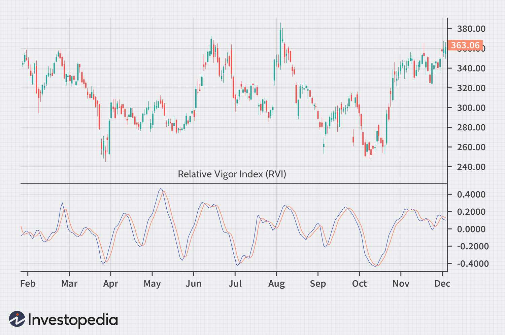

The Relative Vigor Index (RVI) is a prevalent technical indicator in the trading community, valued for its ability to assess market momentum effectively. Traders rely on the RVI to measure the strength and direction of market trends, which aids in making informed trading decisions. The use of technical indicators such as the RVI is integral to the practice of algorithmic trading, where predetermined criteria guide the execution of trades through automated systems.

Trading indicators are vital for algorithmic trading, providing key analytics that facilitate strategic decision-making. They allow traders to identify patterns, predict future price movements, and manage risk effectively. The RVI stands out due to its unique approach to calculating the vigor or strength of price movements, thereby offering insights into potential trend continuations or reversals.



The RVI is calculated using a specific formula that considers the relationship between a period's closing and opening prices, divided by the high-low range of the same period. This mathematical expression allows traders to quantify market sentiment and identify trading opportunities with more precision.

Integrating the RVI into trading algorithms enables automated systems to generate trade signals based on real-time market data, improving the speed and accuracy of trade executions. Understanding how to apply the RVI in trading algorithms not only enhances a trader's ability to respond swiftly to market changes but also improves the overall effectiveness of trading strategies.

By exploring the RVI's mechanics and its application in algorithmic trading, traders can enhance their decision-making capabilities and gain a more profound understanding of market dynamics. The RVI serves as a significant asset in a trader's toolkit, offering a reliable means to interpret market vigor and potentially achieve better trading outcomes.

## Table of Contents

## What is the Relative Vigor Index (RVI)?

The Relative Vigor Index (RVI) is a technical momentum indicator used by traders to gauge the conviction behind recent price movements. RVI is particularly effective in identifying the direction of market trends and spotting potential market reversals. This indicator is grounded on the principle that, in bullish markets, prices tend to close higher than they open, while in bearish markets, they close lower. By quantifying these tendencies, the RVI assists traders in confirming existing trends and refining their trading strategies.

RVI is formulated by analyzing price changes over a specific period and is expressed mathematically as follows:

$$
\text{RVI} = \frac{\text{Close} - \text{Open}}{\text{High} - \text{Low}}
$$

This calculation captures the strength of price movements by measuring the difference between closing and opening prices relative to the trading range (high minus low). A positive RVI value suggests that, on average, prices are closing higher than they opened, indicating bullish [momentum](/wiki/momentum), whereas a negative value indicates bearish momentum.

In practice, traders often use the RVI in combination with other technical indicators to enhance the robustness of their market analysis. For instance, pairing RVI with tools like moving averages or the Relative Strength Index (RSI) can provide a more comprehensive view of market conditions, helping to filter out false signals and confirm trends with greater accuracy. Thus, while the RVI is an integral component of technical analysis, its effectiveness is enhanced when used alongside complementary indicators.

## Understanding the RVI Formula

The Relative Vigor Index (RVI) is a momentum indicator primarily used to measure the strength of a price movement in a given market. At its core, the RVI formula is designed to provide insights into the underlying vigor or conviction driving recent price changes. The RVI is calculated by assessing the differences between closing and opening prices over a certain period, thereby capturing the inherent momentum of price changes.

The calculation of the RVI is straightforward, yet insightful. Specifically, the formula measures the difference between the close and open prices and divides this by the difference between the high and low prices during the same period. This can be mathematically expressed as:

$$
\text{RVI} = \frac{\text{Close} - \text{Open}}{\text{High} - \text{Low}}
$$

The numerator, $\text{Close} - \text{Open}$, quantifies the net change in price over the period, thereby indicating whether bullish or bearish sentiment is dominant. Meanwhile, the denominator, $\text{High} - \text{Low}$, normalizes this change relative to the total price range within the period, offering a perspective on how significant the net change is compared to total [volatility](/wiki/volatility-trading-strategies).

The RVI is often perceived as an enhancement over simple price changes because it accounts for both the direction and the relative magnitude of price movements. Such an approach allows traders to interpret the RVI as an indicator of market sentiment. A higher RVI suggests strong upward momentum, which could imply bullish sentiment, while a lower or negative RVI might indicate downward momentum and potential bearish sentiment.

Additionally, traders often use the RVI in combination with other indicators to confirm trends and support technical analysis. It helps to gauge potential reversals by providing a momentum perspective that might not be immediately apparent through simple price charts alone. This dual focus on price movement direction and magnitude makes the RVI a valuable tool for anticipating shifts in market sentiment.

## Implementing RVI in Algorithmic Trading

Algorithmic trading has revolutionized the financial markets by providing traders with the tools to execute trades based on pre-determined criteria, reducing the need for manual intervention. One way to enhance these algorithms is by integrating the Relative Vigor Index (RVI). The RVI provides insight into market momentum, making it valuable for automated trading systems.

Integrating RVI into [algorithmic trading](/wiki/algorithmic-trading) involves programming the indicator to generate trade signals when specific conditions are met. This can be achieved by setting thresholds for the RVI values to trigger buy or sell signals. For instance, a trade signal may be generated when the RVI crosses above a particular level, indicating bullish momentum, or below a certain level, suggesting bearish momentum.

A simple implementation in Python might look like this:

```python
import pandas as pd
import numpy as np

def calculate_rvi(data, period=10):
    """
    Calculate the Relative Vigor Index (RVI).
    :param data: A DataFrame containing 'Open', 'Close', 'High', 'Low' prices.
    :param period: The period over which to calculate the RVI.
    :return: The RVI as a Series.
    """
    close_open_diff = data['Close'] - data['Open']
    high_low_diff = data['High'] - data['Low']

    rvi = close_open_diff.rolling(window=period).mean() / high_low_diff.rolling(window=period).mean()
    return rvi

# Example usage with a DataFrame df containing price data
df['RVI'] = calculate_rvi(df)
```

Once the RVI is integrated into the trading algorithm, the next step involves [backtesting](/wiki/backtesting) these RVI-based strategies to evaluate their performance across different market conditions. Backtesting allows traders to simulate the trading strategy on historical data, thereby understanding its effectiveness and reliability before deploying it in live market conditions. 

Successful backtesting can reveal the robustness of an RVI-based model, identifying how it might perform in both trending and sideways markets. It often includes Sharpe ratios, drawdown analyses, and other performance metrics.

By leveraging the RVI in algorithmic trading, traders can improve decision-making accuracy, leading to enhanced efficiency and profitability. Slowly optimizing and iterating the algorithm based on test results is essential for adapting to dynamic market conditions and reducing the risk of false signals generated by the RVI. This approach allows for fine-tuning so that the algorithm can better differentiate between true trend reversals and noise.

In summary, integrating the Relative Vigor Index into algorithmic trading systems can automate and refine trading strategies, providing a more systematic approach to capturing market momentum and potential reversals.

## Benefits and Limitations of Using the RVI

The Relative Vigor Index (RVI) serves as a significant tool for traders aiming to decipher market momentum and potential reversals. Its utility is pronounced, especially in volatile markets where rapid decision-making is crucial. The core advantage of the RVI lies in its ability to provide insights into the strength and direction of price movements, assisting traders in making more informed decisions.

However, like any technical indicator, the RVI has its limitations. One primary concern is the risk of false signals, which may arise due to market noise or unexpected market events. The RVI is not infallible; its signals should not be used in isolation. To mitigate the impact of false signals, traders are encouraged to use the RVI in tandem with other technical indicators such as Moving Averages, Moving Average Convergence Divergence (MACD), or the Relative Strength Index (RSI). This approach allows for a more robust analysis, confirming trends or reversals that the RVI alone might not reliably indicate.

Another limitation of the RVI is its dependency on past price movements, which means it may sometimes react slowly to rapid changes in market conditions. This lag can be detrimental during periods of highly volatile market shifts. Thus, it is essential for traders to understand both the benefits and limitations of the RVI to harness its full potential effectively.

By acknowledging and addressing these limitations, traders can optimize the use of the RVI, enhancing their strategy’s accuracy and reliability. This strategic integration is crucial for maximizing the benefits of the RVI while minimizing any adverse impacts from its inherent limitations.

## Conclusion

The Relative Vigor Index (RVI) serves as an indispensable instrument for traders aiming to gain insights into market momentum. Its ability to quantify and reflect the vigor of price movements renders it a dependable ally for trend analysis. By capturing the tendency of prices to close higher than they open in rising markets, and lower in declining ones, RVI provides a nuanced perspective on market sentiment, which is crucial for making informed trading decisions.

In the context of algorithmic trading, the integration of RVI into trading algorithms offers a path to automating and optimizing trading strategies. The capacity of RVI to generate clear trade signals based on predefined conditions allows traders to execute strategies consistently, minimizing the influence of human emotion and potentially enhancing profitability. Backtesting such algorithms can further validate their effectiveness, ensuring they adapt well to varying market conditions.

Despite its utility, the RVI is not without limitations. Its ability to produce false signals, especially in choppy or sideways markets, necessitates a prudent approach. It is often most effective when used alongside other technical indicators, providing a more comprehensive view of market dynamics. Acknowledging these constraints enables traders to capitalize on RVI's strengths while mitigating the risks associated with its use.

As traders constantly adapt to an evolving financial landscape, the RVI's role as a persistent and valuable indicator remains assured. Its continued relevance is fueled by its foundational premise—measuring market vigor—which is integral to technical analysis and trading strategy development. The RVI's enduring utility underscores its place in the toolkit of both novice and seasoned traders seeking an edge in competitive markets.

## References & Further Reading

[1]: Ehlers, J. F. (1991). ["Rocket Science for Traders: Digital Signal Processing Applications."](https://www.amazon.com/Rocket-Science-Traders-Processing-Applications/dp/0471405671) John Wiley & Sons.

[2]: Chande, T.S. (1994). ["The New Technical Trader: Boost Your Profit by Plugging into the Latest Indicators."](https://books.google.com/books/about/The_New_Technical_Trader.html?id=uPMJAQAAMAAJ) John Wiley & Sons.

[3]: Kaufman, P. J. (2013). ["Trading Systems and Methods, 5th Edition."](https://onlinelibrary.wiley.com/doi/book/10.1002/9781119202561) Wiley.

[4]: Murphy, J. J. (1999). ["Technical Analysis of the Financial Markets: A Comprehensive Guide to Trading Methods and Applications."](https://archive.org/details/technicalanalysi0000murp) New York Institute of Finance.

[5]: Lopez de Prado, M. (2018). ["Advances in Financial Machine Learning."](https://www.amazon.com/Advances-Financial-Machine-Learning-Marcos/dp/1119482089) Wiley.