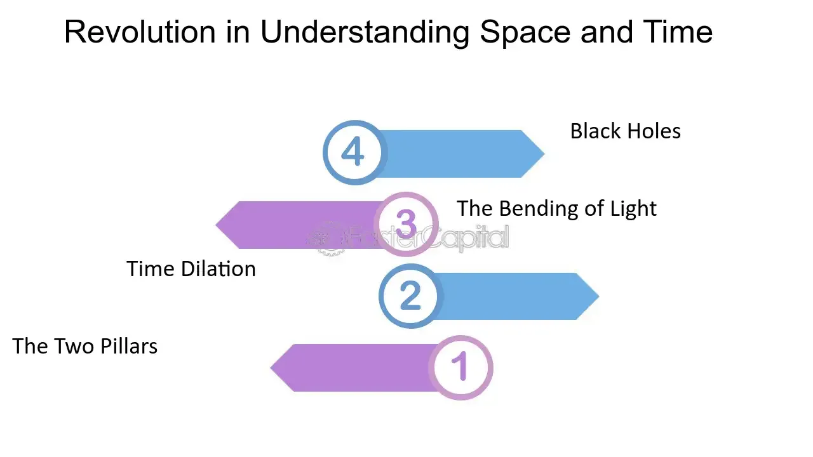

## Table of Contents

## What is the relativity trap?

The relativity trap is a concept in physics that describes how time and space can change depending on how fast you're moving. Imagine you're on a spaceship traveling very fast, close to the speed of light. From your perspective on the spaceship, time might seem to pass normally. But to someone watching from Earth, your time would appear to be moving slower. This is because, according to Einstein's theory of relativity, time and space are not fixed but can stretch and shrink based on speed.

This idea can be hard to understand because it goes against our everyday experience. Normally, we think time moves at the same pace for everyone. But the relativity trap shows us that this isn't true when you're moving at very high speeds. It's like a trap because it can lead to surprising and counterintuitive results, like astronauts aging more slowly than people on Earth. This concept is important for things like GPS satellites, which have to account for these time differences to work correctly.

## How does the relativity trap affect decision-making?

The relativity trap can affect decision-making by making it hard to compare options that happen at different times or speeds. Imagine you're choosing between two jobs: one that pays well but starts in a year, and another that pays less but starts right away. If you're moving fast, like on a spaceship, the time until the first job starts might feel shorter to you than to someone on Earth. This can make the first job seem more appealing because it feels like you won't have to wait as long.

This can lead to decisions that might not make sense to others who aren't moving as fast. For example, if you're on a fast-moving spaceship, you might choose to invest in a project that takes a long time to pay off because, to you, that time feels shorter. But to someone on Earth, that same project might seem like a bad idea because they see the time as much longer. So, the relativity trap can cause you to make choices based on your own experience of time, which might not match up with what others think is best.

## Can you provide a simple example of the relativity trap in everyday life?

Imagine you and your friend are playing a game where you have to wait for a timer to finish before you can open a present. You are sitting still, but your friend is on a fast-moving train. To you, the timer takes 10 minutes to finish. But because your friend is moving fast, the timer seems to take only 8 minutes for them. This is the relativity trap at work: time moves differently for your friend because they are moving quickly.

This can affect how you both feel about the game. You might think it's fair because the timer is the same for both of you, but your friend might feel like they have to wait less time. It shows how something as simple as a timer can be experienced differently based on how fast you're moving. The relativity trap can make it hard to agree on what's fair or what's a good choice when time feels different for different people.

## What psychological principles underpin the relativity trap?

The relativity trap is influenced by the psychological principle of time perception. People's sense of time can change based on what they are doing and how they feel. When someone is moving fast, like on a spaceship, their brain might process time differently than someone who is sitting still. This is because our brains use clues from our surroundings to tell time, and these clues can be different when we're moving quickly. So, the relativity trap can make people feel like time is moving at a different speed, which can affect their decisions and how they see the world.

Another psychological principle at play is the concept of relativity itself, which affects how we compare things. When we make choices, we often compare options to each other. If someone is moving fast and experiences time differently, their comparisons might not match up with someone who is standing still. For example, a long-term project might seem more appealing to someone on a fast-moving spaceship because they feel like the time will pass quickly. This can lead to decisions that seem strange to others who experience time differently. The relativity trap shows us how our perception of time and our comparisons can lead to different choices based on our situation.

## How can the relativity trap be identified in marketing strategies?

The relativity trap can be seen in marketing strategies when companies use time-based promotions that play on how people feel about waiting. For example, a company might offer a special deal that lasts for a short time, like a flash sale. To someone who feels like time is moving quickly, this short time might seem even shorter, making the deal more appealing. But to someone who feels like time is moving slowly, the same deal might not seem as urgent. Marketers can use this understanding of time perception to make their promotions more effective by targeting people who might feel time differently.

Another way the relativity trap shows up in marketing is through long-term offers. A company might offer a subscription that lasts for a year, and this can seem like a good deal to someone who feels like a year will pass quickly. But to someone who feels like a year is a long time, the same subscription might not seem as appealing. Marketers can tailor their messages to appeal to different groups based on how they perceive time, making their strategies more effective by understanding the relativity trap.

## What are the common cognitive biases associated with the relativity trap?

One common cognitive bias associated with the relativity trap is the time discounting bias. This is when people value things that happen sooner more than things that happen later. If someone feels like time is moving quickly because they're moving fast, they might discount the future even more. They might choose a smaller reward right away instead of waiting for a bigger reward later because the wait feels shorter to them. This can lead to decisions that might not be the best in the long run.

Another cognitive bias is the framing effect. This is when people make different choices based on how options are presented. If a marketer frames a deal as a short-term offer, someone who feels like time is moving quickly might see it as more urgent and valuable. But someone who feels like time is moving slowly might not see the same urgency. The way time is framed can influence decisions, and the relativity trap can make these differences even bigger.

## How does the relativity trap influence consumer behavior?

The relativity trap can make people see time differently, and this can change how they act as consumers. If someone feels like time is moving quickly, they might be more likely to buy things that are available for a short time. They might jump at a flash sale because it feels like the time to buy is very short. On the other hand, someone who feels like time is moving slowly might not see the same rush to buy. This difference in how people see time can make them choose different products or deals based on how urgent they feel the offer is.

Another way the relativity trap affects consumer behavior is through long-term offers. If a company offers a yearly subscription, someone who feels like a year will pass quickly might think it's a good deal. They might be more willing to commit to something that lasts a long time because it feels like it won't be that long to them. But someone who feels like a year is a very long time might not be as interested in the same subscription. So, the relativity trap can make people choose different things based on their own sense of time, which can lead to different buying habits.

## What are some historical examples where the relativity trap played a significant role?

One historical example where the relativity trap played a significant role is in the development of the Global Positioning System (GPS). When GPS was being created, scientists had to account for the fact that time moves differently for satellites in space compared to people on Earth. The satellites move very fast, so time for them goes a bit slower than for us. If the scientists didn't fix this, the GPS would give wrong locations. By understanding the relativity trap, they made sure the GPS works right by adjusting the time on the satellites.

Another example is in the planning of long space missions, like those to Mars. Astronauts on these missions move very fast, so time for them goes slower than for people on Earth. This means they age a tiny bit slower than their families back home. When planning these missions, scientists have to think about how this time difference might affect the astronauts and their families. The relativity trap makes these missions more complicated because it changes how time works for everyone involved.

## How can individuals avoid falling into the relativity trap?

To avoid falling into the relativity trap, individuals need to be aware of how their sense of time can change based on their situation. If you're moving fast, like on a plane or a train, you might feel like time is moving differently than it does when you're sitting still. It's important to remember that this feeling is normal but can affect your decisions. Try to think about how someone who isn't moving as fast as you might see the same situation. This can help you make choices that are fair and make sense to others.

Another way to avoid the relativity trap is to be careful when comparing things that happen at different times. If you're choosing between a reward now and a bigger reward later, think about how long the wait really is, not just how it feels to you. It can help to talk to someone who sees time differently to get their view on the choice. By understanding that time can feel different to different people, you can make better decisions and avoid the surprises that come with the relativity trap.

## What are the advanced techniques used by businesses to exploit the relativity trap?

Businesses use advanced techniques to make the most of the relativity trap by playing with how people see time. They might create flash sales that only last a short time. To someone who feels like time is moving quickly, these sales seem even shorter and more urgent. This makes them more likely to buy right away. Companies also use countdown timers on their websites to make people feel like they need to act fast. By understanding that people's sense of time can change, businesses can make their promotions feel more urgent and exciting.

Another way businesses use the relativity trap is by offering long-term deals like yearly subscriptions. If someone feels like a year will pass quickly, they might see the subscription as a good deal. Companies might show how much money you save over a year to make the offer seem even better. They also use stories or ads that make a year feel short, like showing happy moments that seem to fly by. By making long-term offers seem shorter and more appealing, businesses can get more people to sign up for their services.

## How does the relativity trap interact with other decision-making biases?

The relativity trap can work together with other decision-making biases to make our choices even trickier. One of these biases is the time discounting bias. This happens when we want things now more than things later. If someone feels like time is moving fast, they might want a small reward right away even more than usual. This can lead them to make choices that might not be the best in the long run. The relativity trap makes this bias stronger because it changes how we see time, making us want things now even more.

Another bias that the relativity trap can affect is the framing effect. This is when how a choice is presented changes what we decide. If a company says a deal will only last a short time, someone who feels like time is moving quickly might see it as even more urgent. They might jump at the deal because it feels like it won't be around for long. The relativity trap makes the framing effect stronger by changing how urgent we feel a choice is. Together, these biases can make our decisions even harder to understand and predict.

## What research methodologies are used to study the effects of the relativity trap?

Researchers use different ways to study how the relativity trap affects people. One way is through experiments where they change how fast people are moving and see how it changes their choices. They might put people on a fast-moving train and ask them to choose between a reward now and a bigger reward later. By comparing these choices to people who are sitting still, researchers can see how the relativity trap changes what people want. They also use surveys to ask people about their sense of time and how it affects their decisions. This helps them understand how different people see time and make choices.

Another way researchers study the relativity trap is by looking at real-life situations where time moves differently for different people. They might study astronauts who go on long space missions and see how their sense of time changes compared to people on Earth. By looking at how these astronauts make choices, researchers can learn more about the relativity trap. They also use computer models to predict how people might act when time feels different. These models help them test their ideas and see how the relativity trap might affect big groups of people.

## What are examples of the relativity trap in trading?

Investors often fall prey to the relativity trap by selecting stocks based on relative price comparisons within a sector, rather than considering the broader market valuation. This behavior is influenced by the perception that a stock is a 'better buy' simply because it is cheaper than other stocks within the same sector, even if the broader market or absolute valuation metrics suggest otherwise. This relative comparison can lead to skewed investment decisions and potentially unrecognized risks.

Furthermore, this bias tends to evoke an overemphasis on historical performance metrics. Traders might focus excessively on past performance, believing that historically profitable stocks are inherently more valuable. However, such reliance on historical data may obscure current market conditions, like shifts in economic indicators or company-specific events that might significantly alter a stock's future potential. Historical performance can be represented mathematically as follows:

$$

R_{\text{historical}} = \frac{P_{\text{final}} - P_{\text{initial}}}{P_{\text{initial}}}
$$

where $R_{\text{historical}}$ is the historical return, and $P_{\text{initial}}$ and $P_{\text{final}}$ are the initial and final prices, respectively.

In [algorithmic trading](/wiki/algorithmic-trading), the relativity trap can distort model assumptions. Algorithms that rely on comparative metrics or historical data without adjusting for current market dynamics can perpetuate biases. For instance, if an algorithm is programmed to prioritize stocks with performance ratios exceeding those of their sector peers, it may overlook vital factors such as market [volatility](/wiki/volatility-trading-strategies) or emerging industry trends. This can lead to suboptimal trades, where algorithmic logic is swayed more by relative metrics than by a comprehensive, data-driven analysis of the market landscape. To counteract such pitfalls, algorithmic models need continuous sensitivity adjustments that weigh both historical performance and real-time data analytics. This balance ensures more objective trading outcomes and mitigates the unintended effects of cognitive biases like the relativity trap.

## What are the Mechanisms of the Relativity Trap in Algo Trading?

Algorithmic trading systems are crafted to make data-driven decisions with limited human intervention, yet they are susceptible to cognitive biases like the relativity trap. This bias can be embedded into algorithms when they place excessive reliance on comparative financial ratios or peer benchmarks, rather than incorporating absolute valuation measures.

One mechanism through which the relativity trap affects algorithmic trading is through the prioritization of relative metrics such as sector-specific price-to-earnings (P/E) ratios. For instance, a trading algorithm might assess stocks within a tech sector where the average P/E ratio is notably higher than the broader market. If such an algorithm solely focuses on relative metrics, it might favor stocks with lower P/E ratios within the tech sector, even if these are significantly overvalued when viewed from a broader market context. This can lead the algorithm to overlook underlying market-specific factors that may justify the relative valuation.

The tendency of algorithms to overweight recent past performance is another manifestation of the relativity trap. Models guided by the relativity trap might evaluate stocks or financial instruments based on their recent performance relative to a peer benchmark, assuming that performers will continue their trajectory. However, market conditions and variables external to the comparative set should also be considered to provide a more holistic view. A common formula used in such scenarios is the moving average, which helps smooth out short-term fluctuations to identify trends in the data:

$$
\text{MA}_n = \frac{1}{n} \sum_{i=0}^{n-1} P_{t-i}
$$

Where $\text{MA}_n$ is the moving average of period $n$, and $P_{t-i}$ represents the stock price at time $t-i$. While this mathematical approach can reduce the noise of short-term volatility, it may reinforce biases if algorithms give undue weight to recent price movements in comparison to absolute valuations.

Addressing these issues requires a multi-faceted approach. Traders should incorporate absolute valuation techniques such as Discounted Cash Flow (DCF) analysis alongside relative metrics to provide a balanced view. An example of a Python code snippet that could help adjust valuations by incorporating both relative and absolute metrics is:

```python
def calculate_adjusted_valuation(pe_ratio, dcf_value, weight_relative=0.5, weight_absolute=0.5):
    """
    Calculate an adjusted valuation by weighting both P/E ratio and DCF absolute value.

    :param pe_ratio: P/E ratio-based valuation
    :param dcf_value: DCF-based valuation
    :param weight_relative: Weight for the relative valuation
    :param weight_absolute: Weight for the absolute valuation
    :return: Adjusted valuation
    """
    return (weight_relative * pe_ratio) + (weight_absolute * dcf_value)

# Example usage
pe_valuation = 25  # hypothetical P/E-based valuation
dcf_valuation = 30  # hypothetical DCF-based valuation

adjusted_valuation = calculate_adjusted_valuation(pe_valuation, dcf_valuation)
print(f"Adjusted Valuation: {adjusted_valuation}")
```

This simple function exemplifies how traders can balance considerations from both the relativity trap and absolute measures to mitigate bias within their trading strategies.

By recognizing these pitfalls, traders can recalibrate their algorithmic models to account for overarching market factors, thus facilitating more objective trading decisions that are less vulnerable to the relativity trap.

## References & Further Reading

[1]: Kahneman, D. (2013). ["Thinking, Fast and Slow."](https://books.google.com/books/about/Thinking_Fast_and_Slow.html?id=ZuKTvERuPG8C) Farrar, Straus and Giroux.

[2]: Senior, J., & Greer-Tynes, K. (2020). ["Behavioral Finance: The Impact of Psychological Biases on Trading Strategies."](https://www.tandfonline.com/doi/full/10.1080/1331677X.2020.1839526)

[3]: Thaler, R. H. (2015). ["Misbehaving: The Making of Behavioral Economics."](https://www.jstor.org/stable/26391911) W. W. Norton & Company.

[4]: Kahneman, D., & Tversky, A. (1979). ["Prospect Theory: An Analysis of Decision under Risk."](https://www.jstor.org/stable/1914185) Econometrica, 47(2), 263-291.

[5]: Sloman, S. A., & Fernbach, P. (2018). ["The Knowledge Illusion: Why We Never Think Alone."](https://www.amazon.com/Knowledge-Illusion-Never-Think-Alone/dp/0399184368) Riverhead Books.