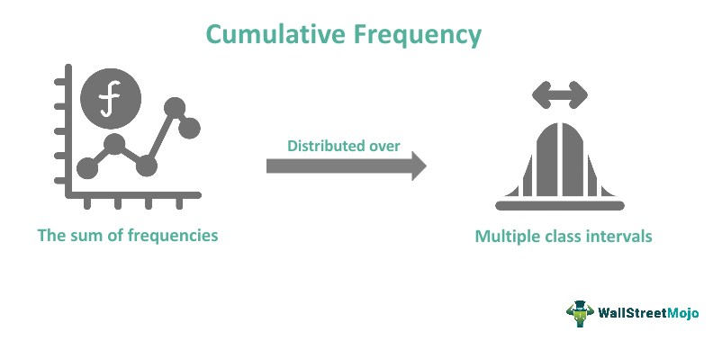

Algorithmic trading has revolutionized the financial markets by utilizing computer algorithms to automate trading decisions, resulting in higher efficiency and the ability to process vast amounts of data quickly. This approach minimizes human error and emotional decision-making, allowing traders to capitalize on microsecond-level opportunities. However, the very efficiency of algorithmic trading also introduces complexities, particularly related to cognitive biases that traders might inadvertently program into their systems.

One significant cognitive bias affecting decision-making in trading is the relativity trap. This bias causes individuals to prioritize comparative assessments over absolute values, which may skew judgment and decision-making. In trading, this can manifest as a tendency to evaluate stocks or other assets not on their standalone merits, but rather against each other, leading to skewed perceptions and potentially suboptimal investment decisions. For instance, traders might focus too heavily on how a stock's performance compares to a peer group, neglecting whether the stock is fundamentally sound on its own.



Understanding the relativity trap is essential for traders aiming to optimize their strategies and increase profitability. By recognizing how psychological biases can infiltrate algorithmic models, traders can refine their approaches to avoid these pitfalls. Addressing these biases ensures that data-driven insights remain paramount, enhancing the objectivity and effectiveness of algorithmic trading systems and ultimately supporting better financial outcomes.

## Table of Contents

## Understanding the Relativity Trap

The relativity trap is a cognitive bias characterized by decision-making based on relative comparisons rather than objective evaluations of absolute values. This bias significantly influences how individuals assess options in various contexts, including financial markets and consumer behavior. The underlying mechanism of the relativity trap is closely tied to the anchoring effect, where an initial piece of information—such as a price or a benchmark—serves as a reference point, affecting subsequent judgments and decisions. 

For instance, when individuals are presented with a product on sale, the original price often serves as an anchor, leading them to perceive the discounted price as more attractive, regardless of the product's actual value or necessity. This behavior illustrates how comparative assessments can overshadow objective evaluations.

In trading, the relativity trap manifests by causing investors to focus excessively on relative measures, such as the performance of a stock relative to its peers or sector averages, rather than considering intrinsic valuation metrics like cash flows or asset values. This reliance on relative performance can lead to skewed investment decisions, potentially resulting in overvaluation or undervaluation of assets. Consequently, the relativity trap can influence trading outcomes by leading to systematic errors in valuation and investment strategy, emphasizing the need for awareness and adjustment of such biases in trading environments.

## Examples of Relativity Trap in Trading

Investors often fall prey to the relativity trap by selecting stocks based on relative price comparisons within a sector, rather than considering the broader market valuation. This behavior is influenced by the perception that a stock is a 'better buy' simply because it is cheaper than other stocks within the same sector, even if the broader market or absolute valuation metrics suggest otherwise. This relative comparison can lead to skewed investment decisions and potentially unrecognized risks.

Furthermore, this bias tends to evoke an overemphasis on historical performance metrics. Traders might focus excessively on past performance, believing that historically profitable stocks are inherently more valuable. However, such reliance on historical data may obscure current market conditions, like shifts in economic indicators or company-specific events that might significantly alter a stock's future potential. Historical performance can be represented mathematically as follows:

$$

R_{\text{historical}} = \frac{P_{\text{final}} - P_{\text{initial}}}{P_{\text{initial}}}
$$

where $R_{\text{historical}}$ is the historical return, and $P_{\text{initial}}$ and $P_{\text{final}}$ are the initial and final prices, respectively.

In [algorithmic trading](/wiki/algorithmic-trading), the relativity trap can distort model assumptions. Algorithms that rely on comparative metrics or historical data without adjusting for current market dynamics can perpetuate biases. For instance, if an algorithm is programmed to prioritize stocks with performance ratios exceeding those of their sector peers, it may overlook vital factors such as market [volatility](/wiki/volatility-trading-strategies) or emerging industry trends. This can lead to suboptimal trades, where algorithmic logic is swayed more by relative metrics than by a comprehensive, data-driven analysis of the market landscape. To counteract such pitfalls, algorithmic models need continuous sensitivity adjustments that weigh both historical performance and real-time data analytics. This balance ensures more objective trading outcomes and mitigates the unintended effects of cognitive biases like the relativity trap.

## Mechanisms of the Relativity Trap in Algo Trading

Algorithmic trading systems are crafted to make data-driven decisions with limited human intervention, yet they are susceptible to cognitive biases like the relativity trap. This bias can be embedded into algorithms when they place excessive reliance on comparative financial ratios or peer benchmarks, rather than incorporating absolute valuation measures.

One mechanism through which the relativity trap affects algorithmic trading is through the prioritization of relative metrics such as sector-specific price-to-earnings (P/E) ratios. For instance, a trading algorithm might assess stocks within a tech sector where the average P/E ratio is notably higher than the broader market. If such an algorithm solely focuses on relative metrics, it might favor stocks with lower P/E ratios within the tech sector, even if these are significantly overvalued when viewed from a broader market context. This can lead the algorithm to overlook underlying market-specific factors that may justify the relative valuation.

The tendency of algorithms to overweight recent past performance is another manifestation of the relativity trap. Models guided by the relativity trap might evaluate stocks or financial instruments based on their recent performance relative to a peer benchmark, assuming that performers will continue their trajectory. However, market conditions and variables external to the comparative set should also be considered to provide a more holistic view. A common formula used in such scenarios is the moving average, which helps smooth out short-term fluctuations to identify trends in the data:

$$
\text{MA}_n = \frac{1}{n} \sum_{i=0}^{n-1} P_{t-i}
$$

Where $\text{MA}_n$ is the moving average of period $n$, and $P_{t-i}$ represents the stock price at time $t-i$. While this mathematical approach can reduce the noise of short-term volatility, it may reinforce biases if algorithms give undue weight to recent price movements in comparison to absolute valuations.

Addressing these issues requires a multi-faceted approach. Traders should incorporate absolute valuation techniques such as Discounted Cash Flow (DCF) analysis alongside relative metrics to provide a balanced view. An example of a Python code snippet that could help adjust valuations by incorporating both relative and absolute metrics is:

```python
def calculate_adjusted_valuation(pe_ratio, dcf_value, weight_relative=0.5, weight_absolute=0.5):
    """
    Calculate an adjusted valuation by weighting both P/E ratio and DCF absolute value.

    :param pe_ratio: P/E ratio-based valuation
    :param dcf_value: DCF-based valuation
    :param weight_relative: Weight for the relative valuation
    :param weight_absolute: Weight for the absolute valuation
    :return: Adjusted valuation
    """
    return (weight_relative * pe_ratio) + (weight_absolute * dcf_value)

# Example usage
pe_valuation = 25  # hypothetical P/E-based valuation
dcf_valuation = 30  # hypothetical DCF-based valuation

adjusted_valuation = calculate_adjusted_valuation(pe_valuation, dcf_valuation)
print(f"Adjusted Valuation: {adjusted_valuation}")
```

This simple function exemplifies how traders can balance considerations from both the relativity trap and absolute measures to mitigate bias within their trading strategies.

By recognizing these pitfalls, traders can recalibrate their algorithmic models to account for overarching market factors, thus facilitating more objective trading decisions that are less vulnerable to the relativity trap.

## Addressing the Relativity Trap

To effectively address the relativity trap in algorithmic trading, it is crucial to design trading models that blend absolute valuation measures with relative metrics. This dual approach helps in counterbalancing the cognitive biases associated with comparative assessment. Absolute valuation measures, such as discounted cash flow (DCF) analysis or intrinsic value computations, offer a strong foundation by focusing on fundamental company valuations without immediate comparative influence.

Regular updates to trading algorithms are essential for maintaining the relevance of strategy executions. Financial markets are dynamic, characterized by rapid shifts driven by economic data, geopolitical events, and investor sentiment. Algorithms relying solely on static comparative metrics - such as sector average P/E ratios - risk becoming obsolete as market conditions evolve. Incorporating mechanisms that facilitate frequent reassessment of input variables ensures algorithms remain aligned with prevailing market realities.

Periodic assessment of the relative versus absolute measures within trading algorithms is another critical step. This involves introducing systematic checks within the computational framework to evaluate the influence of relative metrics and adjust their weighting accordingly. For instance, the following Python code snippet illustrates a simple mechanism for balancing these inputs:

```python
def calculate_influence_weight(relative_metric, absolute_value):
    # Assigns a weight to the metrics
    relative_weight = 0.5
    absolute_weight = 0.5

    # Calculate combined influence
    combined_influence = (relative_weight * relative_metric) + (absolute_weight * absolute_value)
    return combined_influence

# Example usage
relative_pe_ratio = 15
absolute_intrinsic_value = 20

# Evaluate the influence of relative and absolute metrics
influential_value = calculate_influence_weight(relative_pe_ratio, absolute_intrinsic_value)
print("Combined Influential Value:", influential_value)
```

In this hypothetical example, relative and absolute values are treated with equal importance by default. However, these weights can be shifted based on historical performance or prevailing market conditions, thereby allowing dynamic recalibration of strategy emphasis.

Incorporating these practices helps traders navigate the challenges posed by the relativity trap, fostering a more balanced approach that reflects both intrinsic and market-relative considerations. Continuous evaluation and adaptation of trading algorithms to account for these factors are fundamental to achieving long-term trading success.

## Conclusion

The relativity trap stands as a notable psychological bias affecting both consumer and trading behaviors, often leading to less optimal financial outcomes. In the context of algorithmic trading, this bias can skew decision-making processes by influencing model predictions and investment strategies. Recognizing the relativity trap is crucial for developing effective trading strategies that leverage data-driven insights and mitigate cognitive distortions. By addressing this bias, traders can make more informed and objective decisions, minimizing the impact of emotional reactions and unfounded comparisons in financial markets.

Adapting trading algorithms to account for the relativity trap involves a commitment to constant refinement and reassessment. Updating these algorithms to include both absolute and relative valuation measures reduces susceptibility to biases introduced by comparative metrics alone. Furthermore, implementing checks within algorithms to balance relative versus absolute considerations allows for more robust trading decisions aligned with current market conditions.

Emphasizing continual algorithm refinement ensures alignment with evolving market dynamics and reduces the risk of outdated or biased strategies. Psychological biases like the relativity trap, if unacknowledged, can lead to less informed trading decisions, potentially affecting long-term profitability and strategy effectiveness. Thus, the integration of psychological awareness into algorithmic trading practices is not just beneficial but essential for achieving sustainable trading success.

## References & Further Reading

[1]: Kahneman, D. (2013). ["Thinking, Fast and Slow."](https://books.google.com/books/about/Thinking_Fast_and_Slow.html?id=ZuKTvERuPG8C) Farrar, Straus and Giroux.

[2]: Senior, J., & Greer-Tynes, K. (2020). ["Behavioral Finance: The Impact of Psychological Biases on Trading Strategies."](https://www.tandfonline.com/doi/full/10.1080/1331677X.2020.1839526)

[3]: Thaler, R. H. (2015). ["Misbehaving: The Making of Behavioral Economics."](https://www.jstor.org/stable/26391911) W. W. Norton & Company.

[4]: Kahneman, D., & Tversky, A. (1979). ["Prospect Theory: An Analysis of Decision under Risk."](https://www.jstor.org/stable/1914185) Econometrica, 47(2), 263-291.

[5]: Sloman, S. A., & Fernbach, P. (2018). ["The Knowledge Illusion: Why We Never Think Alone."](https://www.amazon.com/Knowledge-Illusion-Never-Think-Alone/dp/0399184368) Riverhead Books.