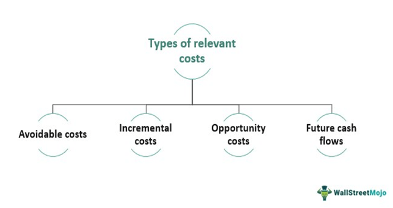

Algorithmic trading has transformed financial markets by enabling traders to execute orders with a speed and frequency unattainable by human effort. Harnessing algorithms allows traders to respond to market conditions in milliseconds, capitalizing on fleeting opportunities that would otherwise be missed. This technological advancement has made algorithmic trading indispensable in modern finance, highlighting speed and efficiency as key factors in gaining a competitive edge. However, to ensure profitability, understanding and analyzing costs is as crucial as leveraging technology and speed.

Relevant cost analysis, a concept rooted in accounting, examines costs that will be impacted by specific decisions in the future. These costs differ from sunk costs, which have already been incurred and are not recoverable. The objective of relevant cost analysis is to focus on future costs that will be directly influenced by a decision, thus enabling better financial outcomes. In the context of algorithmic trading, similar cost considerations must be taken into account. Trading costs, whether they manifest as explicit expenses like brokerage fees or implicit costs such as bid-ask spreads and market impact, play a pivotal role in the profitability of trading strategies.

This article aims to explore the integration of relevant cost analysis into the framework of algorithmic trading. It seeks to bridge the gap between accounting principles and trading cost considerations by focusing on the identification and minimization of trading expenses that are crucial for decision-making in trading algorithms. Understanding and minimizing these costs not only ensures profitability but also enhances the efficiency of algorithmic strategies.

To effectively manage and reduce trading costs, traders must employ strategies that align with the principles of relevant cost analysis. By filtering out unnecessary data and focusing on avoidable expenses, traders can enhance their decision-making processes. This approach enables the identification of strategies that reduce costs while maximizing trade execution efficiency. Through this lens, the article will present insights into optimizing algorithmic trading strategies by integrating cost management techniques and strategic trade execution methods.

## Table of Contents

## Understanding Relevant Cost in Accounting

Relevant cost is a critical concept in managerial accounting, directing attention to costs that are subject to change depending on particular business decisions. These costs arise in the future and are avoidable, thereby differing fundamentally from sunk costs, which are expenses already incurred and irrecoverable. Given that sunk costs do not change regardless of future actions, they should be disregarded in decision-making processes.

The identification and inclusion of relevant costs are crucial for sound financial decision-making. These costs directly influence decisions and often determine the profitability of various strategic paths. In accounting, typical scenarios where relevant cost analysis is applied include decisions such as:

- **Make or Buy Decisions**: Businesses must choose between manufacturing a product in-house or purchasing it from an external supplier. The decision should only consider future costs and differences in the cost of manufacturing versus the cost of purchasing, excluding any past expenses such as initial investments in machinery that are already sunk costs.

- **Shutting Down Operations**: When considering whether to discontinue a particular operation or division, relevant costs include future operational expenses and any savings from ceasing operations. Sunk costs, such as initial setup costs or past operating losses, should not influence this decision.

- **Accepting Special Orders**: Companies may evaluate whether to accept a special order at a reduced price. The decision should focus on additional costs directly attributable to fulfilling the order, such as raw materials and variable labor, while ignoring fixed costs, which remain unchanged regardless of the order's acceptance.

In essence, relevant cost analysis aids in focusing on costs that will be directly affected by business choices, thereby facilitating more effective and financially sound decision-making processes. By honing in on these specific, avoidable costs, businesses can better evaluate the economic impact of their strategic choices and achieve optimal financial outcomes.

## Trading Costs in Algorithmic Trading

In [algorithmic trading](/wiki/algorithmic-trading), understanding and managing trading costs is essential for developing effective strategies. These costs are divided into explicit and implicit categories.

Explicit costs are transparent and consist of commissions and fees paid to brokers and exchanges for executing trades. These costs are predictable and typically calculated based on the [volume](/wiki/volume-trading-strategy) or value of trades. For example, brokers might charge a flat rate per trade or a percentage of the trade value. In addition, exchange fees are often levied as a fixed cost per transaction or a percentage, depending on the trading volume or market type.

Implicit costs, on the other hand, are not immediately visible and can significantly affect the profitability of trade. These include bid-ask spreads, market impact costs, and slippage. The bid-ask spread represents the difference between the highest price a buyer is willing to pay (bid) and the lowest price a seller is willing to accept (ask). This cost becomes apparent when market orders are executed at these differing prices, affecting the final trading outcome.

Market impact costs arise when a large order affects the asset's price, moving it unfavorably. For instance, a sizable buy order may push the price up, thus increasing the purchase cost beyond the initial quotes. This impact is crucial to consider, especially in high-frequency and large-volume trading, where even small price shifts can significantly affect profitability.

Slippage occurs when an executed trade receives a different price than expected. This can happen due to market [volatility](/wiki/volatility-trading-strategies) or delays in order execution. For instance, an order intended to execute at a certain price may actually be completed at a higher cost due to rapid market movements.

Effectively managing these trading costs involves a comprehensive understanding of both explicit and implicit expenses. By incorporating algorithms that optimize execution, traders can reduce the bid-ask spread costs and mitigate market impact. Tools such as transaction cost analysis (TCA) enable traders to evaluate these costs, leading to informed adjustments and ultimately enhancing the profitability of algorithmic trading strategies.

## Linking Relevant Cost Analysis to Trading Costs

The analysis of trading costs using relevant cost principles involves distinguishing between expenses that can be avoided and those that are inevitable. This methodology parallels how managers utilize relevant costs for business decisions and can substantially reduce unnecessary trading costs in algorithmic strategies.

In algorithmic trading, understanding which costs genuinely influence a trading strategy is imperative. By effectively filtering out non-essential cost data, traders can concentrate on the charges that significantly impact their decision-making processes. This focus allows for strategic optimization where traders analyze the cost-benefit aspects of specific transactions. For example, by eschewing fixed, non-negotiable costs such as basic platform fees, traders can allocate resources toward variable, performance-related expenses like those incurred from commission structures and market conditions that can vary significantly across executions.

An effective cost analysis within this framework considers the elements of trading costs—both explicit and implicit. Explicit costs, including broker commissions, are typically straightforward and can often be renegotiated, especially when trading in high volumes or frequency. However, implicit expenses such as bid-ask spreads, market impact, and slippage require deeper analysis. By employing cost analysis tools and methodologies, traders can evaluate these implicit costs' effects on their strategies. A change in the bid-ask spread, for instance, might shift the cost calculations of a particular trading model, necessitating recalibrations in the algorithm.

Algo traders need to assess market conditions and execution tactics critically. The relevance of these analyses lies in their ability to highlight which costs can be reduced or eliminated. For example, leveraging advanced execution algorithms such as smart order routing can diminish unnecessary market impacts by optimizing for cheaper and more efficient market venues. Traders can apply these routing protocols to align their trading actions with periods of higher [liquidity](/wiki/liquidity-risk-premium), potentially reducing both slippage and spreads.

By adopting relevant cost analysis methods, traders not only identify cost reductions but also align their strategies more closely with favorable market conditions. This mindset fosters the development of robust trading strategies inherently designed to minimize extraneous financial burdens while enhancing the efficiency and profitability of executions. Effective cost management, therefore, involves a continuous process of analyzing, adapting, and refining trading systems to maintain a competitive advantage.

## Strategies to Minimize Trading Costs

Selecting appropriate trading algorithms that optimize execution quality based on market conditions is crucial for minimizing trading costs in algorithmic trading. By analyzing various factors like volatility, trade volume, and [order book](/wiki/order-book-trading-strategies) depth, traders can choose algorithms that execute orders more efficiently, reducing unnecessary expenses.

Negotiating better commission rates with brokers is another effective strategy, especially for high-frequency or high-volume trading. Brokers often offer tiered pricing based on trading activity levels, providing opportunities for traders to lower their transaction costs by increasing trading volumes or consolidating trades to meet specific thresholds.

Timing trades to coincide with periods of high liquidity is a key tactic to reduce costs like bid-ask spreads and market impacts. During these times, the presence of more market participants allows for tighter spreads and more favorable execution prices. This can be particularly important in volatile markets, where timing becomes critical to securing optimal trade prices.

Employing advanced trading technologies, such as smart order routing systems, aids in selecting the most cost-effective venues for execution. These systems analyze multiple trading venues in real-time, taking into account criteria such as liquidity, latency, and transaction fees, to route orders to the best possible market, enhancing execution quality while minimizing costs.

Regular reevaluation and adjustment of strategies are vital to adaptability in the ever-changing market landscape. As market conditions fluctuate, so too should the trading strategies employed. Continuous monitoring and fine-tuning of algorithmic models ensure that traders can capitalize on market opportunities while keeping costs manageable. In sum, these strategies collectively enable traders to enhance profitability through effective cost management in algorithmic trading.

## The Role of Cost Analysis Tools

Cost analysis tools, particularly Transaction Cost Analysis (TCA) tools, are essential in the algorithmic trading landscape for scrutinizing and managing trade-related expenses. TCA tools provide comprehensive insights into the various costs embedded within trades, allowing traders to evaluate and optimize their expense strategies effectively. These tools analyze explicit costs, such as commissions and fees, alongside implicit costs like slippage and market impact, providing a holistic view of trading expenditure.

Real-time monitoring tools are crucial in high-frequency trading settings where market conditions can fluctuate rapidly. These tools enable traders to adjust their strategies on-the-fly in response to cost variations, thereby preserving profitability. Real-time insights into cost fluctuations can prevent unnecessary losses and improve execution quality by adapting to the immediate market dynamics.

Performance dashboards play a significant role by offering data-driven reports on trading costs. These dashboards consolidate diverse cost metrics into a coherent format, assisting traders in identifying patterns and trends over time. This facilitates informed decision-making and strategic adjustments aimed at reducing costs and enhancing trading performance.

Utilizing these cost analysis tools can provide traders with a competitive advantage by ensuring their strategies are continually optimized for cost efficiency. Advanced analytics and data visualization capabilities enable traders to pinpoint inefficiencies and implement cost-saving measures swiftly. In an environment where minor cost differentials can significantly impact profitability, maintaining precise control over trading expenses is paramount.

In summary, the integration of TCA tools, real-time monitoring systems, and performance dashboards into trading operations is indispensable for achieving cost efficiency. By harnessing the full potential of these technologies, traders can maintain a strategic edge and navigate the complexities of modern financial markets with improved efficacy.

## Conclusion

Relevant cost analysis serves as a crucial framework for enhancing decision-making procedures in both accounting and algorithmic trading. In the high-speed world of algorithmic trading, meticulous understanding and management of trading costs are key to ensuring profitability. By applying the principles of relevant cost analysis, traders are equipped to optimize strategies by focusing on avoidable costs, thereby improving performance. This strategic emphasis on cost efficiency helps traders prioritize investments that offer genuine advantages over inconsequential expenses.

Using advanced tools and making strategic adjustments further perpetuate success in the dynamic landscape of algorithmic trading. Tools such as Transaction Cost Analysis (TCA) provide deep insights into cost structures and enable traders to refine their approaches continuously. These analyses and tools contribute to a comprehensive understanding of the cost components involved in trades, facilitating more informed strategy formulations.

As financial markets and trading technologies continue to evolve, it is imperative to stay informed about the best practices for cost management. Remaining updated ensures that traders can adapt to new market conditions, leveraging technological advancements to maintain and enhance profitability. Consequently, ongoing education and adaptation are vital for maintaining a competitive edge in algorithmic trading. This commitment to understanding and optimizing trading costs assures that relevant cost analysis remains a cornerstone of effective trading strategies.

## References & Further Reading

[1]: Bergstra, J., Bardenet, R., Bengio, Y., & Kégl, B. (2011). ["Algorithms for Hyper-Parameter Optimization."](https://dl.acm.org/doi/10.5555/2986459.2986743) Advances in Neural Information Processing Systems 24.

[2]: ["Advances in Financial Machine Learning"](https://www.amazon.com/Advances-Financial-Machine-Learning-Marcos/dp/1119482089) by Marcos Lopez de Prado

[3]: ["Evidence-Based Technical Analysis: Applying the Scientific Method and Statistical Inference to Trading Signals"](https://www.amazon.com/Evidence-Based-Technical-Analysis-Scientific-Statistical/dp/0470008741) by David Aronson

[4]: ["Machine Learning for Algorithmic Trading"](https://github.com/PacktPublishing/Machine-Learning-for-Algorithmic-Trading-Second-Edition) by Stefan Jansen

[5]: ["Quantitative Trading: How to Build Your Own Algorithmic Trading Business"](https://www.amazon.com/Quantitative-Trading-Build-Algorithmic-Business/dp/1119800064) by Ernest P. Chan