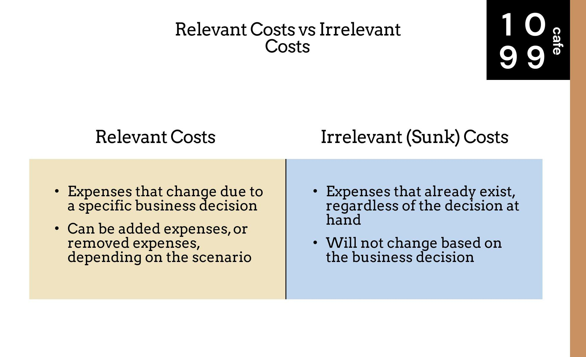

## Table of Contents

## What is relevant cost in accounting?

Relevant cost in accounting is the cost that will change depending on the decision you make. It's important because it helps businesses figure out the best choice when they have different options. For example, if a company is thinking about starting a new project, they will look at the costs that will be different if they go ahead with the project or not. These costs are called relevant costs.

These costs are only the ones that will affect the future. Costs that have already been spent, like the money spent on buying a machine last year, are not relevant. They are called sunk costs and won't change no matter what decision is made now. So, when making decisions, businesses focus on the costs that will be different in the future, like the cost of new materials or extra labor needed for a new project.

## How does relevant cost differ from irrelevant cost?

Relevant cost and irrelevant cost are terms used in accounting to help businesses make decisions. Relevant costs are the costs that will change depending on the decision you make. For example, if you're deciding whether to start a new project, the cost of the materials you'll need for that project is a relevant cost because it will only happen if you decide to go ahead with the project.

On the other hand, irrelevant costs are costs that won't change no matter what decision you make. These are often called sunk costs because they are costs that have already been spent and can't be recovered. For instance, if you bought a machine last year, the cost of that machine is irrelevant to your decision about starting a new project because it won't change whether you start the project or not.

Understanding the difference between relevant and irrelevant costs helps businesses focus on the costs that really matter for their decisions. By looking at relevant costs, they can see how different choices will affect their future expenses and make smarter choices.

## Why is understanding relevant cost important for decision-making?

Understanding relevant cost is important for decision-making because it helps businesses figure out which costs will change based on the choices they make. When a company is thinking about starting a new project or changing how they do things, they need to look at the costs that will be different if they go with one option instead of another. These costs, called relevant costs, help them see how much more or less they will spend depending on their decision. By focusing on these costs, businesses can make smarter choices that will save them money or help them make more profit.

For example, if a company is thinking about making a new product, the cost of the materials and extra labor needed for that product are relevant costs. These costs will only happen if they decide to make the new product. On the other hand, costs that won't change no matter what they decide, like the cost of a machine they bought last year, are not important for this decision. By knowing which costs are relevant, the company can better understand if making the new product will be a good financial move. This helps them avoid wasting money on decisions that might not be profitable.

## Can you provide examples of relevant costs in business scenarios?

Imagine a bakery is thinking about adding a new type of bread to their menu. The cost of the flour and other ingredients needed to make the new bread is a relevant cost. This is because they will only have to buy these ingredients if they decide to add the new bread. Also, if they need to hire someone to help bake the new bread, the cost of their wages is a relevant cost too. These costs will change depending on whether they decide to go ahead with the new bread or not.

Another example is a car company considering whether to start making electric cars. The cost of the batteries and other special parts needed for electric cars is a relevant cost. These costs will only come up if they decide to make electric cars. If they need to build a new factory to make these cars, the cost of building the factory is also a relevant cost. These costs will be different depending on their decision, so they are important to think about when making the choice.

## How do relevant costs impact short-term and long-term decision making?

Relevant costs have a big impact on short-term decision making because they help businesses figure out which choice will save them money or make them more profit right away. For example, if a company is deciding whether to accept a special order, they need to look at the costs that will change if they say yes to the order. These might include extra materials, labor, or shipping costs. By focusing on these relevant costs, the company can quickly see if the special order will be worth it in the short term, helping them make a smart decision that affects their immediate financial situation.

In the long term, relevant costs also play an important role in decision making, but they help businesses plan for the future. For instance, if a company is thinking about buying new equipment, they need to think about the costs that will change over time if they go ahead with the purchase. This could include the cost of the equipment itself, maintenance costs, and how it will affect their production costs in the future. By understanding these relevant costs, the company can make a decision that will help them save money or make more profit over a longer period. This helps them plan and invest wisely for the future, ensuring they stay profitable and grow.

## What are the key characteristics that define a cost as relevant?

A cost is considered relevant if it will change depending on the decision you make. This means that if you choose one option over another, the cost will be different. For example, if a company is thinking about starting a new project, the cost of the materials needed for that project is relevant because it will only happen if they decide to go ahead with the project. Relevant costs help businesses see how much more or less they will spend based on their choices.

Relevant costs are also about the future, not the past. Costs that have already been spent, like the money spent on buying a machine last year, are not relevant. These are called sunk costs and won't change no matter what decision is made now. So, when making decisions, businesses focus on the costs that will be different in the future, like the cost of new materials or extra labor needed for a new project. By looking at these future costs, companies can make smarter choices that will save them money or help them make more profit.

## How can relevant cost analysis be applied in budgeting?

Relevant cost analysis is really helpful when making a budget because it helps you see which costs will change if you make different choices. For example, if a company is planning its budget for next year and thinking about starting a new product line, they need to look at the costs that will be different if they go ahead with the new product. These might include the cost of new materials, extra labor, and maybe even new machines. By focusing on these relevant costs, the company can make a budget that shows how much more money they will need if they decide to start the new product line.

In budgeting, relevant cost analysis also helps businesses plan better for the future. If a company is thinking about changing how they do things, like moving to a new location or switching to a different supplier, they need to think about the costs that will change because of these decisions. These could be things like moving costs, new rent, or different prices from a new supplier. By understanding these relevant costs, the company can make a budget that helps them see if these changes will save them money or cost more in the long run. This way, they can plan their budget wisely and make sure they have enough money to cover all their costs.

## What role does relevant cost play in cost-volume-profit analysis?

Relevant cost plays a big role in cost-volume-profit (CVP) analysis because it helps businesses figure out how much they need to sell to make a profit. In CVP analysis, you look at how changes in costs and sales volume affect your profits. Relevant costs are the costs that change when you sell more or less of your product. For example, if you sell more, you might need more materials and labor, and these costs are relevant because they will change based on your sales.

By focusing on relevant costs in CVP analysis, a business can see how much they need to sell to cover these costs and start making a profit. If a company is thinking about lowering the price of their product to sell more, they need to look at how the relevant costs, like materials and labor, will change. This helps them decide if lowering the price will actually lead to more profit or if it will just increase their costs without enough sales to cover it. So, relevant costs are key in CVP analysis because they help businesses make smart choices about pricing and sales to maximize their profits.

## How do accountants identify and measure relevant costs?

Accountants identify relevant costs by looking at which costs will change depending on the decision they are making. They focus on future costs, not costs that have already been spent. For example, if a company is thinking about starting a new project, accountants will look at the costs of new materials, extra labor, and any other expenses that will only happen if the project goes ahead. These are the costs that matter for the decision because they will be different if the company chooses to do the project or not.

To measure these relevant costs, accountants will gather information about how much the new materials will cost, how much extra labor will be needed, and any other expenses that will change. They might look at quotes from suppliers, labor rates, and other data to get accurate numbers. By adding up all these costs, they can see the total relevant cost for the decision. This helps the company understand if the decision will be worth it financially, making sure they focus on the costs that will actually change in the future.

## In what ways can relevant cost analysis affect pricing strategies?

Relevant cost analysis helps businesses decide on their pricing strategies by showing them which costs will change if they change their prices. For example, if a company wants to lower the price of a product to sell more, they need to think about the costs that will go up because they are selling more. These might include the cost of more materials and extra labor. By understanding these relevant costs, the company can figure out if lowering the price will actually make them more money or if it will just increase their costs without enough extra sales to cover it.

This analysis also helps companies decide if they should raise their prices. If they think about increasing the price, they need to look at the costs that will stay the same or change very little, like the cost of materials they already have. If these costs are low compared to the new higher price, the company might make more profit. By focusing on relevant costs, businesses can set prices that help them cover their costs and make the most profit, making sure they are not losing money on their products.

## How does relevant cost influence make-or-buy decisions?

Relevant cost plays a big role in make-or-buy decisions, which is when a company decides if they should make something themselves or buy it from someone else. When making this choice, the company looks at the costs that will change depending on what they decide. For example, if they choose to make the product, they need to think about the cost of materials, labor, and maybe even new machines. These costs are relevant because they will only happen if the company decides to make the product. On the other hand, if they decide to buy the product, they need to look at the price they will pay the supplier and any other costs like shipping. By comparing these relevant costs, the company can see which choice will cost less and help them save money.

For instance, if a company is thinking about making a part for their product instead of buying it, they will add up the cost of the materials and labor needed to make the part. They will compare this to the price the supplier is asking for the part, plus any shipping costs. If the cost of making the part is lower than buying it, it makes sense to make it themselves. But if buying the part is cheaper, even after adding in shipping, then buying is the better choice. By focusing on these relevant costs, the company can make a smart decision that will help them save money and be more profitable.

## What are the common challenges and limitations of using relevant cost analysis in complex business environments?

Using relevant cost analysis in complex business environments can be tricky because it's hard to figure out which costs will really change when you make a decision. Sometimes, there are a lot of costs to look at, and it can be tough to tell which ones are important and which ones are not. For example, if a company is thinking about starting a new project, they need to think about costs like materials, labor, and maybe even new machines. But what if some of these costs are shared with other projects? It can be hard to figure out exactly how much of these shared costs will change, making it difficult to do a clear relevant cost analysis.

Another challenge is that businesses often have to guess what will happen in the future. When using relevant cost analysis, you need to predict how costs will change based on your decisions. But the future is not always easy to predict, and sometimes things don't go as planned. For instance, if a company thinks the price of materials will stay the same but it goes up, their relevant cost analysis might not be accurate anymore. This can lead to making decisions based on wrong information, which can hurt the business. So, while relevant cost analysis is helpful, it's important to remember its limitations and be careful when using it in complex situations.

## References & Further Reading

[1]: Bergstra, J., Bardenet, R., Bengio, Y., & Kégl, B. (2011). ["Algorithms for Hyper-Parameter Optimization."](https://dl.acm.org/doi/10.5555/2986459.2986743) Advances in Neural Information Processing Systems 24.

[2]: ["Advances in Financial Machine Learning"](https://www.amazon.com/Advances-Financial-Machine-Learning-Marcos/dp/1119482089) by Marcos Lopez de Prado

[3]: ["Evidence-Based Technical Analysis: Applying the Scientific Method and Statistical Inference to Trading Signals"](https://www.amazon.com/Evidence-Based-Technical-Analysis-Scientific-Statistical/dp/0470008741) by David Aronson

[4]: ["Machine Learning for Algorithmic Trading"](https://github.com/PacktPublishing/Machine-Learning-for-Algorithmic-Trading-Second-Edition) by Stefan Jansen

[5]: ["Quantitative Trading: How to Build Your Own Algorithmic Trading Business"](https://www.amazon.com/Quantitative-Trading-Build-Algorithmic-Business/dp/1119800064) by Ernest P. Chan