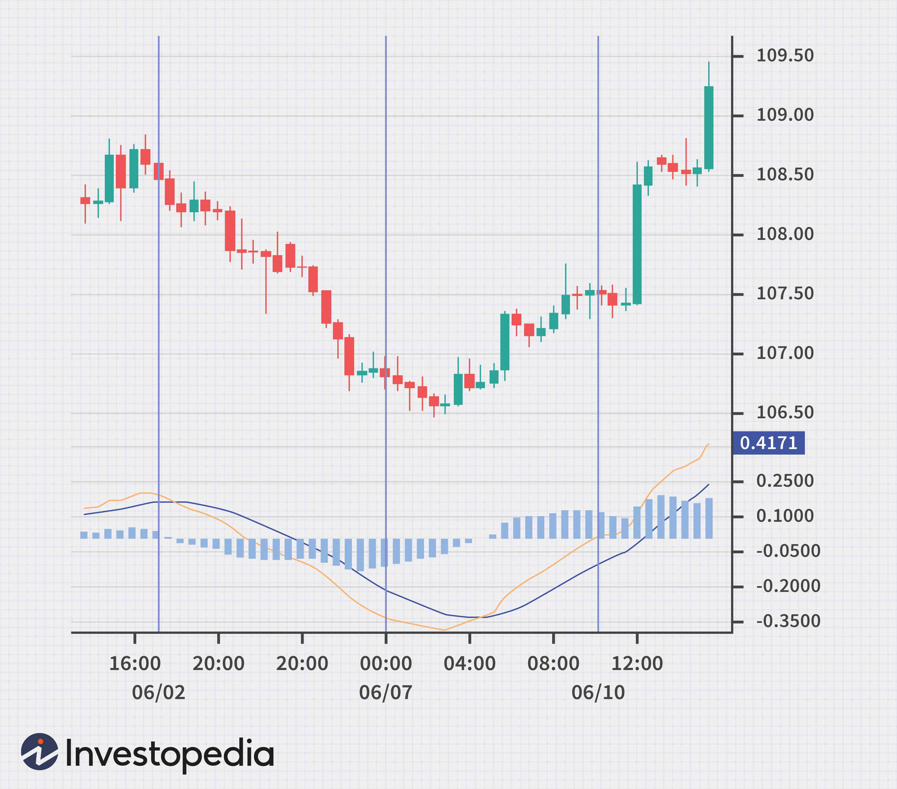

The Moving Average Convergence Divergence (MACD) is a widely recognized indicator in technical analysis, serving as a fundamental component of many trading strategies. Its development is attributed to Gerald Appel in the late 1970s, and since then, it has become indispensable for traders seeking to interpret price trends and momentum shifts. The MACD indicator uniquely combines elements of trend-following and momentum analysis, offering a versatile tool for both novice and seasoned traders.

In essence, MACD calculates the difference between two exponential moving averages (EMAs) of a security's price, providing insights into price momentum and potential trend reversals. Typically, a 12-period EMA and a 26-period EMA are used to generate the MACD line. This line is complemented by a signal line, often a 9-period EMA of the MACD line itself, which aids in identifying entry and exit points in a trading strategy.



For algorithmic traders, MACD's simplicity and clarity make it an attractive choice for strategy automation. The indicator's signal line crossover and its convergence or divergence from the price chart serve as crucial triggers for generating buy or sell signals. With the integration of algorithmic trading platforms and programming languages such as Python, traders can readily leverage libraries like `pandas` and `matplotlib` to implement and visualize MACD-based strategies. This automation not only enhances efficiency but also allows for rigorous backtesting to refine and optimize trading algorithms, thereby ensuring their robustness across various market contexts. Ultimately, the MACD remains a vital instrument for identifying and capitalizing on momentum shifts in both manual and algorithmic trading frameworks.

## Table of Contents

## Understanding MACD

The Moving Average Convergence Divergence (MACD) is a technical indicator used to gauge the strength and momentum of a security's price trend by examining the relationship between two exponential moving averages (EMAs). It specifically involves the calculation of three components: the MACD line, the signal line, and the histogram.

### Calculation Components

1. **MACD Line**: This is computed by subtracting the 26-period EMA from the 12-period EMA:
$$
   \text{MACD Line} = \text{EMA}_{12} - \text{EMA}_{26}

$$
   The choice of 12 and 26 periods is standard but can be adjusted based on trading strategy and asset characteristics.

2. **Signal Line**: This is a 9-period EMA of the MACD line:
$$
   \text{Signal Line} = \text{EMA}_{9}(\text{MACD Line})

$$
   The signal line helps identify shifts in [momentum](/wiki/momentum) and potential buy or sell signals when it crosses the MACD line.

3. **MACD Histogram**: This represents the difference between the MACD line and the signal line:
$$
   \text{Histogram} = \text{MACD Line} - \text{Signal Line}

$$
   The histogram visually illustrates the convergence and divergence between the MACD and signal lines, offering a clearer picture of momentum changes.

### Interpretation

The MACD line oscillates around a zero line, which serves as a neutral point indicating equilibrium between the two EMAs. When the MACD line crosses above the zero line, it suggests that the 12-period EMA is greater than the 26-period EMA, indicating bullish momentum. Conversely, when the MACD line crosses below the zero line, the 26-period EMA has surpassed the 12-period EMA, suggesting bearish momentum.

### Example in Python

Here is a basic example of calculating the MACD line, signal line, and histogram using Python with the `pandas` library:

```python
import pandas as pd

def calculate_ema(prices, period):
    return prices.ewm(span=period, adjust=False).mean()

# Sample price data
prices = pd.Series([your_price_data])

# Calculate EMAs
ema_12 = calculate_ema(prices, 12)
ema_26 = calculate_ema(prices, 26)

# Calculate MACD line and Signal line
macd_line = ema_12 - ema_26
signal_line = calculate_ema(macd_line, 9)

# Calculate Histogram
macd_histogram = macd_line - signal_line

print(macd_line, signal_line, macd_histogram)
```

This code provides a basic framework for using MACD in a trading strategy, highlighting how seamlessly it integrates analytical capabilities with modern programming tools.

## MACD in Algorithmic Trading

Algorithmic traders frequently employ the Moving Average Convergence Divergence (MACD) indicator to automate trading strategies by identifying precise entry and [exit](/wiki/exit-strategy) points based on momentum shifts. Key to implementing MACD in [algorithmic trading](/wiki/algorithmic-trading) is the use of Python, thanks to its extensive ecosystem of libraries. Prominently, libraries such as 'pandas' enable efficient data manipulation and analysis, while 'pandas_ta' offers a comprehensive range of technical analysis tools, including a built-in function to compute the MACD indicator. 

The MACD is defined as the difference between the 12-period and 26-period exponential moving averages (EMA) of the security's price. The MACD line is often accompanied by a 9-period EMA, known as the signal line. Buy and sell signals are generated based on the interaction between the MACD line and the signal line. For instance, when the MACD line crosses above the signal line, it may indicate a bullish momentum, signaling a potential entry point. Conversely, a cross below the signal line could suggest bearish momentum and a potential exit point.

To illustrate the implementation of MACD using Python, consider the following code snippet:

```python
import pandas as pd
import pandas_ta as ta

# Load your price data
data = pd.read_csv('price_data.csv')

# Calculate MACD
data['MACD'], data['Signal_Line'] = ta.macd(data['Close'])

# Define trading logic
data['Buy'] = (data['MACD'] > data['Signal_Line']) & (data['MACD'].shift() <= data['Signal_Line'].shift())
data['Sell'] = (data['MACD'] < data['Signal_Line']) & (data['MACD'].shift() >= data['Signal_Line'].shift())
```

Backtesting is an indispensable step when developing algorithmic trading strategies. It involves simulating the trading strategy on historical data to evaluate its performance under various market conditions. Through [backtesting](/wiki/backtesting), traders can optimize MACD parameters, adjust trading thresholds, and calibrate risk management settings to enhance strategy resilience. The process helps identify potential weaknesses and rectify them before deploying the strategy in live markets. The success of MACD-based strategies in algorithmic trading hinges on rigorous testing and continuous refinement to adapt to the ever-evolving market dynamics.

Overall, integrating MACD into algorithmic trading provides a systematic approach to capitalizing on momentum shifts. Yet, to maximize its potential, traders must pair the indicator with sound programming practices and a robust testing framework.

## MACD Trading Strategies

The MACD (Moving Average Convergence Divergence) indicator is widely used among traders for constructing strategies based on market momentum shifts. A popular approach involves the MACD Crossover Strategy, where traders look to generate buy and sell signals based on crossovers between the MACD line and the signal line. Specifically, the strategy suggests buying when the MACD line crosses above the signal line, indicating potential upward momentum, and selling when it crosses below, signaling potential downward momentum. This approach is favored for its clarity and simplicity, making it a staple for both novice and experienced traders.

Another effective strategy is the Zero Line Cross. The zero line on the MACD histogram acts as a crucial level for identifying bullish and bearish momentum. When the MACD line crosses above the zero line, it suggests a shift towards bullish momentum, prompting traders to consider long positions. Conversely, a cross below the zero line signals bearish momentum, indicating potential shorting opportunities. The Zero Line Cross provides straightforward insights into the broader trend, complementing the MACD Crossover Strategy.

Divergence offers another layer of analysis in MACD trading strategies. Divergence occurs when there is a discrepancy between the MACD indicator and the actual price movements of the security. For instance, if the price is making new highs while the MACD is forming lower highs, a bearish divergence is occurring, hinting at a potential trend reversal. Conversely, if the price is making new lows but the MACD is making higher lows, a bullish divergence may be present, suggesting a reversal to the upside. Identifying and leveraging divergence can assist traders in spotting potential pivot points in the market before they occur.

These MACD-based strategies not only highlight potential trading opportunities but also enhance the precision of entry and exit points in a trader’s plan. With the use of Python, traders can automate these strategies using libraries like `pandas` and `pandas_ta`, which support robust backtesting and optimization of trading algorithms to adapt to varying market conditions. Here is a basic Python snippet to calculate the MACD values using `pandas`:

```python
import pandas as pd

def calculate_macd(prices, short_period=12, long_period=26, signal_period=9):
    short_ema = prices.ewm(span=short_period, adjust=False).mean()
    long_ema = prices.ewm(span=long_period, adjust=False).mean()
    macd_line = short_ema - long_ema
    signal_line = macd_line.ewm(span=signal_period, adjust=False).mean()
    macd_histogram = macd_line - signal_line
    return macd_line, signal_line, macd_histogram

# Example usage with Pandas DataFrame
data = pd.DataFrame({'price': [/* your price data here */]})
macd_line, signal_line, macd_histogram = calculate_macd(data['price'])
```

This code calculates the MACD line, signal line, and histogram values, forming the backbone of MACD strategies, and allowing traders to systematically identify trading signals.

## Combining MACD with Other Indicators

The Moving Average Convergence Divergence (MACD) can be augmented by combining it with other technical indicators, such as the Relative Strength Index (RSI) and [volume](/wiki/volume-trading-strategy) indicators, to enhance trading signals and market analysis. 

RSI is a momentum oscillator that measures the speed and change of price movements, oscillating between 0 and 100. It is typically used to identify overbought or oversold conditions in a market. By pairing MACD with RSI, traders can gain a clearer insight into potential momentum changes. For example, if the MACD suggests a bullish crossover (where the MACD line crosses above the signal line), confirming this signal with an RSI value below 30 (indicating oversold conditions) can strengthen the bullish conviction.

Volume indicators, such as the On-Balance Volume (OBV) or the Volume Oscillator, provide additional context by measuring the strength of a price move. For instance, if a bullish crossover is observed on the MACD and is accompanied by increasing OBV, it can suggest that the buying interest is supported by ample volume, validating the upward momentum. Conversely, if the MACD indicates a bearish move and this is supported by declining volume, it reinforces the bearish trend signal.

The combination of MACD with these indicators allows for a more nuanced analysis. While MACD highlights the momentum and potential trend changes, RSI can provide the market condition (overbought or oversold), and volume indicators can confirm the strength or weakness of the prevailing trend. This combined approach helps mitigate the limitations of each standalone indicator and provides traders with a more reliable framework for decision-making.

## Limitations of MACD

The Moving Average Convergence Divergence (MACD), while a powerful tool in technical analysis, has notable limitations that traders should consider. One significant drawback is its susceptibility to producing false signals in markets characterized by sideways movement or high [volatility](/wiki/volatility-trading-strategies). In such environments, frequent fluctuations in price can cause the MACD to generate misleading buy or sell signals, potentially leading traders to make suboptimal decisions. This increased noise can obscure clear trends, making it challenging to discern actionable insights solely based on MACD readings.

Another limitation of the MACD is its nature as a lagging indicator. The MACD relies on past price data to compute its values, which means that it tends to react to changes in market conditions after they have already occurred. This lag can cause the MACD to identify trend reversals later than ideal, potentially resulting in missed opportunities for profitable entries or exits. Traders who rely exclusively on the MACD may find themselves entering or leaving positions at suboptimal times, especially in rapidly changing market conditions.

To mitigate these limitations and enhance the effectiveness of the MACD, traders are advised to use it in conjunction with other technical indicators. Pairing MACD with leading indicators or complementary tools, such as the Relative Strength Index (RSI) or volume indicators, can help validate signals and provide a more comprehensive analysis of market conditions. By incorporating multiple data points, traders can increase the accuracy of their trading decisions and reduce the likelihood of being misled by the inherent lag and noise associated with MACD signals.

## Conclusion

The Moving Average Convergence Divergence (MACD) remains a valuable asset within both algorithmic and manual trading strategies, particularly for identifying shifts in market momentum. Its significance is rooted in its dual function of combining trend-following and momentum analysis, which makes it a staple for traders aiming to optimize their market engagement. By revealing the relationship between two exponential moving averages of a security's price, MACD offers insights that are instrumental for making informed trading decisions.

Understanding the MACD's calculations is pivotal for traders who wish to maximize its utility. The MACD line is computed using a 12-period and a 26-period exponential moving average, with the difference between these two averages forming the MACD line itself. A 9-period EMA—often referred to as the signal line—complements the MACD line by smoothing out fluctuations and aiding in the generation of actionable signals.

Acknowledging the strengths and weaknesses of MACD is crucial. Its ability to identify potential entry and exit points is advantageous, yet it is not without limitations. As a lagging indicator, MACD might produce delayed signals, especially in volatile or sideways markets, which could lead to missed opportunities or false signals if used in isolation. Therefore, combining MACD with other technical indicators, such as the Relative Strength Index (RSI) or volume indicators, enhances its accuracy and effectiveness, offering a more comprehensive analysis of market conditions.

Ongoing learning and adaptation are indispensable for refining MACD-based strategies. Traders benefit greatly from backtesting and continual assessment of their strategies across different market scenarios. This ongoing process not only improves the robustness of the strategies but also ensures traders remain adaptable in varying market conditions. Through understanding its calculations, recognizing its limitations, and continuously refining strategies, traders can fully harness MACD's potential, positioning themselves advantageously in the dynamic world of trading.

## References & Further Reading

[1]: Appel, G. (2005). ["Technical Analysis: Power Tools for Active Investors."](https://www.amazon.com/Technical-Analysis-Power-Active-Investors/dp/0132930048) FT Press.

[2]: Brown, C. (2021). ["Technical Analysis for Algorithmic Pattern Recognition."](https://link.springer.com/book/10.1007/978-3-319-23636-0) Springer.

[3]: Murphy, J. J. (1999). ["Technical Analysis of the Financial Markets: A Comprehensive Guide to Trading Methods and Applications."](https://archive.org/details/technicalanalysi0000murp) New York Institute of Finance.

[4]: Pring, M. J. (2002). ["Technical Analysis Explained: The Successful Investor's Guide to Spotting Investment Trends and Turning Points."](https://www.amazon.com/Technical-Analysis-Explained-Fifth-Successful/dp/0071825177) McGraw-Hill Education.

[5]: Elder, A. (2014). ["The New Trading for a Living: Psychology, Discipline, Trading Tools and Systems, Risk Control, Trade Management."](https://www.amazon.com/New-Trading-Living-Psychology-Discipline/dp/1118443926) Wiley Trading.