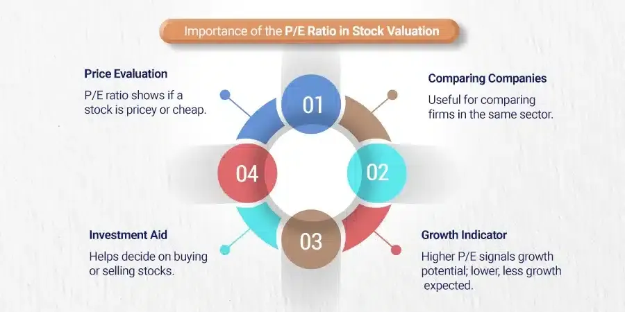

## Table of Contents

## What is the P/E ratio and how is it calculated?

The P/E ratio, or Price-to-Earnings ratio, is a way to figure out how much investors are willing to pay for a company's earnings. It's like a tool that helps you see if a stock might be a good buy or if it's too expensive. You calculate the P/E ratio by taking the current stock price and dividing it by the company's earnings per share (EPS). The EPS is how much money the company made for each share of its stock over the last year.

The P/E ratio can tell you different things depending on what number you get. A high P/E ratio might mean that people think the company will grow a lot in the future, so they're willing to pay more for it now. But it could also mean the stock is too expensive. On the other hand, a low P/E ratio might show that the stock is a bargain, or it could mean that people don't think the company will do well in the future. It's important to compare the P/E ratio of a company with others in the same industry to get a better idea of what it means.

## Why is the P/E ratio important for investors?

The P/E ratio is important for investors because it helps them figure out if a stock is a good deal or not. It's like a quick way to see if you're paying too much for a company's earnings. When you look at the P/E ratio, you can compare it with other companies in the same industry. If a company's P/E ratio is lower than its competitors, it might mean the stock is cheaper and could be a good buy. But if it's higher, you might be paying more for the same amount of earnings, which could be a sign that the stock is too expensive.

Another reason the P/E ratio is helpful is that it gives you an idea about what other investors think about a company's future. If a company has a high P/E ratio, it often means that people expect it to grow a lot and make more money in the future. They're willing to pay more now because they think the company will do well later. On the other hand, a low P/E ratio might mean that people don't think the company will grow much, or they might even think it will do worse. So, by looking at the P/E ratio, investors can get a sense of what the market thinks about a company's future.

## How can the P/E ratio be used to compare companies within the same industry?

The P/E ratio helps investors compare companies within the same industry by showing how much they are paying for each dollar of earnings. If one company has a lower P/E ratio than another in the same industry, it might mean that the first company's stock is cheaper. For example, if Company A has a P/E ratio of 10 and Company B has a P/E ratio of 20, you're paying less for each dollar of earnings from Company A. This could make Company A look like a better deal, but it's important to look at other things too, like how fast the companies are growing or if they have any big problems.

Another way the P/E ratio helps is by showing what investors think about a company's future. If a company in an industry has a higher P/E ratio than its competitors, it might mean that investors expect it to grow more or make more money in the future. They're willing to pay more now because they think the company will do well later. But if a company has a lower P/E ratio, it might mean that investors don't think it will grow as much or they might even think it will do worse. So, by comparing P/E ratios, investors can get a sense of which companies in an industry might be good investments based on what the market thinks about their future.

## What are the limitations of using the P/E ratio as a sole metric for investment decisions?

The P/E ratio is a helpful tool, but it has some problems if you use it by itself to make investment choices. One big issue is that the P/E ratio doesn't tell you everything about a company. It only looks at the price of the stock and the earnings per share, but it doesn't consider other important things like how much debt the company has, how fast it's growing, or if it's facing any big problems. For example, a company might have a low P/E ratio because it's in trouble, not because it's a good deal.

Another problem is that the P/E ratio can be different depending on the industry. Some industries, like tech companies, usually have higher P/E ratios because people expect them to grow a lot. If you compare a tech company to a company in a slower-growing industry just by looking at their P/E ratios, you might make a wrong decision. Also, the P/E ratio can be affected by one-time events or accounting tricks that make the earnings look different than they really are. So, it's important to use the P/E ratio along with other tools and information to get a full picture of a company before deciding to invest.

## How does the P/E ratio relate to a company's growth expectations?

The P/E ratio can tell us a lot about what investors think about a company's future growth. If a company has a high P/E ratio, it usually means that people expect it to grow a lot and make more money in the future. They are willing to pay more for the stock now because they believe the company will do well later. For example, if a tech company has a P/E ratio of 30 while the average in its industry is 20, it might mean that investors think this tech company will grow faster than others.

On the other hand, a low P/E ratio might mean that investors don't expect much growth from the company. They might think the company will stay the same or even do worse in the future, so they aren't willing to pay as much for the stock. But sometimes, a low P/E ratio can also mean the stock is a good deal if the company is actually doing well but people haven't noticed yet. So, the P/E ratio gives us a clue about growth expectations, but it's not the whole story.

## Can the P/E ratio help identify undervalued or overvalued stocks?

The P/E ratio can help investors figure out if a stock is undervalued or overvalued by comparing it to other stocks in the same industry. If a company's P/E ratio is lower than the average for its industry, it might mean the stock is undervalued. This could be a good sign that the stock is a bargain and might be a good investment. For example, if most companies in the tech industry have a P/E ratio of 25, but one tech company has a P/E ratio of 15, that company might be undervalued.

On the other hand, if a company's P/E ratio is higher than the industry average, it might mean the stock is overvalued. This could mean that investors are paying too much for the stock because they think the company will grow a lot in the future. But if those growth expectations don't happen, the stock price could go down. So, a high P/E ratio might be a warning sign that the stock is too expensive. It's important to remember that the P/E ratio is just one tool, and investors should look at other things too before deciding if a stock is a good buy or not.

## What are the differences between trailing P/E and forward P/E ratios?

The trailing P/E ratio looks at the past. It uses the earnings per share from the last 12 months to figure out the ratio. This means it's based on what the company has already done, not what it might do in the future. Investors use the trailing P/E ratio to see how the stock is valued based on its recent performance. It's like looking in the rearview mirror to see how the company has been doing.

The forward P/E ratio, on the other hand, looks at the future. It uses the expected earnings per share for the next 12 months to calculate the ratio. This means it's based on what people think the company will do in the future, not what it has already done. Investors use the forward P/E ratio to see how the stock might be valued based on what's expected to happen. It's like looking through the windshield to see where the company might be headed.

## How do economic cycles affect the reliability of the P/E ratio?

Economic cycles can change how useful the P/E ratio is. During good times, when the economy is growing, companies usually make more money. This can make their P/E ratios look lower because their earnings go up. But if everyone knows the economy is doing well, stock prices might go up a lot too, which can make P/E ratios higher. So, in a growing economy, you need to be careful because a low P/E ratio might not mean the stock is a good deal if everyone is expecting the company to keep making more money.

On the other hand, during bad times, when the economy is not doing well, companies might make less money. This can make their P/E ratios look higher because their earnings go down. But if people are worried about the economy, stock prices might go down too, which can make P/E ratios look lower. In a shrinking economy, a high P/E ratio might not mean the stock is too expensive if everyone is expecting the company to make less money. So, the P/E ratio can be tricky to use during different parts of the economic cycle, and it's important to look at other things too.

## What role does sector-specific analysis play in interpreting P/E ratios?

Sector-specific analysis is really important when you're trying to understand P/E ratios. Different sectors have different average P/E ratios because they grow at different speeds and have different risks. For example, tech companies often have higher P/E ratios because people expect them to grow a lot. But companies in older industries, like utilities, might have lower P/E ratios because they don't grow as fast. So, if you're looking at a company's P/E ratio, you need to compare it to other companies in the same sector to know if it's high or low.

When you compare P/E ratios within a sector, you get a better idea of if a stock is a good deal or not. If a company's P/E ratio is lower than the average for its sector, it might mean the stock is undervalued and could be a good buy. But if it's higher, it might mean the stock is overvalued and you're paying too much. But remember, the P/E ratio is just one piece of the puzzle. You need to look at other things too, like the company's debt, how fast it's growing, and what's happening in the economy.

## How can investors adjust the P/E ratio for one-time events or accounting anomalies?

Investors can adjust the P/E ratio for one-time events or accounting anomalies by looking at the company's earnings carefully. Sometimes, a company might have a big one-time gain or loss that makes its earnings look different than they really are. For example, if a company sells a big piece of property and makes a lot of money from it, that money might not happen again next year. So, investors can take out that one-time gain from the earnings to get a better idea of what the company usually makes. This way, the P/E ratio will be more accurate and show what the company is really worth.

Another way to adjust the P/E ratio is to look at the company's financial statements and see if there are any accounting tricks that make the earnings look different. Sometimes, companies might use different ways to count their money that can make their earnings look better or worse than they really are. By understanding these accounting methods, investors can make changes to the earnings number to get a truer P/E ratio. This helps them see if the stock is a good deal or not, without being fooled by one-time events or accounting tricks.

## What advanced statistical methods can be used to enhance the predictive power of the P/E ratio?

To make the P/E ratio better at predicting how a stock will do, investors can use a method called regression analysis. This method helps them see how the P/E ratio and other things like the company's growth, how much debt it has, and what's happening in the economy might all work together to affect the stock price. By looking at a lot of data from the past, regression analysis can show which of these things are most important for guessing what will happen to the stock price in the future. This way, investors can get a clearer picture of whether a stock with a certain P/E ratio is likely to go up or down.

Another advanced method is called time series analysis. This method looks at how the P/E ratio changes over time and tries to find patterns. For example, it might show that a company's P/E ratio goes up and down in a certain way every year, or that it changes when the economy gets better or worse. By understanding these patterns, investors can make better guesses about where the P/E ratio might go next. This can help them decide if a stock is a good buy now or if they should wait for a better time.

## How does the integration of P/E ratio with other financial ratios improve investment analysis?

Using the P/E ratio along with other financial ratios can give investors a much better picture of a company's health and future. For example, the price-to-book (P/B) ratio tells you how much the market thinks a company is worth compared to its assets. If a company has a low P/E ratio but a high P/B ratio, it might mean the company is not making much money right now but has valuable things that could help it grow later. On the other hand, the debt-to-equity (D/E) ratio shows how much debt a company has compared to what it owns. A high D/E ratio might make a low P/E ratio less attractive because the company could have trouble paying back its debts.

Another useful ratio to look at is the return on equity (ROE), which shows how well a company is using the money its shareholders have put in to make more money. If a company has a high P/E ratio but also a high ROE, it might mean that investors are willing to pay more for the stock because the company is good at turning their money into profits. By putting all these ratios together, investors can see a fuller picture of a company's financial health and make smarter choices about whether to buy, sell, or hold a stock.

## What is the importance of understanding financial metrics in investment?

Financial metrics serve as critical indicators for investors seeking to evaluate the performance and potential of their investment opportunities. These metrics offer a quantitative basis for assessing various aspects of a company's financial health and competitive position. The primary categories of financial metrics include profitability, liquidity, solvency, and valuation ratios, each fulfilling distinct roles in investment analysis.

Profitability metrics, such as the net profit margin, return on assets (ROA), and return on equity (ROE), measure a company's ability to generate income relative to its revenue, assets, or shareholders' equity. For instance, the net profit margin is calculated using the formula:

$$
\text{Net Profit Margin} = \left( \frac{\text{Net Income}}{\text{Total Revenue}} \right) \times 100
$$

This ratio provides insights into how efficiently a company converts revenue into actual profit, directly impacting its operational viability and attractiveness to investors.

Liquidity metrics, including the current ratio and quick ratio, assess a company's capacity to meet its short-term obligations. The current ratio is defined as:

$$
\text{Current Ratio} = \frac{\text{Current Assets}}{\text{Current Liabilities}}
$$

A higher ratio indicates a greater ability to cover short-term liabilities, which is vital for maintaining operational stability.

Solvency metrics, such as the debt-to-equity ratio, evaluate a company's long-term financial stability and its ability to sustain operations over time. This ratio is calculated by:

$$
\text{Debt-to-Equity Ratio} = \frac{\text{Total Liabilities}}{\text{Shareholders' Equity}}
$$

A lower ratio generally suggests a more financially healthy company with less reliance on debt financing.

Valuation ratios, most notably the Price-to-Earnings (P/E) ratio, help investors determine the relative value of a company's stock and compare it with peers within the industry. Valuation ratios can uncover under- or over-valued stock opportunities, aiding investors in making informed purchase or sale decisions.

The utility of these metrics lies in their ability to provide a benchmark for comparing companies within the same industry, offering insights into each company's market standing and operational efficiency. The accuracy of these metrics is paramount, as they directly inform investment decisions. Precise computations and contextual understanding of these ratios enable investors to evaluate opportunities and risks comprehensively, leading to more strategic financial planning and increased potential for favorable investment outcomes.

## What is the Role of the P/E Ratio in Investment Analysis?

The Price-to-Earnings (P/E) ratio is a foundational valuation metric in investment analysis. It is calculated by dividing a company's current market price per share by its earnings per share (EPS):

$$
\text{P/E Ratio} = \frac{\text{Market Price per Share}}{\text{Earnings per Share (EPS)}}
$$

This ratio provides investors with an understanding of how much they are paying for each dollar of a company's earnings, thereby serving as an indicator of market expectations about the company's growth prospects. A high P/E ratio can suggest that a stock is overvalued relative to its earnings, as investors are willing to pay more today in anticipation of higher future growth. This elevated ratio often reflects optimism about a company's growth trajectory, profitability potential, or an anticipated increase in earnings.

Conversely, a low P/E ratio might indicate that a stock is undervalued or that the market has low expectations for the company's growth. It could imply that investors are paying less for each dollar of current earnings, which may present a purchasing opportunity if the market has underestimated the company's future potential or if there are external factors temporarily depressing its valuation.

It is essential to contextualize the P/E ratio by comparing it against industry benchmarks or historical averages for the specific stock. Anomalies may arise from industry-specific factors or market conditions that skew the P/E ratio, such as cyclical downturns or unique competitive pressures. For comprehensive investment analysis, it is often valuable to analyze the P/E ratio alongside other financial metrics, such as price-to-book ratio or return on equity, to obtain a holistic view of a company's financial health and market valuation.

## References & Further Reading

[1]: ["Quantitative Investment Analysis"](https://www.investopedia.com/articles/investing/041114/simple-overview-quantitative-analysis.asp) by Richard A. DeFusco, CFA, Dennis W. McLeavey, CFA, Jerald E. Pinto, CFA, and David E. Runkle, CFA

[2]: Liu, Y., & Lee, K. C. (2020). ["Algorithmic Trading Strategies with Machine Learning: Lessons from the Financial Crisis"](https://centaur.reading.ac.uk/90705/3/Opportunities%20and%20challenges%20in%20global%20health%20crisis%20%28ABM%20Forthcoming%29_Final%20%281%29%20%281%29.pdf). SAGE Open.

[3]: ["Financial Freedom Through Electronic Day Trading: 101 Market Lessons and Strategic Trading Tips"](https://books.google.com/books/about/Financial_Freedom_Through_Electronic_Day.html?id=LpYRmQEACAAJ) by Van K. Tharp, Brian June

[4]: ["Algorithmic Trading and DMA: An Introduction to Direct Access Trading Strategies"](https://www.amazon.com/Algorithmic-Trading-DMA-introduction-strategies/dp/0956399207) by Barry Johnson

[5]: ["The Essentials of Trading: From the Basics to Building a Winning Strategy"](https://www.amazon.com/Essentials-Trading-Building-Winning-Strategy/dp/047179063X) by John Forman