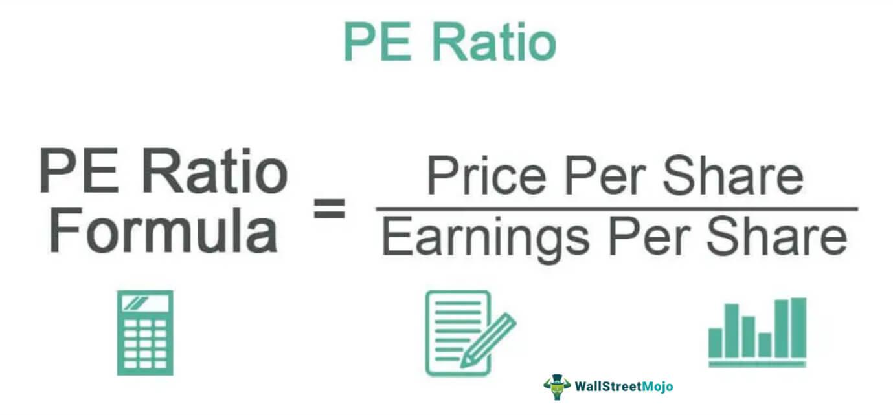

The world of investment is a dynamic landscape where complexity and rapid advancements are the norm. Investors today are equipped with a plethora of tools and techniques aimed at facilitating well-informed decision-making processes. Among the various financial metrics available, the Price-to-Earnings (P/E) ratio is distinguished as a fundamental measure for evaluating stock valuations. This ratio serves as a vital gauge of a company's market performance, allowing investors to assess how the market prices a company's earnings relative to its share price.

Simultaneously, the advent of algorithmic trading has transformed the utilization of financial metrics, including the P/E ratio, in investment strategies. This technological progression enables the automation of trading processes through predefined algorithms, enhancing the execution speed and precision of trades while minimizing human intervention. The integration of algorithmic trading with traditional financial analysis tools has redefined investment strategies, offering a strategic edge by efficiently handling large volumes of data.



The purpose of this article is to examine the interconnection between financial metrics, P/E ratio analysis, and algorithmic trading strategies. By exploring how these components align, we aim to foster a comprehensive understanding of their collective contribution to effective investment analysis. Through this exploration, investors can gain insights into optimizing their approaches by leveraging both financial metrics and algorithmic advancements to enhance their decision-making capabilities in the ever-evolving investment landscape.

## Table of Contents

## Understanding Financial Metrics in Investment

Financial metrics serve as critical indicators for investors seeking to evaluate the performance and potential of their investment opportunities. These metrics offer a quantitative basis for assessing various aspects of a company's financial health and competitive position. The primary categories of financial metrics include profitability, liquidity, solvency, and valuation ratios, each fulfilling distinct roles in investment analysis.

Profitability metrics, such as the net profit margin, return on assets (ROA), and return on equity (ROE), measure a company's ability to generate income relative to its revenue, assets, or shareholders' equity. For instance, the net profit margin is calculated using the formula:

$$
\text{Net Profit Margin} = \left( \frac{\text{Net Income}}{\text{Total Revenue}} \right) \times 100
$$

This ratio provides insights into how efficiently a company converts revenue into actual profit, directly impacting its operational viability and attractiveness to investors.

Liquidity metrics, including the current ratio and quick ratio, assess a company's capacity to meet its short-term obligations. The current ratio is defined as:

$$
\text{Current Ratio} = \frac{\text{Current Assets}}{\text{Current Liabilities}}
$$

A higher ratio indicates a greater ability to cover short-term liabilities, which is vital for maintaining operational stability.

Solvency metrics, such as the debt-to-equity ratio, evaluate a company's long-term financial stability and its ability to sustain operations over time. This ratio is calculated by:

$$
\text{Debt-to-Equity Ratio} = \frac{\text{Total Liabilities}}{\text{Shareholders' Equity}}
$$

A lower ratio generally suggests a more financially healthy company with less reliance on debt financing.

Valuation ratios, most notably the Price-to-Earnings (P/E) ratio, help investors determine the relative value of a company's stock and compare it with peers within the industry. Valuation ratios can uncover under- or over-valued stock opportunities, aiding investors in making informed purchase or sale decisions.

The utility of these metrics lies in their ability to provide a benchmark for comparing companies within the same industry, offering insights into each company's market standing and operational efficiency. The accuracy of these metrics is paramount, as they directly inform investment decisions. Precise computations and contextual understanding of these ratios enable investors to evaluate opportunities and risks comprehensively, leading to more strategic financial planning and increased potential for favorable investment outcomes.

## The Role of the P/E Ratio in Investment Analysis

The Price-to-Earnings (P/E) ratio is a foundational valuation metric in investment analysis. It is calculated by dividing a company's current market price per share by its earnings per share (EPS):

$$
\text{P/E Ratio} = \frac{\text{Market Price per Share}}{\text{Earnings per Share (EPS)}}
$$

This ratio provides investors with an understanding of how much they are paying for each dollar of a company's earnings, thereby serving as an indicator of market expectations about the company's growth prospects. A high P/E ratio can suggest that a stock is overvalued relative to its earnings, as investors are willing to pay more today in anticipation of higher future growth. This elevated ratio often reflects optimism about a company's growth trajectory, profitability potential, or an anticipated increase in earnings.

Conversely, a low P/E ratio might indicate that a stock is undervalued or that the market has low expectations for the company's growth. It could imply that investors are paying less for each dollar of current earnings, which may present a purchasing opportunity if the market has underestimated the company's future potential or if there are external factors temporarily depressing its valuation.

It is essential to contextualize the P/E ratio by comparing it against industry benchmarks or historical averages for the specific stock. Anomalies may arise from industry-specific factors or market conditions that skew the P/E ratio, such as cyclical downturns or unique competitive pressures. For comprehensive investment analysis, it is often valuable to analyze the P/E ratio alongside other financial metrics, such as price-to-book ratio or return on equity, to obtain a holistic view of a company's financial health and market valuation.

## Algorithmic Trading and its Impact on Financial Analysis

Algorithmic trading has become an integral component of modern financial markets, utilizing pre-set rules and algorithms to systematically execute trades. These algorithms often incorporate financial metrics such as the Price-to-Earnings (P/E) ratio, enabling traders to make informed decisions rapidly and efficiently.

One of the primary benefits of [algorithmic trading](/wiki/algorithmic-trading) is its enhancement of efficiency in trade execution. By automating the trading process, algorithms can perform transactions at speeds unattainable by human traders. This swift execution provides a competitive edge in fast-paced markets where time is often a critical [factor](/wiki/factor-investing). Furthermore, algorithms can operate continuously without the constraints of human fatigue, offering a perpetual presence in the market.

In addition to speed, algorithmic trading improves accuracy by reducing human errors and emotional biases. Human traders might act on impulse or suffer from cognitive biases, leading to suboptimal trading decisions. Algorithms, in contrast, follow predefined criteria and are immune to such psychological pitfalls, ensuring that trades are executed based on data and logic rather than emotion.

Another significant advantage of algorithmic trading is its capability to process large datasets quickly. Given the enormous [volume](/wiki/volume-trading-strategy) of real-time market data generated every second, identifying profitable investment opportunities manually would be an insurmountable task. Algorithms, equipped with sophisticated computational power, can analyze vast amounts of data almost instantaneously. This ability allows for the precise identification of trading signals and trends, thus optimizing the chances of capitalizing on favorable conditions.

Python, one of the most popular programming languages in finance, is often used to develop trading algorithms. Consider the following simple Python example that uses the P/E ratio to inform buy/sell decisions:

```python
def trading_decision(pe_ratio, threshold=15):
    if pe_ratio < threshold:
        return "Buy"
    elif pe_ratio > threshold:
        return "Sell"
    else:
        return "Hold"

# Example usage
print(trading_decision(10))  # Output: "Buy"
print(trading_decision(20))  # Output: "Sell"
```

This code snippet illustrates how an algorithm might decide to buy stocks with a P/E ratio below a certain threshold and sell those above it. By employing such strategies, algorithmic trading systems can manage portfolios with high precision and responsiveness to market changes.

Overall, algorithmic trading leverages advanced computational techniques to enhance the effectiveness and efficiency of financial analysis and trade execution. Its integration with financial metrics like the P/E ratio exemplifies a data-driven approach to investment strategies, ultimately facilitating more precise and informed decision-making in dynamic and fluctuating markets.

## Case Studies and Real-World Applications

Many investment firms have integrated algorithmic trading strategies by leveraging the Price-to-Earnings (P/E) ratio, achieving notable enhancements in portfolio performance. These firms typically focus on stocks with specific P/E ratios, recognizing that these can signal potential growth opportunities or undervalued positions. For instance, by targeting stocks exhibiting relatively low P/E ratios, firms can capitalize on undervalued stocks poised for upward corrections, thereby maximizing returns when market sentiment shifts.

Real-world applications illustrate the successful fusion of algorithmic trading systems with financial metrics, prominently featuring the P/E ratio. An example of this is Renaissance Technologies, a quantitative investment firm, known for employing complex algorithms that utilize an array of financial indicators including the P/E ratio. Such systems enable the firm to process large volumes of data swiftly, identifying investment opportunities that would be impractical to discern through manual analysis alone. This approach not only improves the speed and accuracy of trades but also enhances overall decision-making processes, leading to superior investment returns.

To demonstrate the utility of these strategies, consider a fundamental Python approach that highlights how an algorithm could utilize the P/E ratio in decision-making:

```python
def select_stocks(stocks, pe_threshold):
    """Selects stocks with a P/E ratio less than the specified threshold."""
    selected_stocks = []
    for stock in stocks:
        if stock['PE_ratio'] < pe_threshold:
            selected_stocks.append(stock)
    return selected_stocks

# Example stock data
stocks = [
    {'name': 'ABC Corp', 'PE_ratio': 15},
    {'name': 'XYZ Inc', 'PE_ratio': 25},
    {'name': 'LMN Ltd', 'PE_ratio': 10}
]

# Select stocks with P/E ratio less than 20
desired_stocks = select_stocks(stocks, 20)
print(desired_stocks)
```

This code snippet exemplifies how algorithmic methods can streamline the selection of stocks based on predefined P/E ratio criteria, ensuring that only those meeting the desired financial parameters are considered for investment. The transformative impact of these algorithms lies in their ability to efficiently manage and execute trades, minimizing human error and emotional biases often encountered in manual trading.

Furthermore, various case studies underscore the significant improvement in investment returns when algorithmic systems incorporate the P/E ratio. Reports indicate that firms utilizing such integrated approaches experience a consistent edge over traditional methods, as the capability to swiftly adjust to market conditions enhances the adaptability and responsiveness of investment strategies.

These examples and methodologies highlight how the application of algorithmic trading in conjunction with essential financial metrics like the P/E ratio profoundly influences investment strategies, delivering substantial advantages in competitive financial markets.

## Challenges and Limitations

Despite its advantages, there are notable challenges associated with the use of the Price-to-Earnings (P/E) ratio and algorithmic trading in financial analysis and investment decision-making.

### Limitations of the P/E Ratio

The P/E ratio, while a fundamental metric in valuing stocks, has inherent limitations. Primarily, it does not inherently account for future growth or dynamic market conditions. This can result in misvaluations. For example, a high P/E ratio could illustrate investor optimism for future growth, but it might also signal that a stock is overvalued, leading to expectations that may not be met if growth does not materialize as anticipated. Conversely, a low P/E could imply undervaluation, yet it might also suggest limited growth potential or negative market sentiment that financial metrics don't immediately capture.

Moreover, the P/E ratio relies on accurate earnings reports, which can sometimes be affected by accounting practices or one-time events that skew quarterly results. When analyzing companies across different sectors, the P/E ratio might lead to misleading comparisons without a clear understanding of differing business models and sector-specific growth rates.

### Challenges in Algorithmic Trading

Algorithmic trading presents its own set of challenges. While it significantly enhances trade execution efficiency and precision, it necessitates sophisticated technology and substantial expertise. Developing and maintaining these technological systems requires resources that may be prohibitive for individual investors or small investment firms. Furthermore, algorithms must be continuously updated and refined to accommodate swift changes in market conditions and price dynamics. 

Algorithm development requires an understanding of various programming languages, data analysis, and [machine learning](/wiki/machine-learning) techniques—a barrier for anyone without the requisite skill set. The following simple Python snippet demonstrates how to calculate the P/E ratio using a company's share price and earnings per share (EPS):

```python
def calculate_pe_ratio(share_price, eps):
    try:
        return share_price / eps
    except ZeroDivisionError:
        return float('inf')  # Represents an undefined P/E ratio

share_price = 150.0  # Example share price
eps = 5.0  # Example earnings per share

pe_ratio = calculate_pe_ratio(share_price, eps)
print(f'The P/E Ratio is: {pe_ratio}')
```

Furthermore, algorithmic trading systems can sometimes introduce systemic risks, particularly if they are not properly monitored. For example, rapid automated trades can contribute to market [volatility](/wiki/volatility-trading-strategies) during periods of uncertainty, as evidenced by incidents like flash crashes.

Lastly, investors utilizing algorithmic strategies must be vigilant in their approach, continually refining their systems. Market conditions are not static; they evolve with political shifts, economic changes, and technological advancements. Therefore, strategies that perform well under certain conditions may not yield similar results in a different context, necessitating ongoing adjustment and validation against real-world data.

In summation, while the integration of the P/E ratio and algorithmic trading into investment strategies provides significant advantages, it is crucial to remain cognizant of these challenges and limitations to ensure robust and effective investment decision-making.

## Conclusion

Financial metrics, particularly the Price-to-Earnings (P/E) ratio, are crucial in investment analysis because they provide a comparative measure of stock valuation. The P/E ratio aids investors in distinguishing between seemingly similar investment opportunities by offering a clearer view of what the market is willing to pay today for a share relative to its earnings. This metric is especially useful in assessing whether a stock is overvalued or undervalued by comparing it against industry peers or historical benchmarks.

Algorithmic trading enhances the utility of the P/E ratio by streamlining the process through automation, thereby improving the speed and precision of implementing investment strategies. Algorithms can rapidly assess vast amounts of financial data, integrating metrics like the P/E ratio into their decision-making frameworks to target profitable opportunities efficiently. By eliminating human error and emotional biases, algorithmic trading allows for a systematic and disciplined approach to trading that can adapt swiftly to market changes.

Despite these advantages, it is essential to acknowledge the challenges associated with using P/E ratios and algorithmic trading. The P/E ratio may fail to capture future growth potential or external market conditions, potentially leading to incorrect valuations. Similarly, algorithmic trading requires sophisticated technology and expertise, which can be barriers for some investors. Additionally, the dynamic nature of markets means that strategies must be continuously refined to remain effective.

Investors are encouraged to adopt a comprehensive approach that integrates multiple financial metrics and trading strategies to optimize results. By leveraging a diverse set of tools and approaches, investors can enhance their ability to make informed and strategic decisions, thereby improving overall investment performance. This holistic methodology ensures that investors can navigate the complexities of the financial landscape while capitalizing on technological advancements in trading strategies.

## References & Further Reading

[1]: ["Quantitative Investment Analysis"](https://www.investopedia.com/articles/investing/041114/simple-overview-quantitative-analysis.asp) by Richard A. DeFusco, CFA, Dennis W. McLeavey, CFA, Jerald E. Pinto, CFA, and David E. Runkle, CFA

[2]: Liu, Y., & Lee, K. C. (2020). ["Algorithmic Trading Strategies with Machine Learning: Lessons from the Financial Crisis"](https://centaur.reading.ac.uk/90705/3/Opportunities%20and%20challenges%20in%20global%20health%20crisis%20%28ABM%20Forthcoming%29_Final%20%281%29%20%281%29.pdf). SAGE Open.

[3]: ["Financial Freedom Through Electronic Day Trading: 101 Market Lessons and Strategic Trading Tips"](https://books.google.com/books/about/Financial_Freedom_Through_Electronic_Day.html?id=LpYRmQEACAAJ) by Van K. Tharp, Brian June

[4]: ["Algorithmic Trading and DMA: An Introduction to Direct Access Trading Strategies"](https://www.amazon.com/Algorithmic-Trading-DMA-introduction-strategies/dp/0956399207) by Barry Johnson

[5]: ["The Essentials of Trading: From the Basics to Building a Winning Strategy"](https://www.amazon.com/Essentials-Trading-Building-Winning-Strategy/dp/047179063X) by John Forman