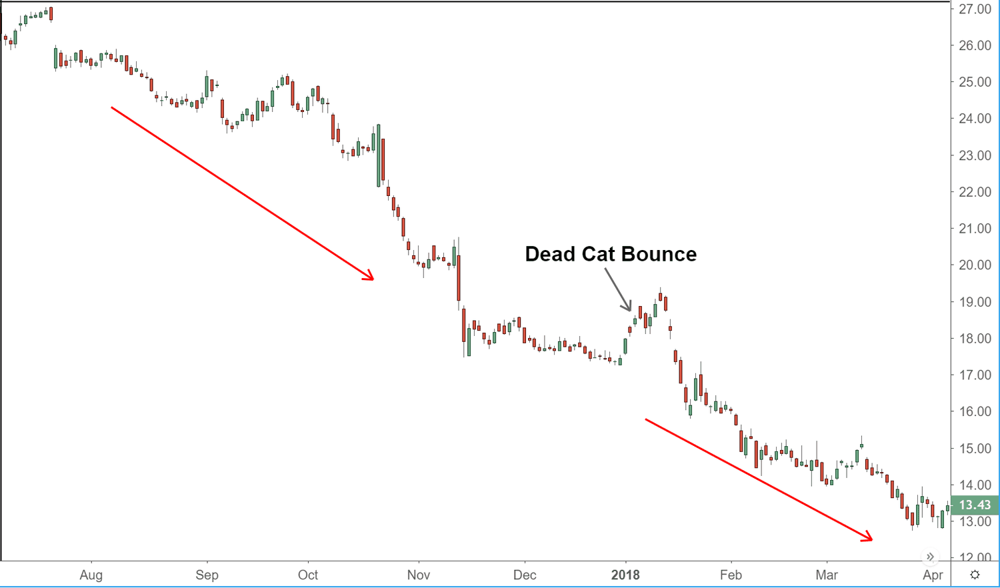

## Table of Contents

## What is a relief rally in the stock market?

A relief rally in the stock market happens when stock prices go up after a time of falling or being unsure. It's like when people feel better after being worried, so they start buying stocks again. This can happen because of good news, like a company doing better than expected, or because people think the bad times are over.

These rallies can be short and might not last long. They are called "relief" because investors feel relieved that things are getting better. But, it's important to be careful because the market can go down again if the good feelings don't last or if new problems come up.

## What are the common triggers for a relief rally?

Relief rallies often start when something good happens after a time when the market was going down or people were unsure. For example, if a company reports better earnings than people thought, or if the government says it will help the economy, these can make investors feel better. Also, if a big problem like a trade war or a political issue seems to be getting better, this can trigger a relief rally.

Sometimes, relief rallies happen just because the market has been going down for a while and people think it can't get worse. They start buying stocks again, hoping that the worst is over. This can also happen if there's a lot of money waiting on the sidelines, ready to jump back into the market when things look a bit better. But, these rallies can be short-lived if the good news doesn't keep coming or if new problems pop up.

## How does a relief rally differ from a bull market?

A relief rally and a bull market are different things in the stock market. A relief rally is when stock prices go up for a short time after they've been going down or when people were unsure. It happens because something good happens that makes people feel better, like a company doing well or a problem getting better. But, relief rallies don't last long and the market can start going down again soon.

A bull market, on the other hand, is when the stock market goes up for a long time. It's not just a quick jump like a relief rally. In a bull market, people feel good about the economy and keep buying stocks because they think prices will keep going up. Bull markets can last for months or even years, and they are driven by strong economic growth and good news that keeps coming.

So, the main difference is that a relief rally is short and happens after bad times, while a bull market is long and happens during good times.

## Can you explain the psychological factors behind a relief rally?

A relief rally happens because of how people feel. When the stock market has been going down and people are worried, any good news can make them feel better. This good news could be a company doing better than expected or a problem getting solved. When people feel relieved, they start buying stocks again because they think the bad times are over. This feeling of relief can make a lot of people buy at the same time, which pushes the stock prices up quickly.

But, relief rallies don't last long because they are based on feelings, not on strong reasons like a bull market. If the good news stops or new problems come up, people can start feeling worried again. Then, they might sell their stocks, and the market can go back down. So, relief rallies show how important feelings are in the stock market, but they also show that feelings can change fast.

## What are some historical examples of relief rallies?

In 2009, after the big financial crisis, there was a relief rally. The market had been going down a lot because of the crisis, and many people lost money. But then, the government started helping banks and companies, and people started to feel a bit better. This made the stock market go up for a short time, even though the economy was still not doing well. It was a relief rally because people felt less worried after the government's help.

Another example happened in March 2020, during the start of the COVID-19 pandemic. The stock market dropped a lot because everyone was scared about the virus. But then, the government and the central bank said they would help the economy with money and support. This made people feel a bit better, and the stock market went up for a short time. It was a relief rally because the good news about help made people less worried, even though the virus was still a big problem.

## How can investors identify the start of a relief rally?

Investors can spot the start of a relief rally by watching the news and how the market is doing. If the market has been going down for a while and then suddenly goes up after some good news, it might be the start of a relief rally. This good news could be something like a company doing better than expected or the government saying it will help the economy. When this happens, people who were worried start feeling better and start buying stocks again, which makes the prices go up quickly.

It's also important to look at how fast the market is going up. Relief rallies often happen very quickly because a lot of people start buying at the same time. If the market goes up a lot in just a few days after being down, it's a sign that it might be a relief rally. But, investors need to be careful because relief rallies don't last long, and the market can go back down if the good feelings don't last or if new problems come up.

## What are the risks associated with participating in a relief rally?

Participating in a relief rally can be risky because it might not last long. When the market goes up quickly after being down, it's because people feel better after hearing good news. But if that good news stops or if new problems come up, the market can go back down just as fast. So, if you buy stocks during a relief rally, you might lose money if the market drops again soon.

Another risk is that relief rallies can make people feel too good about the market. When prices go up fast, it's easy to think the bad times are over and that prices will keep going up. But relief rallies are based on feelings, not strong reasons like a bull market. If you buy stocks thinking the rally will last, you might be surprised when the market goes down again. So, it's important to be careful and not get too excited during a relief rally.

## How long do relief rallies typically last?

Relief rallies usually don't last very long. They might go on for a few days or a couple of weeks at most. This is because they happen when people feel better after bad times, but that good feeling can go away quickly if new problems come up or if the good news stops.

Since relief rallies are based on feelings, they can end as fast as they start. If the market goes back to being unsure or if bad news comes out, people can start selling their stocks again. So, it's important to remember that relief rallies are short and can be followed by the market going down again.

## What technical indicators are used to predict a relief rally?

Technical indicators can help investors see when a relief rally might start. One common indicator is the Relative Strength Index (RSI). When the RSI goes from being very low to moving up, it can mean that the market is getting less oversold. This can happen when people start feeling better after bad times, which might lead to a relief rally. Another indicator is trading [volume](/wiki/volume-trading-strategy). If the volume goes up a lot when the market starts going up after being down, it can show that many people are buying stocks again because they feel relieved.

Another useful indicator is the moving average. If the stock price goes above its moving average after being below it for a while, it can be a sign that a relief rally is starting. This happens because the moving average shows the average price over time, and when the price goes above it, it can mean that the market is turning around. These indicators are not perfect, but they can give investors a hint that a relief rally might be coming.

## How do relief rallies affect different sectors of the market?

Relief rallies can affect different sectors of the market in different ways. When the market starts going up after a bad time, some sectors might go up more than others. For example, if the good news that starts the rally is about a specific industry, like technology or healthcare, those sectors might see their stock prices go up more. This happens because investors feel more confident about those sectors and start buying their stocks more.

Other sectors might not go up as much during a relief rally. If the good news is more general, like the government helping the whole economy, then many sectors might go up a bit, but not as much as the ones directly helped by the news. Also, some sectors that were hit hard during the bad times might not go up as much during the relief rally because people are still worried about them. So, while a relief rally can make the whole market feel better, it doesn't affect all sectors the same way.

## What strategies can traders use to capitalize on a relief rally?

Traders can use a few strategies to make the most of a relief rally. One way is to buy stocks right when the rally starts. This means watching the news and the market closely to see when good news makes people feel better and start buying stocks again. If traders can buy at the start of the rally, they might be able to sell the stocks later for a higher price. But, they need to be quick because relief rallies don't last long.

Another strategy is to focus on the sectors that are likely to go up the most during the rally. If the good news is about a specific industry, like technology or healthcare, traders can buy stocks in those sectors. They might go up more than other stocks during the rally. Traders should also watch the trading volume and technical indicators like the RSI and moving averages to see when the rally might be starting or ending. This can help them decide when to buy and when to sell.

## How do global economic conditions influence the occurrence of relief rallies?

Global economic conditions can play a big role in causing relief rallies. When the world economy is going through tough times, like a recession or a big problem like a trade war, stock markets around the world can go down. If there's good news that makes people think the bad times might be over, it can start a relief rally. This good news could be something like a country's government saying it will help its economy, or a big problem getting solved. When this happens, investors around the world feel better and start buying stocks again, which makes the market go up for a short time.

But, relief rallies can be different in different parts of the world because of how global economic conditions affect each place. If the good news is about one country or region, the relief rally might be stronger there than in other places. For example, if the U.S. government says it will help its economy, the U.S. stock market might go up more than markets in other countries. Also, if the global economy is still not doing well, the relief rally might not last long because new problems can come up quickly. So, global economic conditions can both start and end relief rallies, depending on how they change and what news comes out.

## References & Further Reading

For further insights on the impact of [algorithmic trading](/wiki/algorithmic-trading) and its role in influencing stock market dynamics, readers can explore a range of scholarly articles and [books](/wiki/algo-trading-books). A comprehensive approach includes understanding historical movements during major financial crises, which often shed light on market psychology and investor behavior during periods of turmoil and recovery. In addition, developing a solid foundation in advanced trading strategies through the use of technical indicators can greatly enhance one's trading acumen.

1. **Impact of Algorithmic Trading**: Algorithmic trading has transformed financial markets by providing tools that can execute trades with speed and precision. Several articles and research papers offer detailed analyses of how these algorithm-driven systems influence market efficiency, volatility, and liquidity. Academic journals such as The Journal of Trading and The Journal of Financial Markets are valuable resources for empirical studies on this topic.

2. **Historical Market Movements**: Understanding the patterns and triggers of relief rallies during past financial crises is essential for contextualizing current market conditions. Texts such as "Manias, Panics, and Crashes: A History of Financial Crises" by Charles Kindleberger and Robert Aliber provide insights into the cyclical nature of markets and the psychology that drives extreme financial behavior.

3. **Advanced Trading Strategies**: The integration of technical indicators into trading algorithms enables more nuanced strategies that capture market inefficiencies. Books like "Advances in Financial Machine Learning" by Marcos Lopez de Prado offer a rigorous approach to employing machine learning techniques in the development of advanced trading algorithms. Similarly, "Quantitative Trading: How to Build Your Own Algorithmic Trading Business" by Ernest P. Chan offers practical guidance on creating and implementing algorithmic trading strategies.

For those interested in quantitative finance and algorithmic trading, open-source platforms such as QuantConnect or Zipline may serve as valuable tools. Here is a simple Python example utilizing a moving average crossover strategy, a basic yet widely used approach in algorithmic trading:

```python
import pandas as pd

# Sample data
data = {'price': [100, 102, 101, 105, 107, 110, 115, 120, 125, 130]}
df = pd.DataFrame(data)

# Calculate moving averages
df['short_mavg'] = df['price'].rolling(window=3, min_periods=1).mean()
df['long_mavg'] = df['price'].rolling(window=5, min_periods=1).mean()

# Implement crossover strategy
df['signal'] = 0
df['signal'][df['short_mavg'] > df['long_mavg']] = 1
df['positions'] = df['signal'].diff()

print(df)
```

Ultimately, the continuous learning and adaptation to evolving market conditions, supported by robust research and sophisticated trading tools, are essential components for successfully navigating financial markets.

