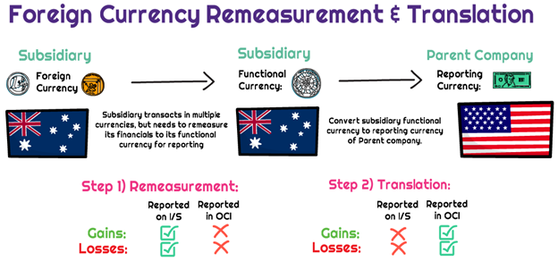

## Table of Contents

## What is remeasurement?

Remeasurement is when you measure something again to make sure the first measurement was correct. It's like double-checking your work. People often do this in construction, science, and cooking to avoid mistakes that could cause problems later.

For example, if you are building a house, you might measure the length of a wall to make sure it's the right size before you start building. If you find out later that the wall is too short or too long, it can cause big problems. So, you measure it again to be sure. This helps to make sure everything is done right the first time.

## Why is remeasurement important?

Remeasurement is important because it helps to make sure that things are done correctly. When you measure something once, you might make a mistake. By measuring again, you can catch those mistakes before they cause bigger problems. This is really helpful in jobs like building houses or making things in a factory, where small errors can lead to big issues later on.

For example, if you are cooking and you measure the ingredients wrong, your food might not taste good. But if you measure the ingredients again, you can fix the mistake before you start cooking. This way, you can make sure your food turns out just right. Remeasurement helps to keep things accurate and reliable, which is important in many different situations.

## What are the basic types of remeasurement?

There are two main types of remeasurement: manual and automated. Manual remeasurement is when you measure something again by hand, using tools like a ruler or a tape measure. This is common in everyday tasks, like checking the size of a room before you buy furniture or making sure you have the right amount of ingredients for a recipe. It's important to be careful and take your time when doing manual remeasurement, so you don't make any mistakes.

Automated remeasurement uses machines and computers to check measurements again. This type of remeasurement is often used in factories and labs, where they need to be very precise. Machines can measure things much faster and more accurately than people can, which helps to avoid errors and save time. Automated remeasurement is important in industries where even small mistakes can cause big problems, like making cars or medicine.

## Can you explain the difference between remeasurement and revaluation?

Remeasurement and revaluation are two different things, but they both have to do with checking and updating values. Remeasurement is when you measure something again to make sure the first measurement was right. It's like double-checking your work. You might do this in everyday life, like when you're cooking and you want to make sure you have the right amount of ingredients, or in a job, like when you're building something and you need to make sure the pieces are the right size.

Revaluation, on the other hand, is when you change the value of something based on new information. This is often used in business and finance. For example, if you own a piece of land and its value goes up because a new shopping center is built nearby, you might revalue the land to reflect its new, higher value. Revaluation is about updating the worth of something, while remeasurement is about checking the accuracy of a measurement.

## How does remeasurement affect financial statements?

Remeasurement can affect financial statements when it involves foreign currency. If a company does business in different countries, it has to convert the money from those countries into its own currency to make financial statements. Sometimes, the value of one currency changes compared to another. When this happens, the company has to remeasure the foreign currency to see how much it's worth now. This can make the numbers on the financial statements go up or down, depending on whether the foreign currency got stronger or weaker.

For example, if a company in the United States has a lot of money in Euros and the Euro gets stronger compared to the US dollar, the company will have more money when it converts the Euros back to dollars. This makes the company's financial statements look better because it shows more money. On the other hand, if the Euro gets weaker, the company will have less money after conversion, and the financial statements will show less money. So, remeasurement can change how much money a company seems to have, which is important for people who read the financial statements.

## What are some common methods used for remeasurement?

One common method for remeasurement is manual checking. This means using tools like rulers, tape measures, or scales to measure something again. People often do this in everyday tasks, like making sure a piece of furniture will fit in a room or checking if they have the right amount of ingredients for a recipe. It's important to be careful and take your time when doing manual remeasurement to avoid mistakes.

Another method is automated remeasurement. This uses machines and computers to check measurements again. This type of remeasurement is often used in factories and labs where precision is very important. Machines can measure things much faster and more accurately than people can, which helps to avoid errors and save time. Automated remeasurement is useful in industries where even small mistakes can cause big problems, like making cars or medicine.

In finance, remeasurement often involves using software to convert foreign currency values. If a company does business in different countries, it needs to convert the money from those countries into its own currency for financial statements. The software automatically updates the conversion rates based on the latest exchange rates, which can change the reported values on the financial statements. This helps companies keep their financial reports accurate and up-to-date.

## In what scenarios is remeasurement typically applied?

Remeasurement is used in many everyday situations. For example, when you are cooking, you might measure your ingredients again to make sure you have the right amounts. If you are building something, like a shelf, you would measure the wood again to make sure it's the right size. This helps to avoid mistakes that could ruin your project or meal. People also use remeasurement when they are buying things, like furniture, to make sure it will fit in their home.

In professional settings, remeasurement is very important. In construction, workers measure things like walls and beams again to make sure everything fits together correctly. In factories, machines often measure parts again to make sure they are the right size and shape. This helps to avoid problems that could slow down production or make the products unsafe. In finance, companies remeasure the value of foreign money to keep their financial statements accurate, especially when exchange rates change.

## How do different accounting standards treat remeasurement?

Different accounting standards treat remeasurement in their own ways, but they all want to make sure the numbers in financial statements are correct. Under the International Financial Reporting Standards (IFRS), remeasurement is used when a company has to change the value of foreign currency. If the value of the foreign currency changes, the company has to remeasure it to show the new value in its financial statements. This helps to keep the financial statements accurate and up-to-date.

In the United States, the Generally Accepted Accounting Principles (GAAP) also use remeasurement for foreign currency. But GAAP has some different rules about when and how to do it. For example, GAAP might require a company to use a different method to convert foreign currency, depending on the situation. Both IFRS and GAAP want to make sure that the financial statements show the right numbers, but they might do it in slightly different ways.

## What are the challenges faced when performing remeasurement?

One challenge of remeasurement is making sure it's accurate. When you measure something again, you want to make sure you do it right. But sometimes, people can make mistakes. They might read the numbers wrong or use the wrong tool. This can lead to errors in the remeasurement, which can cause problems later on. For example, if you're building a house and you remeasure a wall wrong, it might not fit with the other parts of the house.

Another challenge is that remeasurement can take a lot of time. When you have to measure something again, it adds extra steps to your work. This can slow things down, especially if you're working on a big project. In a factory, for example, if machines have to remeasure parts all the time, it can slow down the whole production line. This can be a problem if you need to finish the project quickly.

## Can you provide examples of remeasurement in different industries?

In the construction industry, remeasurement is really important. When workers are building a house, they need to make sure everything fits together just right. So, they measure things like walls and beams again to make sure they are the right size. If they find a mistake, they can fix it before it causes bigger problems. This helps to make sure the house is built correctly and safely.

In the food industry, remeasurement is used a lot too. When chefs are cooking, they measure their ingredients again to make sure they have the right amounts. If they use too much or too little of something, the food might not taste good. By remeasuring, they can make sure the food turns out just right. This is important for making sure customers are happy with their meals.

In the finance industry, companies use remeasurement to keep their financial statements accurate. If a company does business in different countries, it has to convert the money from those countries into its own currency. Sometimes, the value of one currency changes compared to another. So, the company has to remeasure the foreign currency to see how much it's worth now. This helps to make sure the financial statements show the right numbers, which is important for people who read them.

## How does technology assist in the remeasurement process?

Technology helps a lot with remeasurement by making it faster and more accurate. Machines and computers can measure things much quicker than people can. For example, in a factory, machines can check the size and shape of parts over and over again without getting tired. This helps to make sure the parts are always the right size, which is important for making things like cars or medicine. Computers also help in finance by automatically updating the value of foreign money when exchange rates change. This keeps financial statements accurate and up-to-date without people having to do it all by hand.

Using technology for remeasurement can save time and reduce mistakes. When people measure things by hand, they might make errors, like reading the numbers wrong or using the wrong tool. But machines and computers are very good at measuring things correctly. For example, in construction, workers can use laser tools to measure walls and beams quickly and accurately. This helps to make sure everything fits together right. In the food industry, chefs can use digital scales to measure ingredients precisely, which helps to make sure the food tastes good every time.

## What are the future trends in remeasurement practices?

In the future, remeasurement practices are likely to become even more advanced with new technology. More and more, machines and computers will be used to measure things quickly and accurately. For example, in factories, robots might be used to check the size and shape of parts all the time. This will help to make sure everything is made correctly and safely. In finance, new software might make it even easier to update the value of foreign money when exchange rates change. This will help companies keep their financial statements accurate without a lot of work.

Another trend is the use of smart devices and the Internet of Things (IoT) for remeasurement. In construction, workers might use smart tools that automatically send measurements to a computer. This can help to make sure everything fits together right without having to write down numbers. In homes, smart scales and measuring tools might be used in the kitchen to make cooking easier and more accurate. These new technologies will help people and businesses do remeasurement better and faster, which can save time and reduce mistakes.

## What is Remeasurement?

Remeasurement is the process of revising the value of assets or currencies within a company's financial statements to ensure they accurately reflect their current worth. This is a critical practice for businesses engaged in international operations, dealing with foreign currencies or assets whose values may fluctuate over time due to market dynamics or changes in economic conditions. 

The importance of remeasurement stems from the inherent [volatility](/wiki/volatility-trading-strategies) in foreign exchange markets and the economic environments in which these businesses operate. Exchange rates can vary significantly over short periods, necessitating recalibrations within financial statements to maintain accuracy. Remeasurement ensures that the financial positions and performance of a company are not misleading due to outdated or inaccurate valuations.

Mathematically, remeasurement can be represented by adjusting the historical cost of an asset or reporting figures to present values using current exchange rates. For example, if a financial statement initially records a foreign asset at an historical exchange rate, remeasurement involves updating this value to match the present exchange rate:

$$
\text{Remeasured Value} = \text{Historical Value} \times \frac{\text{Current Exchange Rate}}{\text{Initial Exchange Rate}}
$$

This adjustment is particularly important for companies preparing consolidated financial statements that include foreign subsidiaries. The remeasurement process allows these firms to present a cohesive and comparable view of their financial situation. By aligning recorded values with real-time market conditions, businesses uphold transparency and enable stakeholders to make well-informed decisions.

Python can be used to automate remeasurement calculations, streamlining the adaptation of financial statements to ever-changing market conditions. Below is a simple example illustrating how one might perform such a calculation in Python:

```python
def remeasure_value(historical_value, current_rate, initial_rate):
    return historical_value * (current_rate / initial_rate)

# Example usage
historical_value = 100000  # Value in foreign currency
initial_rate = 1.2  # Initial exchange rate
current_rate = 1.1  # Current exchange rate

remeasured_value = remeasure_value(historical_value, current_rate, initial_rate)
print("Remeasured Value:", remeasured_value)
```

This function calculates the remeasured value by adjusting the historical asset value according to the current and initial exchange rates, providing an accurate depiction of the asset's present worth in the financial statements.

## What are the types of remeasurement?

In the complex and interconnected world of global finance, remeasurement processes are indispensable for accurately reflecting a company's financial position. Various types of remeasurement processes address different financial scenarios, each with unique applications and implications.

1. **Remeasurement Due to Foreign Currency Translation**: This type of remeasurement is prevalent among companies engaged in international operations. Businesses often transact in multiple currencies, necessitating the conversion of foreign currency values to the company's functional or reporting currency. This conversion is vital as exchange rates fluctuate, affecting the value of assets and liabilities. According to the Financial Accounting Standards Board (FASB), the generally accepted accounting principles (GAAP) guide how entities translate foreign currency balances. The process involves using current exchange rates for assets and liabilities, historical rates for equity, and average rates for income and expenses. Mathematically, the translation can be expressed as:
$$
   \text{Translated Value} = \text{Foreign Currency Amount} \times \text{Current Exchange Rate}

$$

   This ensures that financial reports accurately capture the entity's financial health, reflecting currency value changes.

2. **Remeasurement Due to Impairment**: Remeasurement is crucial when an asset's market value significantly declines, necessitating impairment recognition. An impairment loss occurs when the carrying amount of an asset exceeds its recoverable amount, necessitating a write-down to reflect accurate asset values on the balance sheet. This process is governed by accounting standards such as the International Financial Reporting Standards (IFRS) and U.S. GAAP. The impairment process typically includes identifying potential impairments, testing for recoverability, and measuring the impairment loss. The formula used for calculating the impairment loss is:
$$
   \text{Impairment Loss} = \text{Carrying Amount} - \text{Recoverable Amount}

$$

   This adjustment is vital for ensuring that the financial statements provide a true and fair view of the company's asset values.

3. **Remeasurement vs. Translation**: It is important to distinguish between remeasurement and translation, as they impact financial statements differently. Remeasurement directly affects net income because it involves recalculating values in the functional currency for foreign operations when the local currency is not stable, or operations use a different currency than the reporting currency. Conversely, translation adjustments occur in the equity section of the financial statements. These adjustments arise when converting subsidiary financials from the functional currency to the reporting currency but do not impact net income. This distinction is crucial, particularly for consolidating financial statements of multinational corporations with widespread international operations.

Recognizing these types of remeasurement processes is essential for maintaining accurate, reliable, and compliant financial reports, which help stakeholders make informed decisions.

## References & Further Reading

[1]: Bergstra, J., Bardenet, R., Bengio, Y., & Kégl, B. (2011). ["Algorithms for Hyper-Parameter Optimization."](https://dl.acm.org/doi/10.5555/2986459.2986743) Advances in Neural Information Processing Systems 24.

[2]: ["Advances in Financial Machine Learning"](https://www.amazon.com/Advances-Financial-Machine-Learning-Marcos/dp/1119482089) by Marcos Lopez de Prado

[3]: ["Foreign Currency Financial Statements and High Inflation: A Guide to Implementation"](https://www.ifrs.org/issued-standards/list-of-standards/ias-29-financial-reporting-in-hyperinflationary-economies/) by Martin Shubik and Geoffrey Wheeler

[4]: ["International Financial Reporting Standards (IFRS) 2023: Interpretations and Applications"](https://www.amazon.com/Interpretation-Application-Standards-Regulatory-Reporting/dp/1394186304) by Barry J. Epstein and Ralph Nach

[5]: ["Quantitative Trading: How to Build Your Own Algorithmic Trading Business"](https://www.amazon.com/Quantitative-Trading-Build-Algorithmic-Business/dp/1119800064) by Ernest P. Chan