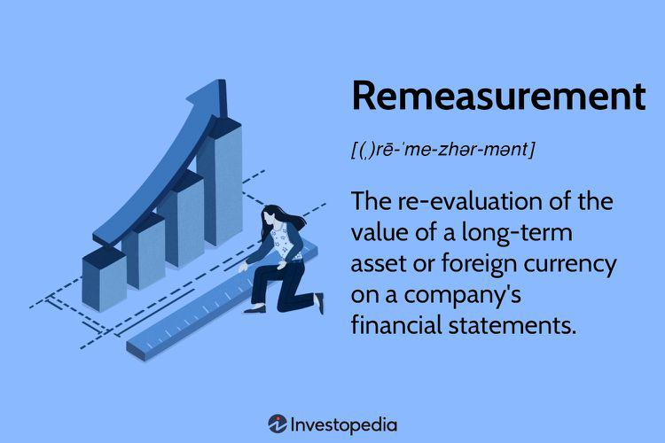

In today's rapidly evolving financial landscape, remeasurement has become a pivotal process for businesses operating across multiple currencies. As globalization intensifies, companies increasingly engage in international transactions that require the handling of various currencies, each subject to frequent fluctuations in value. Remeasurement addresses the need for accurate financial reporting, enabling companies to present their financial statements precisely despite these fluctuations. This ensures transparency and compliance with international accounting standards such as International Financial Reporting Standards (IFRS) and Generally Accepted Accounting Principles (GAAP).

The significance of remeasurement extends beyond conventional financial accounting, particularly influencing algorithmic trading. In this domain, precise valuation of assets and liabilities across different currencies and markets is crucial for developing effective trading strategies. Traders and financial analysts utilize remeasurement to refine algorithms, which are instrumental in predicting market trends and maximizing returns. By understanding the nuances of remeasurement, businesses can better navigate financial risks and leverage opportunities presented by currency volatility.



This article aims to provide a comprehensive understanding of remeasurement, encompassing its various types and its profound impact on financial statements and trading strategies. Through real-world examples and insights, we will explore how remeasurement integrates into the broader framework of financial operations, ensuring businesses maintain financial accuracy in a dynamic global market.

## Table of Contents

## What is Remeasurement?

Remeasurement is the process of revising the value of assets or currencies within a company's financial statements to ensure they accurately reflect their current worth. This is a critical practice for businesses engaged in international operations, dealing with foreign currencies or assets whose values may fluctuate over time due to market dynamics or changes in economic conditions. 

The importance of remeasurement stems from the inherent volatility in foreign exchange markets and the economic environments in which these businesses operate. Exchange rates can vary significantly over short periods, necessitating recalibrations within financial statements to maintain accuracy. Remeasurement ensures that the financial positions and performance of a company are not misleading due to outdated or inaccurate valuations.

Mathematically, remeasurement can be represented by adjusting the historical cost of an asset or reporting figures to present values using current exchange rates. For example, if a financial statement initially records a foreign asset at an historical exchange rate, remeasurement involves updating this value to match the present exchange rate:

$$
\text{Remeasured Value} = \text{Historical Value} \times \frac{\text{Current Exchange Rate}}{\text{Initial Exchange Rate}}
$$

This adjustment is particularly important for companies preparing consolidated financial statements that include foreign subsidiaries. The remeasurement process allows these firms to present a cohesive and comparable view of their financial situation. By aligning recorded values with real-time market conditions, businesses uphold transparency and enable stakeholders to make well-informed decisions.

Python can be used to automate remeasurement calculations, streamlining the adaptation of financial statements to ever-changing market conditions. Below is a simple example illustrating how one might perform such a calculation in Python:

```python
def remeasure_value(historical_value, current_rate, initial_rate):
    return historical_value * (current_rate / initial_rate)

# Example usage
historical_value = 100000  # Value in foreign currency
initial_rate = 1.2  # Initial exchange rate
current_rate = 1.1  # Current exchange rate

remeasured_value = remeasure_value(historical_value, current_rate, initial_rate)
print("Remeasured Value:", remeasured_value)
```

This function calculates the remeasured value by adjusting the historical asset value according to the current and initial exchange rates, providing an accurate depiction of the asset's present worth in the financial statements.

## Types of Remeasurement

In the complex and interconnected world of global finance, remeasurement processes are indispensable for accurately reflecting a company's financial position. Various types of remeasurement processes address different financial scenarios, each with unique applications and implications.

1. **Remeasurement Due to Foreign Currency Translation**: This type of remeasurement is prevalent among companies engaged in international operations. Businesses often transact in multiple currencies, necessitating the conversion of foreign currency values to the company's functional or reporting currency. This conversion is vital as exchange rates fluctuate, affecting the value of assets and liabilities. According to the Financial Accounting Standards Board (FASB), the generally accepted accounting principles (GAAP) guide how entities translate foreign currency balances. The process involves using current exchange rates for assets and liabilities, historical rates for equity, and average rates for income and expenses. Mathematically, the translation can be expressed as:
$$
   \text{Translated Value} = \text{Foreign Currency Amount} \times \text{Current Exchange Rate}

$$

   This ensures that financial reports accurately capture the entity's financial health, reflecting currency value changes.

2. **Remeasurement Due to Impairment**: Remeasurement is crucial when an asset's market value significantly declines, necessitating impairment recognition. An impairment loss occurs when the carrying amount of an asset exceeds its recoverable amount, necessitating a write-down to reflect accurate asset values on the balance sheet. This process is governed by accounting standards such as the International Financial Reporting Standards (IFRS) and U.S. GAAP. The impairment process typically includes identifying potential impairments, testing for recoverability, and measuring the impairment loss. The formula used for calculating the impairment loss is:
$$
   \text{Impairment Loss} = \text{Carrying Amount} - \text{Recoverable Amount}

$$

   This adjustment is vital for ensuring that the financial statements provide a true and fair view of the company's asset values.

3. **Remeasurement vs. Translation**: It is important to distinguish between remeasurement and translation, as they impact financial statements differently. Remeasurement directly affects net income because it involves recalculating values in the functional currency for foreign operations when the local currency is not stable, or operations use a different currency than the reporting currency. Conversely, translation adjustments occur in the equity section of the financial statements. These adjustments arise when converting subsidiary financials from the functional currency to the reporting currency but do not impact net income. This distinction is crucial, particularly for consolidating financial statements of multinational corporations with widespread international operations.

Recognizing these types of remeasurement processes is essential for maintaining accurate, reliable, and compliant financial reports, which help stakeholders make informed decisions.

## Remeasurement in Algorithmic Trading

Remeasurement holds substantial weight in [algorithmic trading](/wiki/algorithmic-trading) by impacting the evaluation of asset positioning and risk management, particularly when navigating volatile currency markets. In trading activity involving multiple currencies, remeasurement adjustments may redefine the numerical landscape within which algorithms operate. This is critical for maintaining the alignment between theoretical models and current market realities.

Algorithmic traders often use a combination of statistical methods and real-time data analysis to optimize their strategies. The inclusion of remeasurement data allows these algorithms to adapt promptly to fluctuations in currency values, minimizing potential losses. The influence of remeasurement can be integrated into algorithmic models to adjust foreign currency positions accurately.

For instance, consider a trading scenario involving U.S. equities that require conversion from U.S. dollars (USD) to Euros (EUR). Given the [volatility](/wiki/volatility-trading-strategies) of [forex](/wiki/forex-system) markets, the remeasurement process would repeatedly adjust for conversion differences impacting the portfolio's valuation. An algorithm can be designed to perform real-time revaluation adjustments using the current exchange rate data as follows:

```python
def remeasure_assets(assets_in_usd, exchange_rate):
    """Remeasures the value of assets from USD to EUR using the current exchange rate."""
    assets_in_eur = {asset: value * exchange_rate for asset, value in assets_in_usd.items()}
    return assets_in_eur

# Example usage
assets_in_usd = {"Asset_A": 1000, "Asset_B": 2500, "Asset_C": 4000}
current_exchange_rate = 0.85  # USD to EUR exchange rate
remeasured_assets = remeasure_assets(assets_in_usd, current_exchange_rate)
```

Accurate measurement of such currency-driven asset revaluation enables traders to fine-tune their strategies dynamically, reducing opportunities for [arbitrage](/wiki/arbitrage) exploitation by adversaries and safeguarding profit margins. Through predictive modeling based on historical remeasurement data, algorithmic systems can forecast currency movement trends. This can also aid in preemptive recalibration of parameters crucial for algorithmic decision-making. Such proactive strategy adaptation helps traders maintain optimal trading conditions despite the turbulence in currency values.

Overall, understanding and incorporating remeasurement into algorithmic models transforms currency volatility into an opportunity for strategic realignment, fostering a competitive edge in rapidly responding to economic shifts.

## Examples of Remeasurement

Remeasurement is a crucial process in accounting and finance, providing an accurate reflection of asset and currency values during times of economic flux. A prominent example is the impact of the COVID-19 pandemic on goodwill impairment. As the pandemic led to widespread economic uncertainty, many companies experienced a decline in the value of their goodwill. This necessitated a remeasurement to ensure that financial statements accurately mirrored the reduced value of this intangible asset. The impairment testing became more frequent and rigorous, reflecting actual economic downturn impacts on acquired businesses. 

In hyperinflationary environments, businesses are compelled to adjust their financial records continuously to cope with severe currency devaluation. When inflation rates soar, the local currency rapidly loses purchasing power, leading to significant discrepancies in the reported values of assets and liabilities. Companies must frequently remeasure these values to align with the current economic situation, ensuring their financial statements remain valid and reliable.

A real-world scenario is seen in a UK-based company remeasuring its Euro-denominated assets for accurate reflection in British Pound (GBP) financial statements. This is necessary to prevent erroneous profit or loss statements due to currency exchange rate fluctuations. For instance, if the exchange rate changes from 1 EUR = 0.90 GBP to 1 EUR = 0.85 GBP, the value of Euro-denominated assets in GBP terms will decrease. The company must adjust the recorded values on its balance sheet to reflect these changes, thereby maintaining truthful financial insights.

Python code can illustrate how companies might simulate the currency remeasurement of their Euro-denominated assets using historical exchange rate data. Here's a simple example:

```python
def remeasure_assets(euro_asset_value, old_exchange_rate, new_exchange_rate):
    gbp_value_old = euro_asset_value * old_exchange_rate
    gbp_value_new = euro_asset_value * new_exchange_rate
    remeasurement_diff = gbp_value_new - gbp_value_old
    return gbp_value_new, remeasurement_diff

# Example usage:
euro_asset_value = 1000000  # 1 million Euros worth of assets
old_exchange_rate = 0.90  # Old exchange rate (1 EUR = 0.90 GBP)
new_exchange_rate = 0.85  # New exchange rate (1 EUR = 0.85 GBP)

new_gbp_value, difference = remeasure_assets(euro_asset_value, old_exchange_rate, new_exchange_rate)
print(f"New GBP Value: £{new_gbp_value}")
print(f"Remeasurement Difference: £{difference}")
```

This code calculates the new value of Euro-denominated assets in GBP and identifies the difference caused by the change in exchange rates, offering a simplistic view of remeasurement outcomes.

## Conclusion

Understanding remeasurement is vital for achieving financial accuracy and developing robust trading strategies. This process plays a crucial role in ensuring that financial statements accurately reflect the economic realities of a business's operations. By adjusting the values of assets or currencies, remeasurement helps companies to present a truthful financial picture, which is essential for informed decision-making.

Remeasurement is particularly important in the context of currency translation and asset impairment. When businesses operate in multiple countries, currency translation is necessary to convert foreign currencies into the home currency for reporting purposes. This aspect of remeasurement ensures that fluctuations in exchange rates do not obscure the financial position of a company. Additionally, when the value of an asset is impaired due to market changes or economic conditions, remeasurement is required to record this decrease accurately in financial statements.

For financial professionals and algorithmic traders, mastering remeasurement processes is critical as financial landscapes continue to change. Algorithmic trading strategies rely heavily on accurate data, and remeasurement adjustments can significantly influence the performance of these strategies. For instance, when developing trading algorithms that assess currency volatility, incorporating remeasurement data helps in predicting financial market movements more accurately.

To navigate the complexities introduced by remeasurement, financial professionals need to be adept in applying these processes to both identify risks and seize opportunities. As such, continuous learning and adaptation are essential skills in an ever-evolving economic environment, ensuring that businesses remain competitive and financially sound.

## References & Further Reading

[1]: Bergstra, J., Bardenet, R., Bengio, Y., & Kégl, B. (2011). ["Algorithms for Hyper-Parameter Optimization."](https://dl.acm.org/doi/10.5555/2986459.2986743) Advances in Neural Information Processing Systems 24.

[2]: ["Advances in Financial Machine Learning"](https://www.amazon.com/Advances-Financial-Machine-Learning-Marcos/dp/1119482089) by Marcos Lopez de Prado

[3]: ["Foreign Currency Financial Statements and High Inflation: A Guide to Implementation"](https://www.ifrs.org/issued-standards/list-of-standards/ias-29-financial-reporting-in-hyperinflationary-economies/) by Martin Shubik and Geoffrey Wheeler

[4]: ["International Financial Reporting Standards (IFRS) 2023: Interpretations and Applications"](https://www.amazon.com/Interpretation-Application-Standards-Regulatory-Reporting/dp/1394186304) by Barry J. Epstein and Ralph Nach

[5]: ["Quantitative Trading: How to Build Your Own Algorithmic Trading Business"](https://www.amazon.com/Quantitative-Trading-Build-Algorithmic-Business/dp/1119800064) by Ernest P. Chan