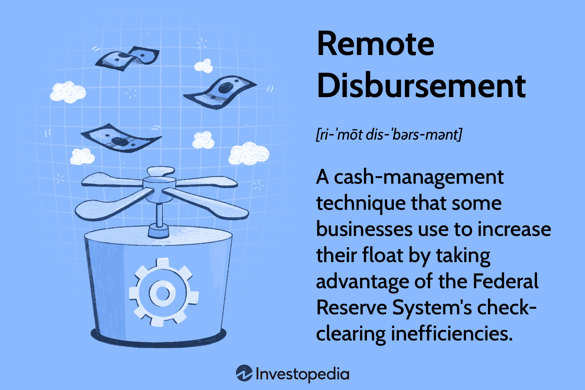

In the modern digital age, financial transactions have vastly evolved, integrating various technologies to enhance the ease and security of payments, disbursements, and trading. Digital payments have become the backbone of financial interactions, providing instantaneous, secure, and efficient methods for transferring value across the globe. The proliferation of digital wallets, online banking, and mobile payment services underscores the shift from traditional cash and card-based transactions to more versatile, technology-driven solutions.

This article explores the interconnected elements of digital payments, remote disbursement methods, fund transfers, and their relationship with algorithmic trading. The intricate ties among these facets illustrate how technology has revolutionized financial operations, offering new opportunities for efficiency while posing distinct challenges. Remote disbursement and fund transfer methods streamline operations for businesses, aiding in effective cash management and enabling faster transaction cycles, critical in today's fast-paced environment.



Algorithmic trading, a revolutionary approach in financial markets, leverages computational power to execute trades with precision and speed unattainable by human traders. The integration of algorithmic trading with modern payment technologies highlights a key development in how financial ecosystems operate, optimizing liquidity management, and reducing transaction costs.

The work will cover innovations, benefits, challenges, and future trends in these sectors. By understanding the complex interactions between these technological domains, we aim to provide a comprehensive overview of the financial landscape pertinent to businesses, financial institutions, and individual users. This narrative intends to highlight the importance of adapting to these advancements and identifying potential opportunities arising from this dynamic environment, ultimately fostering an inclusive, efficient, and sustainable financial future.

## Table of Contents

## Digital Payments: The Backbone of Modern Transactions

Digital payments have significantly transformed the landscape of financial transactions, offering increased speed, reliability, and convenience. These methods have rapidly gained traction, predominantly through mobile wallets and online banking systems. Digital payment platforms such as Apple Pay, Google Wallet, PayPal, and numerous online banking applications have streamlined transaction processes, allowing users to conduct payments through their smartphones or computers with ease. As a result, the dependence on cash has decreased, providing a more seamless transaction experience.

Secure transactions have become paramount in the rise of digital payments. Payment gateways, which act as intermediaries between merchants and financial institutions, play a crucial role in processing transactions securely. These gateways employ encryption protocols such as SSL (Secure Sockets Layer) and TLS (Transport Layer Security) that encrypt sensitive information, ensuring data integrity and confidentiality during transactions.

Blockchain technology has emerged as an innovative solution to minimize fraud risks in digital payments. By decentralizing transaction records into a ledger accessible by all network participants, blockchain ensures transparency and reduces the chances of fraudulent activities. Cryptographic principles used in blockchain technology, such as hashing and digital signatures, further bolster transaction security.

Current trends highlight the rise of cryptocurrencies and their significant implications for traditional banking systems. Cryptocurrencies like Bitcoin and Ethereum serve as both digital currencies and payment systems, challenging conventional financial paradigms. Their decentralized nature reduces transaction costs and time, offering competitive alternatives to cross-border payments traditionally dominated by banks.

In summary, digital payments have not only reshaped transactional processes but have also introduced secure, innovative solutions like blockchain technology. The advancing trend of cryptocurrencies continues to pose both challenges and opportunities for traditional banking systems. As digital payments further evolve, they remain indispensable in today's interconnected financial world.

## Remote Disbursement and Fund Transfer Methods

Remote disbursement refers to the process through which funds are electronically transferred from one entity to another, eliminating the need for physical cash handling. This method enhances cash management for businesses by increasing efficiency and lowering operational costs. It allows organizations to manage their funds more effectively, ensuring timely payments while optimizing their cash flow. Effective cash management is crucial for businesses as it leads to better financial planning and improved interest earnings.

Companies take advantage of remote banking technologies to optimize financial float and interest earnings. Remote banking allows businesses to extend the amount of time money stays within their banking systems, known as the financial float. By doing this, they can earn interest on their funds for a longer period before disbursement, ultimately optimizing their financial strategies.

Several techniques fall under remote disbursement, each offering unique advantages. Automated Clearing House (ACH) transfers are widely used in the United States. These transfers allow for batch processing of transactions, making them cost-effective and reliable for recurring payments like payroll. Direct deposits, a common form of ACH transfer, ensure employees receive their salaries directly into their bank accounts without delay. Push-to-card technology presents a newer method, enabling funds to be sent directly to a recipient's debit card instantaneously, offering a competitive edge by providing immediate access to funds.

The Federal Reserve plays a significant role in the process of check-clearing, which directly impacts disbursement practices. The Federal Reserve's check-clearing system ensures that checks are processed efficiently, facilitating the movement of funds. This system reduces the time required for funds to be transferred between banks, thus enhancing cash management strategies for disbursing entities.

Despite the benefits, challenges in remote disbursement practices persist. Regulatory compliance is a significant concern as businesses must navigate various national and international regulations to ensure lawful financial transactions. Moreover, international transfer complexities arise from differing banking systems and regulations across countries, often leading to delays and increased transfer costs.

In conclusion, remote disbursement and fund transfer methods form critical components of contemporary financial strategies, assisting businesses in effectively managing cash flow and optimizing their financial resources. As technology advances, these systems continue to evolve, presenting both opportunities and challenges that must be addressed for successful integration into global finance.

## Algorithmic Trading: A Revolutionary Approach

Algorithmic trading refers to the use of computer algorithms to manage buying and selling orders in financial markets. By leveraging complex mathematical models, it executes transactions at speeds unattainable by human traders. This method has become increasingly prevalent due to its efficiency and precision.

### Methodologies of Algorithmic Trading

**1. Statistical Arbitrage**

Statistical [arbitrage](/wiki/arbitrage) exploits price inefficiencies between multiple securities. It involves constructing mathematical models to predict future price movements and executing trades to capitalize on temporary mispricings. This strategy often employs mean reversion techniques, where the assumption is that prices will revert to a mean over time.

**2. Market Making**

Market making involves placing both buy and sell limit orders to capture the spread between the bid and ask prices. This provides [liquidity](/wiki/liquidity-risk-premium) to the markets and allows market makers to profit from the differential. Algorithms automate this process, enabling a significant [volume](/wiki/volume-trading-strategy) of trades to be conducted efficiently.

**3. Trend Following**

Trend following is based on the premise that securities exhibiting strong trends in price will likely continue in the same direction. Here, algorithms identify initial trends and execute trades aligned with the trend direction, triggering exits when the trend weakens or reverses.

### Advantages of Algorithmic Trading

Algorithmic trading boasts several advantages:

- **Speed**: Algorithms can execute orders within milliseconds, exploiting the smallest arbitrage opportunities before market conditions change.
- **Accuracy**: Automated systems reduce human errors in order execution and trading decisions.
- **Data-Driven Strategies**: Advanced algorithms analyze vast data sets in real-time, leading to more informed trading actions.

### Risks in Algorithmic Trading

Despite its advantages, [algorithmic trading](/wiki/algorithmic-trading) is not without risks:

- **Market Manipulation**: Algorithms can potentially be misused for practices like spoofing, where false orders are placed to manipulate prices.
- **Systemic Failures**: Dependence on technological systems can lead to significant loses in case of software bugs or network outages.
- **Ethical Considerations**: The high speed and volume of trades can lead to market conditions that disadvantage traditional traders.

### AI and Machine Learning in Algorithmic Trading

Artificial intelligence (AI) and [machine learning](/wiki/machine-learning) are transforming algorithmic trading by enhancing pattern recognition, predictive analytics, and decision-making processes. Machine learning models analyze historical data to predict future market trends, continuously improving their accuracy over time. AI-enabled systems can adapt to market changes dynamically, providing a significant edge in trading performance.

Python, with libraries such as NumPy, pandas, and TensorFlow, is widely used to implement these advanced models. An example of a simple moving average crossover strategy, using AI concepts, could be scripted as follows:

```python
import pandas as pd

def moving_average_signals(data, short_window=40, long_window=100):
    signals = pd.DataFrame(index=data.index)
    signals['signal'] = 0.0

    signals['short_mavg'] = data['close'].rolling(window=short_window, min_periods=1).mean()
    signals['long_mavg'] = data['close'].rolling(window=long_window, min_periods=1).mean()

    # Create signals: 1 when short moving average is greater than long moving average
    signals['signal'][short_window:] = np.where(signals['short_mavg'][short_window:]
                                                 > signals['long_mavg'][short_window:], 1.0, 0.0)   
    # Generate trading orders
    signals['positions'] = signals['signal'].diff()

    return signals

# Example usage:
# Assuming `data` is a DataFrame with a 'close' column for stock closing prices.
signals = moving_average_signals(data)
```

This script exemplifies a basic trend-following approach using moving averages, a starting point for much more sophisticated AI-driven strategies. As technology progresses, the integration of AI in algorithmic trading platforms will likely become even more pronounced, paving the way for innovative trading systems capable of significant advancements in financial markets.

## Integration of Payment Systems and Algorithmic Operations

The integration of payment systems and algorithmic operations represents a significant transformative force within the financial industry. The evolving synergy between payment technologies, such as digital wallets and blockchain, and algorithmic trading has resulted in enhanced liquidity and reduced transaction costs. Digital wallets provide fast and secure payment solutions, often incorporating blockchain technology to ensure immutability and transparency. Blockchain, with its decentralized nature, reduces intermediary costs associated with traditional banking systems, thereby allowing users and enterprises to enjoy lower transaction fees.

Financial institutions and fintech startups have spearheaded this integration, showcasing numerous successful applications. For instance, JP Morgan's initiative, the Interbank Information Network (IIN), uses blockchain technology to streamline cross-border payments. This integration facilitates immediate fund transfers, enhancing the efficiency of trading operations by ensuring liquidity is readily available when needed. Fintech startups, such as Revolut and TransferWise, utilize algorithm-driven solutions to optimize currency exchanges and lower the user's transaction costs, thereby making the financial process more efficient for customers.

Despite the evident benefits, this convergence presents technological and regulatory challenges. The complexity of integrating two technologically advanced systems requires robust infrastructure, which can be a barrier for smaller enterprises. Furthermore, the regulatory landscape is continually evolving, with governments attempting to manage the implications of blockchain and AI technologies. Compliance with different regional regulations can pose significant challenges to international transactions.

Looking ahead, the implications of AI-driven algorithms, 5G technology, and quantum computing are profound. AI will enhance algorithmic trading strategies by leveraging vast datasets for real-time analytics, allowing for more accurate and timely trading decisions. The advent of 5G technology promises to achieve lower latency, crucial for real-time trading operations and payment settlements. Quantum computing holds the potential to revolutionize financial computations, offering unprecedented processing power to optimize trading algorithms and secure transactions against future cyber threats.

In summary, the intertwining of payment systems and algorithmic operations is fostering a more agile and cost-effective financial ecosystem. While challenges remain, the ongoing advancements in technology are poised to fundamentally reshape the financial landscape, offering robust opportunities for innovation and efficiency.

## Conclusion

In the increasingly digital economy, interconnected financial processes play a pivotal role by streamlining operations and facilitating secure, rapid transactions. The integration of digital payments, remote disbursement methods, fund transfers, and algorithmic trading exemplifies the potential of this interconnectedness, enabling a seamless financial ecosystem that benefits businesses, financial institutions, and individuals alike. This intricate web of financial technologies has made transactions more efficient, reduced costs, and enhanced the overall user experience.

Adapting to technological advances and evolving regulatory landscapes is crucial. The rapid pace of innovation in financial technologies necessitates continuous adaptation to leverage new tools effectively. Regulatory environments are also in flux as governments and international bodies attempt to keep pace with technological innovations, ensuring consumer protection and financial system stability. Navigating these shifts requires businesses and institutions to stay informed and responsive to emerging trends and policies.

Opportunities abound for those willing to embrace these changes. From the increased use of AI in trading algorithms to the widespread adoption of blockchain for transparent, secure transactions, future prospects are promising. However, challenges such as cybersecurity threats, systemic risks, and ethical considerations must be addressed proactively to prevent potential disruptions. Balancing innovation with caution will be essential to mitigating these risks.

A call to action is essential for fostering an inclusive, efficient, and sustainable financial future. Stakeholders across sectors must collaborate to embrace innovation and ensure that advancements in financial technology are accessible to a broad audience, including underserved populations. By emphasizing inclusivity, efficiency, and sustainability, the financial sector can contribute significantly to economic growth while promoting equitable access to financial services. As we look to the future, this collective effort will be key to harnessing the full potential of interconnected financial processes.

## References & Further Reading

1. Narayanan, A., et al. "Bitcoin and Cryptocurrency Technologies: A Comprehensive Introduction." Princeton University Press, 2016. This book provides an in-depth understanding of cryptocurrencies and the underlying technologies, including blockchain, which are integral to the modern landscape of digital payments.

2. Geva, B. "The Law of Electronic Funds Transfers." Butterworths, 1992. This text examines the legal framework governing electronic fund transfers, offering vital insights into regulatory and compliance challenges faced in remote disbursement methods.

3. Lee, I. (Editor). "The Internet of Things in the Modern Business Environment." IGI Global, 2018. This comprehensive resource discusses the IoT's impact on financial transactions and the integration of digital payment technologies with other innovative solutions.

4. Treleaven, P., et al. "Algorithmic Trading Review." Journal of Financial Transformation, 2013. This article presents a thorough review of algorithmic trading processes, methodologies, and their implications for financial markets.

5. Linton, O., et al. "The Impact of Modern Technology on the Investment Industry: Algorithmic Trading." Institute for Quantitative Investment Research (INQUIRE), 2012. This paper explores advancements in algorithmic trading technology, with a focus on AI and machine learning.

6. Schwab, K. "The Fourth Industrial Revolution." Currency, 2017. This book outlines how technological advancements, including fintech innovations like digital payments and algorithmic trading, are shaping the future of industries.

7. Fitzpatrick, M. J. "Global E-commerce: Impacts of National Environment and Policy." Cambridge University Press, 2019. This text examines global e-commerce trends and their correlation with digital payment systems.

8. Chuen, D. L. K., et al. "Handbook of Blockchain, Digital Finance, and Inclusion." Academic Press, 2017. This resource compiles essential readings on blockchain technology's role in digital finance and its potential for further innovation.

9. Easley, D., et al. "Bitcoin Mining and its Implications." Journal of Economic Perspectives, 2014. A scholarly article discussing the economics of bitcoin mining and its relationship with the broader digital payment ecosystem.

10. Hull, J. C. "Options, Futures, and Other Derivatives." Prentice Hall, 2011. Hull's book is a staple for understanding derivatives markets, including the impacts of algorithmic trading strategies on these markets.

This list serves as a valuable foundation for anyone interested in further exploring the intricate dynamics of digital payment systems, remote disbursement methods, algorithmic trading, and their associated regulatory and technical challenges.

