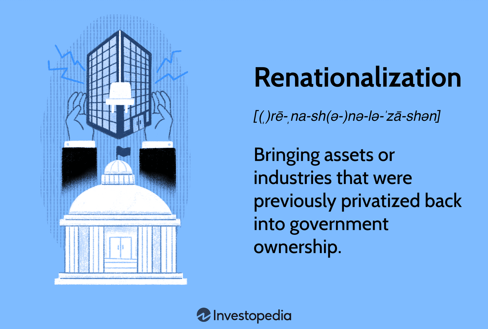

The dynamics of modern economic policy are ever-evolving, particularly with regard to renationalization and nationalization. These are strategies whereby the government gains increased control over industries, in contrast to the liberalization trends our global economy has often witnessed. Renationalization refers to the process of transferring privately owned enterprises to public ownership, mainly driven by economic or political motivations. On the other hand, nationalization involves the outright governmental takeover of private assets to manage critical sectors such as transportation, energy, and utilities. These processes are undertaken with the aim of protecting national interests, reducing inequalities, or controlling monopolies. 

In stark contrast, the financial world is experiencing a technological transformation through algorithmic trading, which leverages advanced technology to automate market transactions. This has reshaped financial markets, bringing efficiency, speed, and new complexities into the trading landscape. Algorithmic trading uses pre-set parameters in software to execute trades at high speeds and volumes that are impossible for human traders. This interaction between technology-driven markets and policies of renationalization and nationalization highlights the significant shifts in economic strategies and governance.



A comprehensive understanding of these intersections is critical for navigating the complexities of the global economy. The interaction between public sector control and private sector innovation presents a unique set of challenges and opportunities. Renationalization and nationalization can impact various sectors differently, from implications for investment and shareholder value to broader effects on economic stability and growth. At the same time, algorithmic trading must adapt to these policy changes to maintain functionality in diverse regulatory environments.

Throughout this article, we will examine these economic policies, providing the reader with insights into their implications and real-world examples that illustrate how these concepts play out across various economic landscapes. Future scenarios may involve increased integration of technology in policymaking and economic strategy, offering possible harmonization between public control and private efficiency. This understanding aids in effectively responding to shifts in economic policy and technological advancement.

## Table of Contents

## Understanding Renationalization and Nationalization

Renationalization involves transitioning previously privatized assets back under government control. This process is often motivated by economic or political factors, such as the need to rectify market failures, ensure access to essential services, or respond to public demand for greater government oversight. Renationalization can be observed in various industries when governments perceive that the privatization of these assets has led to unfavorable outcomes, such as increased prices or reduced quality of service.

Conversely, nationalization refers to the direct government acquisition of private assets. This strategy is typically employed to exert more control over critical sectors, including oil, transportation, and utilities. Governments may resort to nationalization to ensure that these vital industries operate in alignment with national interests, particularly during periods of economic instability or geopolitical conflict.

Both renationalization and nationalization aim to safeguard national interests, manage monopolies, and enable wealth redistribution. By centralizing control, these policies can stabilize economies, secure strategic resources, and enhance public welfare. However, the implementation of such policies often sparks debates regarding efficiency and market dynamics.

Historically, the practice of nationalization gained significant [momentum](/wiki/momentum) in the mid-20th century. During this period, various countries implemented nationalization strategies across different regions, driven by ideological leanings towards socialism and the intent to foster national development. The post-World War II era, in particular, witnessed numerous nationalization programs aimed at rebuilding economies and asserting economic sovereignty.

The benefits of nationalization and renationalization are manifold. They can provide economic stability by ensuring that key sectors are not subject to the [volatility](/wiki/volatility-trading-strategies) of market forces. Strategic control allows for long-term planning and investment, reducing dependency on foreign enterprises. Furthermore, these policies can promote public welfare through equitable distribution of resources and services.

However, the drawbacks are also significant. State-controlled enterprises often face inefficiencies due to a lack of competitive pressure. Market distortion is another potential consequence, as government intervention can impede the natural equilibrium of supply and demand, affecting pricing and innovation. Moreover, the financial burdens associated with maintaining and managing nationalized industries can strain public budgets, particularly if these entities operate at a loss.

In conclusion, the complex dynamics of renationalization and nationalization encompass a range of motivations and outcomes. While these policies can provide strategic advantages and support public welfare, they also pose challenges related to efficiency and economic distortions. Understanding the historical context and economic implications of such government interventions is crucial for assessing their potential impacts on various sectors.

## Economic Implications of Renationalization and Nationalization

Renationalization and nationalization are policy measures employed by governments to reclaim control over previously privatized assets or to take over private industries deemed vital to national interests. These strategies can offer economic stabilization, secure strategic resources, and bolster national security. However, they also present several challenges, including potential inefficiencies, significant financial burdens on governments, and reduced foreign investment.

One significant advantage of renationalization is the potential to stabilize an economy, especially when strategic sectors are involved. For instance, by bringing critical assets under state control, a government can ensure the continuous provision of essential services and prevent monopoly abuses, which can protect consumers from exploitation. Moreover, state control can secure important resources, ensuring that they are used to benefit national rather than purely private interests.

However, these strategies also entail considerable risks, notably inefficiencies associated with government management of industries. Publicly managed entities often face less competitive pressure to innovate and cut costs compared to their private counterparts. This could lead to decreased productivity and a lack of responsiveness to market demands. Additionally, the financial burden placed on a government to maintain and invest in these industries can be significant, diverting resources from other essential public services or projects.

Furthermore, renationalization and nationalization policies might deter foreign investment. Investors are likely to be cautious in environments where state intervention is prevalent and where the risk of expropriation is high, thereby potentially stunting economic growth. This hesitancy can be especially detrimental for developing countries that rely heavily on foreign capital for development initiatives.

Argentina's experience with renationalization offers an illustrative case. In 2012, Argentina nationalized its oil company, YPF, seizing a majority stake from the Spanish company Repsol. While this move allowed Argentina to regain control over its energy resources and aimed to boost domestic investment, it also led to significant international arbitration claims and affected Argentina's reputation among international investors. The economic impact was complex, as it fostered greater state control but also brought legal, financial, and diplomatic repercussions.

Comparisons to other nations, such as Venezuela, underscore the varied economic outcomes of similar strategies. In Venezuela, extensive nationalization programs, particularly in the oil and utilities sectors, initially promised increased government revenue and economic independence. However, over time, inefficient management and a lack of investment led to declining production levels and the deterioration of infrastructure, exacerbating the country's economic crisis. This contrasts with Argentina's more mixed results, highlighting how the success of such policies can depend heavily on execution and broader economic conditions.

These instances reveal a recurring tension between public welfare and economic efficiency. While state control can ensure broader resource distribution and public access to essential services, it often conflicts with the need for efficiency that drives private enterprises. Balancing these competing interests remains a crucial challenge for policymakers considering or implementing nationalization and renationalization strategies.

## Algorithmic Trading in the Context of Economic Policies

Algorithmic trading, often referred to as algo trading, employs automated systems to execute trades based on predefined parameters. This approach leverages advanced computational power and algorithms to make trading decisions, profoundly influencing market dynamics by increasing trading speed, [liquidity](/wiki/liquidity-risk-premium), and market efficiency. 

In the context of nationalized sectors, the trading environment becomes intricately linked with state policies and geopolitical developments. Nationalization, which often involves the government taking control of critical industries like oil and utilities, creates market conditions that are heavily influenced by political motives rather than purely economic ones. Algorithmic trading systems must therefore adapt to these conditions by incorporating policy-driven market changes, geopolitical risks, and regulatory environments into their models.

For example, in the oil industry, national policy shifts on production quotas or export restrictions can significantly affect supply and pricing. Algorithmic systems need to be responsive to such changes, requiring continuous updates and realignment of trading strategies. The price dynamics in markets dominated by geopolitical landscapes often follow patterns influenced by government decisions rather than just supply-demand economics. 

The integration of [artificial intelligence](/wiki/ai-artificial-intelligence) (AI) and [machine learning](/wiki/machine-learning) into [algorithmic trading](/wiki/algorithmic-trading) offers significant advantages in adapting to complex and rapidly changing market conditions. AI-driven models can analyze large datasets and identify patterns that human traders might overlook. For instance, through machine learning algorithms, traders can predict price movements by analyzing past patterns related to regulatory announcements or geopolitical events. This ability to anticipate and swiftly react to policy-driven changes can give traders a substantial edge.

Algorithmic trading models might use regression analysis or time-series forecasting to understand and predict how these factors influence market prices. An example of a simple linear regression model used in Python may look like:

```python
import numpy as np
from sklearn.linear_model import LinearRegression

# Example data: changes in policy (input) and corresponding market price change (output)
policy_changes = np.array([[1], [2], [3], [4], [5]])
price_changes = np.array([10, 20, 30, 40, 50])

# Create and train the model
model = LinearRegression()
model.fit(policy_changes, price_changes)

# Predict future changes
predicted_price_change = model.predict(np.array([[6]]))
print(predicted_price_change)
```

In this simplified example, the model learns how policy changes relate to market price changes and predicts future scenarios based on new inputs. However, real-world trading models incorporate far more variables and sophisticated algorithms, including neural networks and [deep learning](/wiki/deep-learning) techniques.

To summarize, algorithmic trading operates within a unique intersection of economic policy and market dynamics, particularly in nationalized sectors. It requires continuous adaptation to policy shifts and geopolitical risks, harnessing the power of modern technologies such as AI and machine learning to maintain competitiveness and profitability. The seamless integration of these technologies with trading strategies is crucial for effective navigation of the markets influenced by national and geopolitical factors.

## Interactions and Challenges

Nationalization initiatives create significant challenges for private enterprises, contributing to a shift in the economic landscape that affects both investors and traders. When a government takes control of private assets, it can lead to a myriad of financial and operational changes, influencing investment strategies, altering market valuations, and affecting shareholder confidence. For investors, the uncertainty associated with nationalized sectors demands careful assessment of geopolitical risk and market stability. Traders must also adapt, as nationalization can induce price volatility and alter supply-demand dynamics.

One primary challenge is the financial burden that nationalization can place on economies. State ownership often requires substantial public expenditure to either maintain or improve infrastructure and service quality. This can strain government budgets, potentially leading to higher taxes or reallocations of funds from other critical areas. Additionally, without the profit motive driving efficiency, these sectors can become inefficient, leading to reduced competitiveness and innovation. Past analyses, such as those conducted in Venezuela's oil industry, demonstrate how nationalization can lead to underperformance and inefficiency, turning former profit centers into financial liabilities.

Another underlying issue in nationalized environments is the potential for corruption. With less oversight and competition compared to the private sector, state-managed enterprises may be more susceptible to corrupt practices. This can exacerbate inefficiencies, inflate costs, and ultimately burden the economy further. Effective governance and increased transparency are critical if nationalized entities are to operate successfully. Establishing clear protocols, audit systems, and accountability mechanisms are essential steps toward mitigating these risks.

Algorithmic trading systems are directly impacted by the complexities introduced by nationalized industries. These systems must be robust enough to handle abrupt policy changes or geopolitical tensions that impact markets. For instance, trading models in the oil industry must account for governmental control over production, pricing, and export policies. Algorithms must incorporate diverse data sources, including political risk assessments and government announcements, to optimize trading strategies in state-controlled sectors. Python code, for instance, can be used to enhance these models by integrating machine learning frameworks that predict policy impact based on historical data:

```python
import numpy as np
from sklearn.ensemble import RandomForestRegressor

# Sample features: policy changes, production output, geopolitical events
# Sample targets: price changes
X = np.array([[0.2, 500, 0], [0.1, 480, 1], [0.3, 530, 0]])
y = np.array([50, 48, 52])  # hypothetical price changes

# Random Forest Model
model = RandomForestRegressor(n_estimators=100)
model.fit(X, y)

# Predict price impact of a new policy
policy_change = np.array([[0.25, 510, 1]])
predicted_impact = model.predict(policy_change)
print("Predicted Price Impact:", predicted_impact)
```

Critiques of nationalization often focus on resource misallocation, where political motives overshadow economic efficiency. Nationalization is sometimes driven more by ideology or a desire for political control than by sound economic logic. This misalignment can deter foreign investment, as seen in various historical contexts where nationalization provoked capital flight and reduced investor confidence.

Despite these challenges, the potential for successful nationalization exists if effective governance structures are put in place. These include establishing independent regulatory bodies, ensuring competitive practices where possible, and fostering an environment that encourages transparency and accountability. By addressing these concerns, nationalized sectors can contribute positively to economic growth and public welfare.

## Future Trends and Technological Integration

Technological advancements play a pivotal role in the future of nationalized industries, and incorporating technologies such as artificial intelligence (AI) and blockchain is essential for enhancing the efficiency and modernization of these sectors. These advancements help governments manage resources more effectively, ensuring sustainability and optimization of operations. AI provides powerful tools for predictive analytics and decision-making processes that are integral to the complex dynamics of industries like oil and gas. By utilizing machine learning algorithms, these sectors can improve resource allocation, forecast demand with greater accuracy, and enhance the overall production processes.

Additionally, blockchain technology offers secure, transparent, and tamper-proof systems crucial for managing transactions and regulatory compliance in nationalized industries. Its implementation can streamline supply chain operations and provide a reliable framework for monitoring cross-border energy transactions, thereby improving operational transparency and reducing fraud. As countries aim to modernize their nationalized oil sectors, investments in these technologies are anticipated to rise, fostering increased efficiency and sustainability.

Hybrid models that combine public and private sector strengths may also emerge as a balanced approach to nationalization. These partnerships can leverage private sector innovation prowess while maintaining the strategic control and security often associated with nationalized industries. This blended structure allows for the agility and technology infusion typical of the private sector while retaining public interests' alignment, mitigating the inefficiencies often associated with full national control.

Moreover, future economic policies are expected to further integrate technological solutions to harmonize nationalized and private sector functions. This integration ensures that technological advancements are aligned with nationalization strategies, optimizing control and efficiency in managing national resources. For example, deploying AI in monitoring and optimizing the energy grid can ensure that production aligns with consumption patterns, reducing waste and increasing resilience against disruptions.

Ultimately, aligning nationalization strategies with technology advancements enables countries to better harness emerging technologies' benefits. This approach not only helps in optimizing industry performance but also in supporting broader economic growth and sustainability objectives. Through strategic investment in technology and novel policy frameworks, nations can maximize both control over critical sectors and the benefits derived from technological innovations.

## Conclusion

Renationalization and nationalization are intricate policies involving substantial economic and political factors. As governments seek to assert control over essential industries, these policies play a pivotal role in shaping the economic landscape. The transition of private assets to public ownership can safeguard national interests and emphasize strategic control. However, it also presents challenges such as inefficiency and potential market disruption. Balancing these policies with the agility and innovation of private enterprise remains complex.

Algorithmic trading emerges as a significant element in this context, providing the tools necessary to navigate policy-induced market fluctuations. This form of trading leverages advanced algorithms to execute trades efficiently, responding rapidly to market changes influenced by state interventions. Traders and investors must adapt their strategies, factoring in the implications of nationalized industries and potential shifts in government policies.

The integration of technology emerges as a promising avenue, helping reconcile the efficiencies of the private sector with the strategic advantages of public control. Advanced technologies, such as artificial intelligence and machine learning, can enhance operational efficiency within nationalized sectors, offering adaptive solutions to dynamic economic conditions. Furthermore, blockchain and other innovations may ensure transparency, reducing the risks of corruption and inefficiencies often associated with state ownership.

Ultimately, the future economic environment will likely witness an evolving interplay between these policies and technological innovations. Hybrid models combining public and private sector strengths may offer balanced solutions, optimizing both efficiency and control. As these policies and technologies converge, the economic landscape will continue to transform, necessitating adaptive strategies to harness these changes effectively.

## References & Further Reading

[1]: Bergstra, J., Bardenet, R., Bengio, Y., & Kégl, B. (2011). ["Algorithms for Hyper-Parameter Optimization."](https://dl.acm.org/doi/10.5555/2986459.2986743) Advances in Neural Information Processing Systems 24.

[2]: ["Advances in Financial Machine Learning"](https://www.amazon.com/Advances-Financial-Machine-Learning-Marcos/dp/1119482089) by Marcos Lopez de Prado

[3]: ["Evidence-Based Technical Analysis: Applying the Scientific Method and Statistical Inference to Trading Signals"](https://www.amazon.com/Evidence-Based-Technical-Analysis-Scientific-Statistical/dp/0470008741) by David Aronson

[4]: ["Machine Learning for Algorithmic Trading"](https://github.com/stefan-jansen/machine-learning-for-trading) by Stefan Jansen

[5]: ["Quantitative Trading: How to Build Your Own Algorithmic Trading Business"](https://www.amazon.com/Quantitative-Trading-Build-Algorithmic-Business/dp/1119800064) by Ernest P. Chan