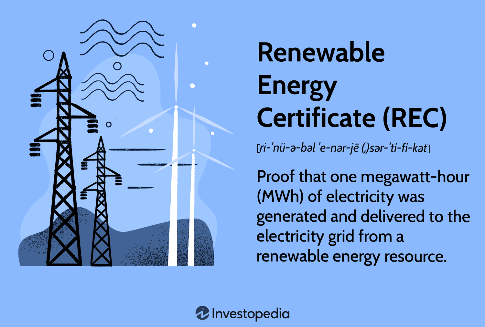

## Table of Contents

## What are Renewable Energy Certificates (RECs)?

Renewable Energy Certificates, or RECs, are a way to track and trade renewable energy. When a renewable energy source like wind or solar power generates electricity, it creates one REC for every megawatt-hour of power produced. These certificates can be bought and sold separately from the actual electricity. This means that a company or individual can buy RECs to support renewable energy, even if they get their electricity from non-renewable sources.

RECs help increase the use of renewable energy by making it more financially attractive for companies to produce it. When someone buys a REC, they are essentially paying for the environmental benefits of that renewable energy. This extra money can help renewable energy producers cover their costs and invest in more projects. Overall, RECs play an important role in the push towards a cleaner, more sustainable energy future.

## Why are Renewable Energy Certificates important?

Renewable Energy Certificates, or RECs, are important because they help make renewable energy more popular and financially viable. When people or companies buy RECs, they are supporting the production of clean energy from sources like wind or solar power. This extra money helps renewable energy producers cover their costs and invest in more projects. Without RECs, it might be harder for these projects to get off the ground because they often need more money upfront than traditional energy sources.

RECs also allow people and companies to take responsibility for their energy use in a simple way. Even if someone gets their electricity from a non-renewable source, they can buy RECs to offset their impact on the environment. This means they can claim they are using renewable energy, even if the actual power they use comes from somewhere else. This flexibility makes it easier for more people to support and invest in renewable energy, which is crucial for moving towards a cleaner, more sustainable future.

## How are Renewable Energy Certificates created?

Renewable Energy Certificates, or RECs, are created when renewable energy sources like wind, solar, or hydro power generate electricity. For every megawatt-hour of electricity produced, one REC is made. This means that if a wind farm produces 100 megawatt-hours of electricity, it will create 100 RECs. These certificates are like a receipt that proves the electricity came from a renewable source.

Once the RECs are created, they are tracked and recorded in a special system. This system keeps track of where the RECs come from and who owns them. When someone buys a REC, it is removed from the system, so it can't be sold again. This makes sure that each REC is used only once to support renewable energy.

## What are the different types of Renewable Energy Certificates?

There are two main types of Renewable Energy Certificates: unbundled RECs and bundled RECs. Unbundled RECs are sold separately from the actual electricity they represent. This means someone can buy the REC to support renewable energy, but they don't get the electricity itself. This is common for people or companies who want to claim they use renewable energy but get their power from other sources. Bundled RECs, on the other hand, are sold together with the electricity. When you buy bundled RECs, you get both the electricity and the certificate that proves it came from a renewable source.

There are also different types of RECs based on the source of the renewable energy. For example, you can have RECs from wind power, solar power, hydro power, or biomass. Each type of REC represents electricity generated from that specific renewable source. Some people or companies might prefer to buy RECs from a certain type of renewable energy because they want to support that particular technology or because it fits better with their environmental goals.

## Can you explain the difference between a REC and a carbon offset?

A Renewable Energy Certificate, or REC, is like a receipt that shows electricity came from a renewable source like wind or solar power. When you buy a REC, you're helping to support more clean energy being made. RECs are created for every megawatt-hour of renewable electricity produced and can be sold to people or companies who want to say they use green energy, even if they get their actual power from other sources.

A carbon offset, on the other hand, is something you buy to make up for the carbon dioxide you release into the air. This could be from driving a car or using electricity from fossil fuels. When you buy a carbon offset, the money goes towards projects that reduce carbon, like planting trees or capturing greenhouse gases. So, while RECs help support renewable energy, carbon offsets focus on reducing the amount of carbon in the atmosphere.

## How does one purchase Renewable Energy Certificates?

To buy Renewable Energy Certificates, or RECs, you can go to a special website or company that sells them. These places are called REC brokers or marketplaces. You can choose the type of REC you want, like ones from wind or solar power, and how many you need. Once you pick what you want, you pay for them, usually online. After you buy them, the RECs are taken out of the system so they can't be sold again.

Some power companies also offer RECs. If you get your electricity from a company that sells RECs, you might be able to buy them directly from your bill. This can be an easy way to support renewable energy without having to go to a different website. No matter where you buy them, buying RECs helps more clean energy get made and shows you care about the environment.

## What are some common uses of Renewable Energy Certificates?

People and companies use Renewable Energy Certificates, or RECs, to show they care about the environment. When a company buys RECs, it can say it uses green energy, even if its actual power comes from other sources. This helps the company look good to customers who care about the planet. Some people also buy RECs to make their homes or businesses more eco-friendly. It's like saying, "I support clean energy," even if they can't get solar panels or wind turbines themselves.

RECs also help make more renewable energy projects happen. When people buy RECs, the money goes to companies that make clean energy. This extra money can help these companies build more wind farms or solar panels. Without RECs, it might be harder for these projects to get the money they need to start. So, buying RECs is a way for anyone to help grow the use of clean energy around the world.

## How do Renewable Energy Certificates help in achieving sustainability goals?

Renewable Energy Certificates, or RECs, help in achieving sustainability goals by making it easier for more people and companies to support clean energy. When someone buys a REC, they are paying for the environmental benefits of renewable energy, like wind or solar power. This extra money helps companies that make clean energy to build more projects. Without RECs, it might be hard for these companies to get enough money to start new projects because clean energy often needs more money upfront than traditional energy sources. So, by buying RECs, people and companies can help grow the use of renewable energy around the world.

RECs also help people and companies reach their own sustainability goals. For example, a company might want to say it uses green energy to look good to its customers who care about the environment. By buying RECs, the company can claim it uses clean energy, even if its actual power comes from other sources. This makes it easier for everyone to be more eco-friendly. People can also buy RECs to make their homes more sustainable. It's a simple way for anyone to help the planet, even if they can't put solar panels on their roof. So, RECs are an important tool for making the world more sustainable.

## What are the regulatory frameworks governing Renewable Energy Certificates?

Renewable Energy Certificates, or RECs, are managed by different rules in different places. In the United States, the main group in charge is the Environmental Protection Agency (EPA). They run a program called the Green Power Partnership that helps keep track of RECs. There are also state rules that can change how RECs work. Some states have special laws that say power companies have to use a certain amount of renewable energy, and RECs help them meet these rules. These state rules can be different, so it's important to know what the rules are where you live.

In other countries, the rules for RECs can be different too. For example, in Europe, the European Union has its own rules about renewable energy and RECs. They have something called the Guarantee of Origin system, which is like RECs but works a bit differently. Each country in the EU might have its own extra rules on top of the EU rules. All these rules are there to make sure RECs are used the right way and help grow the use of clean energy around the world.

## How can the effectiveness of Renewable Energy Certificates be measured?

The effectiveness of Renewable Energy Certificates, or RECs, can be measured by looking at how much more renewable energy is made because of them. When people buy RECs, they give money to companies that make clean energy. This extra money helps these companies build more wind farms or solar panels. So, one way to see if RECs are working is to check if more renewable energy projects are happening. If there are more wind turbines or solar panels being built, it means RECs are helping to grow clean energy.

Another way to measure the effectiveness of RECs is to see if more people and companies are using them. If more people are buying RECs, it shows that they care about the environment and want to support clean energy. This can also be seen in how many companies are using RECs to say they use green energy. If more companies are doing this, it means RECs are helping them reach their sustainability goals. So, by looking at these things, we can tell if RECs are making a difference in making the world more sustainable.

## What are some challenges and criticisms associated with Renewable Energy Certificates?

One big challenge with Renewable Energy Certificates, or RECs, is that some people don't think they really help the environment as much as they should. They say that when someone buys a REC, it doesn't always mean more renewable energy is being made. It might just mean that the person who bought the REC can say they use green energy, but the actual power they use could still come from dirty sources like coal or gas. This can make people feel like RECs are more about looking good than making a real difference.

Another problem is that the rules for RECs can be different in different places. This can make it hard to know if a REC is really worth what you pay for it. Some RECs might be cheaper because they come from older projects that were going to happen anyway, not because someone bought the REC. This makes it tricky for people to know if their money is helping to build new clean energy projects or just going to old ones. So, while RECs can help support renewable energy, these challenges can make it harder for them to be as effective as everyone hopes.

## Can you provide examples of successful implementations of Renewable Energy Certificates?

One example of successful use of Renewable Energy Certificates, or RECs, is with big companies like Google. Google wants to use only clean energy for all its offices and data centers around the world. They buy a lot of RECs to help reach this goal. By buying RECs, Google helps make more renewable energy projects happen, like wind farms and solar panels. This shows how RECs can help big companies be more eco-friendly and support the growth of clean energy.

Another example is how some states in the U.S. use RECs to meet their clean energy goals. In places like California and Massachusetts, power companies have to use a certain amount of renewable energy. They can buy RECs to help them meet these rules. This has helped more wind and solar projects get built in these states. It shows how RECs can help make sure more clean energy is used, even when it's hard to change the whole power system right away.

## References & Further Reading

[1]: Heeter, J., Bird, L., & Reekie, P. (2019). ["Status and Trends in the U.S. Voluntary Green Power Market (2018 Data)"](https://research-hub.nrel.gov/en/publications/status-and-trends-in-the-voluntary-market-2018-data). National Renewable Energy Laboratory.

[2]: Mazur, K., Fernandez, A., & Mazur, K. A. (2006). ["Understanding Renewable Energy Certificates."](https://www.sciencedirect.com/science/article/abs/pii/S0960077920310092) Environmental Protection Agency.

[3]: Bessembinder, H., & Lemmon, M. L. (2002). ["Equilibrium Pricing and Optimal Hedging in Electricity Forward Markets"](https://www.jstor.org/stable/2697781). The Journal of Finance.

[4]: MacKenzie, D. W. (2018). ["Algorithmic Trading and the Rise of the Machines"](https://uberty.org/wp-content/uploads/2015/11/mackenzie-algorithms.pdf). The Handbook of Technology Management.

[5]: Ramanathan, J. (2018). ["Blockchain Technology for Renewable Energy Certificates"](https://scholar.google.com/citations?user=IrTx-TsAAAAJ&hl=en). Frontiers of Information Technology & Electronic Engineering.