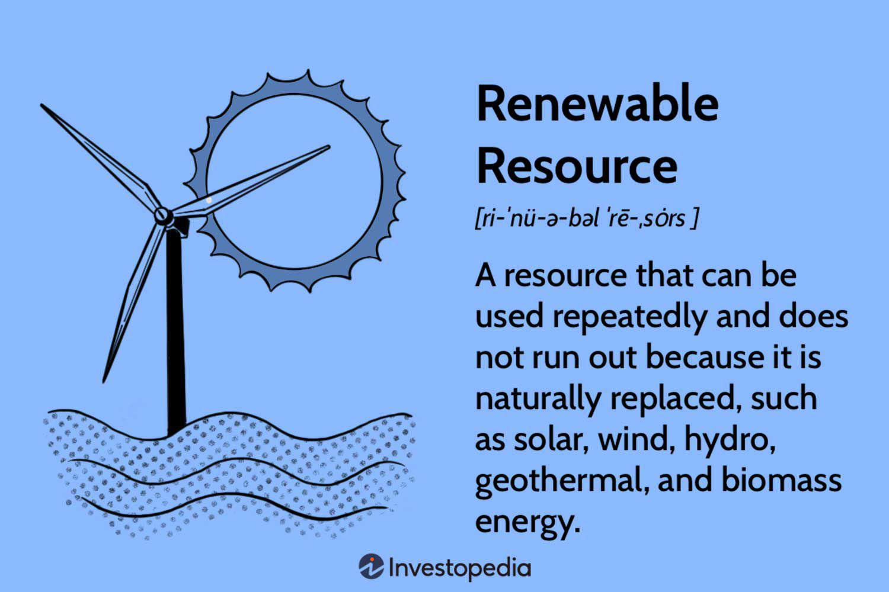

In recent years, the convergence of innovative trends has fundamentally transformed approaches to investing and energy production. Central to this transformation is the growing emphasis on sustainability and the adoption of renewable energy sources. These sources, including solar, wind, and hydroelectric power, offer promising alternatives to traditional fossil fuels, primarily due to their low environmental impact and the inexhaustible nature of their raw resources. At the same time, algorithmic trading has manifested as a formidable tool for investors, enabling more efficient and emotion-free trading in various sectors, including the rapidly expanding field of renewable energy. This article explores how sustainable energy sources and algorithmic trading can converge to deliver both financial and environmental benefits.

Algorithmic trading uses sophisticated computer algorithms to execute trades automatically, driven by data analysis and specific criteria. This method mitigates human emotional biases such as fear and greed, which frequently lead to irrational trading decisions. In the context of renewable energy stocks, algorithmic trading can offer strategic advantages. It allows traders to promptly respond to market signals that indicate opportunities in the green energy sector, enhancing trading precision and optimizing execution speed.



Understanding these domains is crucial for investors who wish to align their portfolios with green energy objectives. Utilizing advanced trading tools can maximize financial returns while endorsing sustainable practices. This approach offers a promising avenue for investors to simultaneously achieve profitability and contribute to global sustainability efforts. By focusing on renewable resources, sustainable investing, and algorithmic trading, we can explore the potential for a more environmentally friendly and lucrative future.

## Table of Contents

## Understanding Renewable Energy Sources

Renewable energy sources are central to efforts aimed at minimizing carbon emissions and addressing climate change. These resources, which naturally replenish, include solar power, wind power, hydroelectric power, geothermal energy, and biomass.

Each type of renewable energy has its own set of advantages and limitations. Solar and wind resources, for example, are abundant but subject to fluctuations due to weather conditions. Solar energy, harnessed using photovoltaic cells, converts sunlight directly into electricity. It offers a clean and sustainable power supply but is contingent on sunlight availability. Wind energy similarly depends on atmospheric conditions to drive turbines, generating electricity.

Technological advancements in renewable energy have significantly improved efficiency, making these sources increasingly viable and competitive with fossil fuels. For instance, the cost of solar panels has plummeted, partly due to technological improvements and economies of scale in production. Wind turbine technology has also evolved, with modern turbines capable of generating far more electricity than older models.

The escalating demand for renewable energy stems from environmental concerns and the strategic need to diversify energy sources. This diversification decreases reliance on fossil fuels, mitigates geopolitical risks associated with energy imports, and curbs greenhouse gas emissions. Additionally, renewable energy supports sustainable development goals by offering cleaner alternatives that do not deplete natural resources for future generations.

Examples such as solar photovoltaic cells and wind turbines have gained prominence in the energy landscape, pioneering the shift away from traditional energy sources. These technologies embody the move toward a sustainable energy future, aligning with global priorities to reduce adversity from climate change while catering to the growing energy needs of a burgeoning population.

## The Role of Algorithmic Trading in Sustainable Investing

Algorithmic trading, commonly known as bot trading, utilizes sophisticated computer algorithms to execute trades automatically based on predetermined criteria and data analysis. This technology is instrumental in reducing the impact of human emotions, such as fear and greed, which can often lead to irrational trading decisions. By relying on data-driven strategies, [algorithmic trading](/wiki/algorithmic-trading) enhances the accuracy and efficiency of trading operations, providing a more consistent approach to investment.

In the realm of renewable energy stocks, algorithmic trading offers a distinct strategic advantage. The ability to quickly process and react to market signals enables traders to identify opportunities within the sustainable energy sector swiftly. This is particularly beneficial given the rapid pace of change and innovation in this field. By leveraging algorithms, investors can adjust their holdings in response to fluctuating market conditions, ensuring that their investment strategies remain aligned with ongoing environmental and technological developments.

One of the key benefits of algorithmic trading is its capacity for automation. This not only optimizes the speed of execution – meaning trades can be completed in milliseconds – but also allows for continuous market surveillance. Such vigilance enables traders to capitalize on moments of market [volatility](/wiki/volatility-trading-strategies) that may arise due to unexpected news or changes in market dynamics. The constant monitoring ensures that investment actions are always in sync with the latest market data, ultimately improving the chances of favorable investment outcomes.

Furthermore, algorithmic trading serves as a valuable asset in promoting sustainable investing. It allows for the formulation of investment strategies that align closely with environmental objectives and the adoption of green technologies. For example, algorithms can be designed to prioritize investments in companies with strong sustainability practices or those involved in the development of renewable energy technologies. This alignment ensures that investor portfolios not only seek financial returns but also contribute positively to global sustainability goals.

To illustrate, consider the use of a simple moving average (SMA) crossover strategy, which is widely employed in algorithmic trading. This involves calculating two SMAs of a stock's price – a short-term SMA and a long-term SMA. When the short-term SMA crosses above the long-term SMA, it generates a buy signal, indicating potential upward [momentum](/wiki/momentum); conversely, when it crosses below, it signals a potential decline, prompting a sell action. Such strategies can be tailored to focus on renewable energy stocks, thus aligning trading activities with sustainable investment principles.

```python
import pandas as pd

# Assume df is a pandas DataFrame with columns 'Date' and 'Price'
def simple_moving_average_strategy(df, short_window=40, long_window=100):
    df['Short_SMA'] = df['Price'].rolling(window=short_window, min_periods=1, center=False).mean()
    df['Long_SMA'] = df['Price'].rolling(window=long_window, min_periods=1, center=False).mean()

    # Buying signals
    df['Signal'] = 0.0
    df['Signal'][short_window:] = np.where(df['Short_SMA'][short_window:] > df['Long_SMA'][short_window:], 1.0, 0.0)

    # Trading positions
    df['Position'] = df['Signal'].diff()

    return df

# Assuming df contains renewable energy stock data
sma_trading_signals = simple_moving_average_strategy(df)
```

This script, for example, can be adapted for analyzing price data of renewable energy stocks, assisting in automated decision-making aligned with sustainable investing principles. Through such methods, algorithmic trading not only seeks to enhance profitability but also encourages an ethical investment approach that considers the environmental impacts.

## Benefits of Combining Renewable Energy Investments and Algorithmic Trading

The integration of algorithmic trading with renewable energy investments presents a set of compelling advantages that can enhance both financial performance and sustainable outcomes. One primary benefit is the improved execution of trades. Algorithmic trading systems operate with a high degree of efficiency and speed, enabling investors to execute trades at the most opportune moments. By leveraging sophisticated algorithms, these systems can analyze market data in real-time and make swift decisions that optimize trade outcomes, which is crucial in the fast-paced world of stock trading.

Additionally, algorithmic trading minimizes emotional bias, a significant [factor](/wiki/factor-investing) in conventional trading that can lead to poor investment decisions. Emotions such as fear and greed often cloud judgment, resulting in suboptimal trading actions. By contrast, algorithms adhere strictly to predefined rules and historical data patterns, ensuring that trades are based on logical analysis rather than emotional response.

The renewable energy sector is currently experiencing significant momentum due to a global shift towards decarbonization and sustainable practices. This shift makes renewable energy stocks an attractive investment as countries worldwide implement policies and initiatives to reduce carbon emissions and promote clean energy solutions. Investors in this sector can not only anticipate financial returns but can also play a role in environmental stewardship by financing companies dedicated to sustainable practices and clean energy technologies.

Combining these two fields places investors in a strong position to quickly adapt to market dynamics and capitalize on lucrative opportunities within the green sector. Algorithmic trading strategies can be finely tuned to detect and respond to market signals that indicate emerging trends or shifts in stock prices, allowing investors to act decisively when conditions are favorable.

Incorporating sustainability-driven performance metrics into algorithmic trading strategies can further align investments with long-term environmental objectives. By integrating parameters such as carbon emissions data, renewable energy capacity addition, and adherence to sustainability standards, investors can ensure that their stock selections are in line with both financial and environmental goals. This strategic alignment supports sustainability by directing capital towards companies that are leading the charge in clean energy advancements.

Overall, the synergy between renewable energy investments and algorithmic trading holds the potential to foster a more sustainable and economically viable investment landscape. This dual approach not only aligns with global sustainability targets but also provides investors with the tools to achieve superior financial performance in a rapidly evolving market.

## Challenges and Risks

Despite the promising synergies between renewable energy investments and algorithmic trading, several challenges and risks require careful consideration.

Market volatility in the renewable energy sector is a significant concern, often driven by regulatory changes and technological disruptions. As governments adjust policies to meet climate goals or react to technological advancements, these shifts can cause sudden price fluctuations in energy stocks. To manage this volatility, investors must employ rigorous risk management strategies. This involves using advanced statistical models to anticipate potential market changes and prepare for them accordingly.

Algorithmic trading's dependence on complex algorithms introduces another layer of risk. Technical glitches or errors in trading algorithms can lead to substantial financial losses. This risk necessitates meticulous testing and validation of algorithms before they are deployed. A robust approach to mitigate these potential pitfalls includes continuous monitoring and real-time adjustments as market conditions evolve.

Moreover, staying informed about regulatory developments and compliance requirements is crucial for investors. The renewable energy sector is highly regulated, and non-compliance can result in legal penalties and damage to reputation. Regular updates from regulatory bodies and incorporating compliance checks in trading strategies can help in mitigating these risks.

A comprehensive risk management approach is essential in safeguarding investments. This includes thorough [backtesting](/wiki/backtesting) of trading strategies using historical data to evaluate their potential performance. Diversification, a timeless strategy in investment management, can also serve as a buffer against the inherent risks of investing in a dynamic sector. By spreading investments across different asset classes and regions, investors can reduce exposure to localized market disruptions.

In conclusion, while the integration of renewable energy investments with algorithmic trading presents numerous opportunities, it is accompanied by challenges that require meticulous planning and execution to ensure sustained success.

## Future Trends and Opportunities

As global emphasis on sustainability grows, renewable energy investments are projected to experience sustained growth, creating a fertile environment for innovative investment strategies. This trend is propelled by several key factors and developments:

Technical advancements are emerging both within the energy sector and in algorithmic trading technology. These innovations have the potential to significantly enhance trading strategies by improving accuracy and efficiency. For example, the integration of [machine learning](/wiki/machine-learning) algorithms in trading can analyze vast datasets from renewable energy markets, identifying patterns and trends that human traders might miss. Consequently, investors can make more informed decisions, optimizing their portfolios for better financial returns.

Government incentives play a critical role in bolstering renewable energy investments. Instruments such as green energy certificates, tax credits, and carbon credits are designed to encourage businesses and individuals to adopt sustainable practices. These incentives reduce the financial burden associated with transitioning to renewable energy sources, thereby making such investments more attractive. For instance, tax breaks can increase the return on investment for companies engaged in renewable energy projects, further enhancing their appeal to investors.

There is a growing trend among businesses worldwide to increase transparency in their sustainability practices. As companies disclose more information about their environmental impact and sustainability initiatives, investors gain access to a wealth of data that can be leveraged for informed investment decisions. This transparency, combined with advancements in data analytics, allows algorithmic trading systems to process and analyze data effectively. By incorporating sustainability metrics into trading algorithms, investors can align their portfolios with companies that demonstrate a strong commitment to environmental stewardship.

The evolution of these areas—energy technology, algorithmic trading, and corporate transparency—presents substantial opportunities for investors. By harnessing these opportunities, investors can achieve not only financial success but also contribute to a sustainable future. The ongoing convergence of these fields indicates a shift towards investment practices that prioritize both economic growth and environmental responsibility. As this intersection continues to develop, it is expected to become a cornerstone of modern investment strategies, aligning with global efforts to combat climate change and promote sustainable development.

## Conclusion

The synergy between sustainable energy investments and algorithmic trading presents a significant opportunity for achieving both environmental sustainability and economic success. Investors utilizing AI-driven trading strategies can make informed decisions that enhance profit margins while adhering to global sustainability objectives. These strategies enable the continuous analysis and adaptation to market conditions, leveraging vast datasets to predict trends and identify optimal investment opportunities.

Nonetheless, realizing the full potential of this approach necessitates diligent risk management and an awareness of technological and regulatory changes. Investors must be cognizant of the volatility inherent in the renewable energy sector, as well as the complex nature of algorithmic trading systems, to safeguard their portfolios against unforeseen losses. Regular updates to algorithms, alongside a robust compliance strategy, are vital for maintaining the integrity and performance of trading operations.

The growing emphasis on both financial returns and ethical considerations signifies a transformation in investor priorities, with an increasing number seeking investments that not only offer lucrative returns but also contribute positively to societal goals. This dual approach aligns investment practices with a commitment to sustainability, marking a shift towards more socially responsible investing.

In conclusion, the intersection of sustainable energy and algorithmic trading is set to play a crucial role in shaping modern investment practices. This convergence offers a pathway to achieving long-term financial prosperity while supporting global efforts to combat climate change, representing a progressive step towards a more sustainable economic future.

## References & Further Reading

[1]: Bergstra, J., Bardenet, R., Bengio, Y., & Kégl, B. (2011). ["Algorithms for Hyper-Parameter Optimization."](https://dl.acm.org/doi/10.5555/2986459.2986743) Advances in Neural Information Processing Systems 24.

[2]: ["Advances in Financial Machine Learning"](https://www.amazon.com/Advances-Financial-Machine-Learning-Marcos/dp/1119482089) by Marcos Lopez de Prado

[3]: ["Evidence-Based Technical Analysis: Applying the Scientific Method and Statistical Inference to Trading Signals"](https://www.amazon.com/Evidence-Based-Technical-Analysis-Scientific-Statistical/dp/0470008741) by David Aronson

[4]: ["Machine Learning for Algorithmic Trading"](https://github.com/PacktPublishing/Machine-Learning-for-Algorithmic-Trading-Second-Edition) by Stefan Jansen

[5]: ["Quantitative Trading: How to Build Your Own Algorithmic Trading Business"](https://books.google.com/books/about/Quantitative_Trading.html?id=j70yEAAAQBAJ) by Ernest P. Chan