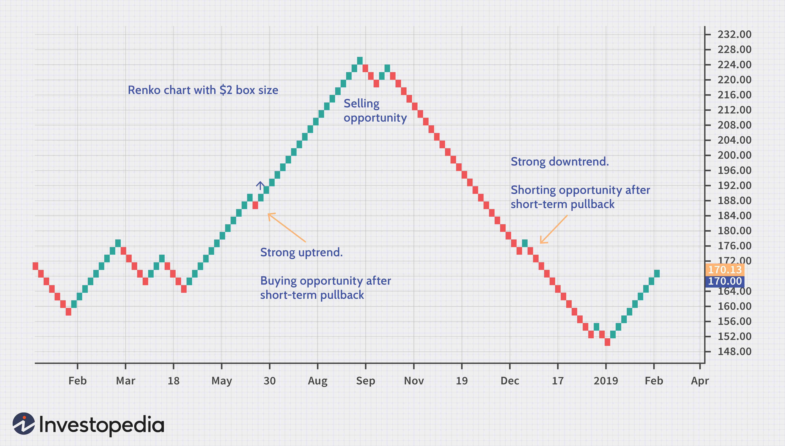

## Table of Contents

## What is a Renko chart?

A Renko chart is a type of chart used in trading that helps show price movements in a simple way. Instead of showing every small up and down movement like a regular chart, a Renko chart only adds a new block, or "brick," when the price moves by a certain amount. This makes it easier to see the overall trend without getting distracted by small changes.

These charts are named after the Japanese word "renga," which means brick. Traders use Renko charts to focus on the main direction of the market, making it easier to spot trends and make decisions. Because Renko charts ignore small price changes, they can help traders avoid false signals and stay focused on the bigger picture.

## How does a Renko chart differ from traditional candlestick or bar charts?

A Renko chart is different from traditional candlestick or bar charts because it focuses on price movement in a simpler way. While candlestick and bar charts show every small up and down movement in price, including the opening, closing, high, and low prices for each time period, Renko charts only add a new block, or "brick," when the price moves by a set amount. This means that Renko charts ignore smaller price changes and only show the bigger moves, making the chart look cleaner and easier to read.

This difference helps traders see the main trend more clearly. With candlestick or bar charts, it can be hard to spot the overall direction because of all the small ups and downs. But with a Renko chart, the trend is easier to see because the chart only shows the bigger price movements. This can help traders make better decisions by focusing on the main direction of the market and avoiding distractions from minor price fluctuations.

## What is the origin of the term 'Renko' and its significance?

The term 'Renko' comes from the Japanese word 'renga,' which means brick. This name fits well because a Renko chart looks like a series of bricks stacked on top of each other. Traders started using Renko charts to make it easier to see the big moves in the market without getting confused by small ups and downs.

The significance of the term 'Renko' lies in its simplicity and focus. By using bricks to show only the important price changes, Renko charts help traders see the main trend more clearly. This can lead to better trading decisions because the chart cuts out the noise from minor price movements, making it easier to spot the overall direction of the market.

## How are Renko bricks formed and what determines their size?

Renko bricks are formed based on how much the price moves. When the price goes up or down by a certain amount, a new brick is added to the chart. If the price keeps going in the same direction and reaches another set amount, another brick is added. But if the price changes direction and moves back by the same amount, the last brick is taken away and a new brick in the opposite direction is put in its place. This makes the chart look like a series of bricks, showing only the big moves in the market.

The size of the bricks is decided by the trader. They can choose how big they want each brick to be, depending on what they are trading and their own strategy. A smaller brick size will show more details and more bricks on the chart, while a bigger brick size will show fewer bricks and focus on the bigger price moves. The right brick size can help traders see the trends they are interested in and make better decisions.

## What are the key advantages of using Renko charts for trading?

Renko charts help traders see the main direction of the market more easily. They do this by only showing big price moves and ignoring small ups and downs. This makes the chart look cleaner and simpler, so traders can focus on the overall trend without getting distracted by little changes. When traders can see the big picture more clearly, they can make better decisions about when to buy or sell.

Another advantage of Renko charts is that they can help traders avoid false signals. Because Renko charts only add new bricks when the price moves by a set amount, they don't show every small price change. This means traders are less likely to be tricked by short-term price movements that don't really matter in the long run. By focusing on the bigger moves, Renko charts can help traders stay on track and follow the main trend more effectively.

## Can Renko charts help in identifying trends more effectively than other chart types?

Renko charts can help traders see trends more clearly than other types of charts. They do this by only showing big price moves and ignoring small ups and downs. This makes the chart look simple and clean, so it's easier to spot the main direction the market is going. When traders can see the big picture without getting distracted by little changes, they can make better decisions about when to buy or sell.

Other charts, like candlestick or bar charts, show every small price movement, which can make it hard to see the overall trend. With so many ups and downs, it's easy to get confused and miss the main direction of the market. Renko charts help solve this problem by only adding new bricks when the price moves by a set amount, making it easier to focus on the bigger moves and follow the trend more effectively.

## How do you set up a Renko chart in popular trading platforms?

Setting up a Renko chart in popular trading platforms like MetaTrader 4 or TradingView is pretty easy. In MetaTrader 4, you first need to download and install a custom indicator for Renko charts because MT4 doesn't have them built-in. Once you have the indicator, you can open a new chart, attach the Renko indicator to it, and then set the brick size to whatever you want. This will turn your regular chart into a Renko chart, showing you the big price moves without the small ups and downs.

In TradingView, setting up a Renko chart is even simpler because it's already built into the platform. All you have to do is open a new chart, click on the 'Chart Type' button at the bottom, and then choose 'Renko' from the list. After that, you can adjust the brick size to fit your trading strategy. This way, you can quickly start using Renko charts to see the main trends in the market and make better trading decisions.

## What are the common strategies used with Renko charts?

One common strategy when using Renko charts is trend following. Traders look for a series of bricks in the same direction to spot a trend. If they see a lot of green bricks going up, they might decide to buy because it looks like the price is going up. If they see a lot of red bricks going down, they might decide to sell because it looks like the price is going down. This strategy helps traders catch big moves in the market by following the main direction and ignoring small price changes.

Another strategy is using support and resistance levels. Traders watch where the price stops and turns around on the Renko chart. These levels can show where the price might stop again in the future. If the price hits a support level and starts making green bricks, traders might decide to buy, hoping the price will keep going up. If the price hits a resistance level and starts making red bricks, traders might decide to sell, expecting the price to go down. This way, traders can use Renko charts to find good spots to enter or exit trades based on where the price has moved before.

A third strategy is using Renko charts to confirm signals from other indicators. Traders might use tools like moving averages or the Relative Strength Index (RSI) along with Renko charts. If the other indicator gives a buy or sell signal, traders can look at the Renko chart to see if the price is moving in the same direction. If the Renko chart shows a series of bricks going up when the other indicator says to buy, it can give traders more confidence in their decision. This way, Renko charts can help traders double-check their trading signals and make better choices.

## How can Renko charts be used to manage risk in trading?

Renko charts can help traders manage risk by making it easier to see where the price might stop and turn around. These places are called support and resistance levels. When traders see that the price hits a support level and starts making green bricks, they know it might be a good time to buy. If the price hits a resistance level and starts making red bricks, it could be a good time to sell. By using these levels, traders can set their stop-loss orders at the right spots to limit how much money they might lose if the price goes the wrong way.

Another way Renko charts help with risk management is by making trends clearer. Because Renko charts only show big price moves and ignore the small ups and downs, traders can see the main direction of the market more easily. This helps them decide when to enter or exit a trade based on the overall trend. By following the trend and avoiding false signals from small price changes, traders can reduce their risk of making bad trades and losing money.

## What are the limitations and potential drawbacks of using Renko charts?

Renko charts can be tricky because they don't show time. Regular charts show how prices change over time, but Renko charts only show price moves. This means traders might miss important news or events that happen between the big price moves. Also, because Renko charts ignore small price changes, they might not show all the details that can be important for some trading strategies. Traders who need to see every little up and down might find Renko charts too simple.

Another problem with Renko charts is that they can be hard to set up right. The size of the bricks matters a lot, and choosing the wrong size can make the chart less useful. If the bricks are too big, traders might miss important trends. If they're too small, the chart might look too much like a regular chart and lose its main advantage of showing big moves clearly. Plus, not all trading platforms have Renko charts built-in, so traders might need to use special tools or indicators, which can be a hassle.

## How can Renko charts be combined with other technical indicators for enhanced analysis?

Renko charts can be used with other technical indicators to make trading decisions easier and more accurate. One way to do this is by using moving averages with Renko charts. A moving average is a line that shows the average price over a certain time. When traders see the Renko chart's bricks moving above the moving average, it might be a good time to buy because the price is going up. If the bricks are below the moving average, it could be a good time to sell because the price is going down. This way, the moving average helps traders see the trend more clearly and make better choices.

Another way to use Renko charts with other indicators is by looking at the Relative Strength Index (RSI). The RSI shows if a market is overbought or oversold. If the RSI is above 70, it means the market might be overbought, and if it's below 30, it might be oversold. Traders can use the RSI along with Renko charts to find good times to buy or sell. For example, if the Renko chart shows green bricks and the RSI is below 30, it could be a strong signal to buy. If the Renko chart shows red bricks and the RSI is above 70, it might be a good time to sell. By combining these tools, traders can get a better picture of the market and make smarter trades.

## What advanced techniques can experts use to optimize Renko chart trading strategies?

Experts can use something called 'brick size optimization' to make their Renko chart trading better. This means they try different sizes of bricks to see which one works best for their trading. A smaller brick size can show more details and help catch smaller trends, but it might also show more noise. A bigger brick size can help focus on the big moves and ignore the small ups and downs, but it might miss some smaller trends. By testing different sizes, experts can find the right balance that fits their trading style and helps them make better decisions.

Another advanced technique is using 'multiple time frame analysis' with Renko charts. This means looking at the same market with Renko charts of different brick sizes at the same time. For example, an expert might use a small brick size for a short-term view and a bigger brick size for a longer-term view. By comparing these different views, they can see both the small moves and the big trends. This can help them understand the market better and find good times to enter or exit trades. By combining these different time frames, experts can make more informed trading decisions and improve their chances of success.

## How do Renko Charts compare with Heikin Ashi Charts?

Renko charts and Heikin Ashi charts are both valuable tools for traders aiming to simplify price movement interpretations, although their methodologies and applications differ significantly. Understanding these distinctions and applications is crucial for traders to leverage the optimal chart type for their strategies.

Renko charts, characterized by their use of fixed brick sizes regardless of time, focus solely on price movement. This attribute makes them highly effective in filtering market noise and identifying clear trends and support/resistance levels. Each brick represents a specific price movement, and only when this predetermined price change occurs does a new brick form. This method of charting can prove advantageous for traders primarily interested in capturing trends and reducing the distraction of minor price fluctuations. The simplicity of trend identification allows traders to make more straightforward buy and sell decisions based exclusively on significant price movements.

In contrast, Heikin Ashi charts work by averaging price data to create a smoother appearance compared to traditional candlesticks. This averaging process is helpful for highlighting long-term trends and providing a clearer picture of market momentum. The Heikin Ashi technique calculates the average using the midpoint of the open and close prices over two consecutive periods, with formulas such as:

$$

\text{Heikin Ashi Close} = \frac{\text{Open}_{current} + \text{High}_{current} + \text{Low}_{current} + \text{Close}_{current}}{4} 
$$

$$

\text{Heikin Ashi Open} = \frac{\text{Open}_{previous} + \text{Close}_{previous}}{2} 
$$

Traders often favor Heikin Ashi charts for their ability to reveal the market's general direction and diminish the impact of price spikes and whipsaws.

When choosing between Renko and Heikin Ashi charts, several considerations come into play. Renko charts are preferred when the emphasis is purely on price action and minimizing noise, making them suitable for trend-following strategies in markets with substantial price movements. They excel in scenarios where price volatility needs to be isolated from temporal fluctuations. On the other hand, Heikin Ashi charts are suitable for analyzing long-term market trends and understanding overall market sentiment by smoothing short-term fluctuations. They are particularly beneficial for swing traders seeking to identify entry and exit points aligned with broader market trends.

Ultimately, the choice between Renko and Heikin Ashi charts depends on individual trading goals, market conditions, and personal preferences for noise reduction versus trend smoothing. By understanding the specific advantages and use cases of each chart type, traders can make informed decisions and potentially enhance their trading strategies.

## What are the Frequently Asked Questions?

### Addressing Common Questions Traders Might Have About Renko Charts

Renko charts, distinct from traditional chart types, can generate a number of queries for traders unfamiliar with their analytical approach. Here, we address some common questions regarding their use.

1. **What are Renko Charts and How Do They Work?**

   Renko charts are a type of chart that focuses solely on price movement, filtering out time and volume. Derived from the Japanese word "renga" meaning brick, Renko charts are composed of bricks which are placed at 45-degree angles to each other. The color of the bricks typically denotes the direction of the movement, with one color for rising prices and another for falling prices.

2. **How Do I Determine the Right Box Size for Renko Charts?**

   The box size, or brick size, is a crucial element in constructing a Renko chart, as it dictates when a new brick is added. Choosing an appropriate box size involves a balance between filtering out noise and capturing significant price movements. This can be done using fixed-value methods or Average True Range (ATR) methods:

   - **Fixed Box Size:** Select a static value based on historical price levels or personal preference. This approach works well in stable markets.

   - **ATR Method:** This dynamic method considers the market's volatility, offering a box size that adjusts with market conditions. The formula to determine box size via ATR is:
$$
   \text{Box Size} = \text{ATR} \times k

$$

   Where $k$ is a multiplier determined by the trader.

3. **How to Set Up Renko Charts on Trading Platforms?**

   Most trading platforms like TradingView and MetaTrader support Renko charts. Here’s a general guide to setting them up:

   - **On TradingView:**
     - Go to the chart of your chosen instrument.
     - Click on the “Chart Type” icon in the toolbar, then select "Renko."
     - Adjust the box size using the settings option, choosing between fixed and ATR methods.

   - **On MetaTrader:**
     - Install the Renko Chart plugin, if not available by default.
     - Open a standard chart of your desired financial instrument.
     - Apply the Renko Chart indicator and configure the brick size as per your strategy.

4. **What Are the Challenges Associated with Renko Charts in Trading?**

   Traders may encounter several challenges when using Renko charts:

   - **Setting the Right Box Size:** As discussed, choosing an appropriate box size can be difficult, especially in markets with fluctuating volatility.
   - **Missed Signals:** Due to their noise-filtering ability, Renko charts might miss smaller transient price movements.
   - **Lagging Information:** Renko charts might induce lag because bricks are only added after a complete price movement equal to the box size.

5. **Strategies to Overcome Challenges with Renko Charts?**

   - To counteract missed signals and lag, traders can use a combination of Renko charts with other technical indicators like Moving Averages or RSI to confirm trends.
   - Implement backtesting and paper trading to adjust box sizes dynamically based on changing market conditions.
   - Regularly evaluate the Renko settings and adapt to market dynamics, ensuring robustness in trading strategies.

By addressing these key aspects, traders can exploit the full potential of Renko charts, integrating them seamlessly into their trading strategies.

## References & Further Reading

[1]: Kirkpatrick II, Charles D., and Dahlquist, Julie R. ["Technical Analysis: The Complete Resource for Financial Market Technicians."](https://www.amazon.com/Technical-Analysis-Complete-Financial-Technicians/dp/0134137043) FT Press.

[2]: Pring, Martin J. ["Technical Analysis Explained: The Successful Investor's Guide to Spotting Investment Trends and Turning Points."](https://www.amazon.com/Technical-Analysis-Explained-Fifth-Successful/dp/0071825177) McGraw-Hill Education.

[3]: Murphy, John J. ["Technical Analysis of the Financial Markets: A Comprehensive Guide to Trading Methods and Applications."](https://www.amazon.com/Technical-Analysis-Financial-Markets-Comprehensive/dp/0735200661) New York Institute of Finance.

[4]: Nison, Steve. ["Japanese Candlestick Charting Techniques: A Contemporary Guide to the Ancient Investment Techniques of the Far East."](https://archive.org/details/japanesecandlest0000niso) 

[5]: Lopez de Prado, Marcos. ["Advances in Financial Machine Learning."](https://www.amazon.com/Advances-Financial-Machine-Learning-Marcos/dp/1119482089) John Wiley & Sons.

[6]: Chan, Ernest P. ["Quantitative Trading: How to Build Your Own Algorithmic Trading Business."](https://github.com/ftvision/quant_trading_echan_book) John Wiley & Sons.

[7]: Aronson, David R. ["Evidence-Based Technical Analysis: Applying the Scientific Method and Statistical Inference to Trading Signals."](https://www.amazon.com/Evidence-Based-Technical-Analysis-Scientific-Statistical/dp/0470008741) John Wiley & Sons.

[8]: Jansen, Stefan. ["Machine Learning for Algorithmic Trading."](https://github.com/stefan-jansen/machine-learning-for-trading) Packt Publishing.