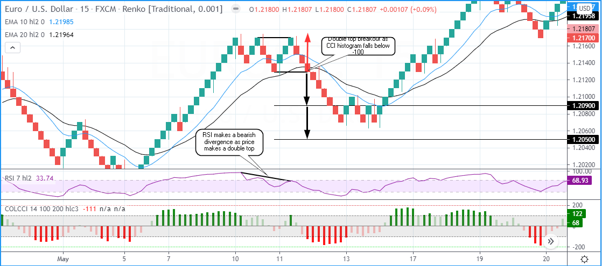

## Table of Contents

## What is a Renko chart and how does it differ from traditional candlestick charts?

A Renko chart is a type of chart used in trading that focuses on price movement rather than time. It uses bricks or blocks to represent changes in price. A new brick is added to the chart only when the price moves by a certain amount, called the "brick size." If the price doesn't move enough, no new brick is added. This makes Renko charts simpler to read because they filter out small price changes and show clearer trends.

Renko charts differ from traditional candlestick charts in a few key ways. Candlestick charts show both the opening and closing prices of a time period, as well as the highs and lows, making them more detailed. They are plotted on a time axis, so each candlestick represents a specific time frame, like a day or an hour. On the other hand, Renko charts ignore time and focus solely on price movement. This can help traders see trends more easily, but they miss out on the detailed price information that candlestick charts provide.

## How are Renko bricks formed and what determines their size?

Renko bricks are formed based on price movement. When the price moves up or down by a certain amount, called the brick size, a new brick is added to the chart. If the price goes up by the brick size, a new brick is added above the last brick, and it's usually colored differently, like green or white, to show an upward move. If the price goes down by the brick size, a new brick is added below the last brick, and it's usually colored differently too, like red or black, to show a downward move. If the price doesn't move enough to reach the brick size, no new brick is added, which means the chart stays the same until the price moves enough.

The size of the Renko bricks is determined by the trader before they start using the chart. The brick size can be set as a fixed amount, like $1 or $0.50, or as a percentage of the price, like 0.5%. A smaller brick size will create more bricks on the chart, showing more detail but also more noise. A larger brick size will create fewer bricks, showing clearer trends but less detail. Traders choose the brick size based on what they want to see in the chart and how they plan to use it for trading.

## What are the basic principles of the Renko trading strategy?

The basic idea of the Renko trading strategy is to follow the trend shown by the Renko bricks. When you see a series of bricks moving up, it means the price is going up, and you might want to buy. When you see a series of bricks moving down, it means the price is going down, and you might want to sell. The key is to wait for a clear trend to start before making a trade. This helps you avoid getting into trades when the price is just moving back and forth without a strong direction.

Another important part of the Renko trading strategy is to use support and resistance levels. These are price levels where the price often stops or changes direction. When the Renko bricks reach these levels, it can be a good time to enter or [exit](/wiki/exit-strategy) a trade. For example, if the price is going up and hits a resistance level, you might want to sell because the price might start going down. If the price is going down and hits a support level, you might want to buy because the price might start going up. By using these levels, you can make better trading decisions based on where the price is likely to go next.

## How can Renko charts help in identifying trends more effectively?

Renko charts help in identifying trends more effectively because they focus only on price movement and ignore small price changes. Each brick on a Renko chart represents a specific price move, like $1 or $0.50. This means that the chart only adds a new brick when the price moves enough to meet the brick size. This makes the chart look cleaner and easier to read, showing clear trends without the noise from small price changes that you might see on other types of charts.

Because Renko charts don't use time, they show trends based purely on price movement. This can help traders see the direction of the market more clearly. For example, if you see a series of green bricks moving up, it's a clear sign of an uptrend. If you see a series of red bricks moving down, it's a clear sign of a downtrend. This simplicity makes it easier for traders to decide when to buy or sell, based on the direction of the trend they see on the chart.

## What are the key advantages of using Renko charts for trading?

Renko charts make it easier for traders to see trends because they focus on price movement and ignore small price changes. Each brick on a Renko chart shows a specific price move, like $1 or $0.50. This means the chart only adds a new brick when the price moves enough to meet the brick size. This makes the chart look cleaner and simpler to read, showing clear trends without the noise from small price changes that you might see on other types of charts.

Because Renko charts don't use time, they show trends based purely on price movement. This can help traders see the direction of the market more clearly. For example, if you see a series of green bricks moving up, it's a clear sign of an uptrend. If you see a series of red bricks moving down, it's a clear sign of a downtrend. This simplicity makes it easier for traders to decide when to buy or sell, based on the direction of the trend they see on the chart.

## What are the potential drawbacks or limitations of the Renko trading strategy?

One potential drawback of using Renko charts for trading is that they don't show all the price information that other charts do. Renko charts only add new bricks when the price moves by a certain amount, so you might miss out on important price changes that are smaller than the brick size. This can make it harder to see all the details of what's happening in the market. For example, if the price goes up and down a little bit but not enough to make a new brick, you won't see those changes on a Renko chart.

Another limitation is that Renko charts can sometimes give false signals about the trend. Because they only show big price moves, they might make it look like the price is going in one direction when it's actually just moving back and forth. This can lead traders to make trades based on a trend that isn't really there. Also, because Renko charts don't use time, they might not be as good for traders who need to know exactly when certain price changes happened.

## How do you set up a basic Renko trading system?

To set up a basic Renko trading system, you first need to choose the right platform or software that supports Renko charts. Many trading platforms, like MetaTrader 4 or 5, have Renko chart options you can use. Once you have the platform, decide on the brick size for your Renko chart. This can be a fixed amount, like $1, or a percentage of the price, like 0.5%. The brick size will affect how many bricks you see on the chart and how clear the trends are. A smaller brick size will show more detail but might also show more noise, while a larger brick size will show clearer trends but less detail.

After setting up your Renko chart, you need to decide on your trading rules. A simple rule could be to buy when you see a series of green bricks moving up, showing an uptrend, and to sell when you see a series of red bricks moving down, showing a downtrend. You can also use support and resistance levels to help with your trades. These are price levels where the price often stops or changes direction. When the Renko bricks reach these levels, it can be a good time to enter or exit a trade. For example, if the price is going up and hits a resistance level, you might want to sell because the price might start going down. If the price is going down and hits a support level, you might want to buy because the price might start going up.

## What technical indicators work best with Renko charts?

When using Renko charts, some of the best technical indicators to use are moving averages and the Relative Strength Index (RSI). Moving averages help you see the overall trend more clearly. You can use a simple moving average, which is the average price over a certain number of bricks, or an exponential moving average, which gives more weight to recent prices. When the price is above the moving average, it might be a good time to buy because it shows an uptrend. When the price is below the moving average, it might be a good time to sell because it shows a downtrend.

The RSI is another useful indicator that measures how fast the price is moving and whether it's overbought or oversold. On a Renko chart, the RSI can help you see if the price has moved too far in one direction and might be ready to change direction. If the RSI is above 70, it means the price might be overbought, and it could be a good time to sell. If the RSI is below 30, it means the price might be oversold, and it could be a good time to buy. By using these indicators with Renko charts, you can make better trading decisions based on the trend and the strength of the price movement.

## How can a trader manage risk when using the Renko trading strategy?

Managing risk when using the Renko trading strategy involves setting clear rules for when to enter and exit trades. One way to do this is by using stop-loss orders. A stop-loss order is like a safety net that automatically sells your trade if the price goes down too much. This helps you limit how much money you could lose on a single trade. For example, if you buy when you see an uptrend on the Renko chart, you can set a stop-loss order just below the last green brick. This way, if the price suddenly drops, your trade will close before you lose too much money.

Another way to manage risk is by deciding how much money you're willing to risk on each trade. This is called position sizing. You can choose to risk only a small part of your total money, like 1% or 2%, on each trade. This means that even if you lose on a few trades, you won't lose all your money. It's also important to keep an eye on your trades and be ready to adjust your stop-loss orders if the price moves in your favor. By moving the stop-loss up as the price goes up, you can lock in some of your profits and reduce the risk of losing them if the price suddenly drops.

## What are some advanced Renko trading techniques for experienced traders?

Experienced traders can use advanced Renko trading techniques like combining Renko charts with other chart types, such as candlestick or Heikin-Ashi charts. By looking at the same price data in different ways, traders can get a better understanding of the market. For example, they might use a Renko chart to see the overall trend and a candlestick chart to see more detailed price movements. This can help them make more informed trading decisions. Another technique is to use multiple time frames. Traders can look at Renko charts with different brick sizes to see both short-term and long-term trends. This can help them find the best times to enter and exit trades.

Another advanced technique is to use more complex indicators with Renko charts. For example, traders might use the Moving Average Convergence Divergence (MACD) indicator to see when the trend might change. When the MACD line crosses above the signal line, it can be a sign to buy, and when it crosses below, it can be a sign to sell. Traders can also use the Average Directional Index (ADX) to measure the strength of the trend. If the ADX is high, it means the trend is strong, and it might be a good time to trade in the direction of the trend. By combining these indicators with Renko charts, experienced traders can get more detailed information about the market and make better trading decisions.

## How does the choice of Renko brick size impact trading performance?

The choice of Renko brick size can really change how well you do in trading. If you pick a small brick size, like $0.10, you'll see more bricks on your chart. This can help you see more details about what the price is doing, but it can also make the chart look busy and harder to read. A small brick size might make you trade more often because you'll see more changes in the price, but this can also lead to more losses if the market is just moving back and forth without a clear trend.

On the other hand, if you choose a bigger brick size, like $1, you'll see fewer bricks on your chart. This makes the chart look cleaner and easier to read, showing you the big moves in the price more clearly. A bigger brick size can help you focus on the main trend and avoid getting distracted by small price changes. But, it might also mean you miss out on some trading chances because you won't see as many price moves. So, finding the right brick size is important for seeing the market clearly and making good trading choices.

## Can you provide a case study or example of a successful trade using the Renko strategy?

Let's look at a simple example of how someone might use a Renko chart to make a successful trade. Imagine a trader named Sarah who uses a Renko chart with a brick size of $0.50 to trade a stock. One day, she notices that the chart starts showing a series of green bricks moving up, which means the price is going up. Sarah decides to buy the stock when she sees the fourth green brick because she thinks the uptrend is strong enough. She sets a stop-loss order just below the last green brick to limit her risk.

A few days later, the price keeps going up, and more green bricks are added to the chart. Sarah keeps an eye on her trade and moves her stop-loss order up as the price rises, locking in some of her profits. Eventually, the price hits a resistance level, and the chart starts showing red bricks moving down. Sarah decides to sell her stock when she sees the second red brick, making a nice profit. By using the Renko chart to follow the trend and manage her risk, Sarah was able to make a successful trade.

## References & Further Reading

[1]: Fuertes, A.-M., & Olmo, J. (2013). ["The Role of Time in Financial Markets: A Timing-of-Arrival Approach."](https://www.sciencedirect.com/science/article/abs/pii/S2173578619301337) Journal of Financial Econometrics, 11(4), 651-678. 

[2]: Karsenti, M. "Time-Independent Investment Strategies Using Renko and Point & Figure Charts." In "Technical Analysis of the Financial Markets," by John J. Murphy, 2016.

[3]: Alexander, C. (2008). ["Market Risk Analysis, Volume IV: Value at Risk Models."](https://www.wiley.com/en-us/Market+Risk+Analysis%2C+Volume+IV%2C+Value+at+Risk+Models-p-9780470997888) John Wiley & Sons.

[4]: Bulkowski, T. J. (2008). ["Encyclopedia of Chart Patterns."](https://books.google.com/books/about/Encyclopedia_of_Chart_Patterns.html?id=tIwlEAAAQBAJ) 2nd Edition, Wiley.

[5]: Jankovec, M., & Zadravec, I. (2016). ["Comparison of the Efficiency of Traditional and Algorithmic Trading Strategies in U.S. Stock Markets."](https://onlinelibrary.wiley.com/doi/10.1002/pip.3106) Croatian Economic Survey, 18(1), 57-83.