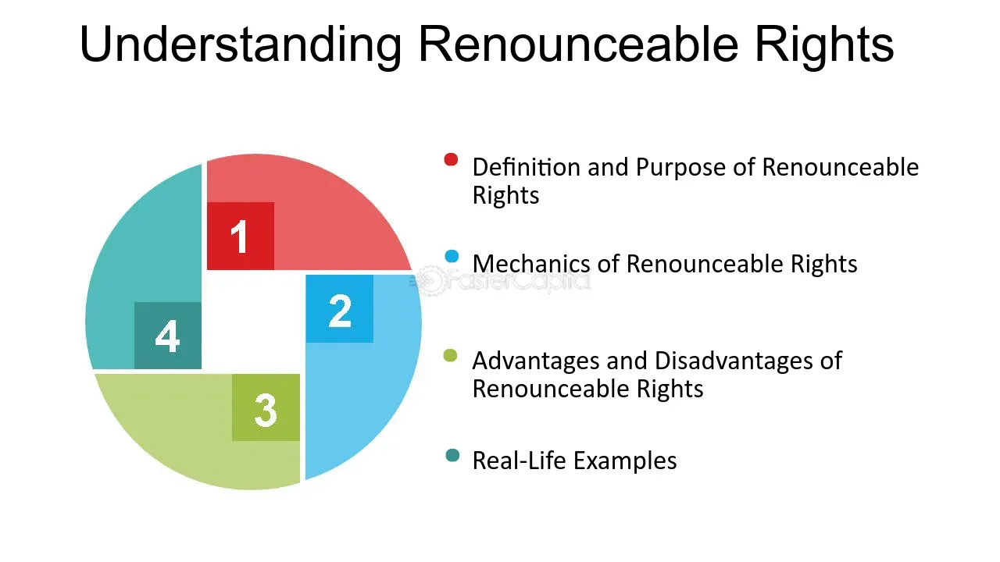

## Table of Contents

## What are renounceable rights?

Renounceable rights are rights that a person can choose to give up or let go of. These rights are not fixed and can be abandoned if the person decides they no longer want them. For example, someone might have the right to inherit money from a family member, but they can choose to renounce that right and not accept the inheritance.

These rights are different from inalienable rights, which are rights that cannot be taken away or given up. Inalienable rights are considered essential and fundamental, like the right to life or freedom of speech. Renounceable rights, on the other hand, are more flexible and depend on the individual's choice to keep or give them up.

## How do renounceable rights differ from non-renounceable rights?

Renounceable rights are rights that a person can choose to give up. If someone has a renounceable right, they can decide they don't want it anymore and let it go. For example, if someone is supposed to get money from a will, they can choose not to take it. This kind of right depends on what the person wants to do with it.

Non-renounceable rights, on the other hand, are rights that a person cannot give up. These rights are very important and everyone is supposed to have them no matter what. Things like the right to live or the right to speak freely are non-renounceable rights. No one can take these rights away from you, and you can't choose to give them up either.

## Can you give examples of renounceable rights?

One example of a renounceable right is the right to inherit money or property. If someone's family member leaves them something in their will, that person can choose to say no to the inheritance. They might do this because they don't want to deal with the responsibilities that come with it or for other personal reasons. This right is renounceable because it's up to the person to decide whether they want to accept it or not.

Another example is the right to a seat on a company's board of directors. Sometimes, shareholders can get a right to take a seat on the board, but they can choose to give up that right if they don't want the job. They might not have the time or interest to serve on the board, so they can renounce their right to the position. This shows how some rights depend on what a person wants to do with them.

## What is the legal process for renouncing a right?

The legal process for renouncing a right can vary depending on the type of right and where you live. Generally, to renounce a right, you need to tell the right people or organizations that you don't want the right anymore. This can be done by writing a letter or filling out a form. It's important to follow the rules about how to do this, so the renouncement is official and legal.

For example, if you want to renounce your right to an inheritance, you might need to send a written statement to the executor of the will or the court handling the estate. This statement should clearly say that you are giving up your right to the inheritance. You may also need to sign it in front of a witness or a notary public to make it official. It's a good idea to talk to a lawyer to make sure you are doing everything the right way and to understand any consequences of giving up the right.

## In what situations might someone choose to renounce a right?

Someone might choose to renounce a right if they feel it's too much responsibility. For example, if someone inherits a big house or a business, they might not want to deal with all the work and costs that come with it. They might decide it's easier to give up their right to the inheritance and let someone else handle it. This way, they don't have to worry about managing something they don't want.

Another reason someone might renounce a right is if they want to help others. If a person has the right to a seat on a company's board of directors but knows someone else who would be better at the job, they might give up their right. By doing this, they let someone more qualified take the position, which can be good for the company and the community. It's a way of putting others' needs before their own.

## What are the potential consequences of renouncing a right?

When someone gives up a right, they might lose out on something good. For example, if someone renounces their right to an inheritance, they won't get the money or property that was coming to them. This can mean they miss out on a big financial help. They might also regret their decision later if they find themselves needing what they gave up. It's important to think carefully before deciding to let go of a right because once it's gone, it's usually hard to get back.

There can also be other effects on other people. If someone renounces their right to a seat on a board of directors, it might change how the company is run. Other people who were counting on that person to be on the board might be affected too. Sometimes, giving up a right can change relationships with family or friends, especially if the right involves things like inheritance or shared property. It's good to think about how the decision might impact others before making a choice.

## How do different jurisdictions view renounceable rights?

Different places around the world have different rules about renounceable rights. In some countries, the laws make it easy for someone to give up a right if they want to. For example, if someone wants to renounce their right to an inheritance, the process might be simple and straightforward. They might just need to write a letter or fill out a form to make it official. Other places might have stricter rules and need more steps, like going to court or talking to a lawyer, to make sure the person really wants to give up their right.

Some countries might not allow certain rights to be given up at all. For example, in some places, the right to inherit cannot be renounced because the law wants to make sure everyone gets what they are supposed to get. This can be different from country to country or even from state to state within a country. It's important for someone thinking about giving up a right to check the local laws and maybe talk to a lawyer to understand what they can and cannot do in their area.

## Are there any rights that are universally considered renounceable?

There are no rights that are universally considered renounceable across all countries and cultures. What one place might see as a right someone can give up, another place might not allow to be given up. For example, in some countries, people can choose to not accept an inheritance, but in other places, the law might not let them do that. This shows how different places have different ideas about what rights people can give up.

However, there are some rights that many places agree can be renounced, like the right to a seat on a company's board of directors. If someone gets this right because they own part of the company, they can often choose to give it up if they don't want to serve on the board. Still, even with rights like these, the rules can be different depending on where you are. So, it's important to know the local laws before deciding to give up any right.

## How does the concept of renounceable rights relate to personal autonomy?

The concept of renounceable rights is closely tied to personal autonomy because it gives people the freedom to make choices about their own lives. Personal autonomy means being able to decide for yourself what you want to do. When someone has a renounceable right, like the right to an inheritance, they can choose to keep it or give it up. This shows that they have control over their own decisions and can shape their life the way they want to. It's all about being able to say, "This is what I want," and having the power to make it happen.

However, renouncing a right is a big decision and comes with responsibilities. When someone decides to give up a right, they need to think about how it might affect them and others. For example, if someone gives up their right to an inheritance, they might lose out on money or property that could have helped them. They also need to make sure they follow the right steps to make their decision official, so it's recognized by the law. This shows that personal autonomy is not just about making choices, but also about understanding the consequences of those choices and taking action to make them real.

## What philosophical arguments support or oppose the concept of renounceable rights?

Some philosophers support the idea of renounceable rights because they believe it shows respect for personal freedom. They think that people should be able to choose what they want to do with their rights. For example, if someone doesn't want to inherit money or a house, they should be able to say no. This view sees renounceable rights as a way to let people live their lives the way they want, without being forced to take on things they don't want. It's about giving people control over their own lives and respecting their choices.

On the other hand, some philosophers argue against renounceable rights because they worry about the consequences. They think that some rights are important for everyone's well-being and should not be given up. For example, if someone gives up their right to an inheritance, they might miss out on something they need later. These philosophers believe that some rights should be protected to make sure people don't make choices they might regret. They want to balance personal freedom with the need to protect people from making bad decisions.

## How have historical cases influenced the understanding of renounceable rights?

Historical cases have helped people understand what renounceable rights are and how they work. One important case is the story of King Edward VIII of England, who in 1936 decided to give up his right to be king. He wanted to marry Wallis Simpson, a woman who had been divorced, which was not allowed for someone in his position at the time. By choosing to renounce his right to the throne, Edward showed that even big rights, like being a king, can be given up if someone wants to do something else more. This case made people think about how personal choices can be more important than keeping a right.

Another example is the case of wills and inheritances. Over time, there have been many cases where people decided not to accept money or property left to them in a will. These cases have shown that the right to inherit can be given up if someone doesn't want it. For example, someone might not want to deal with the responsibilities that come with owning a big house, so they choose to renounce their right to it. These historical cases have helped shape the laws and rules about renounceable rights, showing that they depend on what people want to do with them.

## What are the current debates or emerging issues surrounding renounceable rights?

One big debate about renounceable rights today is about inheritance. Some people think that everyone should get what their family leaves them, no matter what. They worry that if people can give up their right to inherit, it might cause family problems or leave someone without money they need. Others believe that people should be free to choose if they want to accept an inheritance. They say that if someone doesn't want the responsibility of managing a big house or a business, they should be able to say no. This debate shows how different ideas about personal freedom and responsibility can clash.

Another emerging issue is about rights in the digital world. As more of our lives happen online, people are talking about whether digital rights, like the right to control your own data, should be renounceable. Some think that people should be able to give up these rights if they want to, maybe in exchange for using a service for free. Others argue that these rights are too important to give up because they protect our privacy and security. This is a new area where the idea of renounceable rights is being tested, and it's not clear yet how it will all turn out.

## What are the key aspects of understanding financial rights and shareholder rights?

Financial rights refer to the entitlements that individuals or entities have in relation to financial instruments or assets. These rights enable stakeholders to engage in transactions, derive income, and enforce claims over financial assets. Shareholder rights represent a crucial subset of financial rights, specific to individuals who own shares in a corporation. Shareholders are entitled to certain privileges that help maintain their stake and influence within the company, thereby safeguarding their investments.

Key shareholder rights encompass the following:

1. **Voting Rights**: Shareholders typically possess the right to vote on critical corporate matters, such as electing directors, approving mergers, or making amendments to corporate by-laws. Voting may occur in person during annual general meetings or through proxy voting mechanisms. The ability to vote can influence corporate governance and steer business directions. The formula for calculating the proportion of votes a shareholder holds is generally:
$$
   \text{Voting Power} = \frac{\text{Number of shares owned}}{\text{Total number of shares outstanding}}

$$

2. **Dividend Rights**: Shareholders are entitled to a portion of the corporation's profits through dividends, which can be issued in cash or additional shares. The decision to distribute dividends is typically at the discretion of the company’s board of directors. Consistent dividend payments can indicate financial health and stability to investors.

3. **Rights to Information**: Transparency is a fundamental expectation for shareholders, who have the right to be informed about key company operations and financial performance. This includes access to annual reports, financial statements, and notices of shareholder meetings. This transparency fosters informed decision-making and allows shareholders to assess company strategies and their potential investment outcomes.

Understanding these rights is essential for shareholders to exercise control and protect their investments effectively. By utilizing voting power and staying informed, shareholders can contribute to corporate governance and influence corporate strategies, thereby aligning them with their personal investment objectives. Furthermore, consistent monitoring of these rights can help shareholders manage risks associated with corporate actions or market fluctuations, ensuring their investment interests are prioritized.

In essence, navigating financial and shareholder rights involves leveraging these entitlements to optimize returns and mitigate risks. This requires a proactive approach, including continuous education on evolving financial landscapes and regulations that might impact these rights.

## References & Further Reading

[1]: Hillier, D., Ross, S., Westerfield, R., Jaffe, J., & Jordan, B. [*Corporate Finance*](https://books.google.com/books/about/Corporate_Finance_4e.html?id=MMovEAAAQBAJ) (2016). McGraw-Hill Education.

[2]: Lhabitant, F.-S. (2004). [*Hedge Funds: Quantitative Insights*](https://www.wiley.com/en-us/Hedge+Funds%3A+Quantitative+Insights-p-9780470687772). Wiley.

[3]: Harris, L. (2003). [*Trading and Exchanges: Market Microstructure for Practitioners*](https://www.amazon.com/Trading-Exchanges-Market-Microstructure-Practitioners/dp/0195144708). Oxford University Press.

[4]: Hasbrouck, J. (2007). [*Empirical Market Microstructure: The Institutions, Economics, and Econometrics of Securities Trading*](https://academic.oup.com/book/52241). Oxford University Press.

[5]: Aldridge, I. (2013). [*High-Frequency Trading: A Practical Guide to Algorithmic Strategies and Trading Systems*](https://www.amazon.com/High-Frequency-Trading-Practical-Algorithmic-Strategies/dp/1118343506). Wiley.