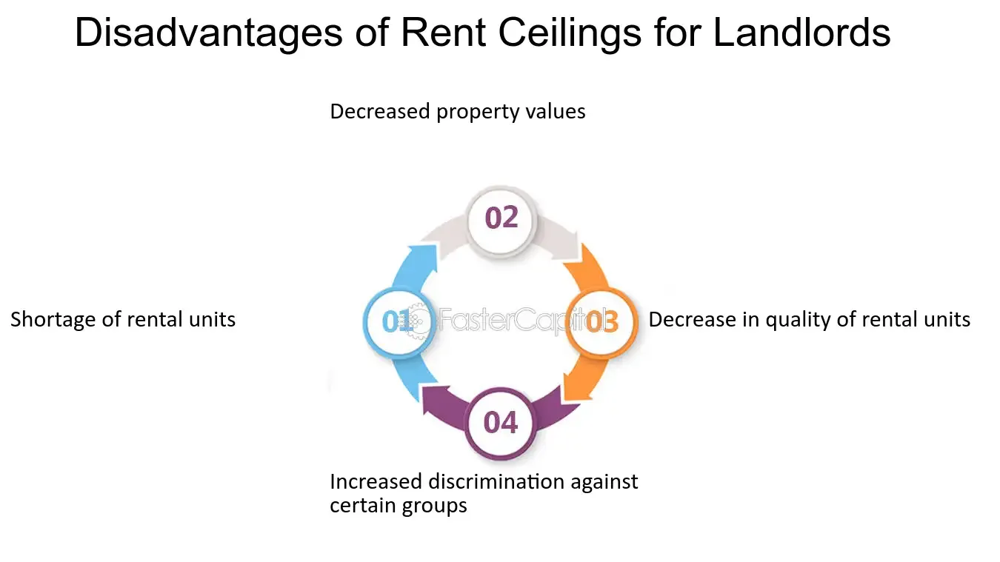

## Table of Contents

## What is a rent ceiling?

A rent ceiling is a limit set by the government on how much landlords can charge for rent. It is meant to make housing more affordable for people who might not be able to pay high rents. When a rent ceiling is in place, landlords cannot raise the rent above the set limit, even if they think they could get more money from tenants.

However, rent ceilings can also have some problems. Sometimes, they can make it hard for landlords to cover their costs, like repairs and maintenance. This might lead to fewer people wanting to be landlords, which can make it harder for people to find a place to rent. Also, if the rent is too low, more people might want to live in an area than there are homes available, causing a shortage of housing.

## How does a rent ceiling work?

A rent ceiling is like a rule that says landlords can't charge more than a certain amount for rent. The government decides this amount to help keep rent affordable for everyone. So, if the rent ceiling is set at $1,000 a month, landlords can't ask tenants to pay more than that, even if they think their apartment is worth more.

This rule can help people who don't have a lot of money to pay for a place to live. But it can also cause some problems. If landlords can't charge enough rent to cover their costs, like fixing things in the apartment, they might not want to rent out their places anymore. This can make it harder for people to find a place to live because there are fewer apartments available. Also, if a lot of people want to live somewhere because the rent is low, there might not be enough homes for everyone who wants one.

## What are the main goals of implementing a rent ceiling?

The main goal of a rent ceiling is to make sure that everyone can afford a place to live. When the government sets a limit on how much landlords can charge for rent, it helps people who don't have a lot of money. This way, they can still find a home without spending too much of their income on rent.

Another goal is to stop rents from going up too fast. Sometimes, in places where a lot of people want to live, landlords might keep raising the rent. A rent ceiling can help keep prices stable so that people don't suddenly have to pay a lot more just to stay in their homes.

## Can you explain the difference between a rent ceiling and rent control?

A rent ceiling and rent control are similar because they both try to keep rent affordable, but they work a bit differently. A rent ceiling is like a limit on how much landlords can charge for rent. It's a simple rule that says, "You can't charge more than this amount." This helps make sure that everyone can find a place to live without paying too much.

Rent control, on the other hand, is a bit more complicated. It's not just about setting a maximum rent. Rent control can include rules about how much and how often landlords can raise the rent. For example, it might say that rent can only go up by a certain percentage each year. This helps keep rent stable over time, so people don't get surprised by big increases.

Both rent ceilings and rent control aim to help people afford housing, but rent control can offer more detailed rules to protect tenants over the long term.

## What are the immediate advantages of a rent ceiling for tenants?

The main advantage of a rent ceiling for tenants is that it keeps rent affordable. When the government sets a limit on how much landlords can charge, tenants don't have to worry about paying too much for their homes. This means more people can find a place to live without spending too much of their money on rent. It's especially helpful for people who don't have a lot of money, because it makes sure they can still afford a place to live.

Another advantage is that a rent ceiling can stop rents from going up too quickly. In some places, landlords might keep raising the rent because a lot of people want to live there. A rent ceiling helps keep the rent stable, so tenants don't get surprised by big increases. This gives tenants more peace of mind because they know their rent won't suddenly go up and they can plan their budget better.

## How might a rent ceiling impact the housing market?

A rent ceiling can help make housing more affordable for people. When the government sets a limit on how much landlords can charge, it means that more people can find a place to live without spending too much of their money. This is good for people who don't have a lot of money because they can still afford a home. It also stops rents from going up too fast, which can help people plan their budgets better and feel more secure about where they live.

However, a rent ceiling can also cause some problems in the housing market. If landlords can't charge enough rent to cover their costs, like fixing things in the apartment, they might not want to rent out their places anymore. This can lead to fewer homes available for people to rent, making it harder for them to find a place to live. Also, if the rent is too low, more people might want to live in an area than there are homes available, causing a shortage of housing. This can make it tough for people to find a place to live, even if the rent is affordable.

## What are the potential long-term disadvantages of rent ceilings for landlords?

Rent ceilings can make it hard for landlords to keep up their properties over time. If the rent they can charge is too low, landlords might not have enough money to pay for repairs and maintenance. This can lead to their buildings getting old and worn out because they can't afford to fix them up. Over time, this might make their properties less valuable, and they could lose money if they decide to sell.

Another problem is that landlords might not want to keep renting out their properties if the rent ceiling is too low. If they can't make enough money from rent to cover their costs, they might decide to use their buildings for something else or sell them. This can lead to fewer places for people to rent, making the housing market tighter. In the long run, this could mean less choice for renters and possibly higher prices in other parts of the market where there are no rent ceilings.

## Can rent ceilings lead to a decrease in housing quality? If so, how?

Yes, rent ceilings can lead to a decrease in housing quality. When landlords can't charge enough rent to cover their costs, they might not have the money to fix up their buildings. Things like broken windows, leaky roofs, or old appliances might not get fixed because the landlord can't afford it. Over time, this means the apartments can get run down and not as nice to live in.

Also, if the rent is too low because of the ceiling, landlords might not want to spend money on making their places better. They might think, "Why should I spend money on new paint or better heating if I can't charge more rent?" So, they might just do the bare minimum to keep the place livable, but not really nice. This can make the overall quality of housing in the area go down.

## Are there any economic theories that support or oppose rent ceilings?

Some economists support rent ceilings because they believe it helps people who don't have a lot of money. They think that without a rent ceiling, landlords might charge too much, and some people might not be able to afford a place to live. By setting a limit on rent, more people can find a home without spending too much of their money. This idea is based on the belief that everyone should have access to affordable housing, and rent ceilings can help make that happen.

On the other hand, many economists oppose rent ceilings because they think it can cause problems in the housing market. They argue that when landlords can't charge enough rent to cover their costs, they might not want to rent out their places anymore. This can lead to fewer homes available for people to rent, causing a shortage. Also, if landlords can't make enough money, they might not fix up their buildings, leading to lower quality housing. These economists believe that rent ceilings can make the housing market worse in the long run.

## What are some real-world examples of cities or countries that have implemented rent ceilings?

In New York City, there's a system called rent control and rent stabilization that acts like a rent ceiling. It helps keep rent affordable for a lot of people. The rules say that landlords can't raise the rent too much, and some apartments can only go up by a small amount each year. This helps people who live there know their rent won't suddenly get too high. But it also means that landlords sometimes don't want to fix up their buildings because they can't charge more rent.

In Berlin, Germany, they tried a rent ceiling a few years ago. The government said that landlords couldn't charge more than a certain amount for rent. They wanted to make sure everyone could afford a place to live. But it didn't work out as planned. Some landlords stopped renting out their places, and it was hard to find an apartment. In the end, the courts said the rent ceiling wasn't allowed, and they had to stop it.

## How do rent ceilings affect new construction and housing supply?

Rent ceilings can make it hard for new buildings to be built. When the government says landlords can't charge more than a certain amount for rent, it means that people who want to build new apartments might not make enough money to cover their costs. Building a new building is expensive, and if they can't charge enough rent to pay for it, they might decide not to build at all. This can lead to fewer new apartments being built, which means there are fewer places for people to live.

Because fewer new buildings are being built, the overall number of homes available can go down. When there are fewer homes and more people wanting to live in them, it can cause a shortage of housing. This can make it really hard for people to find a place to live, even if the rent is affordable because of the rent ceiling. So, while rent ceilings try to make rent cheaper, they can also make it harder to find a place to live because there aren't enough homes.

## What alternative policies to rent ceilings have been proposed or implemented to address housing affordability?

One alternative to rent ceilings is giving people money to help them pay for rent. This is called a housing voucher or rental assistance. Instead of telling landlords how much they can charge, the government gives money directly to people who need it. This way, people can afford to live in nicer places without the government having to control the rent. It also means landlords can still charge enough to cover their costs, so they might be more willing to keep renting out their places.

Another idea is to build more homes. If there are more places for people to live, the rent might go down because there's more competition among landlords. The government can help by giving money or loans to people who want to build new apartments. This can help increase the number of homes available, making it easier for people to find a place to live. It also means that landlords might not be able to charge as much because there are more options for renters.

Some places have tried to make rules about how much and how often landlords can raise the rent. This is called rent control, but it's different from a rent ceiling because it's more about keeping rent stable over time. For example, a rule might say that rent can only go up by a certain percentage each year. This helps people know what to expect and plan their budgets better, without stopping landlords from charging enough to cover their costs.

## References & Further Reading

[1]: Arnott, R., & Igarashi, M. (2000). "Rent Control, Mismatch Costs, and Search Efficiency." Regional Science and Urban Economics, 30(2), 249-288.

[2]: Glaeser, E. L., & Luttmer, E. F. P. (2003). "The Misallocation of Housing under Rent Control." American Economic Review, 93(4), 1027-1046.

[3]: Algert, S., & Leung, M. (2021). ["Algorithmic Pricing: Is it Causing an Antitrust Hurricane?"](https://www.aeaweb.org/articles?id=10.1257/aer.20190623) Harvard Law School Forum on Corporate Governance.

[4]: Hackett, R. (2019). ["How an Algorithm Kicked Off a Housing Market Roller Coaster Ride in San Francisco."](https://link.springer.com/article/10.1007/s00146-021-01154-8), Fortune.

[5]: Mironova, O., & Waters, T. (2020). ["The Impact of Rent Regulation on New York City’s Housing."](https://oksana.nyc/housing-reports) Furman Center for Real Estate and Urban Policy.