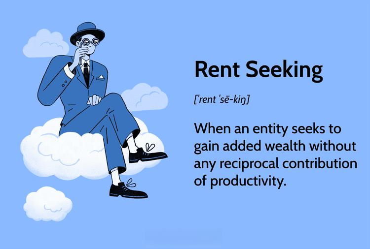

## Table of Contents

## What is rent seeking in economics?

Rent seeking in economics is when someone tries to get more money or benefits without doing anything useful in return. It's like trying to take a bigger piece of the pie without making the pie bigger. For example, a company might spend a lot of money on lobbyists to get the government to give them special favors, like tax breaks or subsidies, instead of using that money to improve their products or services.

This behavior can be bad for the economy because it takes resources away from productive activities. When people or companies focus on rent seeking, they're not investing in things that could help grow the economy, like new technology or better ways of doing business. Instead, they're just trying to get a bigger share of what's already there, which can lead to less innovation and slower economic growth overall.

## Can you provide a simple example of rent seeking?

Imagine there's a small town with only one taxi company. The owner of the taxi company goes to the town's mayor and asks for a rule that says no other taxi companies can start up in the town. The mayor agrees, and in return, the taxi company owner gives the mayor a big donation for his next election campaign. This is an example of rent seeking. The taxi company owner is using his influence to keep competitors out, so he can charge higher prices without having to improve his service.

This behavior hurts the town's people because they have to pay more for taxi rides, and they don't have any other choices. It also means that no new taxi companies can come in and maybe offer better service or lower prices. In the end, the town's economy doesn't grow as much as it could because resources are being used to keep things the same, instead of making things better.

## How does rent seeking differ from profit seeking?

Rent seeking and profit seeking are different ways people try to make money, but they work in opposite ways. Profit seeking is when someone tries to make money by doing something useful, like starting a business or inventing a new product. When people seek profits, they usually create something new or improve something that already exists. This can help the economy grow because it brings new ideas and better ways of doing things.

On the other hand, rent seeking is when someone tries to make money without doing anything useful. Instead of creating something new or improving something, they use their power or influence to get more money or benefits. For example, they might pay politicians to pass laws that help them but hurt everyone else. This can slow down the economy because it takes resources away from things that could help it grow.

## What are the common causes of rent seeking behavior?

Rent seeking behavior often happens because of the way laws and rules are set up. When the government has a lot of control over who can do what, some people might try to use that control to their advantage. For example, if the government gives out special permits or licenses that are hard to get, people might spend a lot of time and money trying to get those permits instead of doing something more productive. This can lead to a lot of wasted effort and resources, as people focus on getting a bigger piece of the pie instead of making the pie bigger.

Another common cause of rent seeking is when there are big rewards for being the only one doing something. If a company can keep others out of their market, they might try to use their power to stop new competitors from coming in. They might do this by asking for special rules or by spending money to influence politicians. This can hurt the economy because it stops new ideas and businesses from growing, and it means that people have fewer choices and might have to pay more for things.

## What are the economic impacts of rent seeking on society?

Rent seeking can hurt the economy in big ways. When people focus on rent seeking, they're not doing things that could help the economy grow, like starting new businesses or inventing new products. Instead, they're trying to get a bigger piece of what's already there. This means that resources, like money and time, are being wasted on things that don't make the economy better. For example, if a company spends a lot of money on lobbyists to get special favors from the government, that's money that could have been used to improve their products or services.

The other big problem with rent seeking is that it can make things unfair for everyone else. When some people or companies use their power to get special benefits, it can make it harder for others to compete. This can lead to higher prices and fewer choices for consumers. For instance, if a taxi company gets the government to stop other taxi companies from starting up, people in that town might have to pay more for rides and won't have any other options. In the end, rent seeking can slow down the economy and make life harder for regular people.

## How can rent seeking be identified in policy and regulation?

Rent seeking in policy and regulation can be spotted when certain groups or companies try to use their influence to get special rules that help them but hurt others. For example, if a big company spends a lot of money on lobbyists to get the government to pass a law that makes it hard for new companies to start up in their industry, that's rent seeking. The company isn't trying to make a better product or service; they're just trying to keep their competitors out so they can keep making more money without working harder.

Another way to identify rent seeking is when policies create big rewards for being the only one doing something, and people spend a lot of time and money trying to be the only one. If the government gives out special permits or licenses that are hard to get, people might focus more on getting those permits than on doing something useful for the economy. This can lead to a lot of wasted effort and resources, as people try to get a bigger piece of the pie instead of making the pie bigger.

## What historical examples illustrate rent seeking?

One historical example of rent seeking is the system of land enclosure in England during the 16th to 19th centuries. Wealthy landowners used their influence to get laws passed that allowed them to take over common lands that were used by many people for farming and grazing. These laws, known as enclosure acts, helped the landowners get richer by turning the common lands into private property, but they hurt the poor people who lost access to the land they needed to make a living. Instead of making the economy better for everyone, these laws just made it easier for the rich to get richer without doing anything to help the country grow.

Another example is the monopolies granted by European monarchs during the 16th and 17th centuries. Kings and queens would give certain people or companies the right to be the only ones to sell certain goods, like salt or tobacco. These monopolies let the people who got them charge high prices and make a lot of money, but they hurt everyone else by making things more expensive and stopping other people from starting their own businesses. Instead of encouraging new ideas and competition, these monopolies just helped a few people get richer without doing anything to help the economy grow.

## What are the theoretical models used to explain rent seeking?

One of the main theoretical models used to explain rent seeking is the Tullock paradox, named after economist Gordon Tullock. This model shows how people might spend a lot of time and money trying to get a bigger piece of what's already there, instead of doing something to make more for everyone. For example, if the government is giving away a prize, people might spend more money trying to win the prize than the prize is actually worth. This doesn't make sense because it's a waste of resources, but it happens because people are trying to get ahead without doing anything useful.

Another model is the contest success function, which looks at how people compete for things like government contracts or special rules that help them. This model says that the person who spends the most money or effort trying to get these things is more likely to win them, even if they're not the best person for the job. This can lead to a lot of wasted effort and money, as people focus on winning the contest instead of doing something that could help the economy grow. Both of these models show how rent seeking can hurt the economy by taking resources away from productive activities.

## How do different economic schools of thought view rent seeking?

Different economic schools of thought have their own views on rent seeking, but many see it as a problem. Neoclassical economists, who focus on how markets work, think rent seeking is bad because it wastes resources. They believe that when people try to get more money without doing anything useful, it takes away from things that could help the economy grow. For example, if a company spends a lot of money on lobbyists to get special favors, that's money that could have been used to improve their products or services. Neoclassical economists want to reduce rent seeking by making markets more competitive and open.

On the other hand, some other schools of thought, like institutional economists, look at how rules and laws affect the economy. They think rent seeking happens a lot because of the way governments set up rules and regulations. For example, if the government makes it hard to start a new business, people might spend more time trying to get around those rules than doing something productive. Institutional economists believe that to stop rent seeking, we need to change the rules so they're fairer and encourage more competition. Both schools of thought agree that rent seeking can slow down the economy, but they have different ideas about how to fix it.

## What measures can governments implement to reduce rent seeking?

Governments can reduce rent seeking by making rules and laws that are fair and help everyone, not just a few people. For example, they can make it easier for new businesses to start up by simplifying the process of getting permits and licenses. If it's easy for anyone to start a business, then companies won't waste time and money trying to keep others out. Governments can also make sure that everyone has a fair chance to compete by breaking up monopolies and stopping companies from getting special favors. This way, companies will have to work hard to make better products and services instead of just trying to get more money without doing anything useful.

Another way governments can help is by being more open about how they make decisions. If people can see how the government is working, it's harder for companies to use their power to get special rules that help them. Governments can also set up rules that stop people from using money to influence politicians, like limiting how much money can be given to election campaigns. By making things more open and fair, governments can encourage people to focus on doing things that help the economy grow, instead of just trying to get a bigger piece of what's already there.

## How does rent seeking affect economic efficiency and growth?

Rent seeking can hurt economic efficiency and growth a lot. When people or companies focus on rent seeking, they're not doing things that could make the economy better, like starting new businesses or coming up with new ideas. Instead, they're trying to get more money without doing anything useful. This means that resources, like money and time, are being wasted on things that don't help the economy grow. For example, if a company spends a lot of money on lobbyists to get special favors from the government, that's money that could have been used to improve their products or services.

This behavior also makes things unfair for everyone else. When some people or companies use their power to get special benefits, it can make it harder for others to compete. This can lead to higher prices and fewer choices for consumers. For instance, if a taxi company gets the government to stop other taxi companies from starting up, people in that town might have to pay more for rides and won't have any other options. In the end, rent seeking can slow down the economy and make life harder for regular people because it takes away resources that could be used to make things better for everyone.

## What are the latest research findings on the dynamics of rent seeking?

Recent research on rent seeking has shown that it's still a big problem in many economies around the world. One study found that rent seeking is more common in countries where the government has a lot of control over who can do what. When the rules make it hard for new businesses to start up, people spend more time trying to get around those rules instead of doing something useful. This can slow down the economy because it wastes resources that could be used to make things better for everyone. Researchers also found that rent seeking can lead to more inequality, as rich people and big companies use their power to get special benefits, making it harder for others to compete.

Another important finding is that rent seeking can change how people behave in the economy. When people see that others are getting rich by using their power to get special favors, they might start doing the same thing. This can create a cycle where more and more people focus on rent seeking instead of doing things that could help the economy grow. Some new studies have also looked at how technology can affect rent seeking. For example, the internet and social media can make it easier for people to see what's going on and stop rent seeking, but they can also be used by companies to influence politicians and get special rules that help them. Overall, the latest research shows that rent seeking is still a big challenge, and finding ways to stop it is important for making the economy work better for everyone.

## References & Further Reading

[1]: Tullock, G. (1967). ["The Welfare Costs of Tariffs, Monopolies, and Theft."](https://onlinelibrary.wiley.com/doi/abs/10.1111/j.1465-7295.1967.tb01923.x) Western Economic Journal, 5(3), 224-232.

[2]: Krueger, A. O. (1974). ["The Political Economy of the Rent-Seeking Society."](https://www.jstor.org/stable/1808883) The American Economic Review, 64(3), 291-303.

[3]: "Rent Seeking and Innovation" by William J. Baumol in the Journal of Economic Literature, 1990.

[4]: Jones, C. M. (2013). ["What Do We Know About High-Frequency Trading?"](https://papers.ssrn.com/sol3/papers.cfm?abstract_id=2236201) Columbia University Working Paper.

[5]: Biais, B., Foucault, T., & Moinas, S. (2015). ["Equilibrium High-Frequency Trading."](https://papers.ssrn.com/sol3/papers.cfm?abstract_id=2024360) Review of Financial Studies, 28(7), 1631-1710.

[6]: "High-Frequency Trading and Its Impact on Markets" by the Committee on Capital Markets Regulation, 2014.

[7]: Aldridge, I. (2013). ["High-Frequency Trading: A Practical Guide to Algorithmic Strategies and Trading Systems,"](https://books.google.com/books/about/High_Frequency_Trading.html?id=8QpIsVUMhmEC) 2nd Edition. Wiley.