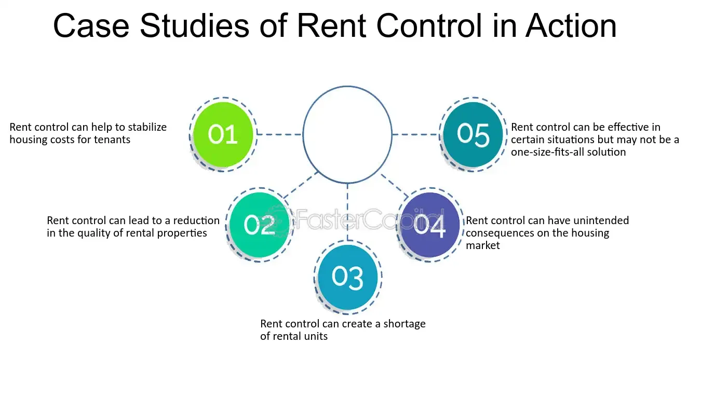

## Table of Contents

## What is rent stabilization?

Rent stabilization is a policy that helps keep rent prices from going up too fast. It's meant to make sure that people can afford to keep living in their homes, even when the cost of living goes up. This is important in big cities where there are a lot of people and not enough places to live. With rent stabilization, there are rules about how much and how often a landlord can raise the rent.

These rules can be different in different places. Usually, the rent can only go up by a small amount each year, like 1% to 3%. This helps people plan their budgets better because they know their rent won't suddenly become too expensive. Rent stabilization can make a big difference for people who don't have a lot of money, helping them stay in their homes and communities.

## How does rent stabilization differ from rent control?

Rent stabilization and rent control are both ways to help keep rent prices from going up too fast, but they work a bit differently. Rent control usually puts a strict limit on how much rent can be, and it doesn't change much over time. It's like saying, "You can't charge more than this amount, no matter what." This can be really good for people who need to keep their rent low, but it can also make it hard for landlords to make money, especially if costs like taxes or repairs go up.

On the other hand, rent stabilization is a bit more flexible. It allows rent to go up, but only by a small amount each year. This means landlords can still make a bit more money over time, but tenants don't have to worry about big jumps in rent. Rent stabilization often comes with other rules too, like making sure buildings are well taken care of. Both policies aim to help people afford to stay in their homes, but they do it in slightly different ways.

## What are the main objectives of rent stabilization policies?

The main goal of rent stabilization policies is to make sure that people can afford to keep living in their homes. When rents go up a lot, it can be hard for people, especially those with low incomes, to keep up with the costs. Rent stabilization helps by setting rules on how much and how often landlords can raise the rent. This way, people know that their rent won't suddenly become too expensive, and they can plan their budgets better.

Another important objective is to help keep communities stable. When people can stay in their homes, neighborhoods stay the same and people can keep their connections with friends, family, and local services. Rent stabilization helps prevent a lot of people from having to move out because they can't afford the rent. This is good for both the people living there and the community as a whole, because it helps everyone feel more secure and connected.

## What mechanisms are used to implement rent stabilization?

Rent stabilization is put into place by making laws or rules that say how much and how often landlords can raise the rent. These rules are usually set by the government, like a city or state. The rules say that each year, the rent can only go up by a small amount, maybe 1% to 3%. This helps people know what to expect and plan their money better. If landlords want to raise the rent more than what the rules allow, they have to ask for special permission.

To make sure everyone follows these rules, there are usually groups or offices set up to watch over things. These groups can check if landlords are following the rules and help tenants if they have problems. If a landlord tries to raise the rent too much, tenants can go to these groups for help. This way, the rules are enforced, and people can feel safe knowing that their rent won't suddenly become too high.

## How does rent stabilization affect tenants?

Rent stabilization helps tenants by keeping their rent from going up too fast. This means they can plan their money better because they know their rent won't suddenly become too expensive. It's really helpful for people who don't have a lot of money, because it lets them keep living in their homes without worrying about big rent increases. This can make a big difference for families and older people who need to stay in the same place.

Another way rent stabilization helps tenants is by keeping their communities stable. When people can stay in their homes, they don't have to move around a lot. This means they can keep their connections with friends, family, and local services. It's good for the whole neighborhood because it helps everyone feel more secure and connected. Rent stabilization makes sure that people can stay in their communities and not have to leave because they can't afford the rent.

## What impact does rent stabilization have on landlords?

Rent stabilization can make things harder for landlords because it limits how much they can raise the rent each year. If costs like taxes, repairs, or maintenance go up, landlords might find it tough to make enough money to cover these expenses. This can make it less appealing for them to keep renting out their properties, especially if they feel like they're not making enough profit. Some landlords might even decide to sell their buildings or change them into something else, like condos, if they think it will be more profitable.

On the other hand, rent stabilization can also have some good points for landlords. When tenants know their rent won't go up a lot, they're more likely to stay in the same place for a long time. This means less turnover, which can save landlords money on things like finding new tenants and fixing up apartments between renters. Stable tenants can also take better care of the property, knowing they'll be there for a while. So, while rent stabilization might limit how much money landlords can make from rent, it can also help them in other ways by keeping their buildings full and well-maintained.

## Can you explain the legal framework surrounding rent stabilization?

Rent stabilization is controlled by laws and rules made by the government. These laws can be different depending on where you live, like in a city or a state. The main idea is to set limits on how much and how often a landlord can raise the rent. For example, the law might say that rent can only go up by 2% each year. These rules are written to help people afford to keep living in their homes and to keep communities stable. Governments also set up special offices or groups to make sure everyone follows these rules. If a landlord tries to raise the rent more than allowed, tenants can go to these groups for help.

Sometimes, the laws about rent stabilization can be complicated. They might have special rules for different kinds of buildings or different situations. For example, some buildings might not have to follow the rent stabilization rules if they were built after a certain year or if they are used for something other than regular apartments. There can also be rules about what landlords have to do to keep the buildings in good shape. If landlords don't follow these rules, they can get in trouble. The goal is to make sure that both tenants and landlords are treated fairly and that everyone can follow the law.

## How is rent stabilization administered and enforced?

Rent stabilization is managed by special groups or offices set up by the government. These groups make sure that landlords follow the rules about how much they can raise the rent each year. If a landlord tries to raise the rent more than allowed, tenants can go to these groups for help. The groups can check if the landlord is following the rules and can help solve problems between tenants and landlords. They might also do regular checks to make sure everything is going well.

The enforcement of rent stabilization laws is important to make sure the rules are followed. If a landlord breaks the rules, they can get in trouble. This might mean they have to pay a fine or fix the problem. The special groups can also help tenants understand their rights and what to do if they have a problem with their rent. This way, everyone knows what to expect and can feel safe knowing that the rules are being followed.

## What are some common challenges and criticisms of rent stabilization?

Rent stabilization can be hard to manage and has some problems. One big challenge is that it can make landlords not want to fix up their buildings. If they can't raise the rent enough to pay for repairs, they might let the buildings get old and run down. Another problem is that it can be hard to find a place to rent in areas with rent stabilization. When rents are kept low, more people want to live there, but there might not be enough apartments for everyone. This can make it tough for new people to move into these areas.

People also criticize rent stabilization a lot. Some say it stops new buildings from being built. If landlords can't make enough money from rent, they might not want to build new apartments. This can make the problem of not having enough places to live even worse. Others say that rent stabilization is not fair to landlords because it limits how much money they can make. They think that landlords should be able to set their own rent prices based on what the market will pay. These criticisms show that while rent stabilization helps some people, it can also create other problems that need to be thought about.

## Can you provide case studies where rent stabilization has been successfully implemented?

In New York City, rent stabilization has been in place for many years and has helped a lot of people. The rules say that landlords can only raise the rent by a small amount each year, usually between 1% and 3%. This has made it easier for people to stay in their homes, even when the cost of living goes up. The city has a special group called the Rent Guidelines Board that decides how much the rent can go up each year. This group looks at things like the cost of living and what landlords have to pay for things like taxes and repairs. Because of rent stabilization, many people in New York City can keep living in their neighborhoods and not have to move because they can't afford the rent.

In San Francisco, rent stabilization has also been successful. The city has rules that say landlords can only raise the rent by a small amount each year, and they have to keep their buildings in good shape. This has helped a lot of people, especially those who don't have a lot of money, to stay in their homes. The city has a group called the Rent Board that helps make sure everyone follows the rules. If tenants have problems with their rent, they can go to the Rent Board for help. Because of these rules, San Francisco has been able to keep its communities stable and help people afford to live there.

## How do economic theories support or critique rent stabilization?

Some economic theories support rent stabilization because they believe it helps make sure everyone can afford a place to live. They say that without rent stabilization, landlords might raise the rent too much, and people with less money would have to move out. This can break up communities and make it hard for people to stay in the same place. Rent stabilization helps keep rents from going up too fast, so people can plan their money better and stay in their homes. It also helps keep neighborhoods stable because people don't have to move around a lot.

Other economic theories criticize rent stabilization because they think it can cause problems. They say that when landlords can't raise the rent enough, they might not want to fix up their buildings or build new ones. This can make the buildings get old and run down, and it can make it hard to find a place to rent because there aren't enough new apartments being built. These theories also say that rent stabilization isn't fair to landlords because it limits how much money they can make. They think that the market should decide the rent prices, not the government, because this would be more fair to everyone.

## What future trends and potential reforms are being discussed in the field of rent stabilization?

People are talking about different ways to make rent stabilization better in the future. One idea is to make the rules about how much rent can go up each year more flexible. This could mean letting landlords raise the rent a bit more if they need to pay for big repairs or if the cost of living goes up a lot. Another idea is to use rent stabilization to help build more homes. Some people think that if landlords can make more money from new buildings, they might be more willing to build them. This could help solve the problem of not having enough places to live.

There are also discussions about making sure rent stabilization is fair for everyone. Some people want to make the rules easier to understand so that both tenants and landlords know what to expect. Others are thinking about ways to make sure that buildings stay in good shape, even with rent stabilization. This might mean giving landlords more money to fix up their buildings or making them follow strict rules about keeping the buildings safe and nice. These ideas show that while rent stabilization helps a lot of people, there are still ways to make it work even better in the future.

## What is Understanding Rent Stabilization?

Rent stabilization is a housing policy aimed at regulating the rate of rent increases to maintain affordability, while ensuring landlords receive a fair return on their investment. It is often mistaken for rent control, yet the two policies differ fundamentally. Rent control typically establishes fixed maximum rates that rents cannot exceed, creating a rigid framework for rent pricing. In contrast, rent stabilization allows for adjustable, regulated increases in rent, offering more flexibility to landlords while safeguarding tenants from drastic rent hikes that might result in displacement.

The core objective of rent stabilization is to provide a buffer against sudden and unaffordable rent increases, which can threaten the housing security of tenants. By limiting rent increments to manageable levels, this approach aims to reduce the likelihood of tenant displacement and ensure a stable housing market. Such stability not only benefits tenants but also contributes to community cohesion and economic stability.

The design and implementation of rent stabilization policies can significantly vary across different local and state jurisdictions, reflecting the diversity in housing market conditions and political landscapes. Some regions may implement percentage caps on annual rent increases, while others might link permissible increases to inflation indices or specific economic indicators. For example, consider a hypothetical city where rent stabilization dictates that annual rent increases cannot exceed the local inflation rate plus 2%. Such a formula might look like:

$$
\text{Max Rent Increase} = \text{Inflation Rate} + 0.02
$$

This mathematical constraint ensures that rent adjustments remain in line with broader economic conditions, preventing unaffordable spikes in housing costs. Local governments often adjust the parameters of rent stabilization policies to balance the interests of both homeowners and tenants, taking into consideration the unique economic conditions of the area.

The variation in policy frameworks across jurisdictions demonstrates the adaptability of rent stabilization measures to suit different local needs. These policies are frequently shaped by public and political pressures, historic housing crises, and socio-economic objectives. Consequently, rent stabilization is a dynamic policy tool that responds to the ongoing challenges and complexities of the housing market, striving to achieve a delicate equilibrium between tenant protection and landlord interests.

## References & Further Reading

[1]: Gyourko, J., & Linneman, P. (1989). "Equity and Efficiency Aspects of Rent Control: An Empirical Study of New York City." Journal of Urban Economics, 25(1), 54-74.

[2]: Arnott, R. (1995). "Time for Revisionism on Rent Control?" Journal of Economic Perspectives, 9(1), 99-120.

[3]: Olsen, E. O. (1988). "What Do Economists Know About the Effect of Rent Control on Housing Maintenance?" Journal of Real Estate Finance and Economics, 1(3), 295-307.

[4]: Schuetz, J. (2020). ["Is Rent Stabilization the Solution to Rising Housing Costs?"](https://www.brookings.edu/articles/to-improve-housing-affordability-we-need-better-alignment-of-zoning-taxes-and-subsidies/) The Brookings Institution.

[5]: Lees, L. (2007). "Gentrification and Social Mixing: Towards an Inclusive Urban Renaissance?" Urban Studies, 45(12), 2449-2470.

[6]: Engelhardt, G. V., Eriksen, M. D., & Greenhalgh-Stanley, N. (2010). "Home Safety, Accessibility, and Elderly Health: Evidence from Falls." Journal of Urban Economics, 68(2), 228-234. 

[7]: Wegmann, J., & Mawhorter, S. (2017). "Measuring Informal Housing Production in California Cities." Journal of the American Planning Association, 83(2), 119-238.

[8]: Piskorski, T., & Tchistyi, A. (2010). "Stochastic House Appreciation and Optimal Mortgage Lending." The Review of Financial Studies, 23(4), 1557-1588.

[9]: Ihlanfeldt, K. R. (2007). "The Effect of Land Use Regulation on Housing and Land Prices." Journal of Urban Economics, 61(3), 420-435.