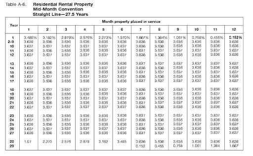

## Table of Contents

## What is rental property depreciation?

Rental property depreciation is a way to account for the wear and tear of a rental property over time. When you own a rental property, you can claim a portion of its value as an expense on your taxes each year. This expense reflects the fact that the property is slowly getting older and less valuable. By claiming depreciation, you can reduce your taxable income, which means you pay less in taxes.

To calculate depreciation, you need to know the property's cost and its useful life. The IRS says that residential rental property has a useful life of 27.5 years. You divide the property's cost by 27.5 to find out how much you can claim each year. For example, if your rental property cost $275,000, you could claim $10,000 in depreciation each year ($275,000 ÷ 27.5 years = $10,000 per year). This helps you save on taxes while owning the property.

## Why is depreciation important for rental property owners?

Depreciation is important for rental property owners because it helps them save money on taxes. When you own a rental property, you can claim a part of its value as an expense each year. This expense is called depreciation, and it shows that the property is getting older and less valuable over time. By claiming depreciation, you can lower your taxable income. This means you pay less in taxes, which can make owning a rental property more affordable.

Another reason depreciation is important is that it helps rental property owners manage their finances better. When you claim depreciation, you're spreading out the cost of the property over many years. This can make it easier to budget and plan for the future. Plus, when you sell the property, you might be able to use something called depreciation recapture, which can affect your taxes. Understanding and using depreciation correctly can make a big difference in how much money you keep in your pocket as a rental property owner.

## How does depreciation affect my taxes as a rental property owner?

Depreciation helps you save money on your taxes as a rental property owner. When you own a rental property, you can claim a part of its value as an expense each year. This expense is called depreciation, and it shows that the property is getting older and less valuable over time. By claiming depreciation, you can lower your taxable income. This means you pay less in taxes. For example, if your rental property cost $275,000, you could claim about $10,000 in depreciation each year. This $10,000 reduces your taxable income, so you pay less tax.

When you sell your rental property, depreciation can affect your taxes in another way. If you've been claiming depreciation, you might have to pay something called depreciation recapture when you sell the property. Depreciation recapture means you have to pay taxes on the amount of depreciation you claimed over the years. This can increase the taxes you owe when you sell the property. It's important to keep track of your depreciation claims and understand how they might affect your taxes when you decide to sell.

## What is the Modified Accelerated Cost Recovery System (MACRS) and how does it relate to rental property depreciation?

The Modified Accelerated Cost Recovery System (MACRS) is a way the IRS lets you claim depreciation on your rental property. It's a method that helps you spread out the cost of your property over time, so you can claim a little bit of it as an expense each year. MACRS is used to figure out how much you can claim in depreciation. It's a bit different from other methods because it lets you claim more depreciation in the early years of owning the property.

For rental properties, MACRS uses a 27.5-year schedule. This means you divide the cost of your property by 27.5 to find out how much you can claim each year. For example, if your rental property cost $275,000, you could claim about $10,000 in depreciation each year. Using MACRS can help you save money on your taxes because it lets you lower your taxable income. Just remember, when you sell your rental property, you might have to pay taxes on the depreciation you claimed, which is called depreciation recapture.

## What is the useful life of a rental property for depreciation purposes?

The useful life of a rental property for depreciation purposes is 27.5 years. This means that when you own a rental property, you can spread out the cost of the property over 27.5 years. Each year, you can claim a part of the property's value as an expense on your taxes. This is called depreciation, and it helps you save money on taxes by lowering your taxable income.

For example, if your rental property cost $275,000, you could claim about $10,000 in depreciation each year. You do this by dividing the cost of the property by 27.5 years. This way, you're accounting for the fact that the property is getting older and less valuable over time. By using this method, you can manage your taxes better and make owning a rental property more affordable.

## How do I calculate the depreciable basis of my rental property?

To calculate the depreciable basis of your rental property, you need to start with the cost of the property. This includes the purchase price plus any costs you paid to get the property ready for renting, like closing costs, legal fees, and improvements. However, you can't include the cost of the land the property sits on because land doesn't wear out over time. To figure out the value of the land, you can look at your property tax bill or get a professional appraisal. Once you know the value of the land, subtract it from the total cost of the property. The result is your depreciable basis, which is the part of the property you can claim as an expense over time.

For example, if you bought a rental property for $300,000 and the land it sits on is worth $50,000, your depreciable basis would be $250,000. You can then use this depreciable basis to figure out how much you can claim in depreciation each year. The IRS says you can spread out the cost of a residential rental property over 27.5 years. So, if your depreciable basis is $250,000, you would divide that by 27.5 to find your annual depreciation expense, which would be about $9,100 per year. This helps you lower your taxable income and save money on taxes.

## What are the different methods of depreciation I can use for my rental property?

When you own a rental property, you can use different ways to claim depreciation on your taxes. The most common method is the Modified Accelerated Cost Recovery System (MACRS). With MACRS, you spread out the cost of your property over 27.5 years. You can claim a part of the property's value as an expense each year, which helps lower your taxes. MACRS lets you claim more depreciation in the early years of owning the property, which can be helpful if you want to save more on taxes right away.

Another method you can use is the Straight-Line Method. This method is simpler than MACRS because you claim the same amount of depreciation each year. You divide the cost of your property by 27.5 years, and that's how much you can claim every year. The Straight-Line Method is good if you want a steady, predictable way to claim depreciation. Both methods help you save money on taxes, but MACRS might help you save more in the early years, while the Straight-Line Method gives you a consistent amount each year.

## How do I apply the straight-line depreciation method to my rental property?

To apply the straight-line depreciation method to your rental property, you first need to figure out the property's depreciable basis. This is the total cost of the property minus the value of the land it sits on. For example, if you bought a rental property for $300,000 and the land is worth $50,000, your depreciable basis would be $250,000. Once you know the depreciable basis, you divide it by the useful life of the property, which the IRS says is 27.5 years for residential rental properties. So, if your depreciable basis is $250,000, you would divide that by 27.5 to get your annual depreciation expense, which would be about $9,100 per year.

Using the straight-line method means you claim the same amount of depreciation each year. This can make it easier to plan your taxes because you know exactly how much you can claim every year. For example, if you claim $9,100 in depreciation each year, you can lower your taxable income by that amount, which helps you save money on taxes. Keep in mind that when you sell the property, you might have to pay taxes on the depreciation you claimed, which is called depreciation recapture. But while you own the property, the straight-line method gives you a steady way to claim depreciation and manage your taxes.

## Can I claim depreciation on improvements made to my rental property?

Yes, you can claim depreciation on improvements made to your rental property. Improvements are things like adding a new roof, installing new windows, or building an addition to the property. These improvements add value to your property and can be depreciated over time. You can't claim depreciation on repairs, like fixing a leaky faucet or painting a room, because repairs just keep the property in good condition. But improvements that increase the property's value or extend its useful life can be included in your depreciation calculations.

To claim depreciation on improvements, you need to add the cost of the improvements to your property's depreciable basis. The depreciable basis is the total cost of the property minus the value of the land. For example, if you bought your rental property for $300,000 and the land is worth $50,000, your original depreciable basis would be $250,000. If you then spend $20,000 on a new roof, you would add that to your depreciable basis, making it $270,000. You would then divide this new depreciable basis by 27.5 years to figure out how much you can claim in depreciation each year. This way, you can lower your taxable income and save money on taxes.

## What happens to the depreciation when I sell my rental property?

When you sell your rental property, you need to think about the depreciation you claimed while you owned it. The IRS calls this "depreciation recapture." It means you have to pay taxes on the amount of depreciation you claimed over the years. This can increase the taxes you owe when you sell the property. For example, if you claimed $10,000 in depreciation each year for 10 years, that's $100,000 in total depreciation. When you sell, you might have to pay taxes on that $100,000.

The good news is that you might be able to avoid or delay paying these taxes if you do a 1031 exchange. This is a special rule that lets you swap one rental property for another without paying taxes right away. You have to follow some strict rules to do a 1031 exchange, like finding a new property within 45 days and closing on it within 180 days. If you do it right, you can keep your money working for you in another rental property without losing it to taxes. But if you don't do a 1031 exchange, you'll need to pay taxes on the depreciation you claimed when you sell your rental property.

## How do I handle depreciation recapture when selling my rental property?

When you sell your rental property, you need to think about the depreciation you claimed while you owned it. This is called depreciation recapture. It means you have to pay taxes on the amount of depreciation you claimed over the years. For example, if you claimed $10,000 in depreciation each year for 10 years, that's $100,000 in total depreciation. When you sell, you might have to pay taxes on that $100,000. The tax rate for depreciation recapture is usually 25%, so you would owe $25,000 in taxes on the $100,000 of depreciation.

The good news is that you might be able to avoid or delay paying these taxes if you do a 1031 exchange. This is a special rule that lets you swap one rental property for another without paying taxes right away. You have to follow some strict rules to do a 1031 exchange, like finding a new property within 45 days and closing on it within 180 days. If you do it right, you can keep your money working for you in another rental property without losing it to taxes. But if you don't do a 1031 exchange, you'll need to pay taxes on the depreciation you claimed when you sell your rental property.

## What advanced strategies can I use to optimize depreciation for tax benefits on my rental property?

One advanced strategy to optimize depreciation for tax benefits on your rental property is to use cost segregation. This means you break down the property into different parts, like the building, the land improvements, and the personal property inside. Each part has a different useful life, so you can claim depreciation on them at different rates. For example, you can claim depreciation on things like appliances or carpeting over a shorter time than the building itself. This can help you claim more depreciation in the early years of owning the property, which means you can save more on taxes right away.

Another strategy is to take advantage of bonus depreciation. This is a special rule that lets you claim a big part of the cost of certain improvements right away, instead of spreading it out over time. For example, if you make improvements to your rental property, like adding new appliances or making energy-efficient upgrades, you might be able to claim a large part of the cost in the first year. This can help you lower your taxable income a lot in that year, which can save you a lot of money on taxes. Just remember, if you use these strategies, you'll need to keep good records and maybe talk to a tax professional to make sure you're doing everything right.

## What are the tax benefits of real estate?

Depreciation provides rental property owners with a substantial tax advantage by allowing them to lower their taxable income. This reduction in taxable income is achieved by accounting for the property's loss in value over time. Essentially, property owners can deduct this depreciation from their rental income, thus decreasing their overall tax liability. 

The principal benefit of depreciation lies in its ability to offset rental income. Suppose an investor owns a rental property generating $20,000 annually. If the annual depreciation estimate is $7,000, then the taxable rental income would effectively reduce to $13,000.

$$
\text{Taxable Rental Income} = \text{Total Rental Income} - \text{Depreciation}
$$

This depreciation deduction is pivotal, especially for real estate investors relying on rental income as a significant portion of their earnings.

Further enhancing these tax benefits are other deductible expenses associated with managing and maintaining rental properties. Deductions for mortgage interest contribute significantly, providing property owners with the means to subtract the interest paid on loans used to purchase real estate from their taxable income. Property taxes, another deductible expense, further aid in relieving the financial burden. Investors may also deduct the costs incurred during repairs, which differentiates from improvements and involves restoring the property to its original condition.

These deductions can cumulatively lead to significant savings, thus making rental properties an attractive investment by reducing the effective tax rate for property owners.

## How do you calculate property depreciation?

Understanding how to calculate property depreciation, particularly through the Modified Accelerated Cost Recovery System (MACRS), is essential for property owners seeking to leverage tax benefits effectively. The MACRS is the current method of depreciation for tax purposes in the United States, and it allows property owners to recover the cost of property through annual deductions over a specified life span.

The General Depreciation System (GDS) under MACRS is most commonly used for residential rental properties. GDS stipulates a recovery period of 27.5 years for residential real estate, while commercial properties typically use a 39-year recovery period. These periods reflect the useful life assigned to the property by the IRS, during which the property's cost basis can be depreciated, excluding the value of the land.

The calculation process under GDS involves several components:

1. **Determine the Basis:** The starting point for depreciation is the property's adjusted basis, generally the purchase price plus any improvements made to increase the property value. Costs associated with acquiring the property, such as closing fees and commissions, should also be included. If property improvements are made, those must be added to the basis.

2. **Land Exclusion:** Because land does not depreciate, its value must be subtracted from the property's total value. An appraisal or tax assessor's statement can provide this figure.

3. **Depreciation Method:** Under GDS, most residential properties use the straight-line method, where an equal depreciation amount is deducted each year over the 27.5-year period. The formula for annual depreciation is:
$$
   \text{Annual Depreciation} = \frac{\text{Adjusted Basis}}{\text{Recovery Period}}

$$

4. **Apply MACRS Table:** The IRS provides MACRS tables that give the applicable percentage for each year of the asset's recovery period. These tables help account for a partial year in the first year of service, known as the mid-month convention, which assumes the asset was placed in service in the middle of the month.

For example, consider a residential rental property purchased for $300,000, where $60,000 is attributed to land:

- **Adjusted Basis** = $300,000 - $60,000 = $240,000
- **Annual Depreciation** = $240,000 / 27.5 ≈ $8,727.27

Special regulations may apply, influencing the selected recovery period or depreciation method. For instance, improvements can have different periods and methods if they extend the property's useful life. Similarly, alternate systems such as the Alternative Depreciation System (ADS) might be required for certain properties or owners, featuring longer recovery periods and mandated methods.

Adapting MACRS effectively allows property owners to optimize the timing and amount of depreciation, aligning tax strategies with broader financial objectives. Understanding these calculations can make a significant difference in the profitability of real estate investments, aiding in strategic financial planning.

## References & Further Reading

[1]: IRS. (2021). ["Publication 946: How to Depreciate Property."](https://www.irs.gov/publications/p946) Internal Revenue Service.

[2]: Lopez de Prado, M. (2018). ["Advances in Financial Machine Learning."](https://www.amazon.com/Advances-Financial-Machine-Learning-Marcos/dp/1119482089) Wiley.

[3]: Aronson, D. R. (2007). ["Evidence-Based Technical Analysis: Applying the Scientific Method and Statistical Inference to Trading Signals."](https://www.amazon.com/Evidence-Based-Technical-Analysis-Scientific-Statistical/dp/0470008741) Wiley.

[4]: Jansen, S. (2020). ["Machine Learning for Algorithmic Trading."](https://github.com/stefan-jansen/machine-learning-for-trading) Packt Publishing.

[5]: Chan, E. P. (2008). ["Quantitative Trading: How to Build Your Own Algorithmic Trading Business."](https://github.com/ftvision/quant_trading_echan_book) Wiley.

[6]: Redin, D. M. (2015). ["Real Estate Investment and Taxation Manual."](https://www.amazon.com/Estate-Investment-Taxation-Commercial-Investment-Council/dp/0137630530) Wiley.

[7]: ["The Book on Tax Strategies for the Savvy Real Estate Investor"](https://www.amazon.com/Book-Strategies-Savvy-Estate-Investor/dp/0990711765) by Amanda Han and Matthew MacFarland

[8]: Geltner, D., Miller, N. G., Clayton, J., & Eichholtz, P. (2013). ["Commercial Real Estate Analysis and Investments."](https://www.researchgate.net/publication/245702364_Commercial_Real_Estate_Analysis_and_Investments) OnCourse Learning.