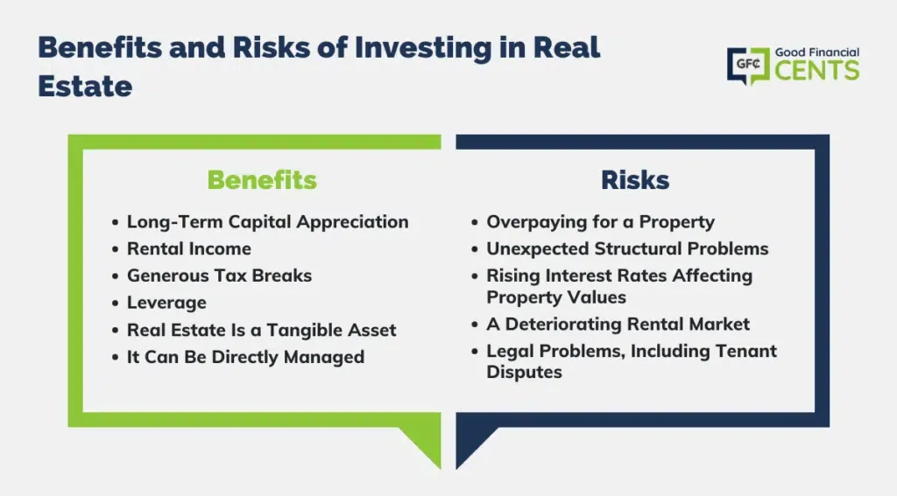

## Table of Contents

## What is rental property investment?

Rental property investment is when you buy a house or an apartment and then rent it out to other people. Instead of living in the property yourself, you let others live there and they pay you rent every month. This rent money can help you pay for the costs of owning the property, like the mortgage, taxes, and repairs. If the rent you collect is more than what you spend on the property, you make a profit.

Investing in rental property can be a good way to make money over time. As you pay off the mortgage, you own more and more of the property, which can increase your wealth. Also, if the value of the property goes up, you can sell it later for more money than you paid for it. However, being a landlord also comes with responsibilities. You need to take care of the property, find good tenants, and sometimes deal with problems like repairs or late rent payments.

## What are the basic financial benefits of investing in rental properties?

Investing in rental properties can help you make money in two main ways. First, you get rental income. This is the money tenants pay you every month to live in your property. If the rent you collect is more than what you spend on the property, like the mortgage, taxes, and repairs, you make a profit. This extra money can be saved or used to buy more properties.

Second, over time, the value of your property might go up. This is called appreciation. If you decide to sell your property later, and its value has increased, you can make a profit from the sale. This can add to your wealth. So, rental properties can give you regular income and also the chance to make money if you sell the property for more than you paid for it.

## How can rental income provide a steady cash flow?

Rental income can provide a steady cash flow because you get money from your tenants every month. When you own a rental property, you set a rent price that tenants agree to pay regularly, usually on the first of each month. If you have good tenants who pay on time, this means you can count on getting that money every month. This regular income can help you pay for things like the mortgage, taxes, and repairs on the property. If the rent you collect is more than your costs, you end up with extra money, which is your profit.

Having this steady cash flow is important because it can help you plan your finances better. You know how much money you will be getting each month, so you can budget for your own expenses and save for the future. Plus, if you own more than one rental property, the income from all of them together can add up to a bigger, more stable cash flow. This can make your financial situation more secure and give you peace of mind knowing that you have a reliable source of income coming in regularly.

## What tax advantages come with owning rental properties?

Owning a rental property can help you save money on taxes. One big advantage is that you can deduct a lot of the costs of running your rental property from your taxable income. This means you can subtract things like mortgage interest, property taxes, repairs, and even the cost of traveling to check on your property from the money you make. These deductions can lower the amount of income you have to pay taxes on, which can save you a lot of money.

Another tax benefit is called depreciation. This lets you deduct a part of the cost of your property over time, even though the actual value of your property might be going up. The IRS lets you spread out the cost of the building (not the land) over 27.5 years for residential rental properties. This depreciation can also lower your taxable income, which means you pay less in taxes each year. Together, these tax advantages can make owning a rental property more profitable and help you keep more of your rental income.

## What are the potential risks associated with rental property investment?

Investing in rental properties can be risky because things might not always go as planned. One big risk is that you might not always find good tenants who pay rent on time. If tenants don't pay, you still have to pay the mortgage and other costs, which can put you in a tough spot financially. Also, if the property stays empty for a long time, you won't get any rental income, but you'll still have to cover all the expenses. This can eat into your savings and make it hard to keep up with payments.

Another risk is that you might have to spend a lot of money on repairs and maintenance. Properties can have unexpected problems, like a broken heater or a leaky roof, and fixing these can be expensive. If you don't have enough money saved up for these repairs, it can be a big problem. Plus, the value of your property might not go up as much as you hope, or it might even go down. If you need to sell the property and its value has dropped, you could lose money instead of making a profit.

Lastly, being a landlord can be a lot of work. You have to deal with tenants, handle legal issues, and manage the property, which can take up a lot of your time and energy. If you're not prepared for this, it can become stressful and overwhelming. All these risks mean that investing in rental properties isn't always easy, and you need to be ready to handle whatever comes your way.

## How does property appreciation impact the overall return on investment?

Property appreciation is when the value of your rental property goes up over time. This can make a big difference in how much money you make from your investment. If you buy a property for $200,000 and it goes up to $250,000, you can sell it for a $50,000 profit. This profit, called capital gain, adds to the money you've made from rent. So, the more the property's value goes up, the more money you can make when you sell it.

But, property appreciation isn't always guaranteed. Sometimes, the value of properties can go down instead of up. If you have to sell your property when its value is low, you might lose money. That's why it's important to think about both the rent you collect and how much the property might be worth in the future. Appreciation can really boost your overall return on investment, but it also comes with risks that you need to be ready for.

## What are the financing options available for purchasing rental properties?

When you want to buy a rental property, you have different ways to get the money you need. One common way is to get a mortgage from a bank or a lender. A mortgage is a loan that you use to buy the property, and you pay it back over time with interest. There are different types of mortgages, like fixed-rate mortgages where the interest rate stays the same, and adjustable-rate mortgages where the interest rate can change. You can also choose between a conventional loan, which is not backed by the government, or a government-backed loan like an FHA loan, which might be easier to get if you don't have a lot of money for a down payment.

Another option is to use a home equity loan or a home equity line of credit (HELOC) if you already own a home. This means you borrow money against the value of your current home to buy a rental property. This can be a good choice if you have a lot of equity in your home, but it also means you're putting your home at risk if you can't pay back the loan. Some people also use their savings or money from selling other investments to buy rental properties. Each of these options has its own pros and cons, so it's important to think about what works best for your situation and how much risk you're comfortable with.

## How can leverage affect the profitability and risk of rental property investments?

Leverage means using borrowed money to buy a rental property. It can make your investment more profitable because it lets you buy a bigger or more expensive property than you could with just your own money. If the property goes up in value or if you make more money from rent than you spend on the property, you can make a bigger profit because you own a bigger piece of the pie. For example, if you put down 20% and borrow the other 80%, your profit from selling the property or from the rent can be a lot more than if you had only used your own money.

But leverage also makes your investment riskier. If the property goes down in value or if you can't find tenants to pay rent, you still have to pay back the loan with interest. This can be a big problem if you don't have enough money coming in to cover your costs. If things go really bad, you might lose the property and damage your credit. So, while leverage can help you make more money, it also means you have more to lose if things don't go as planned.

## What strategies can be used to mitigate risks in rental property investment?

To lower the risks of investing in rental properties, it's smart to do a lot of research before buying. Look at the area where the property is located to make sure it's a good place for renters. Check if there are jobs nearby, good schools, and if it's easy to get around. Also, think about how much money you'll need for repairs and other costs. Make sure you have enough saved up for unexpected problems. It's also a good idea to have insurance on your property to protect against things like fires or natural disasters.

Another way to reduce risks is to be a good landlord. This means finding reliable tenants who will pay rent on time and take care of your property. You can do this by checking their credit and rental history before renting to them. It's also important to keep the property in good shape. Regular maintenance can prevent small problems from turning into big, expensive ones. Having a clear lease agreement that spells out the rules can help avoid disagreements with tenants. By being proactive and managing your property well, you can make your investment safer and more successful.

## How do market conditions influence the success of rental property investments?

Market conditions can really change how well your rental property does. If the economy is doing well, people have more money and jobs, so they can afford to rent your property. This means you can charge more rent and have an easier time finding good tenants. But if the economy is bad, people might not have as much money, so it can be harder to find renters and you might have to lower the rent to get someone to move in. Also, if there are a lot of rental properties in your area, you'll have more competition, which can make it harder to keep your property full and charge a good price.

Another thing to think about is how interest rates affect your investment. If interest rates are low, it's cheaper to borrow money to buy a rental property, which can make your investment more profitable. But if interest rates go up, your loan payments will be higher, which can eat into your profits. The value of properties can also go up and down based on what's happening in the market. If property values are going up, that's good because you can sell your property for more money later. But if values are going down, you might lose money if you need to sell. So, keeping an eye on market conditions and understanding how they can change is really important for making smart decisions about your rental property investment.

## What advanced techniques can be used to maximize returns from rental properties?

One advanced technique to maximize returns from rental properties is to use a strategy called house hacking. This means you live in one part of the property and rent out the other parts. For example, you could buy a duplex, live in one unit, and rent out the other. This way, the rent you get from your tenants can help pay your mortgage and other costs, making your investment more profitable right away. Another technique is to focus on short-term rentals, like using platforms like Airbnb. Short-term rentals can often bring in more money than long-term ones, especially in areas where tourists or business travelers visit a lot. But, this can also mean more work because you'll need to manage bookings and clean the property more often.

Another way to boost your returns is by improving the property to increase its value and rent. You can do this by making upgrades like adding new appliances, fixing up the kitchen or bathroom, or even adding extra living space. These improvements can let you charge more rent and make the property more attractive to buyers if you decide to sell it later. Also, it's smart to use tax strategies to your advantage. For example, you can use a strategy called cost segregation to speed up depreciation, which can lower your taxes and increase your cash flow. By combining these techniques, you can make your rental property investment more profitable and successful.

## How can an investor build a diversified portfolio of rental properties?

To build a diversified portfolio of rental properties, an investor should spread their investments across different types of properties and locations. This means buying different kinds of properties, like single-family homes, apartments, and even commercial spaces like office buildings or retail stores. By having a mix of property types, you can protect yourself if one type of property doesn't do well. Also, it's a good idea to buy properties in different areas. If you only invest in one city or neighborhood, you could be in trouble if something bad happens there, like a big company leaving and causing people to move away. But if you have properties in different places, you're less likely to lose money if one area has problems.

Another way to diversify is to think about the different groups of people who might rent your properties. For example, you could have some properties that are good for families, some that are perfect for students, and others that are great for young professionals. This way, if one group of renters has a hard time paying rent, you still have other groups to rely on. Also, consider different rental strategies, like long-term leases, short-term rentals, or even vacation rentals. By mixing these strategies, you can make sure you have a steady income coming in from different sources. Diversifying your rental property portfolio like this can help you make more money and be safer from risks.

## What are the financial risks associated with rental properties?

Rental properties are frequently viewed as a stable investment choice, primarily due to their tangible nature and the potential for generating steady cash flow. This perception of stability, however, does not imply a risk-free investment. A multitude of financial risks can affect the returns from rental properties, necessitating careful evaluation and management by investors.

One significant risk associated with rental property investments is the possibility of high vacancy rates. High vacancy rates result in reduced income as properties remain unoccupied, directly impacting an investor's cash flow. The rate of vacancy can be influenced by several factors, including location, market supply and demand dynamics, and property appeal. Calculating the vacancy rate is crucial for financial forecasting and can be expressed as:

$$
\text{Vacancy Rate (\%)} = \left( \frac{\text{Number of Vacant Units}}{\text{Total Number of Units}} \right) \times 100
$$

Tenant-related damages also represent a financial risk, as they can lead to extra repair costs, potentially cutting into profit margins. Tenant management is critical to mitigate these risks, involving thorough screening processes and fair, enforceable lease agreements. Unexpected maintenance costs, such as those resulting from natural wear and tear or unforeseen damage, further compound these risks. Budgeting for these potential expenses is essential, with some investors using a rule of thumb to set aside 1-3% of the property's value annually for maintenance.

Location is a pivotal [factor](/wiki/factor-investing) influencing the profitability of rental investments. Properties in areas with strong economic growth typically see higher demand and rental rates, whereas those in declining areas may struggle to attract tenants. Investors often analyze economic indicators, employment rates, and future development plans to assess location viability.

Market trends also play a crucial role in determining both risks and profitability. Fluctuations in the housing market, interest rates, and broader economic conditions can alter property values and rental income potential. For instance, during economic downturns, rental demand might increase as individuals opt out of buying homes, yet rental rates might be pressured due to reduced tenant financial capacity.

Effective property management can greatly influence the success of a rental property investment. Proper management ensures timely rental collections, minimizes vacancy rates through consistent tenant engagement, and guarantees prompt handling of maintenance issues. Engaging professional property management services can be beneficial, although it adds an additional cost layer, generally around 8-12% of monthly rental income.

In summary, while rental property investments offer appealing cash flow potential, investors must proactively manage and mitigate risks associated with high vacancy rates, tenant-related issues, unexpected maintenance costs, and market variability. An informed and strategic approach to these factors can safeguard against financial pitfalls, ensuring more stable returns.

## References & Further Reading

1. **"The Book on Managing Rental Properties" by Brandon Turner**  
   This book offers a comprehensive guide to managing rental properties, focusing on practical strategies for optimizing returns and managing risks.

2. **"Real Estate Investment: Analysis and Forecasting Through Data Analysis" by David M. Geltner et al.**  
   This resource covers in-depth analytical techniques used in real estate investment and the use of data analysis for forecasting market trends.

3. **"Flash Boys: A Wall Street Revolt" by Michael Lewis**  
   Although focused on stock markets, this book provides insightful descriptions of algorithmic trading, which can be applied to real estate markets in terms of data-driven decision-making.

4. **"Financial Risk Management: A Practitioner's Guide to Managing Market and Credit Risk" by Steve L. Allen**  
   This publication is valuable for understanding the principles of financial risk management, applicable to both real estate investments and algorithmic trading.

5. **Research Paper: "Predictive Analytics for Real Estate Investments"**  
   An academic paper discussing how predictive analytics can be employed in real estate for better investment outcomes. It emphasizes data-driven decision-making processes.

6. **"Algorithmic Trading: Winning Strategies and Their Rationale" by Ernie Chan**  
   A detailed exploration of algorithmic trading strategies that can provide insights into leveraging algorithms for property investment.

7. **"The Economics of Real Estate Markets" by Denise DiPasquale and William C. Wheaton**  
   This book explores the economic theories underpinning real estate markets, useful for understanding market dynamics influencing rental properties.

8. **Industry Report: "Global Real Estate Market Outlook" by [Prominent Financial Institution]**  
   An annual report providing an overview of current trends, challenges, and opportunities within the global real estate market.

9. **Suggested Online Course: "Real Estate Financial Modeling" on Financial Edge**  
   This [course](/wiki/best-algorithmic-trading-courses) teaches the skills needed for financial modeling in real estate, essential for analyzing potential investments and employing algorithmic strategies.

10. **Academic Journal: "The Journal of Real Estate Finance and Economics"**  
    A peer-reviewed journal that publishes current research on real estate finance, including papers on innovative investment strategies and risk assessments.

These references are valuable resources for investors who aim to gain a deeper understanding of real estate investment, algorithmic trading, and strategic risk management.

