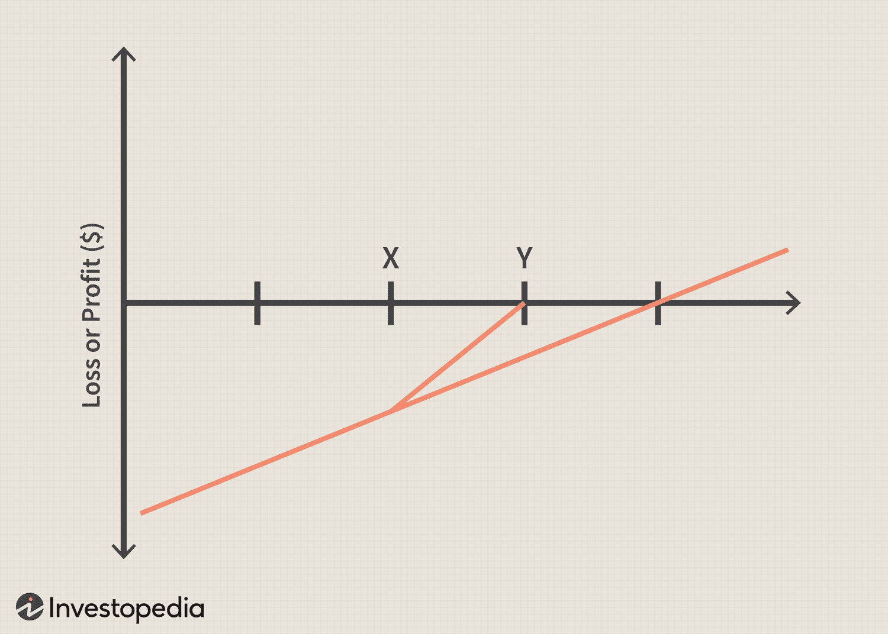

In the world of trading, both beginners and experts face the challenge of broken trades, which can result in significant financial losses. A trade is considered broken when it does not execute as intended, often due to factors such as market volatility, execution errors, or technical glitches. Despite advancements in technology, these issues remain prevalent, causing concern among traders who rely on accurate and efficient transactions to maintain profitability.

The advent of algorithmic trading has revolutionized how trades are executed, bringing speed and precision to the financial markets. Algorithmic trading involves using computer programs that follow a set of predefined rules or algorithms to place trades. This method offers several advantages, including the ability to process large volumes of trades unencumbered by human emotion and fatigue. However, it doesn't completely eliminate the risk of trade failures. Errors can still occur, often stemming from flawed algorithms, unexpected market behavior, or technical failures. Consequently, even in algorithmic trading, the occurrence of broken trades remains a significant challenge.



A strategic approach, known as the repair strategy, offers a way to minimize the impact of these broken trades. Repair strategies are designed to mitigate losses by making calculated adjustments to existing trading positions. These could include options-based strategies, adjusting stop-loss limits, or rebalancing the portfolio. By addressing the root causes of trade failures and employing corrective measures, repair strategies can help traders recover from setbacks and optimize their overall trading outcomes.

This article will examine various trading strategies, with a specific focus on repairing broken trades within the context of algorithmic trading. Our goal is to equip traders with practical tools to enhance their trading performance and mitigate risks. By understanding both the mechanics of algorithmic trading and the nuances of repair strategies, traders can better navigate the complexities of modern financial markets and improve their trading efficiency.

## Table of Contents

## Understanding Broken Trades

Broken trades occur when a trade does not execute as planned, often leading to financial loss or missed opportunities. These failures in execution can be attributed to a variety of factors, including market volatility, execution errors, and technical glitches. Understanding the underlying reasons for these trade failures is essential for developing strategies to mitigate their impact.

Market volatility is a primary catalyst for broken trades, particularly in environments where prices change rapidly. In such scenarios, the intended trade price may no longer be available, leading to slippage—a situation where the executed price of a trade is different from the expected price. Slippage is more pronounced in highly volatile markets, where price movements are swift and unpredictable. For example, during economic announcements or geopolitical events, markets can experience sharp price swings, increasing the likelihood of broken trades.

Execution errors represent another common cause of trade failures. These errors can occur due to mistakes in order entry, such as entering the wrong order type or quantity. In manual trading, human error is a significant [factor](/wiki/factor-investing), but even [algorithmic trading](/wiki/algorithmic-trading) systems are not immune, as they may be incorrectly programmed or encounter unexpected inputs. For example, an algorithm might place a ‘buy’ order instead of a ‘sell’ order due to a coding mistake, leading to unintended market exposure.

Technical glitches also contribute to broken trades, particularly in electronic trading environments. These glitches may arise from system outages, connectivity issues, or software bugs. For instance, if a trading platform experiences downtime during an active trading session, orders may not be executed as planned, resulting in broken trades. Additionally, delays in data feeds or mismatches between order confirmations and executions can lead to inconsistencies and execution failures.

It's important to note that algorithmic trading, while offering speed and precision, is still susceptible to these issues. Algorithms depend on accurate market data and robust infrastructure, and any disruption can lead to erroneous trades. Algorithms may also face challenges in adapting to unexpected market conditions, such as 'flash crashes', which are sudden, severe stock price declines occurring within a very short time frame.

Identifying the root causes of broken trades is crucial for formulating an effective repair strategy. For instance, understanding that high-frequency trading in a volatile market carries inherent risks can inform the development of risk mitigation techniques such as setting limits on trade sizes or incorporating [volatility](/wiki/volatility-trading-strategies)-based adjustments in algorithms.

In summary, broken trades can stem from various causes, including market volatility, execution errors, and technical glitches. Recognizing these scenarios is key to developing effective repair strategies and ensuring consistent trading performance. By addressing these fundamental causes, traders can better protect themselves against the financial impacts of trade failures.

## Algorithmic Trading: An Overview

Algorithmic trading utilizes sophisticated computer programs to execute trades based on predefined rules or criteria. This technology has transformed the trading landscape by providing enhanced speed and accuracy, minimizing the latency between the decision-making process and the market execution. Key components of algorithmic trading systems include data acquisition, signal generation, risk management, and execution of trades, each playing a crucial role in ensuring the effectiveness of the trading strategy.

One of the primary advantages of algorithmic trading is its ability to process vast amounts of market data in real-time, enabling traders to identify and capitalize on fleeting market opportunities that manual trading might miss. Algorithms are designed to react instantaneously to market conditions, thus optimizing the timing of trades and potentially increasing profitability.

Despite its benefits, algorithmic trading is not without vulnerabilities. Errors may arise from a variety of sources, including incorrect algorithm design, data inaccuracies, and unforeseen market conditions. A common error type stems from assumptions in the algorithm that no longer hold true, such as market conditions changing unexpectedly or the data-driven model encountering scenarios beyond its training. For instance, an algorithm may be based on historical price movements that no longer predict future prices due to a shift in market dynamics.

Algorithmic trading is also susceptible to technical glitches, such as software bugs or infrastructure failures that could result in erroneous trades or missed opportunities. An example is the "flash crash" of May 6, 2010, where rapid, automated trading led to a temporary but severe drop in market indices. This underscores the importance of rigorous testing and ongoing monitoring of trading systems to detect and rectify potential issues promptly.

Managing these vulnerabilities requires robust risk management protocols and the ability to implement changes swiftly. Traders often use complex algorithms that include built-in safeguards, such as kill-switches that halt trading if certain risk parameters are breached. Moreover, the integration of [machine learning](/wiki/machine-learning) techniques offers the potential to adapt more dynamically to new information, improving algorithm reliability over time.

Understanding the intricacies of algorithmic trading, along with its associated risks, is critical for implementing efficient repair strategies. These strategies are designed to mitigate the impact of trade failures, ensuring that algorithmic systems can recover or adjust to adverse trading outcomes effectively. The pursuit of developing resilient trading systems is an evolving challenge, particularly as markets become increasingly automated and interconnected.

 to Repair Strategies

Repair strategies are pivotal in the risk management toolkit of traders, particularly when addressing the challenges presented by broken trades. These strategies are designed to mitigate the adverse effects of trades that do not execute as anticipated, thereby preserving capital and enhancing overall trading performance.

One fundamental approach to repair strategies is options-based, which involves using options to either protect or enhance existing positions. For instance, if an underlying stock position has declined, a trader might purchase a call option to capitalize on potential upside recovery without further increasing risk exposure. Conversely, selling a put option might offset some losses if the trader anticipates stabilization or a rebound in the stock price. This method allows for flexibility in handling market shifts and can help in locking in partial profits or safeguarding against further downturns.

Another approach entails adjusting stop-loss limits. A stop-loss is an order placed to sell a security when it reaches a certain price, intended to limit an investor's loss on a position. By carefully recalibrating these limits in response to market conditions, traders can effectively manage trades that may not be performing to expectations. This requires astute market analysis and the ability to adapt to changing trends swiftly.

Rebalancing the portfolio is also a critical repair strategy. This involves realigning the weightings of a portfolio of assets. Rebalancing can be employed to adjust the position sizes in response to evolving market dynamics, ensuring that the portfolio remains aligned with the trader's risk tolerance and investment goals. This ongoing process helps in mitigating risks associated with market volatility and can enhance returns through disciplined asset allocation.

Incorporating mathematical and computational techniques can enhance the effectiveness of repair strategies. For example, the application of algorithms to analyze options pricing models or to determine optimal stop-loss levels is crucial. One common approach is using the Black-Scholes model for option pricing:

$$
C = S_0N(d_1) - Xe^{-rT}N(d_2)
$$

Where:
- $C$ is the call option price
- $S_0$ is the current stock price
- $X$ is the strike price
- $r$ is the risk-free interest rate
- $T$ is the time to expiration
- $N$ is the cumulative distribution function of the standard normal distribution

Python can be employed to simulate various scenarios and evaluate options strategies programmatically:

```python
from scipy.stats import norm
import numpy as np

def black_scholes(S, X, T, r, sigma, option_type='call'):
    d1 = (np.log(S / X) + (r + 0.5 * sigma ** 2) * T) / (sigma * np.sqrt(T))
    d2 = d1 - sigma * np.sqrt(T)

    if option_type == 'call':
        price = S * norm.cdf(d1) - X * np.exp(-r * T) * norm.cdf(d2)
    elif option_type == 'put':
        price = X * np.exp(-r * T) * norm.cdf(-d2) - S * norm.cdf(-d1)

    return price

# Example usage
call_price = black_scholes(S=100, X=100, T=1, r=0.05, sigma=0.2)
```

Options analysis and the decision-making involved in establishing repair strategies are essential components of sophisticated trading practices. By employing these strategies, traders can effectively navigate the complexities of financial markets, thereby reducing potential losses and optimizing their risk-return profiles.

## Implementing a Repair Strategy in Algorithmic Trading

Implementing a repair strategy in algorithmic trading demands a comprehensive understanding of both the trading algorithms involved and the mechanisms available for repair. A systematic approach to integrating these strategies can enhance the resilience of trading systems against unforeseen trade failures.

**Automating Repair Strategies**

Automation of repair strategies can significantly reduce the latency associated with manual interventions, thus curbing potential losses more effectively. By setting predefined triggers, traders can automate responses to trade failures. For instance, a trading system could be programmed to initiate a repair action, such as adjusting an open position, if the price of an asset deviates from its expected path by more than a certain threshold.

Machine learning techniques can further enhance the capability of these automated systems. By employing models such as decision trees or neural networks, systems can predict the likelihood of a trade failing based on historical data. Python's libraries, such as scikit-learn for machine learning and pandas for data manipulation, provide robust tools for implementing these predictive models. An example code snippet for a simple repair trigger could look like this:

```python
import pandas as pd
from sklearn.ensemble import RandomForestClassifier

# Historical trade data
data = pd.read_csv('trade_data.csv')
features = data[['price', 'volume', 'volatility']]
target = data['failed_trade']

# Initialize machine learning model
model = RandomForestClassifier()

# Train model
model.fit(features, target)

# New trade features
new_trade = pd.DataFrame({'price': [105], 'volume': [300], 'volatility': [1.2]})

# Predict and repair
if model.predict(new_trade)[0] == 1:
    print("Repair strategy triggered: Consider adjusting or closing the position.")
```

**Best Practices for Implementation**

To effectively implement repair strategies in algorithmic trading, certain best practices should be considered:

1. **Risk Management**: Define clear risk parameters and ensure that repair strategies do not exacerbate the potential for losses. Tools like value-at-risk (VaR) can be employed to assess potential losses.

2. **Backtesting and Simulation**: Prior to deployment, strategies should be rigorously backtested using historical data. Simulation environments can help traders understand how repair strategies might perform under different market conditions.

3. **Monitoring and Feedback Loops**: Establishing continuous monitoring allows for real-time adjustments to repair strategies. Feedback loops can further refine algorithms by integrating insights from each deployment.

4. **Scalability and Flexibility**: Ensure that the implemented strategies can scale with increasing trade volumes and adapt to new market conditions or instruments.

**Real-World Examples**

One notable example of successful implementation of repair strategies is in high-frequency trading ([HFT](/wiki/high-frequency-trading-strategies)) firms. These firms employ sophisticated algorithms to make numerous trades within milliseconds, making them particularly susceptible to trade failures. By integrating real-time data analytics and machine learning modules, these firms can dynamically adjust trading decisions to repair broken trades swiftly.

Moreover, asset management companies have leveraged repair mechanisms by incorporating options strategies as a hedge against primary portfolio failures. For instance, if a particular equity position declines unexpectedly, options contracts can be activated to recoup some losses.

In conclusion, integrating repair strategies in algorithmic trading requires careful planning and implementation of technology-driven solutions. Automation, risk management, and real-world validation through [backtesting](/wiki/backtesting) and live monitoring are crucial components of a robust repair strategy framework in modern trading systems.

## Benefits and Challenges of Repair Strategies

Repair strategies in trading provide significant benefits by reducing potential losses and enhancing trade outcomes. Their ultimate aim is to minimize the adverse effects of broken trades by adjusting affected positions post-failure. Such strategies can transform potentially detrimental situations into manageable ones, thus contributing to overall trading resilience.

One of the key benefits of repair strategies is the potential for loss reduction. By implementing corrective actions, traders can reposition their portfolios to mitigate the negative effects of unexpected market events or trade execution errors. For instance, employing an options-based repair strategy might involve purchasing call options to cover a sell position that has gone awry. This allows for potential gains if the market moves in a favorable direction, thus offsetting some of the initial losses.

Moreover, repair strategies can lead to improved trade outcomes by leveraging market volatility. They offer the opportunity to capitalize on price fluctuations that initially caused the trade failure. For example, adjusting stop-loss limits post-failure, or rebalancing the portfolio to align with the current market conditions, can enhance the probability of returning to a profitable position. These strategies require proactive market analysis and decision-making, which, although challenging, can offer considerable rewards when executed correctly.

Despite these benefits, repair strategies come with inherent challenges. The most prominent is their complexity, especially in execution. Creating an effective repair strategy requires a comprehensive understanding of market mechanics, a robust knowledge of financial instruments, and the ability to predict potential market movements. This complexity is further compounded when integrating these strategies within algorithmic trading systems, which demand precise coding and algorithmic adjustments.

Another challenge is the necessity for precise market knowledge. Successful implementation relies on accurate market predictions and timely execution. Traders must often make quick decisions based on incomplete information, which necessitates a high degree of expertise and intuition. There is also a risk of overcompensating, wherein excessive adjustments to a trade might lead to further losses instead of recovering from an initial setback.

Understanding the trade-off between risk and reward is essential for optimizing repair strategies. While these strategies can position traders advantageously, they also demand a careful balance. Excessive risk-taking in attempts to repair a trade could exacerbate losses if market conditions do not improve as anticipated. Therefore, traders must evaluate the risk of further market exposure against potential recovery benefits.

In conclusion, while repair strategies offer pathways to mitigate losses and improve trading results, they require detailed analysis and cautious execution to handle their complexities effectively. Both knowledge and a strategic approach are vital to achieving a successful balance between potential gains and inherent risks. By weighing these aspects thoroughly, traders can optimize repair strategies to complement their broader trading objectives.

## Conclusion

Effective management of broken trades is crucial for sustaining profitability in both manual and algorithmic trading. Repair strategies are instrumental tools that can help traders offset the adverse effects of trade failures. By intelligently adjusting existing positions, these strategies can mitigate losses and improve overall trading performance.

The dynamic nature of financial markets necessitates continuous learning and adaptation. Traders must regularly evaluate and refine their repair strategies to keep them relevant and effective. This ongoing process ensures that strategies remain aligned with evolving market conditions and trading technologies.

The integration of algorithmic trading platforms with customized repair strategies offers a promising pathway for achieving success in trading. By leveraging technology, traders can automate repair processes, thereby reducing execution times and minimizing human error. This automation can include setting predefined triggers or employing machine learning techniques to predict and respond to potential trade failures efficiently.

Ultimately, combining algorithmic trading's speed and precision with strategic repair mechanisms can enhance a trader's capability to navigate complex market environments. This synergy not only supports consistent profitability but also lays the foundation for a successful and sustainable trading career in an increasingly automated financial landscape.

## References & Further Reading

[1]: Chan, E. P. (2008). ["Quantitative Trading: How to Build Your Own Algorithmic Trading Business"](https://github.com/ftvision/quant_trading_echan_book). Wiley.

[2]: Lopez de Prado, M. (2018). ["Advances in Financial Machine Learning"](https://books.google.com/books/about/Advances_in_Financial_Machine_Learning.html?id=oU9KDwAAQBAJ). Wiley.

[3]: Aronson, D. R. (2006). ["Evidence-Based Technical Analysis: Applying the Scientific Method and Statistical Inference to Trading Signals"](https://onlinelibrary.wiley.com/doi/book/10.1002/9781118268315). Wiley.

[4]: Jansen, S. (2020). ["Machine Learning for Algorithmic Trading"](https://github.com/stefan-jansen/machine-learning-for-trading). Packt Publishing.

[5]: Bergstra, J., Bardenet, R., Bengio, Y., & Kégl, B. (2011). ["Algorithms for Hyper-Parameter Optimization."](https://dl.acm.org/doi/10.5555/2986459.2986743) Advances in Neural Information Processing Systems 24.