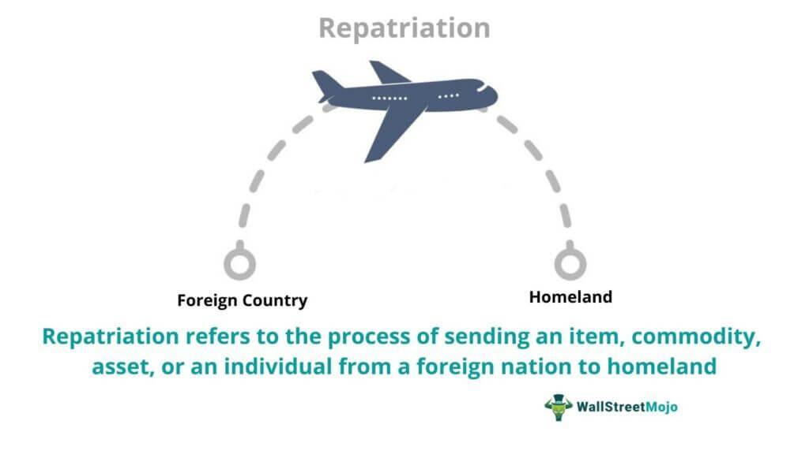

## Table of Contents

## What is repatriation of currency?

Repatriation of currency means bringing money back to your home country from another country. This often happens when people or businesses earn money in a foreign country and want to use it in their own country. For example, if a company in the United States makes money in Japan, it might want to bring that money back to the U.S. to use it there.

Sometimes, governments have rules about how much money can be brought back and when. These rules can affect how easy or hard it is to move money between countries. For instance, some countries might tax the money that is brought back, which can make repatriation less appealing. Understanding these rules is important for anyone who earns money abroad and wants to use it at home.

## Why is repatriation of currency important for businesses?

Repatriation of currency is important for businesses because it allows them to use the money they earn in other countries back home. For example, if a business in the United States makes money in Europe, it can bring that money back to the U.S. to pay for things like salaries, new projects, or to invest in growing the business. Without repatriation, the money would stay in Europe, and the business might not be able to use it where it's needed most.

Also, repatriation helps businesses manage their money better. If a company can bring money back home, it can plan its finances more easily. This is important because it helps the business know how much money it has to spend and invest. Sometimes, rules about repatriation can make it harder or more expensive to bring money back, so businesses need to understand these rules to make good financial decisions.

## How does repatriation of currency affect a country's economy?

When businesses bring money back to their home country, it can help the economy grow. This is because the money can be used to pay workers, start new projects, or invest in businesses. More money moving around means more jobs and more spending, which can make the economy stronger. For example, if a company in the United States brings money back from Europe, it might use that money to build a new factory, which creates jobs and helps the economy.

However, if there are a lot of rules or taxes on bringing money back, it might make businesses keep their money in other countries. This can mean less money is available to help the home country's economy. If businesses can't bring their money home easily, they might not be able to grow as much or create as many jobs. This can slow down the economy and make it harder for the country to do well.

## What are the common methods of repatriating currency?

One common way to bring money back home is through bank transfers. A business or person can use a bank in the foreign country to send money to their bank account back home. This is often done using services like wire transfers or electronic funds transfers. These methods can be quick and easy, but sometimes they come with fees or exchange rates that can make it more expensive.

Another method is through dividend payments. If a company has a branch in another country, it can pay dividends from that branch back to the main company in the home country. This way, the money earned abroad comes back home as profit. This can be useful for big companies with lots of international branches.

Sometimes, businesses might use more complex methods like reinvesting profits or setting up special financial structures. For example, a company might reinvest its foreign earnings into buying assets in the home country. This can be a way to bring money back without directly transferring it. Each method has its own rules and costs, so businesses need to choose the one that works best for them.

## Can you explain the process of currency repatriation?

When a business or person wants to bring money back to their home country from another country, they start by figuring out how much money they want to move. They usually do this through a bank or a financial service. For example, if a company in the United States made money in Japan, they would go to a bank in Japan and ask to send that money to their bank account in the U.S. The bank might use a wire transfer or an electronic funds transfer to move the money. Sometimes, there are fees or different exchange rates that can make this more expensive, so it's important to understand these costs.

Another way to bring money back is through dividend payments. If a company has a branch in another country, it can send the profits from that branch back to the main company at home as dividends. This is a common way for big companies to move money around the world. For example, if a U.S. company has a branch in Germany, it can pay dividends from Germany back to the U.S. Sometimes, businesses use more complex methods like reinvesting profits or setting up special financial structures to bring money back. Each method has its own rules and costs, so it's important to choose the best one for the situation.

## What are the tax implications of repatriating currency?

When you bring money back to your home country from another country, you might have to pay taxes on it. Different countries have different rules about these taxes. For example, in the United States, there used to be a big tax on money brought back from other countries, but the tax laws changed in 2017 to make it easier for businesses to bring money home. This can make a big difference in how much money a business decides to bring back, because the tax can make it more or less expensive.

Sometimes, countries have special rules to encourage businesses to bring money back. They might offer lower taxes or tax breaks to make repatriation more appealing. But even with these rules, businesses need to think carefully about the tax costs. Paying taxes on the money you bring back can eat into your profits, so understanding the tax laws in both the foreign country and your home country is important before you decide to move money.

## How do exchange rates impact currency repatriation?

Exchange rates can make a big difference when you bring money back to your home country. If the exchange rate is good, you get more of your home country's money for the same amount of foreign money. For example, if the exchange rate between the U.S. dollar and the Japanese yen is good, a U.S. company can get more dollars for the yen it earned in Japan. This makes it more appealing to bring the money back home because the company gets more value out of it.

On the other hand, if the exchange rate is bad, you get less of your home country's money for the same amount of foreign money. This can make it less appealing to bring the money back because the company loses value. Businesses need to watch exchange rates carefully and decide the best time to move their money. Sometimes, they might wait for a better exchange rate before bringing the money back to get the most value out of it.

## What are the challenges faced by companies during currency repatriation?

Companies face several challenges when they want to bring money back to their home country. One big challenge is dealing with different rules and taxes in different countries. Some countries might have high taxes on money brought back, which can make it expensive for companies. They need to understand these rules well to avoid losing too much money. Another challenge is the exchange rate. If the exchange rate is not good, companies might get less money back than they expected. They need to watch the exchange rates closely and decide the best time to move their money to get the most value out of it.

Another challenge is the time and cost of moving money. Using banks or other financial services to move money can take time and come with fees. These fees can add up and make it more expensive to bring money back. Companies need to find the best way to move their money that is both fast and cost-effective. Sometimes, they might use more complex financial methods, like reinvesting profits or setting up special structures, to bring money back. But these methods can also be tricky and need a lot of planning and understanding of financial rules.

## Can you provide an example of successful currency repatriation?

A good example of successful currency repatriation happened with Apple, a big technology company from the United States. Apple had a lot of money saved up in other countries, especially Ireland, because of the low taxes there. In 2018, after the U.S. changed its tax laws to make it easier to bring money back home, Apple decided to repatriate a huge amount of money. They brought back over $250 billion, which was one of the biggest repatriations ever. This helped Apple use the money to buy back its own stock, pay dividends to shareholders, and invest in new projects in the U.S.

The success of Apple's repatriation showed how important it is to watch tax laws and plan carefully. By waiting for the right time and taking advantage of the new U.S. tax rules, Apple was able to bring back a lot of money without paying too much in taxes. This example also shows how repatriation can help a company grow and use its money better in its home country. It's a good lesson for other companies about the benefits of understanding and using repatriation strategies well.

## What role do government regulations play in currency repatriation?

Government regulations are very important when it comes to bringing money back to your home country. Different countries have different rules about how much money you can bring back and what taxes you have to pay. For example, some countries might have high taxes on money brought back, which can make it expensive for businesses. These rules can change over time, like when the United States changed its tax laws in 2017 to make it easier for companies to bring money home. Businesses need to understand these rules well so they can plan when and how to move their money without losing too much to taxes.

These regulations can also affect how businesses decide to use their money. If the rules make it hard or expensive to bring money back, companies might choose to keep their money in other countries. This can mean less money is available to help the home country's economy grow. On the other hand, if the government makes it easier to bring money back, more businesses might choose to do so, which can help create jobs and boost the economy. So, government regulations play a big role in deciding how and when companies bring their money back home.

## How do multinational corporations manage repatriation risks?

Multinational corporations manage repatriation risks by carefully watching exchange rates and tax laws. They need to know when the exchange rate is good so they can bring money back when they will get the most value. They also need to understand the tax laws in both the country where they made the money and their home country. If the taxes are high, it might be better to wait until the laws change to make repatriation cheaper. Companies often work with financial experts to help them make these decisions and find the best time to move their money.

Another way they manage risks is by using different financial methods to bring money back. Some companies might reinvest their foreign earnings into buying assets in their home country instead of directly transferring the money. This can be a way to avoid high taxes or bad exchange rates. They might also set up special financial structures to move money around. These methods can be complex, but they help companies protect their money and make sure they can use it where it's needed most.

## What future trends might affect currency repatriation strategies?

In the future, changes in tax laws around the world might make a big difference in how companies bring money back to their home countries. Governments might make new rules to encourage businesses to bring money home, or they might make it more expensive. Companies will need to keep an eye on these changes and plan their money moves carefully. For example, if a country lowers taxes on money brought back, more companies might choose to repatriate their earnings. On the other hand, if taxes go up, companies might wait for better times or find other ways to use their money.

Another trend that could affect currency repatriation is the use of technology. More and more, companies are using digital tools to move money quickly and easily across borders. This can make it faster and cheaper to bring money back home. However, with new technology, there might also be new rules and risks to watch out for. Companies will need to stay up to date with these changes and use technology wisely to manage their money. Overall, keeping an eye on tax laws and using new technology will be important for companies planning their currency repatriation strategies in the future.

## What is Repatriation?

Repatriation refers to the process of converting foreign earnings into the domestic currency and transferring them back to the home country. This is a common financial activity for individuals or corporations that have accumulated wealth abroad and wish to bring it back for use in their local economy. For individuals, repatriation could occur due to earnings from employment overseas, investments, or property sales. For corporations, it often involves profits gained from international operations.

Several critical factors influence the repatriation process. Foreign exchange rates are paramount, as fluctuations can impact the value of the funds once converted into the domestic currency. For example, a favorable exchange rate can increase the amount of money received during repatriation, while an unfavorable rate can reduce it. This is mathematically represented by the formula:

$$
\text{Domestic Currency Value} = \text{Foreign Currency Amount} \times \text{Exchange Rate}
$$

Geopolitical risks also play a significant role. Political instability or changes in government policies in either the foreign or home country can affect the decision or ability to repatriate funds. For instance, sudden changes in foreign exchange controls, like capital controls or restrictions on currency conversion, can hinder the repatriation process.

Additionally, domestic economic policies impact repatriation. Governments might impose taxes or offer incentives on repatriated funds. A country may have policies designed to encourage the inflow of funds, such as tax holidays or reduced tax rates on repatriated income, which can be a deciding [factor](/wiki/factor-investing) for individuals and corporations.

Thus, repatriation is not merely a mechanical process of currency conversion but is affected by a confluence of economic and political factors that necessitate careful consideration and planning.

## What is the Role of Currency Exchange in Repatriation?

Currency exchange is a pivotal aspect of repatriation, involving the conversion of foreign earnings into the domestic currency. This process necessitates keen attention to exchange rate dynamics, as fluctuations can substantially impact the outcome of financial repatriation efforts.

Exchange rate [volatility](/wiki/volatility-trading-strategies) is a primary consideration in this context. Exchange rates are influenced by a myriad of factors, including inflation rates, interest rates, geopolitical events, and economic indicators. These variances can lead to unpredictability in the value of one currency relative to another. For instance, if a company earned revenue in a foreign currency, a favorable exchange rate at the time of conversion would result in a higher equivalent in the home currency, bolstering financial returns. Conversely, an adverse exchange rate would diminish the returned value, emphasizing the importance of timing and strategy in currency exchange.

Accurate market forecasts and trend analysis play essential roles in optimizing currency conversion for repatriation. By leveraging financial models and predictive analytics, stakeholders can gain insights into potential currency movements. A popular tool for such analysis is the moving average, which helps smooth out price data by creating a constantly updated average price. The formula is commonly expressed as:

$$
MA = \frac{(P_1 + P_2 + ... + P_n)}{n}
$$

where $MA$ is the moving average, $P$ represents the price at each point, and $n$ is the total number of periods considered.

Predictive modeling, often powered by algorithmic tools, enhances decision-making by offering probabilistic estimates of future exchange rates. Python is frequently used in such scenarios due to its robust libraries like NumPy and pandas for data manipulation, and scikit-learn for predictive modeling. The following Python snippet demonstrates a simple moving average calculation:

```python
import pandas as pd

# Assuming df is a pandas DataFrame with a column 'foreign_currency_value'
df['moving_average'] = df['foreign_currency_value'].rolling(window=5).mean()
```

This approach allows stakeholders to act strategically, minimizing risks and potentially capitalizing on favorable conditions. As such, understanding and effectively managing the intricacies of currency exchange can lead to more successful and financially advantageous repatriation processes.

## What are the challenges and considerations in financial transfer?

Transferring funds internationally is fraught with various challenges, including substantial transaction fees and intricate regulatory requirements. Financial institutions often levy additional charges that depend on the amount and destination of the transfer. These fees can include fixed charges, variable rates based on the transfer amount, and percentage-based fees. For instance, if a bank charges a 1% fee for transfers, it can be calculated as follows for a transfer amount $A$:

$$
\text{Fee} = A \times 0.01
$$

Regulatory challenges add another layer of complexity. Different countries have distinct financial laws and regulations that must be navigated. In the United States, the Office of Foreign Assets Control (OFAC) oversees the enforcement of economic and trade sanctions, while the European Union follows stringent Anti-Money Laundering (AML) directives. Compliance with these regulations is critical, as violations can result in severe penalties.

Successful navigation of these hurdles requires strategic planning. This involves understanding both domestic and international laws, preparing documentation to meet compliance standards, and potentially utilizing hedging strategies to address foreign exchange risks. Companies may also need to engage with legal professionals specializing in international finance to ensure adherence to all relevant regulations, thus minimizing potential risks during the transfer process.

## References & Further Reading

[1]: Cao, L. (2007). ["Support Vector Machines Experts for Time Series Forecasting."](https://www.semanticscholar.org/paper/Support-vector-machines-experts-for-time-series-Cao/38ed2365b3feecf86d3442460e5b83438e14936f) Journal of Information Science, 33(3), 267-283.

[2]: Lopez de Prado, M. (2018). ["Advances in Financial Machine Learning."](https://www.amazon.com/Advances-Financial-Machine-Learning-Marcos/dp/1119482089) John Wiley & Sons.

[3]: Chan, E. P. (2009). ["Quantitative Trading: How to Build Your Own Algorithmic Trading Business."](https://github.com/ftvision/quant_trading_echan_book) John Wiley & Sons.

[4]: Aronson, D. R. (2006). ["Evidence-Based Technical Analysis: Applying the Scientific Method and Statistical Inference to Trading Signals."](https://www.amazon.com/Evidence-Based-Technical-Analysis-Scientific-Statistical/dp/0470008741) John Wiley & Sons.

[5]: Jansen, S. (2020). ["Machine Learning for Algorithmic Trading."](https://github.com/stefan-jansen/machine-learning-for-trading) Packt Publishing.

[6]: Aldridge, I. (2013). ["High-Frequency Trading: A Practical Guide to Algorithmic Strategies and Trading Systems."](https://www.ahmetbeyefendi.com/wp-content/uploads/2020/07/High-Frequency-Trading-Irene-Aldridge.pdf) John Wiley & Sons.

[7]: Abarbanell, J. S., & Bushee, B. J. (1998). ["Abnormal Returns to a Fundamental Analysis Strategy."](https://papers.ssrn.com/sol3/papers.cfm?abstract_id=40740) The Accounting Review, 73(1), 19-45.