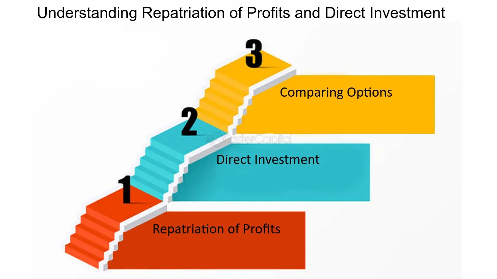

## Table of Contents

## What does repatriation of funds mean?

Repatriation of funds means bringing money back to your home country from another country. For example, if you work in another country and earn money there, you might want to send that money back to your home country. This is common for businesses and individuals who operate internationally.

Sometimes, governments have rules about how much money can be brought back and when. These rules can make repatriation more difficult. For instance, a country might limit the amount of money that can be moved out of their country to control their economy. So, it's important to know the rules of both the country where the money is earned and the country where it will be sent.

## Why do companies need to repatriate funds?

Companies need to repatriate funds to bring the money they earn in other countries back to their home country. This is important because it helps them use that money for things like paying employees, investing in new projects, or giving money back to shareholders. If a company has operations in many countries, the money they make in one place might be needed in another to keep the business running smoothly.

Sometimes, companies also repatriate funds to take advantage of better financial conditions at home. For example, if the interest rates are lower in their home country, it might be cheaper to borrow money there. Or, if the tax rates are lower, it could save them money. But, they need to be careful because different countries have different rules about moving money across borders, and these rules can make repatriation harder or more expensive.

## What are the common reasons for repatriating funds?

Companies often bring money back to their home country because they need it for things like paying workers, starting new projects, or giving money to people who own part of the company. If a company makes money in another country, they might want to use that money back home to keep their business running well. It's like having money in different pockets; sometimes you need to move it from one pocket to another to use it where it's needed most.

Another reason is to take advantage of better financial situations at home. For example, if borrowing money is cheaper in their home country, it makes sense to bring money back there. Or, if taxes are lower at home, it could save the company money. But, moving money across borders can be tricky because different countries have different rules. These rules can make it harder or more expensive to bring money back, so companies have to plan carefully.

## What are the challenges companies face when repatriating funds?

When companies want to bring their money back home from another country, they often face some big challenges. One main problem is the rules and laws in different countries. Some countries have strict limits on how much money can be moved out. These limits can make it hard or even impossible for a company to bring all their money back at once. Also, there might be special taxes or fees that the company has to pay when they move money across borders, which can make it more expensive.

Another challenge is the exchange rate between different currencies. If the value of one country's money goes up or down compared to another country's money, it can change how much the company gets when they bring their money back. This can be risky because the company might end up with less money than they expected. On top of that, the whole process of moving money can take a long time and needs a lot of paperwork, which can slow things down and add to the costs.

## How do tax implications affect the repatriation of funds?

When companies bring money back to their home country, they have to think about taxes. Different countries have different tax rules, and these rules can make repatriating funds more expensive. For example, some countries put a special tax on money that comes in from another country. This means the company has to pay extra money to the government just for bringing their earnings back home. Also, the tax rate in the home country might be higher than where the money was earned, so the company ends up paying more in taxes than they would have if they kept the money abroad.

Another thing to consider is how tax treaties between countries can affect repatriation. Sometimes, two countries agree on special tax rules to help businesses move money more easily. These treaties can lower the taxes a company has to pay when bringing money back. But, figuring out these treaties can be complicated, and companies often need help from tax experts to make sure they're following all the rules. So, taxes play a big role in deciding when and how to bring money back home, and companies need to plan carefully to manage these costs.

## What are the different methods used for repatriating funds?

Companies have a few different ways to bring money back to their home country. One common method is through dividend payments. This is when a foreign branch of the company sends profits back to the parent company as dividends. Another way is through royalty payments, where the foreign branch pays the parent company for using things like patents or trademarks. Companies can also use intercompany loans, where the foreign branch borrows money from the parent company and then pays it back, effectively moving money back home.

Another method is through the sale of goods or services. The foreign branch can sell products to the parent company, and the payment for these sales goes back home. Sometimes, companies use what's called a cost-sharing agreement, where the foreign branch and the parent company share the costs of things like research and development, and this can also move money back to the home country. Each of these methods has its own rules and can be affected by taxes and other regulations, so companies need to pick the best way for their situation.

Choosing the right method depends on a lot of things like the tax rules in both countries, how much money needs to be moved, and how quickly it needs to happen. Sometimes, companies mix different methods to get the best results. It's important for them to work with tax experts and financial advisors to make sure they're following all the rules and getting the most out of their money.

## Can you explain the process of repatriating funds through dividends?

When a company wants to bring money back home through dividends, it's like sharing the profits from a foreign branch with the main company. The foreign branch makes money and decides to send some of it back to the parent company as a dividend. This is a common way to move money because it's straightforward. The foreign branch just needs to follow the rules of both countries, like paying any taxes that might be due on the dividends.

The process starts with the foreign branch calculating its profits and deciding how much to send back as dividends. They then need to make sure they're following the tax laws of the country they're in, which might mean paying a withholding tax on the dividends. After that, they send the money to the parent company. The parent company then has to report this money as income and pay any taxes required by their home country. It's important for the company to plan this carefully to make sure they're not paying more in taxes than they need to.

## How do currency exchange rates impact the repatriation of funds?

When companies bring money back to their home country, they have to change the money from one country's currency to another. This is called a currency exchange, and the rate at which one currency can be exchanged for another can change all the time. If the exchange rate is good, the company might get more money back than they expected. But if the rate is bad, they might get less. This can be a big problem because the company might plan to use that money for important things like paying workers or starting new projects, and if they get less money than they thought, it can mess up their plans.

Because exchange rates can change a lot, companies have to be careful when they decide to bring money back. They might try to wait for a better exchange rate, but waiting can be risky because no one knows for sure what will happen. Sometimes, companies use special financial tools, like forward contracts, to lock in a good exchange rate for the future. This can help them know exactly how much money they'll get when they bring it back, which makes planning easier. But even with these tools, currency exchange rates can still make repatriating funds a tricky and risky process.

## What role do government regulations play in the repatriation of funds?

Government rules can make it harder or easier for companies to bring money back home. Different countries have different laws about moving money across borders. Some countries might limit how much money can be taken out, which means a company might not be able to bring all their money back at once. There can also be special taxes or fees that the company has to pay when they move money, which can make it more expensive. These rules are there to help the government control their economy, but they can create big challenges for companies trying to move their money.

Because of these rules, companies have to plan carefully when they want to bring money back. They need to know the laws of both the country where the money is earned and the country where it will be sent. Sometimes, the rules can change, so companies have to stay updated and might need help from experts to make sure they're following everything correctly. This can slow down the process and add to the costs, but it's important to do it right to avoid any legal problems.

## How can a company minimize the costs associated with repatriating funds?

Companies can save money when bringing funds back home by choosing the right way to move the money. One way is to pick the best method for sending money, like using dividends, royalties, or loans between different parts of the company. Each method has different costs and taxes, so [picking](/wiki/asset-class-picking) the one that costs the least can help save money. Another way is to use special agreements between countries that can lower taxes. These agreements, called tax treaties, can make it cheaper to bring money back if the company knows how to use them right.

Another important thing is to keep an eye on exchange rates. If the value of one country's money goes up or down compared to another, it can change how much the company gets when they bring their money back. To avoid losing money because of bad exchange rates, companies can use tools like forward contracts. These let them lock in a good exchange rate for the future, so they know exactly how much they'll get. Planning carefully and working with experts can help companies follow all the rules and find the cheapest way to bring their money home.

## What are the strategic considerations a company should evaluate before repatriating funds?

Before a company decides to bring money back home, they need to think about a few important things. First, they should look at the tax rules in both the country where the money is earned and the country where it will be sent. Some countries have special taxes or limits on moving money, which can make it more expensive or harder to bring the money back. The company should also check if there are any tax treaties between the two countries that could help lower the costs. Another thing to consider is the exchange rate between the two currencies. If the rate is bad, the company might get less money than they expected, so they might want to wait for a better rate or use tools like forward contracts to lock in a good rate.

Another important thing to think about is the timing and the method of bringing the money back. The company needs to decide if they should bring the money back all at once or in smaller amounts over time. This can depend on how much money they need at home and how the rules in both countries might change. They also need to pick the best way to move the money, like using dividends, royalties, or loans between different parts of the company. Each method has different costs and rules, so choosing the right one can save money. By planning carefully and working with experts, the company can make sure they're following all the rules and getting the most out of their money.

## How do international treaties and agreements influence the repatriation of funds?

International treaties and agreements can make it easier and cheaper for companies to bring money back home. These treaties often set special tax rules between countries, which can lower the taxes a company has to pay when they move money across borders. For example, two countries might agree that money sent back as dividends won't be taxed as much. This can save the company a lot of money and make it simpler to bring their earnings back. By understanding and using these treaties, companies can plan better and reduce the costs of moving money.

However, these treaties can also be complicated. Companies need to know the details of each treaty and how it applies to their situation. Sometimes, the rules can change, so they have to stay updated. Working with tax experts can help them make sure they're following all the rules and getting the best deal. Even with treaties, companies still have to think about other things like exchange rates and the methods they use to move money, but treaties can be a big help in making repatriation smoother and less expensive.

## What is Algorithmic Trading in Fund Transfers?

Algorithmic trading, commonly known as algo trading, revolutionizes fund transfers by utilizing automated platforms and sophisticated algorithms to execute trading strategies at high speeds and volumes. This approach is particularly advantageous in the context of fund transfers for repatriation, where optimization of conversion rates and timing can significantly enhance the financial value of transactions.

In fund transfers, the core advantage of [algorithmic trading](/wiki/algorithmic-trading) lies in its ability to synchronize the conversion and timing of repatriation to capitalize on favorable exchange conditions. By employing data-driven insights, algo trading systems analyze vast quantities of market data, detect patterns, and predict currency fluctuations. This predictive capability ensures that fund transfers occur at times when exchange rates are most advantageous, thereby maximizing the value of the repatriated funds.

To illustrate, consider the dynamic nature of foreign exchange markets, characterized by constant fluctuations in currency valuations due to geopolitical events, economic indicators, and market sentiment. Through predictive analytics and real-time data processing, algorithmic trading models can identify optimal points in time to execute currency conversions, enhancing the efficiency and effectiveness of fund transfers.

Mathematically, the optimization problem in algorithmic trading for fund transfers can be framed as:

$$
\max_{t} V(t) = E(t) \times F(t)
$$

where:

- $V(t)$ is the value of funds repatriated at time $t$.
- $E(t)$ represents the exchange rate at time $t$.
- $F(t)$ denotes the amount of foreign currency to be converted.

The algorithm aims to select the time $t$ that maximizes $V(t)$, leveraging real-time exchange rate forecasts and historical trends.

Moreover, the precision and speed offered by algorithmic trading contribute to its growing influence in international finance. The capability to execute transactions at microsecond intervals minimizes the impact of market [volatility](/wiki/volatility-trading-strategies), reducing transaction costs and enhancing the overall profitability of fund transfers. As a result, algorithmic trading is becoming integral to financial institutions and corporations seeking to optimize their international transactions.

In summary, the integration of algorithmic trading in fund transfers presents a transformative approach to managing currency exchange and timing, offering significant advantages in terms of efficiency and value maximization. As this technology continues to evolve, it is poised to play an increasingly pivotal role in the landscape of international finance.

## References & Further Reading

[1]: Biais, B., & Woolley, P. (2011). ["High Frequency Trading"](https://papers.ssrn.com/sol3/papers.cfm?abstract_id=1834344). Annual Review of Financial Economics, 3(1), 265-297.

[2]: Narang, R. K. (2009). ["Inside the Black Box: The Simple Truth About Quantitative Trading"](https://onlinelibrary.wiley.com/doi/book/10.1002/9781118267738). Wiley Finance.

[3]: Hull, J. (2018). ["Options, Futures, and Other Derivatives"](https://www.amazon.com/Options-Futures-Other-Derivatives-9th/dp/0133456315). Pearson Education.

[4]: Nakamoto, S. (2008). ["Bitcoin: A Peer-to-Peer Electronic Cash System"](https://nakamotoinstitute.org/library/bitcoin/). 

[5]: Tapscott, D., & Tapscott, A. (2016). ["Blockchain Revolution: How the Technology Behind Bitcoin and Other Cryptocurrencies is Changing the World"](https://dl.acm.org/doi/10.5555/3051781). Penguin.