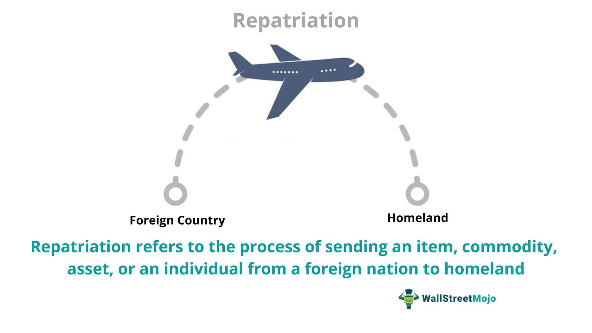

Repatriation of funds involves the transfer of assets from a foreign country to the home country of an individual or business. This process plays a significant role in international finance, influencing financial strategies for global businesses, individual investors, and expatriates. By converting foreign-held funds or profits into the domestic currency, repatriation ensures that resources are available to meet local financial obligations, investments, and consumption.

The dynamics of repatriation have evolved markedly in recent years due to technological advancements and regulatory changes. Regulatory bodies across the world have introduced measures that impact how cross-border transactions are conducted, aiming to curb money laundering, tax evasion, and other illegal financial practices. These regulations often dictate specific requirements for reporting and executing the transfer of funds, prompting both challenges and opportunities for stakeholders involved.

Technological innovations, particularly in financial technology (fintech), have revolutionized fund transfer operations, making them faster and more secure. Blockchain technology and digital payment solutions have introduced new levels of transparency and efficiency in financial transactions. Furthermore, the integration of algorithmic trading in financial markets has paved the way for optimizing fund transfers. Algorithmic trading allows for the execution of complex trading strategies at high speeds and volumes, facilitating better currency conversion rates and reducing exposure to unfavorable exchange rate fluctuations.

This article explores the intersection between repatriation, international finance, fund transfer mechanisms, and algorithmic trading. By examining these components, the article aims to highlight the potential improvements in efficiency and profitability that can be achieved through innovative strategies and technologies in the financial sector.

## Table of Contents

## Understanding Repatriation in International Finance

Repatriation in finance refers to the conversion of foreign currency or liquid assets into the currency of an individual's or a business's home country. This process is an essential component of international finance, impacting multinational corporations, foreign direct investments, and individual investors. Several key factors host significant influence over the efficiency and feasibility of repatriation efforts.

Firstly, exchange rates play a crucial role. Fluctuations in exchange rates can significantly affect the value of repatriated funds, thereby impacting financial outcomes for businesses and individuals. For instance, a favorable exchange rate can enhance the value of foreign earnings when converted to the home currency, whereas unfavorable rates can diminish it.

The economic conditions of both the host and home countries also influence repatriation. Economic stability, inflation rates, and overall financial health of a country can impact its currency's strength and, consequently, the value realized from converting foreign assets into the home currency. Moreover, multinational corporations often consider these economic factors when deciding on the timing and [volume](/wiki/volume-trading-strategy) of funds to repatriate.

Regulatory frameworks represent another crucial influence on repatriation. Countries may impose various regulations and restrictions on the movement of money across their borders. These regulations can include taxes on repatriated profits, caps on the amount that can be transferred, and documentation or reporting requirements. These regulatory mechanisms are often aimed at controlling capital flow and maintaining economic stability within the country.

Moreover, repatriation affects different financial stakeholders uniquely. For multinational corporations, it is a crucial aspect of profit management. The decision to repatriate earnings involves evaluating tax implications and potential reinvestment opportunities within the host country. For foreign direct investments, repatriation is vital in assessing the actual returns on investment, after accounting for taxes and currency conversion impacts. Individual investors, particularly expatriates, must navigate currency exchange challenges and tax obligations, which can differ significantly from one jurisdiction to another.

Overall, understanding repatriation in the context of international finance requires a comprehensive grasp of the interplay between exchange rates, economic conditions, and regulatory environments. These factors collectively determine the optimal approach for individuals and businesses when converting foreign assets into their home currency, ultimately impacting their financial strategies and outcomes.

## The Role of Fund Transfer Mechanisms

Fund transfer mechanisms are an integral component in ensuring the smooth and efficient repatriation of assets across international borders. In recent years, technological advancements have significantly transformed these mechanisms, enhancing both the speed and security of fund transfers. Among the most notable innovations are blockchain technology and fintech solutions, which have introduced new paradigms in the financial industry.

Blockchain technology, with its decentralized ledger system, offers enhanced security and transparency in transactions. By maintaining a distributed record of all transactions, blockchain minimizes the risk of fraud and enhances trust among parties involved in the transfer. This technology is particularly beneficial in cross-border transactions, as it can reduce the time and cost associated with traditional banking systems. A blockchain network can process transactions in a matter of minutes or even seconds, compared to several days required by conventional methods.

Fintech, a portmanteau of "financial technology," encompasses a broad range of technological innovations aimed at improving financial services. Fintech solutions leverage algorithms, data analytics, and cloud computing to optimize fund transfers. They enable real-time processing and provide users with immediate feedback on transfer statuses, thereby increasing efficiency and user satisfaction. Moreover, fintech applications often integrate compliance tools that help ensure adherence to legal and regulatory requirements.

Compliance with legal and regulatory frameworks is crucial for avoiding delays and penalties during fund transfers. Regulatory bodies across different jurisdictions impose various requirements that must be observed to ensure the legitimacy of cross-border financial transactions. These regulations are designed to prevent money laundering, fraud, and the financing of illegal activities. Consequently, businesses and individuals involved in international fund transfers need to remain updated on the latest compliance guidelines and incorporate robust verification processes.

Financial institutions, including banks and non-bank financial service providers, play a pivotal role in facilitating international fund transfers. They offer essential infrastructure and resources required for executing these transactions effectively. Financial institutions not only provide platforms for conducting transfers, but also offer guidance on regulatory compliance, currency exchange, and risk management. By leveraging their expertise and resources, financial institutions help ensure that fund transfers are conducted securely and efficiently, thereby supporting the broader financial ecosystem.

In conclusion, fund transfer mechanisms have evolved considerably due to technological advancements and the growing complexity of regulatory frameworks. The integration of blockchain and fintech solutions, along with robust compliance measures, has propelled the efficiency, security, and reliability of international fund transfers. Financial institutions remain central to this process, offering critical services and support to facilitate smooth repatriation of assets for individuals and corporations alike.

## Algorithmic Trading in Fund Transfers

Algorithmic trading, commonly known as algo trading, revolutionizes fund transfers by utilizing automated platforms and sophisticated algorithms to execute trading strategies at high speeds and volumes. This approach is particularly advantageous in the context of fund transfers for repatriation, where optimization of conversion rates and timing can significantly enhance the financial value of transactions.

In fund transfers, the core advantage of [algorithmic trading](/wiki/algorithmic-trading) lies in its ability to synchronize the conversion and timing of repatriation to capitalize on favorable exchange conditions. By employing data-driven insights, algo trading systems analyze vast quantities of market data, detect patterns, and predict currency fluctuations. This predictive capability ensures that fund transfers occur at times when exchange rates are most advantageous, thereby maximizing the value of the repatriated funds.

To illustrate, consider the dynamic nature of foreign exchange markets, characterized by constant fluctuations in currency valuations due to geopolitical events, economic indicators, and market sentiment. Through predictive analytics and real-time data processing, algorithmic trading models can identify optimal points in time to execute currency conversions, enhancing the efficiency and effectiveness of fund transfers.

Mathematically, the optimization problem in algorithmic trading for fund transfers can be framed as:

$$
\max_{t} V(t) = E(t) \times F(t)
$$

where:

- $V(t)$ is the value of funds repatriated at time $t$.
- $E(t)$ represents the exchange rate at time $t$.
- $F(t)$ denotes the amount of foreign currency to be converted.

The algorithm aims to select the time $t$ that maximizes $V(t)$, leveraging real-time exchange rate forecasts and historical trends.

Moreover, the precision and speed offered by algorithmic trading contribute to its growing influence in international finance. The capability to execute transactions at microsecond intervals minimizes the impact of market [volatility](/wiki/volatility-trading-strategies), reducing transaction costs and enhancing the overall profitability of fund transfers. As a result, algorithmic trading is becoming integral to financial institutions and corporations seeking to optimize their international transactions.

In summary, the integration of algorithmic trading in fund transfers presents a transformative approach to managing currency exchange and timing, offering significant advantages in terms of efficiency and value maximization. As this technology continues to evolve, it is poised to play an increasingly pivotal role in the landscape of international finance.

## Challenges and Opportunities in Repatriation

Repatriation presents both challenges and opportunities, particularly as global finance continues to evolve. One of the primary challenges in repatriating funds is navigating fluctuating exchange rates. Currency volatility can significantly impact the value of assets when they are converted back to the home currency. For instance, if repatriation occurs when the home currency strengthens against the foreign currency, the value of the repatriated funds might be less than anticipated. Businesses and investors must carefully monitor exchange rates and consider employing financial instruments like hedging to mitigate these risks.

Another key challenge is the complex landscape of tax obligations associated with repatriation. Different countries have varying tax policies which can affect the net amount of repatriated funds. For example, some jurisdictions impose withholding taxes on dividends or profits transferred to a foreign entity's home country. Understanding and strategically planning for these tax implications is essential for maximizing the value of repatriated assets. Compliance with international laws and regulations is also crucial. Countries maintain strict controls on cross-border transfers to prevent issues such as money laundering and tax evasion. Failure to adhere to these regulations can result in significant fines and penalties.

On the opportunity side, technological advancements offer new possibilities to enhance the efficiency and reduce the costs of fund transfers. Innovations in blockchain and fintech have enabled faster, more secure, and more transparent transactions. Blockchain, for instance, provides a decentralized ledger that can reduce the need for intermediaries, thereby lowering transaction fees and increasing the speed of fund transfers. By embracing such technologies, businesses can streamline their repatriation processes and achieve greater operational efficiency.

Strategic financial planning is crucial for businesses aiming to capitalize on favorable market conditions while mitigating risks. This involves timing repatriation to take advantage of beneficial economic climates, such as favorable exchange rates and market stability. Additionally, corporations and investors must stay abreast of regulatory changes and emerging trends in global finance. These can impact various aspects of repatriation, from tax obligations to the legal feasibility of certain transactions.

In sum, while repatriation poses several challenges, it also presents opportunities to leverage new technologies for improving efficiency and reducing costs. By strategically planning and remaining informed about changing regulatory landscapes, businesses and investors can optimize their repatriation strategies to harness its full potential.

## Case Studies and Real-World Applications

### Case Studies and Real-World Applications

Case studies in repatriation strategies reveal significant lessons that can guide businesses and investors in optimizing financial operations. A notable example is how Apple Inc. managed the repatriation of its overseas funds following the Tax Cuts and Jobs Act of 2017, which reduced corporate tax rates and encouraged U.S. companies to bring profits back home. Apple repatriated a substantial portion of its overseas earnings, which it used for dividend payments and stock buybacks, effectively increasing shareholder value. This strategy underscores the importance of staying informed and responsive to regulatory changes to optimize tax obligations and unlock financial opportunities.

Algorithmic trading plays a pivotal role in enhancing fund transfer processes. Institutions leveraging algorithmic trading benefit from increased precision and efficiency during currency conversion and asset movement. For instance, HSBC has integrated advanced algorithmic trading programs to manage its foreign exchange transactions, enabling the bank to execute trades at optimal exchange rates while minimizing human error and operational costs. This application of algorithmic trading in fund transfers highlights the potential for these technologies to boost profitability through increased execution speed and reduced transaction costs.

Moreover, multinational corporations (MNCs) employ sophisticated repatriation techniques to optimize tax and regulatory compliance. These strategies often involve a blend of financial planning, legal structuring, and advanced technologies. For example, MNCs like Google utilize legitimate offshore financial centers and treaty networks to streamline their tax obligations while ensuring compliance with international laws. This approach not only mitigates tax liabilities but also facilitates smoother cross-border fund flows, illustrating how corporations can strategically manage their financial structures for enhanced efficiency.

Financial institutions are crucial in adopting and integrating advanced technologies to improve client services, specifically in international fund transfers. Many banks are now incorporating blockchain technology to enhance transparency, security, and speed of transactions. For example, JPMorgan Chase has developed its blockchain-based platform, Onyx, which handles interbank payments and settlements with reduced settlement times and operational risks. By embracing technological advancements, financial institutions can deliver superior services, leading to increased client satisfaction and competitive advantage.

In conclusion, these case studies and real-world applications demonstrate the transformative power of strategic financial management and technological adoption in repatriation and fund transfers. The lessons learned from successful implementations offer a blueprint for businesses and investors aiming to navigate the complex international financial landscape effectively.

## Future Trends in Repatriation and Algo Trading

The future of repatriation and algorithmic trading is evolving under the influence of several dynamic factors, including globalization, technological innovations, and shifting regulatory frameworks. Each of these aspects contributes uniquely to reshaping how financial transactions, particularly the transfer and repatriation of funds, are conducted across borders.

**Globalization and Technological Innovation**

Globalization continues to integrate financial markets worldwide, providing new avenues for cross-border transactions. As economies become more interconnected, the need for efficient repatriation processes grows. Technological innovations, notably in digital platforms and financial technologies, are pivotal in meeting these demands. Algorithmic trading, for instance, leverages automated processes and advanced algorithms to facilitate rapid and precise financial transactions. This technology reduces human error, enhances transaction speed, and optimizes the timing and conversion of currencies, thereby maximizing value during fund repatriation.

**Emerging Markets and Digital Currencies**

Emerging markets, with their growing financial infrastructures, present opportunities for redefining how funds are repatriated. These markets not only offer new investment opportunities but also introduce complexities in terms of currency volatility and regulatory compliance. Simultaneously, the rise of digital currencies such as Bitcoin and Ethereum introduces a potential paradigm shift. Digital currencies offer an alternative to traditional banking systems, enabling quicker and potentially less expensive fund transfers across borders. However, they also [carry](/wiki/carry-trading) regulatory and security challenges that need addressing.

**Adaptive Strategies for Businesses and Investors**

The rapidly changing landscape demands agility and adaptability from businesses and investors. To capitalize on emerging trends, stakeholders in international finance must remain informed about technological advancements and regulatory changes. Implementing strategic financial planning that includes the use of advanced data analytics and predictive modeling can help navigate complex financial ecosystems. Furthermore, ongoing education and adaptation to new financial technologies, such as blockchain and [artificial intelligence](/wiki/ai-artificial-intelligence), will be crucial for optimizing repatriation processes and enhancing overall financial performance.

In conclusion, the future of repatriation and algorithmic trading is poised for significant transformation. By embracing technological advancements and adapting to evolving market dynamics, businesses and investors can unlock new opportunities and optimize international financial operations.

## Conclusion

Repatriation is a multifaceted process within international finance, demanding a thorough understanding of various legal, economic, and technological factors. Effective management of fund transfer mechanisms and algorithmic trading has emerged as a significant opportunity to enhance financial operations. These tools enable precise and efficient handling of currency conversions and timing, thereby optimizing repatriation processes.

For stakeholders, maintaining a keen awareness of current and future trends is essential. By doing so, businesses and investors can navigate the complexities of repatriation more effectively and seize opportunities as they arise. The financial landscape is characterized by continuous change, driven by globalization and rapid technological advancements. As such, strategic planning and a commitment to innovation are crucial for unlocking new possibilities in global finance. Adopting these approaches ensures that financial operations not only keep pace with these developments but also benefit from them, contributing to overall economic growth and stability.

## References & Further Reading

[1]: Biais, B., & Woolley, P. (2011). ["High Frequency Trading"](https://papers.ssrn.com/sol3/papers.cfm?abstract_id=1834344). Annual Review of Financial Economics, 3(1), 265-297.

[2]: Narang, R. K. (2009). ["Inside the Black Box: The Simple Truth About Quantitative Trading"](https://onlinelibrary.wiley.com/doi/book/10.1002/9781118267738). Wiley Finance.

[3]: Hull, J. (2018). ["Options, Futures, and Other Derivatives"](https://www.amazon.com/Options-Futures-Other-Derivatives-9th/dp/0133456315). Pearson Education.

[4]: Nakamoto, S. (2008). ["Bitcoin: A Peer-to-Peer Electronic Cash System"](https://nakamotoinstitute.org/library/bitcoin/). 

[5]: Tapscott, D., & Tapscott, A. (2016). ["Blockchain Revolution: How the Technology Behind Bitcoin and Other Cryptocurrencies is Changing the World"](https://dl.acm.org/doi/10.5555/3051781). Penguin.