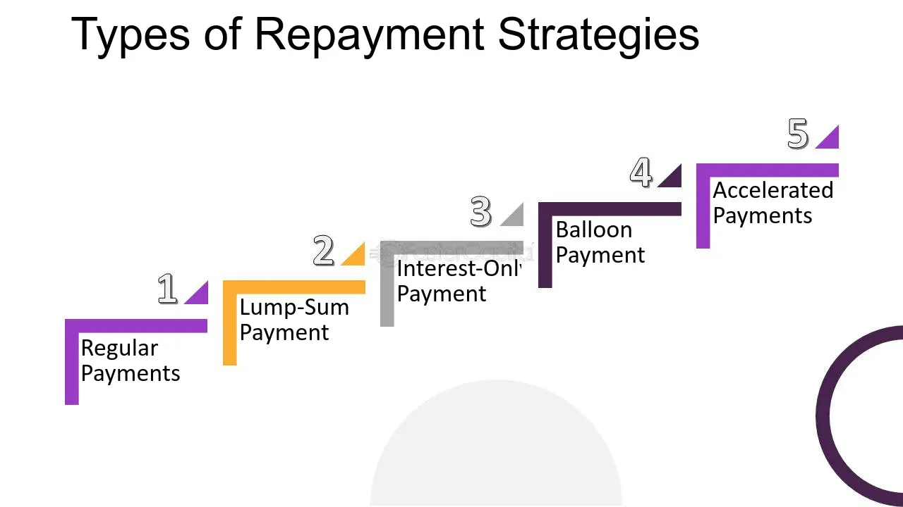

## Table of Contents

## What is a loan repayment process?

A loan repayment process is how you pay back the money you borrowed from a bank or a lender. When you take a loan, you agree to pay it back over time, usually with added interest. This means you'll make regular payments, often monthly, until the full amount is paid off. The payments include both the money you borrowed (the principal) and the interest, which is the cost of borrowing the money.

The way you make these payments can vary. You might pay through automatic deductions from your bank account, by mailing a check, or by making an online payment. It's important to make these payments on time because if you miss them, you might have to pay extra fees or your credit score could go down. Some loans let you pay more than the minimum amount if you want to pay off the loan faster and save on interest.

## What are the different types of loans that require repayment?

There are many types of loans that you need to pay back. Some common ones are personal loans, which you can use for anything you want, like fixing your car or paying for a big trip. Another type is a student loan, which helps you pay for school. You get this money while you're studying, and then you start paying it back after you finish school or leave. Home loans, or mortgages, are for buying a house. You pay these back over a long time, usually many years.

There are also car loans for buying a vehicle. You pay these back in monthly payments until the car is fully paid off. Credit cards can act like loans too. When you use a credit card, you're borrowing money to buy things, and you have to pay it back, usually every month. If you don't pay the full amount, you'll owe interest on what's left. Business loans help companies get started or grow, and they need to be paid back with interest over time.

Each type of loan has its own rules about how you pay it back. Some might let you pay more to finish paying off the loan faster, while others might have fixed payments that you can't change. It's important to understand the terms of your loan so you know exactly what you need to pay and when.

## How does the repayment process differ for personal loans versus student loans?

Personal loans and student loans both need to be paid back, but they have some different rules. Personal loans are usually for things like buying a car or paying for a big trip. You start paying these back right away, often with fixed monthly payments. The [interest rate](/wiki/interest-rate-trading-strategies) might be fixed, meaning it stays the same, or variable, meaning it can change. If you miss a payment, it can hurt your credit score and you might have to pay extra fees.

Student loans are for paying for school. You don't have to start paying these back until after you finish school or leave. This is called a grace period, and it can last for about six months. Some student loans have a fixed interest rate, while others might have a variable rate. If you have trouble paying back your student loans, there are special plans that can make your payments smaller or let you pay based on how much money you make. Missing payments on student loans can also hurt your credit score, but there are more options to help you if you're struggling.

## What are the typical repayment terms for a mortgage?

A mortgage is a loan you use to buy a house. You pay it back over a long time, usually 15 to 30 years. You make monthly payments that include both the money you borrowed and the interest, which is the cost of borrowing the money. The interest rate can be fixed, meaning it stays the same for the whole time you're paying back the loan, or it can be adjustable, meaning it might go up or down.

The monthly payments for a mortgage are usually the same each month if you have a fixed-rate mortgage. This makes it easier to plan your budget because you know exactly how much you need to pay. If you have an adjustable-rate mortgage, your payments might change if the interest rate changes. It's important to make your payments on time because if you miss them, you might have to pay extra fees or your credit score could go down. Sometimes, you can pay more than the monthly amount to pay off the loan faster and save on interest.

## How can auto loan repayment schedules be structured?

An auto loan is money you borrow to buy a car. You pay it back over time, usually in monthly payments. These payments include the money you borrowed, which is called the principal, and the interest, which is the cost of borrowing the money. The length of time you have to pay back the loan can be different. It might be as short as 24 months or as long as 72 months or even more. The longer the time, the smaller your monthly payments will be, but you'll end up paying more in interest.

The interest rate on your auto loan can be fixed or variable. A fixed rate means it stays the same for the whole time you're paying back the loan. A variable rate might go up or down, which can change your monthly payments. If you miss a payment, you might have to pay extra fees or it could hurt your credit score. Sometimes, you can pay more than the monthly amount if you want to pay off the loan faster and save on interest. It's important to make your payments on time to keep your credit score good and avoid extra costs.

## What are the options for managing credit card debt repayment?

Managing credit card debt can be tough, but there are ways to make it easier. One way is to pay more than the minimum amount each month. This helps you pay off the debt faster and saves you money on interest. Another option is to use a balance transfer. This means you move your debt to a new credit card that has a lower interest rate or even a 0% introductory rate. This can give you time to pay off the debt without adding more interest.

You can also try a debt management plan. This is when you work with a credit counseling agency. They can help you make a plan to pay off your debt. They might talk to your credit card companies to lower your interest rates or change your payment terms. Another way is to consolidate your debt. This means you take out a new loan to pay off all your credit cards. Then, you just have to make one payment each month on the new loan, which might have a lower interest rate.

It's important to keep making your payments on time. If you miss payments, it can hurt your credit score and you might have to pay extra fees. If you're having trouble, talk to your credit card company. They might be able to help you with a new payment plan that fits your budget better.

## How does interest affect the total repayment amount for various loans?

Interest is the extra money you have to pay when you borrow money. It's like a fee for using the loan. The more interest you have to pay, the more money you'll end up paying back in total. For example, if you borrow $1,000 with an interest rate of 5%, you'll pay back more than $1,000 because of the interest. The interest can be calculated in different ways, like simple interest or compound interest. Simple interest is just a percentage of the money you borrowed, while compound interest is interest on both the money you borrowed and the interest that's already been added.

Different loans have different interest rates, which affects how much you'll pay back. For personal loans, the interest rate might be higher than for a mortgage because personal loans are riskier for the lender. With a mortgage, the interest rate is usually lower because the loan is secured by the house. Student loans might have lower interest rates too, especially if they're from the government. Credit cards often have the highest interest rates. If you only pay the minimum each month, you could end up paying a lot more in interest over time. So, it's important to understand the interest rate on your loan and try to pay it off as quickly as you can to save money.

## What are the consequences of missing loan repayment deadlines?

If you miss a loan repayment deadline, it can cause problems. You might have to pay late fees, which are extra charges added to your loan. These fees can make the total amount you owe even bigger. Your credit score could also go down. A lower credit score can make it harder for you to borrow money in the future because lenders might think you're not good at paying back loans. If you keep missing payments, the lender might even take legal action against you to get their money back.

For some loans, like a car loan or a mortgage, missing payments can lead to repossession or foreclosure. This means the lender can take back the car or the house if you don't pay. It's a big deal and can make your financial situation even worse. If you're having trouble making payments, it's a good idea to talk to your lender. They might be able to work out a new payment plan that fits your budget better and helps you avoid these serious consequences.

## How can one negotiate better repayment terms with lenders?

If you're having trouble paying back a loan, you can talk to your lender to try to get better repayment terms. It's important to be honest and explain why you're struggling. Maybe you lost your job or had a big medical bill. Lenders might be willing to help if they see you're trying your best to pay. You could ask for a lower interest rate, a longer time to pay back the loan, or even a break from payments for a little while. Sometimes, they might agree to these changes if it means you'll be able to keep paying them back.

When you talk to your lender, be ready with a plan. Show them how much you can afford to pay each month and why the new terms will help you. It's good to have all your financial information ready, like your income and other debts. Lenders like to see that you've thought it through and are serious about paying back the loan. If they say no, don't give up right away. You can ask to talk to someone else or look for other ways to manage your debt, like a debt management plan or consolidating your loans.

## What are the advanced strategies for accelerating loan repayment?

One way to pay off your loan faster is to make extra payments. If you can pay more than the minimum each month, you'll pay off the loan quicker and save money on interest. You might get a bonus at work or some extra money from a side job. Instead of spending it, you can use it to make an extra payment on your loan. Another strategy is to use any money you get from tax refunds or inheritances to pay down your loan. This can really help you get ahead on your payments.

Another good strategy is to refinance your loan. This means you get a new loan with a lower interest rate to pay off the old one. If you can find a lower rate, you'll pay less in interest over time, and more of your payment will go toward the principal. You can also try to increase your income. Maybe you can get a raise at work, find a better-paying job, or start a side business. If you make more money, you can put the extra toward your loan and pay it off faster. These strategies can help you get out of debt quicker and save money in the long run.

## How do loan repayment processes vary internationally?

Loan repayment processes can be different in different countries. In some places, like the United States, you might have to start paying back your loan right away, with fixed monthly payments. In other countries, like in some parts of Europe, you might get a grace period before you need to start paying. Interest rates can also be different. In some countries, the interest rates might be lower because the government helps keep them down, while in others, they might be higher because of the economy or other factors.

The way you make payments can vary too. In some countries, you might pay through automatic deductions from your bank account, while in others, you might need to go to a bank or use a different method. Some countries have strict rules about what happens if you miss a payment, like big fines or even jail time, while others might be more flexible and offer more options to help you if you're struggling. Understanding the rules and customs in your country can help you manage your loan better and avoid problems.

## What role does loan consolidation play in managing multiple loan repayments?

Loan consolidation can help you manage multiple loans by combining them into one single loan. Instead of making several payments each month to different lenders, you make one payment to one lender. This can make it easier to keep track of your payments and might even help you get a lower interest rate. If you have a lot of different loans, like student loans, credit card debt, or personal loans, consolidation can simplify things and make it easier to pay them off.

When you consolidate your loans, you might be able to get a better interest rate or change the length of time you have to pay back the loan. A lower interest rate means you'll pay less in interest over time, and you might be able to pay off the loan faster. Changing the length of the loan can also help. If you choose a longer time, your monthly payments might be smaller, which can make it easier to fit them into your budget. But remember, a longer loan means you might pay more in interest in the end. So, it's important to think about what works best for you and your financial situation.

## References & Further Reading

[1]: Bergstra, J., Bardenet, R., Bengio, Y., & Kégl, B. (2011). ["Algorithms for Hyper-Parameter Optimization."](https://papers.nips.cc/paper/4443-algorithms-for-hyper-parameter-optimization) Advances in Neural Information Processing Systems 24.

[2]: ["Advances in Financial Machine Learning"](https://www.amazon.com/Advances-Financial-Machine-Learning-Marcos/dp/1119482089) by Marcos Lopez de Prado

[3]: ["Evidence-Based Technical Analysis: Applying the Scientific Method and Statistical Inference to Trading Signals"](https://www.amazon.com/Evidence-Based-Technical-Analysis-Scientific-Statistical/dp/0470008741) by David Aronson

[4]: ["Machine Learning for Algorithmic Trading"](https://github.com/stefan-jansen/machine-learning-for-trading) by Stefan Jansen

[5]: ["Quantitative Trading: How to Build Your Own Algorithmic Trading Business"](https://www.amazon.com/Quantitative-Trading-Build-Algorithmic-Business/dp/1119800064) by Ernest P. Chan