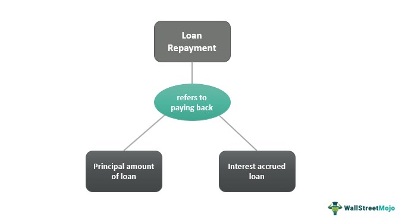

Understanding the complexities of loan types and their respective repayment processes is crucial for borrowers and financial institutions alike. Loans are integral to both individual financial planning and broader economic frameworks, with various types offering specific benefits and obligations that cater to different needs. As financial landscapes evolve, the convergence of traditional financial strategies and modern technologies has brought about innovative methods to enhance loan management.

In recent years, the intersection of loan repayment strategies and algorithmic trading techniques has opened new avenues in financial planning and management. Algorithmic trading, known for its transformative impact on stock markets, is now being adapted to refine and optimize debt management strategies. This integration promises not only efficiency but also heightened precision in repayment processes. By employing sophisticated algorithms, financial institutions can develop more effective repayment strategies that mitigate risk and enhance positive financial outcomes for borrowers.



This article will explore various loan types, the intricacies of their repayment processes, and the role of algorithmic trading in optimizing loan repayment strategies. Loans can range from personal and unsecured to complex commercial instruments, each with specific terms, conditions, and repayment expectations. Understanding these facets can aid borrowers in making informed decisions that align with their financial goals, while lenders can optimize their lending strategies to minimize risk.

With the advent of technology in financial sectors, managing loans has become a more streamlined and efficient process. Digital platforms provide borrowers with tools to track payments, assess loan options, and manage their debt portfolios with unprecedented ease. Fintech innovations enable personalized financial experiences, allowing for tailored repayment plans and strategic refinancing opportunities. Furthermore, data analytics and predictive modeling empower financial institutions to anticipate borrower behavior and adjust strategies accordingly.

We will cover traditional methods, innovative repayment solutions, and how algorithmic trading is reshaping the landscape of loan repayment. From exploring conventional repayment structures to analyzing the impact of advanced algorithmic methodologies, this article aims to provide a comprehensive overview of the current and future state of loan repayment. As technology continues to advance, the synergy between traditional financial principles and cutting-edge innovations holds the promise of improved loan management and financial inclusivity.

## Table of Contents

## Types of Loans and Their Characteristics

Loans are essential financial instruments, broadly categorized into secured and unsecured loans, each catering to distinct financial needs and borrower profiles. This classification frames how loans are structured, assessed, and managed by both lenders and borrowers.

**Secured Loans:**

Secured loans are backed by collateral, which provides the lender with security in the event of borrower default. This collateral could be tangible assets like real estate or vehicles. Common examples of secured loans include:

- **Mortgages:** These are long-term loans used for purchasing real estate, where the property itself serves as collateral. Mortgages typically have lower interest rates owing to the reduced risk for lenders and can span over 15 to 30 years.

- **Auto Loans:** Designed specifically for financing vehicle purchases, auto loans are secured against the vehicle. These loans tend to have shorter terms, often ranging between three to seven years.

The presence of collateral generally results in lower interest rates and longer repayment periods for secured loans, which can be advantageous for borrowers from a cost perspective.

**Unsecured Loans:**

In contrast, unsecured loans do not require collateral, relying instead on the borrower’s creditworthiness and financial standing. These loans typically [carry](/wiki/carry-trading) higher interest rates due to the added risk to the lender. Key types of unsecured loans include:

- **Personal Loans:** These loans are versatile and can be used for various purposes, from debt consolidation to medical expenses. The terms and conditions, such as interest rates and repayment periods, depend heavily on the borrower's credit score.

- **Student Loans:** Aimed at financing education, student loans may have benefits such as deferred interest or subsidized rates. They are typically repaid over an extended period after the borrower completes their education.

- **Business Loans:** These loans are tailored for business purposes, often requiring a strong credit rating and business plan for approval. They can be either short-term or long-term, based on the financial needs of the business.

Understanding the characteristics of these loan types enables borrowers to align their choices with their financial situations and goals. Secured loans offer stability with collateral backing but require asset management, whereas unsecured loans provide flexibility at the cost of higher interest rates. By carefully evaluating the terms – including interest rates, repayment periods, and eligibility criteria – borrowers can select the financial products that best suit their needs.

## Loan Repayment Processes Explained

Loan repayment processes are fundamental to ensuring that borrowers fulfill their financial obligations as per the loan agreement. These processes involve the systematic repayment of both the principal amount and any accrued interest. A variety of repayment schedules are available, each tailored to meet different financial situations.

One common repayment method is fixed monthly payments, where a borrower pays a consistent amount each month. This approach simplifies budgeting for the borrower and gradually reduces the outstanding loan balance over time. The payments are calculated using an amortization schedule, which details how each payment is distributed between principal and interest. For example, the initial payments typically cover more interest, gradually shifting towards repaying more of the principal.

Graduated repayment plans present another option, typically beneficial for borrowers expecting their income to increase over time. Initially, payments are lower and increase at predetermined intervals. This method is often used for student loans and can help individuals ease into their repayment commitments.

Balloon payments entail smaller regular payments with a substantial final payment to settle the balance. This option can appeal to borrowers who anticipate having a large sum of money in the future or access to refinancing options. While this can lower the financial burden during the life of the loan, the borrower must plan for the significant final payment.

Alternative repayment strategies, such as interest-only payments, allow borrowers to pay only the interest for a specified period. This reduces the immediate financial burden but does not reduce the principal, which remains due at the end of the term. Lump-sum repayments involve paying off a large portion or all of the debt at once, thereby reducing future interest payments and potentially shortening the loan term.

The choice of repayment strategy influences the total cost of the loan and affects the borrower's overall financial health. Selecting the appropriate repayment plan requires careful consideration of current financial status, future income projections, and long-term financial goals. Understanding these elements aids borrowers in managing their finances effectively and minimizing interest obligations over the life of the loan.

## Algorithmic Trading and Loan Repayment Optimization

Algorithmic trading, initially developed for financial markets to automate and optimize the process of buying and selling securities, is now being adapted to enhance debt management and loan repayment strategies. This adaptation involves employing sophisticated algorithms that leverage big data and predictive analytics to foresee potential financial challenges and accordingly adjust repayment terms for both borrowers and lenders.

#### Forecasting and Optimization

By analyzing vast amounts of data, these algorithms can predict financial market trends and individual borrower behaviors with a high degree of accuracy. They utilize statistical models to forecast changes in interest rates, identify favorable refinancing opportunities, and adjust repayment schedules to optimize borrower outcomes. For instance, algorithms can identify patterns that suggest when a borrower might face financial trouble and suggest preemptive measures such as altering the repayment structure.

Mathematically, this involves predictive modeling techniques such as logistic regression, decision trees, or neural networks, which can be used to estimate the probability of default and optimize loan terms:

```python
from sklearn.linear_model import LogisticRegression
from sklearn.model_selection import train_test_split

# Example: Predicting default probability
X_train, X_test, y_train, y_test = train_test_split(data_features, target_default, test_size=0.2)

model = LogisticRegression()
model.fit(X_train, y_train)

# Predicting and optimizing repayment terms for new borrowers
default_probabilities = model.predict_proba(X_new)[:, 1]
```

#### Personalized Repayment Plans

Automated systems developed through these algorithms can create personalized repayment plans that take into account an individual’s financial behavior and credit profile. They automate the assessment of creditworthiness and can adjust repayments based on variables such as income changes or unexpected expenses. This customization can improve the financial health of borrowers by minimizing the likelihood of default and ensuring more manageable debt levels.

#### Alerts and Refinancing Opportunities

Another advantage is the capability of these systems to alert borrowers to market changes that could affect their repayment plans, such as fluctuations in interest rates. Real-time monitoring of financial markets enables systems to promptly notify borrowers about potential savings through refinancing opportunities or necessary adjustments to current repayment strategies.

#### Benefits for Lenders

For lenders, [algorithmic trading](/wiki/algorithmic-trading) strategies contribute to effective loan portfolio management by identifying underperforming loans and recommending restructuring solutions before defaults occur. These systems enable lenders to efficiently manage risk, improve return on investment, and minimize default risks through a proactive approach enhanced by data analytics.

Incorporating algorithmic trading into loan repayment optimization represents a significant step forward for financial institutions and borrowers alike. This technological evolution not only enhances the efficiency of repayment processes but also provides a robust framework for personalized financial management solutions.

## Benefits and Challenges

Efficient loan repayment processes are pivotal for maintaining financial discipline and enhancing credit scores. A structured repayment plan not only ensures timely payments but also reduces the overall financial burden by minimizing interest accrual. Algorithmic trading has emerged as a transformative tool in this context, offering several advantages over traditional methods through its precision, speed, and ability to harness data-driven insights.

Algorithmic systems utilize vast data sets and predictive analytics to optimize repayment strategies. By analyzing borrowers' financial behaviors and credit profiles, algorithms can develop tailored repayment plans that align with individual capacities and lifestyles. This personalized approach improves repayment efficiency and borrower satisfaction. Furthermore, algorithmic solutions can swiftly adapt to changing market conditions, alerting borrowers to refinancing opportunities or shifts in interest rates, thereby optimizing loan terms proactively.

Despite the benefits, implementing algorithmic trading in loan management introduces significant challenges. The initial setup requires substantial investment in technology and skilled professionals adept at managing these systems. Only with proper resources can institutions enjoy the full benefits of algorithmic trading. Moreover, traditional sectors often exhibit resistance to adopting automated solutions, necessitating a cultural shift towards embracing technology.

Another key consideration is balancing technology with personal financial advice. While algorithms offer precise recommendations, they may lack the nuanced judgment that human advisors provide, especially in complex financial situations. A hybrid approach that combines data-driven insights with expert financial counseling could yield optimal results, ensuring borrowers receive comprehensive guidance.

Algorithmic trading presents a promising avenue for enhancing loan repayment processes. However, the long-term success of integrating these systems will depend on overcoming financial, technical, and cultural hurdles while maintaining a balance between automated systems and human expertise.

## Future Trends in Loan Repayment and Algorithmic Trading

As technology advances, [artificial intelligence](/wiki/ai-artificial-intelligence) (AI) and [machine learning](/wiki/machine-learning) are expected to become increasingly integral to loan repayment processes. These technologies have the potential to analyze vast amounts of financial data to customize repayment plans, alert both borrowers and lenders to favorable refinancing opportunities, and forecast economic fluctuations that might impact repayments. For example, machine learning algorithms can assess a borrower's payment history and financial behavior to tailor a repayment schedule that fits their financial situation, thereby reducing the likelihood of default and enhancing financial stability.

Blockchain technology is another promising tool for managing loan agreements and repayments with enhanced transparency and security. As a decentralized ledger, blockchain can record all transactions efficiently and immutably, ensuring that loan terms are executed automatically through smart contracts. This could streamline processes by reducing administrative overhead and minimizing fraud risk, given the visible, tamper-proof nature of blockchain records. The use of blockchain can thus provide a higher level of trust and reliability in financial transactions.

The rise of decentralized finance (DeFi) platforms marks a shift toward systems that rely on blockchain and other technologies to facilitate financial services without traditional intermediaries like banks. DeFi platforms can offer borrowers more accessible and flexible loan options, often with better terms than traditional financial institutions. By removing geographical and bureaucratic barriers, DeFi aims to democratize financial services, including loan repayment, making them available to a broader audience.

Fintech innovations are pivotal in providing personalized loan management solutions. Through data analytics and mobile technology, fintech firms can offer tailored financial products that cater to individual borrower needs. This personalization can lead to more efficient loan allocation, enhanced customer satisfaction, and improved repayment rates. Moreover, fintech can facilitate the integration of AI and blockchain in repayment processes, further optimizing these financial systems.

Advancements in AI, blockchain, and fintech collectively hold the promise of reducing barriers within financial markets, promoting greater inclusivity. By enabling more seamless, secure, and efficient financial transactions, these technologies could significantly improve accessibility to financial services across emerging and underserved markets, fostering economic growth and stability on a global scale.

## Conclusion

The landscape of loan repayment is undergoing significant changes, primarily fueled by technological advancements. Algorithmic trading has emerged as a key player in optimizing repayment processes, creating new avenues for efficient debt management. By leveraging big data and sophisticated algorithms, financial operations can be streamlined, enabling both lenders and borrowers to benefit from enhanced economic outcomes. Traditional finance principles, when integrated with modern technological solutions, offer the potential for refined loan management strategies that are adaptable to various financial environments.

Successful implementation of these technologies is contingent upon several factors, including regulatory approval, ongoing technological development, and the readiness of financial markets to embrace these innovations. Regulatory support is crucial in providing a framework within which algorithmic solutions can flourish, offering protection and transparency for all stakeholders involved.

Ultimately, the objective is to establish a financial ecosystem that supports seamless interactions, thereby promoting economic stability and growth. By harnessing the potential of algorithmic trading and other technological tools, the financial sector is poised to offer more personalized and efficient services, which could significantly reduce barriers and improve financial inclusivity on a global scale. As these advancements continue to evolve, they hold the promise of fostering a more robust and inclusive financial system, contributing to overall economic prosperity.

## References & Further Reading

[1]: Bergstra, J., Bardenet, R., Bengio, Y., & Kégl, B. (2011). ["Algorithms for Hyper-Parameter Optimization."](https://papers.nips.cc/paper/4443-algorithms-for-hyper-parameter-optimization) Advances in Neural Information Processing Systems 24.

[2]: ["Advances in Financial Machine Learning"](https://www.amazon.com/Advances-Financial-Machine-Learning-Marcos/dp/1119482089) by Marcos Lopez de Prado

[3]: ["Evidence-Based Technical Analysis: Applying the Scientific Method and Statistical Inference to Trading Signals"](https://www.amazon.com/Evidence-Based-Technical-Analysis-Scientific-Statistical/dp/0470008741) by David Aronson

[4]: ["Machine Learning for Algorithmic Trading"](https://github.com/stefan-jansen/machine-learning-for-trading) by Stefan Jansen

[5]: ["Quantitative Trading: How to Build Your Own Algorithmic Trading Business"](https://www.amazon.com/Quantitative-Trading-Build-Algorithmic-Business/dp/1119800064) by Ernest P. Chan