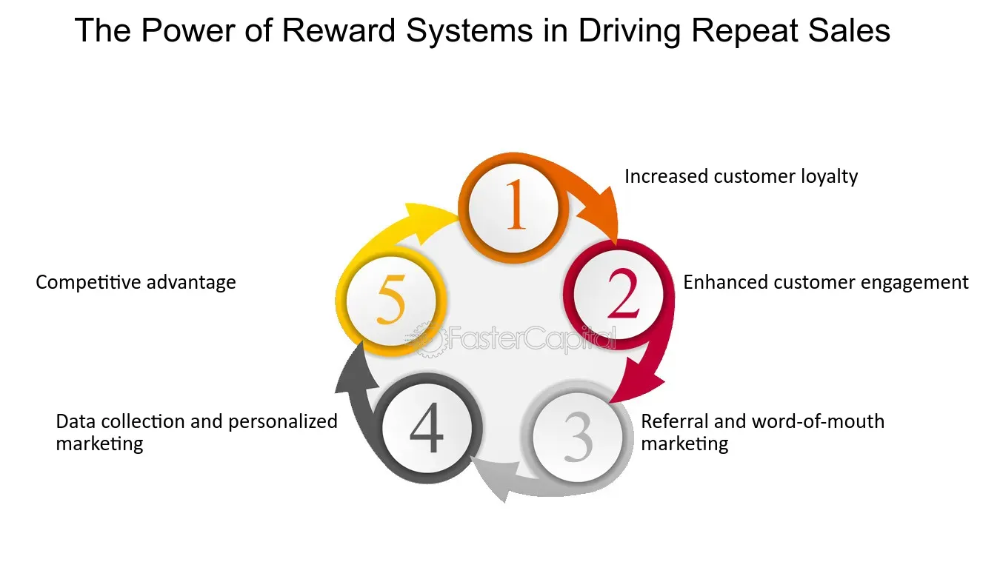

## Table of Contents

## What is the Repeat-Sales Method?

The Repeat-Sales Method is a way to figure out how much house prices have changed over time. It looks at houses that have been sold more than once and compares the prices from the first sale to the second sale. This method helps to see the real change in value of the same house, without being affected by differences in the houses being compared.

This method is useful because it focuses on the same property, so it can show how the market has changed for that specific house. By using only repeat sales, the method avoids problems that can come from comparing different houses, like different sizes or locations. This makes the results more accurate and reliable for understanding how house prices are changing over time.

## How does the Repeat-Sales Method work?

The Repeat-Sales Method works by looking at houses that have been sold more than once. It compares the price of the house from its first sale to its second sale. By doing this, the method can see how much the price of the same house has changed over time. This helps to understand how the market has changed for that specific house without being affected by differences between different houses.

For example, if a house was sold for $100,000 in 2010 and then sold again for $120,000 in 2020, the Repeat-Sales Method would show a 20% increase in the price of that house over ten years. By focusing on the same property, the method avoids problems that can come from comparing different houses, like different sizes or locations. This makes the results more accurate and reliable for understanding how house prices are changing over time.

## What are the basic steps to implement the Repeat-Sales Method?

To implement the Repeat-Sales Method, you first need to gather data on houses that have been sold more than once. This means you need to find records of the same house sold at different times. You'll need the sale price and the date of each sale. This data can come from real estate records or databases. Once you have the data, you need to make sure it is clean and accurate. This means checking for any errors or missing information and fixing them.

Next, you compare the sale prices of each house over time. For example, if a house sold for $100,000 in 2010 and then $120,000 in 2020, you calculate the change in price. You do this for all the houses in your data. Then, you can calculate the average change in price for all the houses to see how the market has changed over time. This helps you understand how house prices are going up or down without being affected by differences between different houses.

## What are the main advantages of using the Repeat-Sales Method?

The Repeat-Sales Method is good because it looks at the same house being sold more than once. This means it can show how the price of that house changes over time without being confused by different houses. For example, if one house is bigger or in a better area than another, the Repeat-Sales Method doesn't have to worry about that. It just looks at the same house, so the results are more accurate and reliable.

Another advantage is that this method helps to see real changes in the market. By focusing on repeat sales, it can show how the value of houses goes up or down over time. This is helpful for understanding how house prices are changing without being affected by things like new houses being built or old houses being torn down. So, it gives a clear picture of how the market is doing for the same houses.

## Can you provide examples of industries that benefit from the Repeat-Sales Method?

The real estate industry is one that benefits a lot from the Repeat-Sales Method. This method helps real estate [agents](/wiki/agents) and analysts see how the prices of houses change over time. By looking at the same house sold more than once, they can understand if the market is going up or down. This is really helpful for setting prices for new houses and for advising people who want to buy or sell a home.

Another industry that can use the Repeat-Sales Method is the property investment sector. Investors who buy houses to rent them out or to sell later can use this method to track how their investments are doing. It shows them if the value of their properties is going up, which can help them decide when to sell or buy more properties. This method gives them a clear way to see the performance of their investments over time.

The Repeat-Sales Method can also be useful for the housing market research industry. Researchers who study how house prices change over time can use this method to get accurate data. By focusing on the same houses sold at different times, they can see real trends in the market. This helps them give better advice to policymakers and others who need to understand the housing market.

## What are the common challenges faced when using the Repeat-Sales Method?

One common challenge with the Repeat-Sales Method is getting good data. You need to find records of houses that have been sold more than once. Sometimes, these records can be hard to find or might have mistakes. If the data is not correct, it can make the results wrong. Also, some houses might not be sold often enough, so you might not have enough information to see how the market is changing.

Another challenge is that the Repeat-Sales Method only looks at houses that have been sold more than once. This means it might not show the whole picture of the market. Some houses might not be included because they haven't been sold again. This can make it hard to understand the market if only a few houses are being looked at. So, it's important to make sure you have enough data to get a good understanding of the market.

Lastly, changes to the house can also be a problem. If a house is fixed up or added to between sales, the price might go up because of the changes, not just because the market changed. This can make it hard to tell if the price went up because of the market or because of the work done on the house. So, you need to be careful and think about these changes when using the Repeat-Sales Method.

## How does the Repeat-Sales Method compare to other sales methods?

The Repeat-Sales Method is different from other sales methods because it only looks at houses that have been sold more than once. This helps to see how the price of the same house changes over time. Other methods, like the Hedonic Pricing Method, look at many different houses at the same time. The Hedonic Method tries to figure out how much different things about a house, like its size or location, affect its price. The Repeat-Sales Method avoids these differences by focusing on the same house, so it can give a clearer picture of how the market is changing for that specific house.

Another method is the Sales Comparison Approach, which compares a house to similar houses that have been sold recently. This method can be useful, but it has to deal with differences between houses, like size or location. The Repeat-Sales Method doesn't have to worry about these differences because it looks at the same house sold at different times. This makes the Repeat-Sales Method more accurate for understanding how the value of a specific house changes over time. However, it might not show the whole market because it only looks at houses sold more than once.

## What metrics are important to track when using the Repeat-Sales Method?

When using the Repeat-Sales Method, it's important to track the sale price of the house each time it is sold. This helps you see how much the price has changed over time. You also need to know the date of each sale. This tells you how long it took for the price to change. By looking at these two things together, you can figure out the percentage change in the price of the house. This is a key metric because it shows how the market has changed for that specific house.

Another important metric is the number of repeat sales you have data for. If you only have a few houses that have been sold more than once, your results might not be very accurate. You need enough data to see a clear trend in the market. Also, it's good to track any changes made to the house between sales. If the house was fixed up or added to, the price might go up because of the changes, not just because the market changed. Keeping an eye on these metrics helps you understand the real changes in the market and makes your results more reliable.

## How can technology enhance the effectiveness of the Repeat-Sales Method?

Technology can make the Repeat-Sales Method work better by helping to collect and organize data. With computers and special software, it's easier to find records of houses that have been sold more than once. This means you can get more data, and it can be more accurate. Technology also helps to check the data for mistakes and fix them, so the results are more reliable. By using technology, you can look at more houses and get a better picture of how the market is changing.

Another way technology helps is by making it easier to analyze the data. With special programs, you can quickly see how the prices of houses have changed over time. This means you can find trends and patterns faster. Technology also helps to share the results with others, like real estate agents or investors, so they can use the information to make better decisions. By using technology, the Repeat-Sales Method can give clearer and more useful information about how house prices are changing.

## What are some advanced strategies for optimizing the Repeat-Sales Method?

One advanced strategy for optimizing the Repeat-Sales Method is to use more advanced data analysis techniques. Instead of just looking at the price changes of individual houses, you can use statistical models to understand the bigger picture. These models can help you see how different factors, like the economy or interest rates, affect house prices. By using these models, you can make better predictions about how the market will change in the future. This helps to make the Repeat-Sales Method more useful for understanding and predicting market trends.

Another strategy is to combine the Repeat-Sales Method with other methods, like the Hedonic Pricing Method. The Hedonic Method looks at how different features of a house, like its size or location, affect its price. By using both methods together, you can get a more complete picture of the market. The Repeat-Sales Method can show you how the price of the same house changes over time, while the Hedonic Method can tell you how different houses are valued at the same time. This combination can give you a clearer and more accurate view of the housing market.

## How can businesses measure the success of the Repeat-Sales Method?

Businesses can measure the success of the Repeat-Sales Method by looking at how well it helps them understand the housing market. If the method gives them clear and accurate information about how house prices are changing over time, it is working well. They can check this by comparing the results from the Repeat-Sales Method with other data, like reports from real estate agencies or government [statistics](/wiki/bayesian-statistics). If the results match up well, it shows that the method is reliable and useful for making decisions about buying or selling houses.

Another way to measure success is by seeing how the Repeat-Sales Method helps businesses make money. If real estate agents or investors use the method to set better prices for houses or to decide when to buy or sell, and they make more profit because of it, then the method is successful. Businesses can track their profits and see if they go up after using the Repeat-Sales Method. If the method helps them make better choices and earn more money, it is a good sign that it is working well.

## What future trends might impact the use of the Repeat-Sales Method?

One future trend that might impact the use of the Repeat-Sales Method is the increase in the use of big data and [artificial intelligence](/wiki/ai-artificial-intelligence). With more data available and better ways to analyze it, the Repeat-Sales Method could become even more accurate and useful. AI can help find patterns and make predictions about how house prices will change in the future. This means businesses and researchers can use the Repeat-Sales Method to make better decisions about buying and selling houses.

Another trend that might affect the Repeat-Sales Method is the growth of smart homes and technology in real estate. As more homes get smart features like automated systems and energy-efficient devices, these changes could impact how houses are valued. The Repeat-Sales Method will need to take these changes into account when looking at how prices change over time. This means the method might need to be updated to include data on home improvements and technology upgrades to stay accurate and relevant.

## What is the Repeat-Sales Method and How is it Understood?

The repeat-sales method is a robust approach to evaluating changes in real estate prices by analyzing the sales histories of the same property over time. This methodology has gained traction as a preferred tool for housing price indexes due to its ability to provide a more nuanced understanding of market trends, free from the noise created by varying property characteristics.

### Conceptual Framework

The essence of the repeat-sales method lies in its focus on properties that have undergone multiple sales transactions. By comparing the sales prices of the same property at different points in time, the method inherently controls for the qualitative differences between properties, such as location, size, and overall condition. This focus on single-property transactions eliminates the potential biases introduced by the heterogeneous nature of real estate assets.

### Methodology

Mathematically, the repeat-sales method can be represented as follows: Suppose a property is sold at times $t_1$ and $t_2$ with prices $P_{1}$ and $P_{2}$ respectively. The method calculates the price change ratio as:

$$

R = \frac{P_{2} - P_{1}}{P_{1}} 
$$

The price indexes are then constructed by aggregating these ratios across a significant number of properties, often adjusting for factors like time disturbances and inflation, to create a comprehensive view of market trends.

### Application in Market Analysis

The repeat-sales method is extensively used in constructing housing price indexes, such as the S&P CoreLogic Case-Shiller Home Price Indices. These indexes are critical for offering insights into how market values fluctuate over time, enabling stakeholders to make informed decisions. By removing extrinsic variables associated with individual property characteristics, the repeat-sales method isolates the intrinsic market [volatility](/wiki/volatility-trading-strategies), providing stakeholders with clear signals regarding real estate dynamics.

### Economic Insights

In various economies, the repeat-sales method serves as an instrumental tool for tracking the health and trends of the housing market. Since real estate is a significant component of economic stability and growth, understanding price movements with clarity facilitates the development of policies and strategies that bolster market confidence.

The repeat-sales method's emphasis on comparing identical properties over time ensures that the resulting data embodies a high degree of reliability and validity, making it a cornerstone of contemporary real estate analysis. This credibility allows policymakers, investors, and analysts to comprehend and anticipate market movements, ultimately fostering a more competitive and efficient market environment.

## What are the applications in real estate valuation?

The repeat-sales method is instrumental in developing various housing price indices, most notably the S&P CoreLogic Case-Shiller National Home Price Index. This index, widely recognized for its accuracy, plays a vital role in real estate market analysis by providing stakeholders with insightful data on housing value changes. By comparing multiple sales of the same property over time, the method captures the true appreciation or depreciation in property values, thus supporting informed decisions related to buying and selling in the real estate market.

Housing price indexes that employ the repeat-sales method benefit from the exclusion of variables associated with differing property characteristics and conditions at different locations. This advantage is achieved because the method focuses on the same property or set of properties over time, eliminating inconsistencies typically found in other valuation techniques. By accurately tracking the price evolution of identical properties, these indices can pinpoint actual market trends rather than generalized assumptions derived from broader averages. 

For example, consider how the repeat-sales index is calculated using the following simplified equation:

$$
P_{t} = \frac{S_{t}}{S_{t-1}}
$$

where $P_{t}$ represents the price index at time $t$, $S_{t}$ is the sale price at time $t$, and $S_{t-1}$ is the sale price at an earlier time $t-1$. With repeated transactions over time, these calculations offer a dynamic view of market fluctuations.

Moreover, several housing indexes leverage the repeat-sales method to analyze real estate trends across different periods. This analysis is critical for understanding demand and supply shifts, which are indispensable for investors and policymakers. By tracking these fluctuations, market participants can better anticipate future movements in property prices, thus refining their strategies accordingly.

In summary, the repeat-sales method underpins the creation and reliability of various housing price indices, proving indispensable for stakeholders seeking deeper insights into real estate market dynamics. By facilitating a more precise observation of value changes in properties, this method directly supports strategic decision-making in buying, selling, and investment practices.

## References & Further Reading

[1]: Case, B., & Shiller, R. J. (1987). ["Prices of Single Family Homes Since 1970: New Indexes for Four Cities."](https://www.nber.org/papers/w2393) National Bureau of Economic Research Working Paper No. 2393.

[2]: Bailey, M. J., Muth, R. F., & Nourse, H. O. (1963). ["A Regression Method for Real Estate Price Index Construction."](https://www.tandfonline.com/doi/abs/10.1080/01621459.1963.10480679) Journal of the American Statistical Association, 58(304).

[3]: Shiller, R. J. (1991). ["Arithmetic Repeat Sales Price Estimators."](https://www.sciencedirect.com/science/article/pii/S1051137705800282) Journal of Housing Economics, 1(1), 110-126.

[4]: Goetzmann, W. N. (1992). ["The Accuracy of Real Estate Indices: Repeat Sales Estimators."](https://link.springer.com/article/10.1007/BF00153997) Journal of Real Estate Finance and Economics, 5, 5-27.

[5]: Geltner, D. (1993). ["Temporal Aggregation in Real Estate Return Indices."](https://onlinelibrary.wiley.com/doi/abs/10.1111/1540-6229.00605) Real Estate Economics, 21(1), 57-85.

[6]: ["Measuring Housing Discrimination"](https://nap.nationalacademies.org/read/10311/chapter/2) by National Research Council (US) Panel on Methods for Assessing Discrimination. 

[7]: ["Real Estate Market Analysis: A Case Study Approach"](https://www.amazon.com/Real-Estate-Market-Analysis-Approach/dp/0874208688) by Deborah L. Brett and Adrienne Schmitz.