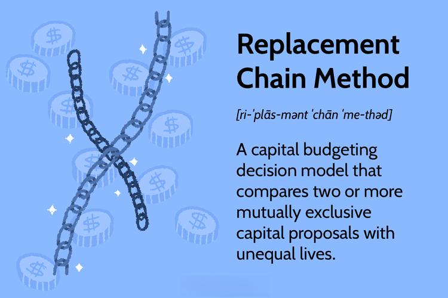

This article examines the relationship between capital budgeting investment analysis and algorithmic trading, with a focus on the Replacement Chain Method. Capital budgeting is essential for assessing long-term investment projects, especially when comparing mutually exclusive projects with different lifespans. These projects often require a strategic evaluation to ensure that organizations invest in opportunities that will maximize value over time.

The Replacement Chain Method offers a systematic approach to address this challenge by enabling comparisons on a consistent temporal scale. Accurately assessing these projects is critical for making informed investment decisions that align with an organization’s financial goals and strategic vision. This method helps in evaluating projects that might only appear favorable when considered individually or over a short period.



Algorithmic trading, which utilizes mathematical models and computational algorithms to make trading decisions, can leverage the principles of capital budgeting for enhanced strategy formulation. Incorporating these robust financial assessment techniques ensures that trading algorithms are not only reactive to market conditions but also proactive in evaluating potential returns and risks associated with various trading strategies over time.

The integration of algorithmic trading with capital budgeting methodologies like the Replacement Chain Method can improve decision-making processes. It provides a quantitative framework for evaluating the long-term performance and viability of trading strategies, allowing financial analysts and investors to make more calculated and informed decisions within dynamic market environments. As both investment analysis and trading strategies continue to evolve, understanding these concepts remains crucial for industries that depend heavily on capital investments and algorithmic trading systems.

## Table of Contents

## Understanding Capital Budgeting

Capital budgeting is a fundamental financial process employed by organizations to evaluate the potential merits of long-term investments. It serves as a decision-making framework that helps allocate resources towards major projects or investments, such as the construction of new facilities, the development of new products, or the acquisition of capital assets. The objective of capital budgeting is to maximize the wealth of the company’s shareholders by selecting the most promising investment opportunities.

Key to the capital budgeting process is the assessment of potential investments using specific financial metrics that evaluate the profitability and viability of projects. Among the most commonly used metrics are:

1. **Net Present Value (NPV)**: NPV is the sum of the present values of cash flows over the life of an investment project. It is calculated by discounting future cash flows to their present value using a pre-determined discount rate, typically the cost of capital. The formula for NPV is:
$$
   NPV = \sum_{t=0}^{n} \frac{C_t}{(1 + r)^t}

$$

   Where $C_t$ is the cash flow at time $t$, $r$ is the discount rate, and $n$ is the total number of time periods.

   A positive NPV indicates that the projected earnings (adjusted for time and risk) exceed the anticipated costs, suggesting that the investment is expected to generate value for the corporation.

2. **Internal Rate of Return (IRR)**: IRR is the discount rate that makes the NPV of all cash flows from a particular project equal to zero. It represents an investment’s expected rate of growth and is used to rank various prospective projects. When comparing projects, those with an IRR greater than the cost of capital are typically considered favorable.

   The IRR is determined by solving the following equation for $r$:
$$
   0 = \sum_{t=0}^{n} \frac{C_t}{(1 + r)^t}

$$

3. **Payback Period**: This metric indicates the time required for an investment to generate cash flows sufficient to recover the initial investment cost. The payback period is a simple measure of investment risk and liquidity, as shorter payback periods signify quicker recovery of the capital expended. However, it does not consider the time value of money or cash flows beyond the payback period.

Capital budgeting plays a crucial role in shaping the strategic direction of companies by ensuring that capital is allocated efficiently to projects that offer the highest potential returns. By systematically evaluating prospective opportunities, organizations can make informed decisions that align with their long-term financial goals.

## The Replacement Chain Method

The Replacement Chain Method (RCM) is a strategic approach within capital budgeting, crafted to facilitate the direct comparison of mutually exclusive projects that possess unequal lifespans. This method plays a pivotal role in allowing investors and financial analysts to make sound accept-reject decisions on capital investments.

The core principle of the Replacement Chain Method is to adjust the temporal scale of all projects to a common time frame. By extending the data of shorter-lived projects to align with those of longer lifespan projects, the method creates a level playing field. This process often involves replicating the shorter project over multiple cycles until both projects span an identical duration. For instance, consider two projects: Project A with a lifespan of three years and Project B with a lifespan of six years. Under the RCM, Project A would be evaluated over two full cycles (3 + 3 years) to match the six-year timeframe of Project B.

This approach effectively addresses the challenge of unequal project timelines, which can otherwise distort financial comparisons. By equating the time duration, the Replacement Chain Method allows for the calculation of net present values (NPV) or other financial metrics on a comparable basis.

Mathematically, the process can be formalized as follows:
- Calculate the cash flows for the full lifespan of each project.
- For the project with the shorter lifespan, repeat its cash flow pattern until it matches the longer project’s timeline.
- Compute the NPV for each project over the standardized time frame.

Python code can be used to implement this method. An example would look like:

```python
def calculate_extended_cash_flows(cash_flows, lifespan, target_lifespan):
    repetitions = target_lifespan // lifespan
    extended_cash_flows = cash_flows * repetitions
    return extended_cash_flows

def calculate_npv(cash_flows, discount_rate):
    npv = sum([cf / (1 + discount_rate) ** t for t, cf in enumerate(cash_flows)])
    return npv

project_a_cash_flows = [1000, 1100, 1200]
project_a_lifespan = 3
project_b_cash_flows = [900, 1000, 1100, 1200, 1300, 1400]
project_b_lifespan = 6

extended_project_a_cash_flows = calculate_extended_cash_flows(project_a_cash_flows, 
                                                             project_a_lifespan,
                                                             project_b_lifespan)

discount_rate = 0.1

npv_a = calculate_npv(extended_project_a_cash_flows, discount_rate)
npv_b = calculate_npv(project_b_cash_flows, discount_rate)

print("NPV of Project A:", npv_a)
print("NPV of Project B:", npv_b)
```

Ultimately, the Replacement Chain Method is indispensable for ensuring that capital budgeting decisions rest on a robust financial comparison, enabling businesses to allocate resources efficiently across competing investment projects.

## Benefits and Limitations of the Replacement Chain Method

The Replacement Chain Method (RCM) is instrumental in providing a comprehensive comparison of mutually exclusive projects with unequal lifespans, a common challenge in capital budgeting. This methodology allows organizations to assess projects on a uniform temporal scale by extending the lifespan of shorter projects to match the longer ones. As such, RCM aids in making informed accept-reject decisions, thereby optimizing capital allocation.

However, the Replacement Chain Method is not without limitations. One primary assumption is that projects can be repeated indefinitely with identical cash flows, which is often impractical in real-world scenarios. This premise overlooks the potential for changes in technology, market conditions, or company strategy that may alter the project's parameters over time. Moreover, the Replacement Chain Method assumes a constant discount rate, disregarding fluctuating interest rates and economic conditions that can impact investment returns. This can lead to significant discrepancies in the net present value calculations, potentially skewing the decision-making process.

Given these limitations, alternative methods may offer more flexibility and accuracy in certain situations. The Equivalent Annual Annuity (EAA) approach, for instance, converts the net present value of a project into an annualized cash flow, allowing for a straightforward comparison of projects with differing lifespans without the need to assume project repetition. This method can be particularly useful when projects are unique and not repeatable, providing a clearer perspective on their respective long-term value.

In conclusion, while the Replacement Chain Method is a valuable tool for comparing projects with unequal lives, its limitations necessitate a cautious application. In scenarios where the assumptions of project repeatability and constant discount rates do not hold, alternative approaches like the Equivalent Annual Annuity method should be considered to ensure an accurate and comprehensive evaluation of investment opportunities.

## Integration of Algorithmic Trading Strategies

Algorithmic trading utilizes sophisticated mathematical models and high computational power to automate and optimize trading decisions. This approach has transformed financial markets, providing speed, accuracy, and efficiency that are unachievable through traditional trading methods. At its core, [algorithmic trading](/wiki/algorithmic-trading) involves executing orders based on pre-defined criteria such as timing, price, or [volume](/wiki/volume-trading-strategy), often using strategies like statistical [arbitrage](/wiki/arbitrage), [market making](/wiki/market-making), or [trend following](/wiki/trend-following).

Incorporating capital budgeting techniques, such as the Replacement Chain Method, into algorithmic trading offers a mechanism to enhance strategic planning and risk management. The Replacement Chain Method can be adapted to evaluate and optimize trading systems, particularly those with variable durations and cash flow trajectories.

For algorithmic traders, a critical challenge lies in assessing trading strategies with varying lifespans and profit potentials. By applying the Replacement Chain Method, traders can simulate the repetitive deployment of a trading strategy across uniform time periods, allowing them to evaluate the total expected returns and risks in a comparable manner. This approach helps in identifying which trading strategies should be continually implemented based on their projected financial performance.

The integration of capital budgeting techniques provides a quantitative framework for selecting trading strategies, similar to how corporations decide on long-term capital investments. By establishing an equivalent project life span through the Replacement Chain Method, traders can measure and compare the net present value (NPV) of different algorithmic strategies, enhancing profitability assessments. This quantitative method allows traders to make informed decisions that take into account both the time dimension of returns and the associated risks.

Python, one of the most popular programming languages for algorithmic trading, facilitates the integration of such financial models. Utilizing libraries like NumPy and Pandas, traders can compute cash flows, discount rates, and NPVs to apply the Replacement Chain Method efficiently:

```python
import numpy as np
import pandas as pd

# Define cash flows for strategy A and B
cash_flows_A = np.array([100, 120, 140])
cash_flows_B = np.array([90, 110, 130, 150])

# Define discount rate
discount_rate = 0.08

# Function to calculate the NPV
def calculate_npv(cash_flows, discount_rate):
    return np.sum(cash_flows / (1 + discount_rate) ** np.arange(len(cash_flows)))

# Calculate and compare NPVs
npv_A = calculate_npv(np.tile(cash_flows_A, len(cash_flows_B) // len(cash_flows_A) + 1)[:len(cash_flows_B)], discount_rate)
npv_B = calculate_npv(cash_flows_B, discount_rate)

"NPV of Strategy A:", npv_A, "NPV of Strategy B:", npv_B
```

The mutual integration of capital budgeting with algorithmic trading enhances the investment decision-making processes by providing valuable insights into how trading strategies stack up against one another financially. As investment landscapes become increasingly data-driven, deploying these financial evaluation tools will be vital for traders aiming to maintain a competitive edge in the fast-paced world of automated trading.

## Conclusion

Combining capital budgeting techniques with algorithmic trading strategies yields comprehensive financial assessments and strategic insights crucial for decision-making in dynamic financial markets. The Replacement Chain Method, while limited by assumptions, such as repeatability and constant discount rates, remains a pivotal framework for evaluating mutually exclusive projects with disparate lifespans. This structured approach enables organizations to align investment horizons and account for differing project timelines effectively, supporting more informed capital allocation. 

As financial environments become increasingly complex, understanding and integrating these methodologies will be vital for investors and financial analysts seeking to optimize portfolio performance. The synergy between capital budgeting and algorithmic trading not only enhances strategic decision-making but also underpins the assessment of trading systems' lifespan and profitability. Through these integrations, financial professionals can better navigate evolving market conditions, leveraging data analytics and algorithmic processes to streamline operations and mitigate risks. 

Developing the capability to evaluate differing investment opportunities with precision will continue to be an asset in the financial sector, ensuring that capital resources are deployed in the most value-creating manner. Therefore, embracing these analytical tools will be indispensable in enhancing the decision-making processes within industries that are reliant on both capital investment and algorithmic trading.

## References & Further Reading

[1]: Brealey, R. A., Myers, S. C., & Allen, F. (2011). ["Principles of Corporate Finance"](https://www.mheducation.com/highered/product/Principles-of-Corporate-Finance-Brealey.html). McGraw-Hill.

[2]: Van Horne, J. C., & Wachowicz, J. M. (2008). ["Fundamentals of Financial Management"](https://www.amazon.com/Van-Horne-Fundamentals-Financial-Management/dp/0273713639). Pearson Prentice Hall.

[3]: Bodie, Z., Kane, A., & Marcus, A. J. (2014). ["Investments"](https://books.google.com/books/about/EBOOK_Investments_Global_edition.html?id=BMsvEAAAQBAJ). McGraw-Hill Education.

[4]: Damodaran, A. (2010). ["The Dark Side of Valuation"](https://pages.stern.nyu.edu/~adamodar/pdfiles/country/darkside.pdf) (2nd edition). FT Press.

[5]: Sharpe, W. F., Alexander, G. J., & Bailey, J. V. (1999). ["Investments"](https://archive.org/details/investments0000shar). Prentice Hall.

[6]: Edwards, F. R. (2001). ["Barbarians at the Gatekeepers? A Proposal for a Risk-Based Approach to Hedge Fund Regulation"](https://openscholarship.wustl.edu/law_lawreview/vol79/iss2/3/). The Journal of Economic Perspectives, 15(3), 189-208.

[7]: Lintner, J. (1965). ["The Valuation of Risk Assets and the Selection of Risky Investments in Stock Portfolios and Capital Budgets"](https://www.jstor.org/stable/1924119). The Review of Economics and Statistics, 47(1), 13-37.

[8]: Markowitz, H. (1952). ["Portfolio Selection"](https://onlinelibrary.wiley.com/doi/abs/10.1111/j.1540-6261.1952.tb01525.x). The Journal of Finance, 7(1), 77-91.