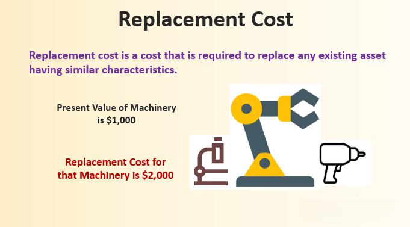

Asset valuation, replacement cost, insurance valuation, and algorithmic trading are fundamental concepts that play significant roles in the financial sector and broader economy. Asset valuation involves determining the worth of assets, which can be tangible, like real estate and machinery, or intangible, such as patents and trademarks. Understanding asset valuation is crucial for making informed investment decisions, financial reporting, and strategic planning.

Replacement cost is a concept used in accounting and insurance to determine the cost involved in replacing an asset with an equivalent one at current prices. This approach is vital for businesses to assess the real worth of their assets in situations such as damage, loss, or obsolescence, ensuring continuity of operations without significant financial strain. Replacement cost valuation often contrasts with fair market value, which reflects the asset's price under current market conditions.

Insurance valuation, on the other hand, is a process of assessing the insured value of an asset to determine coverage amounts and premiums. Different methodologies, such as agreed value, actual cash value, and replacement cost, play roles in determining insurance compensation, making it essential for risk management and policy determination.

Algorithmic trading, a modern approach to executing trades using pre-set rules and algorithms, leverages advanced data analytics and machine learning to enhance trading efficiency and speed. This trading method has transformed financial markets, offering potential benefits such as increased liquidity, reduced transaction costs, and improved market efficiency.

Understanding these concepts is important across various economic sectors, such as real estate, insurance, and financial markets. They are interconnected in financial analysis and risk management, influencing decision-making and strategy development. For instance, algorithmic trading strategies often rely on accurate asset valuations to inform trading decisions, while replacement cost considerations impact insurance and corporate asset management strategies.

This article aims to explore the interplay between these fundamental financial concepts and their implications for modern financial strategies. The upcoming sections will provide an in-depth look at asset valuation, replacement cost, insurance valuation, and algorithmic trading, examining how these areas converge and affect decision-making processes in today's dynamic financial landscape.

## Table of Contents

## Understanding Asset Valuation

Asset valuation is a fundamental concept in finance, involving the process of determining the worth of an asset. This practice is critical for businesses, investors, and financial analysts to make informed decisions pertaining to investment, budgeting, and strategic planning. The main objective of asset valuation is to establish an asset's current worth, which can be accomplished using various methodologies, each providing unique insights based on different assumptions and conditions.

The financial significance of asset valuation is profound. It aids in assessing an organization’s financial health, determining borrowing limits, and making investment decisions. Accurate valuations are crucial for financial reporting and for establishing fair transaction prices.

### Methods of Asset Valuation

1. **Market Value**: This method relies on the price at which an asset would trade in a competitive auction environment. Market value, or fair market value, often reflects the asset's true worth in an open market, influenced by supply and demand dynamics. For publicly traded assets, market value can be determined through stock exchanges, while private asset valuation may involve comparables or appraisal.

2. **Book Value**: Also known as carrying value, book value is calculated from an entity’s balance sheet as the difference between total assets and total liabilities. The formula is:
$$
   \text{Book Value} = \text{Total Assets} - \text{Total Liabilities}

$$
   This represents the net asset value in accounting terms, not necessarily aligned with the asset's market value due to depreciation policies and historical costs.

3. **Intrinsic Value**: This valuation is an estimation of an asset's inherent worth, derived from fundamental analysis, including measures like discounted cash flows (DCF). This approach requires estimating future cash flows and determining their present value through a discount rate. It involves more subjective judgments compared to market or book value.

### Applications of Asset Valuation

Asset valuation is utilized for various purposes:
- **Investment Analysis**: Investors assess whether an asset or company is undervalued or overvalued relative to its market price, guiding buying or selling decisions.
- **Mergers and Acquisitions**: Companies use valuation to negotiate terms and assess fair purchase prices during mergers or acquisitions.
- **Financial Reporting**: Accurate valuations are crucial for compliance with accounting standards and reporting obligations.

### Challenges and Considerations in Asset Valuation

Valuing assets accurately poses significant challenges:
- **Market Conditions**: Fluctuating market conditions can rapidly alter an asset's value, complicating market-based valuations.
- **Data Availability**: Insufficient or outdated data can impair valuation accuracy, particularly for private or illiquid assets.
- **Methodological Assumptions**: Each valuation method depends on assumptions that may not hold true, leading to potential discrepancies between estimated and actual values.
- **Regulatory and Economic Environment**: Changes in regulation or economic instability can impact asset values and the assumptions underlying their valuation.

Accurate asset valuation is crucial but challenging, necessitating a robust understanding of various methodologies and their applications. By navigating these complexities, stakeholders can make informed decisions that align with their financial objectives.

## Delving into Replacement Cost

Replacement cost refers to the amount of money required to replace an asset at current market prices, without considering depreciation or any adjustments for age or condition. It is a crucial concept in both accounting and insurance, serving as a basis for evaluating the current worth of an asset with the assumption of replacing it entirely at today’s price levels.

In accounting, replacement cost is used to determine the financial impact of asset wear and loss over time. It provides a measure more aligned with current market conditions, offering a dynamic valuation approach as opposed to historical cost accounting, which records assets at their original purchase price. In insurance, replacement cost is vital for policymaking, ensuring that adequate coverage is provided to restore an asset after a loss occurs. This valuation often determines the level of insurance coverage required to entirely replace the insured property with a similar one.

The role of replacement cost is pivotal in assessing true asset value post-damage or loss, as it offers a realistic representation of the expenditure needed to restore an asset to its original state or function. Unlike fair market value (FMV), which considers market conditions and potential selling factors of an asset, replacement cost focuses strictly on the cost of replication or restoration. While FMV is often lower than replacement cost, especially for older assets, replacement cost provides businesses with an estimate for total asset recovery post-damage, without factoring in depreciation or obsolescence.

For example, in the real estate sector, a home insurance policy may cover the replacement cost of a house rather than its market value to ensure the homeowner can rebuild an identical property. Similarly, in manufacturing, machinery and equipment are often evaluated using replacement cost to safeguard against potential production downtimes due to equipment failure. The telecommunications and utility sectors also rely heavily on replacement cost for maintaining essential infrastructure, ensuring that financial resources are allocated for complete restoration of service capabilities, without market-driven price variations affecting their valuation.

In summary, replacement cost offers a forward-looking valuation perspective important for robust financial planning and insurance coverage, specifically tailored to accommodate the full restoration needs exemplified in various sectors including real estate, manufacturing, telecommunications, and utilities.

## Insurance Valuation: A Critical Perspective

Insurance valuation plays a pivotal role in risk management and policy determination, offering the framework to assess the financial consequences of risk events. It ensures that insurance policies are accurately priced, providing both insurers and policyholders with a fair basis for compensation in the event of a claim. Through various methodologies, insurance valuation helps in establishing appropriate coverage limits, premiums, and indemnification processes.

Different types of insurance valuations are integral to tailoring policies to specific needs:

**Agreed Value**: This valuation type is predetermined between the insurer and the insured, signifying a fixed payout in the event of a total loss. It eliminates disputes about depreciation and provides clarity on the compensation amount, which is particularly beneficial for unique or hard-to-value assets like collector vehicles or fine art.

**Actual Cash Value (ACV)**: It represents the replacement cost minus depreciation, reflecting the current market value of the item. ACV is commonly used in property insurance and accounts for wear and tear over time, ensuring that compensation is aligned with the asset's current worth.

**Replacement Cost**: This method focuses on the expense required to replace the damaged or lost item with a new one of similar quality. It disregards depreciation, providing a basis for full restoration or substitution, making it essential for homeowners insurance and similar policies where the intention is to restore the policyholder to their pre-loss state.

The methodology behind calculating insurance valuation involves assessing the risk exposures and determining the probability and potential severity of loss events. The use of actuarial science is prominent in this domain, employing statistical models to analyze historical data and forecast future claims. Insurers incorporate factors like market trends, loss history, and economic conditions to refine their valuation processes.

Challenges in insurance valuation are notable, particularly in unpredictable circumstances like natural disasters or economic downturns. Such events can lead to an escalation in claim frequencies and severities, disrupting standard valuation models. Additionally, emerging risks such as cyber threats and climate change pose valuation challenges, necessitating the development of adaptive models that can swiftly respond to evolving threat landscapes.

In conclusion, insurance valuation is foundational to effective risk management and policy structuring. By accommodating diverse methodologies and adapting to environmental shifts, it continues to ensure that insurance remains a resilient mechanism for financial protection.

## The Rise of Algorithmic Trading

Algorithmic trading, often referred to as algo trading or automated trading, represents a major evolution in financial markets, profoundly transforming trading operations. This approach utilizes computer algorithms to conduct trading processes at speeds and frequencies that are beyond human capabilities. As technology advances, [algorithmic trading](/wiki/algorithmic-trading) continues to grow, influencing market dynamics, execution strategies, and risk management practices.

Algorithmic trading uses algorithms—sets of predefined rules and instructions—to analyze trading opportunities and execute buy or sell orders autonomously. These instructions can be based on timing, price, quantity, or any other mathematical model, enabling traders to execute orders with speed and precision. Algorithms can operate across various asset classes including stocks, bonds, commodities, and [forex](/wiki/forex-system). For instance, a common algorithm might exploit statistical [arbitrage](/wiki/arbitrage) opportunities, capitalizing on price inefficiencies by analyzing historical data sets.

The integration of big data analytics and [artificial intelligence](/wiki/ai-artificial-intelligence) (AI) into algo trading has further enhanced its effectiveness. Big data allows traders to process and assess massive volumes of data in real-time, extracting valuable insights to inform trading strategies. AI technologies, particularly [machine learning](/wiki/machine-learning) (ML), enable algorithms to learn from historical patterns and improve decision-making over time. For example, ML models can predict price movements by integrating numerous factors such as market sentiment, macroeconomic indicators, and technical signals.

Algorithmic trading offers several advantages. One of its most significant benefits is increased market [liquidity](/wiki/liquidity-risk-premium). By automating trades, algorithms can execute large volumes of transactions, which enhances market fluidity and enables tighter bid-ask spreads. This, in turn, benefits investors by allowing them to buy or sell securities at more favorable prices, thereby improving market efficiency.

Another advantage is the reduction in transaction costs. Automated trading systems minimize manual intervention, reducing the likelihood of human error and lowering costs associated with trading operations. Furthermore, algorithms can optimize order execution by breaking down large orders into smaller, strategically timed trades, minimizing market impact and slippage.

Additionally, algorithmic trading allows for better risk management. Algorithms can continuously monitor and adjust trading positions in real-time, responding swiftly to market changes. This responsiveness aids in maintaining desired risk profiles and protecting investment portfolios from adverse market movements.

The rise of algorithmic trading marks a pivotal shift in how financial markets operate. By leveraging cutting-edge technologies, it enhances trading efficiency, reduces costs, and provides sophisticated tools for managing market risks. As the capabilities of big data and AI continue to expand, algorithmic trading is poised to play an increasingly integral role in the global financial landscape.

## The Convergence of Asset Valuation and Algo Trading

Algorithmic trading stands at the intersection of finance and technology, where mathematical models and algorithms execute trades at speeds and efficiencies unattainable by human traders. An integral component of formulating these trading algorithms is the incorporation of asset valuation data. Asset valuation provides crucial insights into the intrinsic worth of securities, thereby influencing trading decisions and the creation of automated models.

Algorithmic trading strategies rely heavily on asset valuation to gauge the true value of financial instruments. By integrating data on market value, book value, and intrinsic value, algorithms can make informed decisions on buying or selling securities. For instance, when an asset is undervalued according to its intrinsic or market value, an algorithm might execute a buy order, anticipating a price correction. Conversely, overvalued assets might trigger sell orders.

The impact of asset valuation on trading decisions is significant. Quantitative models imbued with robust valuation data can detect arbitrage opportunities, assess risk exposure, and optimize the timing of trades. For example, a model using discounted cash flow (DCF) analysis to determine intrinsic value can compare this with real-time market prices to predict and act on discrepancies. Moreover, machine learning algorithms are increasingly employed to analyze complex datasets, uncovering patterns and insights that refine valuation metrics further.

Case studies highlight the efficacy of incorporating asset valuation into algorithmic trading. A notable example is the use of fundamentals-based trading algorithms during financial market disruptions. Accurate asset valuation during turmoil has allowed certain trading systems to exploit market inefficiencies. A stock deemed undervalued in the aftermath of a sudden market drop presents an opportunity for those using valuation-driven algorithms. These systems can capitalize quickly, as witnessed during the 2008 financial crisis when algorithms with solid fundamental valuation frameworks outperformed traditional methods.

Despite the advantages, there are inherent risks in utilizing asset valuation within algorithmic trading. The accuracy of valuation models is paramount; incorrect assumptions or data can lead to significant financial losses. Additionally, market [volatility](/wiki/volatility-trading-strategies) can render conventional valuation models ineffective, necessitating continuous revision and adaptation of algorithms. The rapid pace at which trading environments evolve underscores the necessity for valuation models to be both robust and flexible.

In summary, the convergence of asset valuation and algorithmic trading represents a sophisticated aspect of modern finance. Trading algorithms that leverage precise valuation data can achieve superior performance by making informed, data-driven decisions. However, the success of these models hinges on the accuracy and adaptability of the asset valuation methods employed, highlighting the ongoing need for innovation and vigilance in a dynamic market landscape.

## Challenges and Future Outlook

Professionals at the intersection of asset valuation, insurance valuation, replacement cost, and algorithmic trading face several significant challenges. Data security is a paramount concern, especially given the vast amounts of sensitive financial information handled. The integrity of data can be compromised through cyber-attacks, leading to erroneous valuations and trading decisions. Furthermore, market volatility adds to the complexity, as rapid price fluctuations can affect the accuracy of asset valuations and the performance of algorithmic trading models.

Emerging trends such as AI-driven valuations offer promising advancements. Artificial intelligence and machine learning algorithms can analyze extensive datasets to provide more accurate predictive valuations, which can facilitate more informed trading and insurance underwriting decisions. These technologies are anticipated to reduce human error and improve decision-making efficiencies. Concurrently, blockchain technology is gaining traction in ensuring data transparency and security. With its decentralized nature, blockchain can enhance the trust in the data used for valuations and trading, thus mitigating some of the risks associated with data integrity and fraud.

Looking to future developments, the integration of asset valuation with algorithmic trading methods is likely to become more sophisticated. Enhanced computation capabilities could lead to highly adaptive trading algorithms that incorporate real-time valuation data, potentially reshaping market dynamics. For instance, a scenario could involve an algorithm that adjusts trading strategies based on real-time asset value fluctuations, incorporating both intrinsic and external market factors to optimize returns.

Continuous learning and adaptation are crucial in this ever-evolving financial landscape. Professionals must stay informed about technological advancements and regulatory changes to maintain a competitive edge. Training in new technologies, such as AI and blockchain, alongside an understanding of market mechanics, is necessary to navigate future challenges and leverage opportunities in this complex intersection of finance and technology.

## Conclusion

In summarizing the intricate discussions surrounding asset valuation, replacement cost, insurance valuation, and algorithmic trading, it is evident that these concepts form the bedrock of modern financial strategies. Asset valuation serves as a critical tool for investors and businesses, enabling informed decision-making through diverse methodologies—ranging from market value to intrinsic value—each offering unique insights into the financial standing and potential of an asset. Meanwhile, the notion of replacement cost highlights the pragmatic approach to understanding an asset's worth, particularly in situations of damage or loss. This measure, often juxtaposed with fair market value, plays a crucial role in industries where asset recovery costs substantially impact operations and insurance settlements.

Insurance valuation emerges as a pivotal element in risk management, providing mechanisms to ascertain the monetary compensation required under varying conditions. Different valuation methods, including agreed value and actual cash value, reflect the complexity and precision needed to accommodate unforeseen circumstances. The challenges inherent in these calculations underscore the necessity for a comprehensive understanding of risk assessment.

Algorithmic trading, with its expansive use of big data and artificial intelligence, has revolutionized trading efficiency. It relies heavily on timely and precise asset valuation to drive automated trading decisions, thereby enhancing market liquidity and lowering transaction costs. The intersection of asset valuation and algo trading manifests in robust trading models that must consistently adapt to evolving market dynamics.

Professionals and stakeholders in finance must appreciate the dynamic interplay of these concepts to maintain a competitive edge. There is a need for continuous exploration and adaptation as emerging trends like AI-driven valuations and blockchain technologies reshape traditional frameworks. As the financial landscape evolves, grasping the intricacies of these foundational components not only empowers individual actors but also ensures the robustness and resilience of financial markets. Thus, deeper engagement and critical understanding remain key for navigating the complexities of today's financial domain.

## References & Further Reading

[1]: ["Advances in Financial Machine Learning"](https://www.amazon.com/Advances-Financial-Machine-Learning-Marcos/dp/1119482089) by Marcos Lopez de Prado

[2]: ["Machine Learning for Algorithmic Trading"](https://github.com/PacktPublishing/Machine-Learning-for-Algorithmic-Trading-Second-Edition) by Stefan Jansen

[3]: ["Quantitative Trading: How to Build Your Own Algorithmic Trading Business"](https://www.amazon.com/Quantitative-Trading-Build-Algorithmic-Business/dp/0470284889) by Ernest P. Chan

[4]: ["Damodaran on Valuation: Security Analysis for Investment and Corporate Finance"](https://www.amazon.com/Damodaran-Valuation-Security-Investment-Corporate/dp/0471751219) by Aswath Damodaran

[5]: ["Insurance and Risk Management"](https://www.mckinsey.com/capabilities/risk-and-resilience/our-insights/navigating-shifting-risks-in-the-insurance-industry) by Dimitrios Kotsalakis