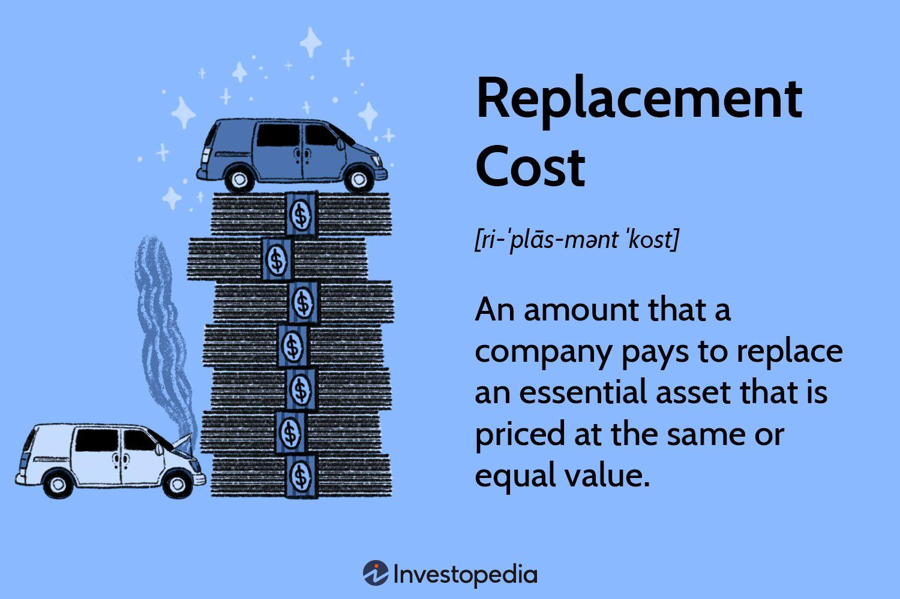

## Table of Contents

## What is replacement cost?

Replacement cost is the amount of money it would take to replace something if it gets lost, damaged, or destroyed. This could be anything from a household item like a TV to a building like a house. Insurance companies often use replacement cost to figure out how much money they should give you if you need to replace something covered by your insurance policy.

For example, if your TV breaks and you have insurance, the replacement cost would be the price of a new TV that is similar to the one you had. This is different from the actual cash value, which would take into account how old your TV was and might give you less money because the TV had depreciated over time. Knowing the replacement cost helps you understand how much insurance you might need to fully cover your belongings.

## How is replacement cost different from market value?

Replacement cost and market value are two different ways to figure out how much something is worth, but they look at it from different angles. Replacement cost is about how much money you would need to spend to get a new item that is similar to the one you lost or that got damaged. It doesn't care about how old the item is or how much it has been used. For example, if your laptop breaks, the replacement cost would be the price of buying a new laptop with similar features today.

Market value, on the other hand, is about how much someone would be willing to pay for your item right now, in its current condition. This value takes into account things like how old the item is, how much wear and tear it has, and what similar items are selling for in the market. Using the same laptop example, the market value might be lower than the replacement cost because the laptop is used and not brand new.

These two values can be quite different. Replacement cost is usually higher because it's based on buying something new, while market value reflects the item's current state and what people are willing to pay for it. Understanding the difference is important, especially when you're dealing with insurance or thinking about selling something.

## Why is understanding replacement cost important for homeowners?

Understanding replacement cost is important for homeowners because it helps them know how much money they would need to rebuild their home or replace their belongings if something bad happens, like a fire or a storm. If you know the replacement cost, you can make sure you have enough insurance to cover everything. This way, if your house gets damaged, you won't have to pay a lot of money out of your pocket to fix it or buy new things.

It's also helpful when you're planning to make changes to your home. For example, if you want to add a new room or upgrade your kitchen, knowing the replacement cost can help you figure out how much more insurance you might need. This makes sure you're always covered, no matter what changes you make to your home. So, understanding replacement cost can save you from big financial surprises and keep you prepared for anything.

## How can someone calculate the replacement cost of their property?

To calculate the replacement cost of your property, you need to think about how much it would cost to rebuild your home and replace everything inside it if it were completely destroyed. Start by finding out the cost per square foot to build a new home similar to yours in your area. You can talk to local builders or check with insurance agents to get an idea of this cost. Then, multiply this cost by the size of your home in square feet. This gives you a good starting point for the replacement cost of the building itself.

Next, you need to think about all the things inside your home, like furniture, appliances, and personal belongings. Make a list of everything you own and find out how much it would cost to buy these items new today. You can use online shopping sites or visit stores to get an idea of current prices. Add up the total cost of all your belongings to find out the replacement cost for your personal property. When you add the replacement cost of the building and your belongings together, you get the total replacement cost of your property.

## What factors influence the replacement cost of a building?

Several things can affect how much it would cost to rebuild a building. The type of building materials used, like wood, brick, or steel, makes a big difference. More expensive materials will increase the replacement cost. Also, the size and layout of the building matter. A bigger building or one with a complex design will cost more to rebuild than a smaller, simpler one. The location of the building is important too. Building costs can be higher in some areas because of things like labor costs, local building codes, and the cost of transporting materials.

Other factors include the age of the building and any special features it might have. Older buildings might need more work to bring them up to current building standards, which can raise the replacement cost. Special features like a swimming pool, a high-end kitchen, or a home theater system will also add to the cost. It's also important to think about inflation and changes in construction costs over time. These can change how much it would cost to rebuild a building today compared to when it was first built.

## Can replacement cost change over time? If so, why?

Yes, replacement cost can change over time. This happens because the prices of building materials and labor can go up or down. For example, if the cost of wood or steel goes up, it will cost more to rebuild a house. Also, if there are more people wanting to build homes, the cost of labor might go up too. Changes in the economy, like inflation, can make everything more expensive, which means the replacement cost will be higher.

Another reason replacement cost can change is because of new building codes and standards. If the rules for building homes get stricter, it might cost more to rebuild a house to meet those new rules. For example, if new laws say you need to use special materials that are better for the environment, those materials might be more expensive. Also, if you add new things to your home, like a fancy kitchen or a pool, the replacement cost will go up because these things cost more to replace.

## What role does replacement cost play in insurance policies?

Replacement cost is really important when it comes to insurance policies. It's the amount of money it would take to replace your home or your stuff if something bad happens, like a fire or a storm. When you buy insurance, you want to make sure the policy covers the full replacement cost. That way, if you need to rebuild your home or buy new things, the insurance company will give you enough money to do it without you having to pay a lot out of your own pocket.

Insurance companies use replacement cost to figure out how much to charge for your policy. If the replacement cost of your home goes up because of things like inflation or new building codes, your insurance might cost more too. It's a good idea to check your insurance policy every now and then to make sure it still covers the full replacement cost of your home and belongings. This helps you stay protected no matter what happens.

## How do insurance companies determine the replacement cost for coverage?

Insurance companies figure out the replacement cost by looking at how much it would cost to rebuild your home and replace your stuff if it got destroyed. They start by finding out the cost per square foot to build a new home like yours in your area. They talk to builders and use special tools to get this information. Then, they multiply this cost by the size of your home. This gives them a good idea of how much it would cost to rebuild the building itself. They also look at the cost of all the things inside your home, like furniture and appliances, and add that up to get the total replacement cost.

Sometimes, insurance companies use special computer programs to help them figure out the replacement cost. These programs take into account things like the type of building materials used, the age of your home, and any special features it might have. They also consider things like inflation and changes in building costs over time. This helps them make sure the replacement cost they come up with is as accurate as possible. By doing all this, insurance companies can set the right amount of coverage for your policy so you're protected if something bad happens.

## What are the common mistakes people make when estimating replacement costs?

One common mistake people make when figuring out replacement costs is not thinking about inflation. Over time, the cost of building materials and labor goes up. If you don't update your estimate, you might not have enough money to rebuild your home if something bad happens. Another mistake is forgetting about special features in your home, like a pool or a fancy kitchen. These things cost more to replace, so if you don't include them in your estimate, you won't have enough insurance to cover everything.

People also often make the mistake of using the market value of their home instead of the replacement cost. Market value is how much someone would pay for your home right now, but it doesn't tell you how much it would cost to build a new one. This can lead to having too little insurance. Lastly, some people don't consider changes in building codes. New rules might make it more expensive to rebuild your home to meet current standards, and if you don't account for this, you might not have enough money to fix everything.

## How does depreciation affect replacement cost?

Depreciation doesn't directly change the replacement cost of something. Replacement cost is about how much it would cost to buy a new item that's just like the old one. For example, if your TV breaks, the replacement cost is the price of a new TV with similar features, no matter how old your old TV was. Depreciation, on the other hand, is about how the value of your item goes down over time because it gets older or used more.

However, depreciation does matter when it comes to insurance. Some insurance policies use the actual cash value instead of replacement cost. The actual cash value takes into account how much your item has depreciated. So, if your TV is old and you have an actual cash value policy, the insurance company might give you less money to replace it because it's not worth as much as a new one. This is different from a replacement cost policy, which would give you enough money to buy a new TV, no matter how old your old one was.

## What advanced methods or technologies are used to assess replacement cost more accurately?

To figure out replacement cost more accurately, insurance companies and property owners use special computer programs. These programs look at a lot of information to come up with a good guess on how much it would cost to rebuild a home or replace stuff. They take into account things like the type of materials used in the building, how old the home is, and any special features it has. They also think about how much it costs to build things in the area where the home is located. These programs can even update their guesses over time to keep up with changes in building costs and new building rules.

Another way to get a more accurate replacement cost is by using drones and 3D scanning technology. Drones can fly around a building and take pictures from all angles. These pictures help create a detailed 3D model of the home. With this model, experts can see exactly what materials were used and how the building is put together. This helps them figure out how much it would cost to rebuild everything. 3D scanning can also be used inside the home to see all the furniture and other stuff, making it easier to estimate the cost of replacing everything inside.

## How can businesses incorporate replacement cost into their risk management strategies?

Businesses can use replacement cost to help them manage risks better. They can figure out how much it would cost to replace their buildings, machines, and other important stuff if something bad happens, like a fire or a flood. By knowing these costs, businesses can make sure they have enough insurance to cover everything. This way, if they need to replace something, they won't have to pay a lot of money out of their own pocket. It's also a good idea for businesses to check their replacement costs regularly because prices can change over time due to things like inflation or new building rules.

Another way businesses can use replacement cost in their risk management is by planning ahead. If they know how much it would cost to replace their stuff, they can set aside money in case they need it. This helps them be ready for unexpected problems without hurting their finances too much. By thinking about replacement costs, businesses can make smarter choices about where to spend their money on insurance and how to protect their property. This makes them better prepared to handle any risks that come their way.

## What is Understanding Asset Valuation?

Asset valuation is a fundamental concept in finance, involving the process of determining the worth of an asset. This practice is critical for businesses, investors, and financial analysts to make informed decisions pertaining to investment, budgeting, and strategic planning. The main objective of asset valuation is to establish an asset's current worth, which can be accomplished using various methodologies, each providing unique insights based on different assumptions and conditions.

The financial significance of asset valuation is profound. It aids in assessing an organization’s financial health, determining borrowing limits, and making investment decisions. Accurate valuations are crucial for financial reporting and for establishing fair transaction prices.

### Methods of Asset Valuation

1. **Market Value**: This method relies on the price at which an asset would trade in a competitive auction environment. Market value, or fair market value, often reflects the asset's true worth in an open market, influenced by supply and demand dynamics. For publicly traded assets, market value can be determined through stock exchanges, while private asset valuation may involve comparables or appraisal.

2. **Book Value**: Also known as carrying value, book value is calculated from an entity’s balance sheet as the difference between total assets and total liabilities. The formula is:
$$
   \text{Book Value} = \text{Total Assets} - \text{Total Liabilities}

$$
   This represents the net asset value in accounting terms, not necessarily aligned with the asset's market value due to depreciation policies and historical costs.

3. **Intrinsic Value**: This valuation is an estimation of an asset's inherent worth, derived from fundamental analysis, including measures like discounted cash flows (DCF). This approach requires estimating future cash flows and determining their present value through a discount rate. It involves more subjective judgments compared to market or book value.

### Applications of Asset Valuation

Asset valuation is utilized for various purposes:
- **Investment Analysis**: Investors assess whether an asset or company is undervalued or overvalued relative to its market price, guiding buying or selling decisions.
- **Mergers and Acquisitions**: Companies use valuation to negotiate terms and assess fair purchase prices during mergers or acquisitions.
- **Financial Reporting**: Accurate valuations are crucial for compliance with accounting standards and reporting obligations.

### Challenges and Considerations in Asset Valuation

Valuing assets accurately poses significant challenges:
- **Market Conditions**: Fluctuating market conditions can rapidly alter an asset's value, complicating market-based valuations.
- **Data Availability**: Insufficient or outdated data can impair valuation accuracy, particularly for private or illiquid assets.
- **Methodological Assumptions**: Each valuation method depends on assumptions that may not hold true, leading to potential discrepancies between estimated and actual values.
- **Regulatory and Economic Environment**: Changes in regulation or economic instability can impact asset values and the assumptions underlying their valuation.

Accurate asset valuation is crucial but challenging, necessitating a robust understanding of various methodologies and their applications. By navigating these complexities, stakeholders can make informed decisions that align with their financial objectives.

## References & Further Reading

[1]: ["Advances in Financial Machine Learning"](https://www.amazon.com/Advances-Financial-Machine-Learning-Marcos/dp/1119482089) by Marcos Lopez de Prado

[2]: ["Machine Learning for Algorithmic Trading"](https://github.com/PacktPublishing/Machine-Learning-for-Algorithmic-Trading-Second-Edition) by Stefan Jansen

[3]: ["Quantitative Trading: How to Build Your Own Algorithmic Trading Business"](https://www.amazon.com/Quantitative-Trading-Build-Algorithmic-Business/dp/0470284889) by Ernest P. Chan

[4]: ["Damodaran on Valuation: Security Analysis for Investment and Corporate Finance"](https://www.amazon.com/Damodaran-Valuation-Security-Investment-Corporate/dp/0471751219) by Aswath Damodaran

[5]: ["Insurance and Risk Management"](https://www.mckinsey.com/capabilities/risk-and-resilience/our-insights/navigating-shifting-risks-in-the-insurance-industry) by Dimitrios Kotsalakis