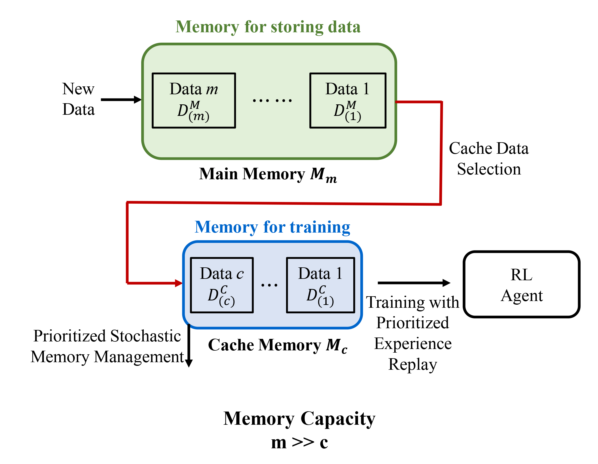

## Table of Contents

## What is Replay Memory in the context of machine learning?

Replay Memory is a technique used in machine learning, especially in reinforcement learning, to help train models more efficiently. It involves storing the experiences of an agent, like a robot or a computer program, as it interacts with its environment. These experiences include what the agent saw, what action it took, and what happened as a result. By saving these experiences in a memory buffer, the agent can go back and learn from them again later. This helps the agent learn from past mistakes and successes without having to experience everything in real-time, which can be time-consuming and costly.

When training a model, the agent randomly samples a batch of experiences from the replay memory. This randomness helps break the correlation between consecutive experiences, which can lead to more stable and effective learning. For example, if an agent is learning to play a video game, it might store moments like jumping over an obstacle or collecting a coin. Later, it can revisit these moments to refine its strategies. By using replay memory, the agent can learn from a diverse set of experiences, improving its performance over time.

## Why is Replay Memory important for training reinforcement learning models?

Replay Memory is important for training reinforcement learning models because it helps them learn more efficiently and effectively. When an agent interacts with its environment, it can store these experiences in a memory buffer. Later, the agent can revisit these experiences to learn from them again. This means the agent doesn't have to experience everything in real-time, which can save a lot of time and resources. For example, if a robot is learning to navigate a maze, it can store and review moments when it successfully found a path or got stuck, allowing it to improve its strategies without having to explore the maze over and over.

Another reason Replay Memory is important is that it helps break the correlation between consecutive experiences. When an agent learns from experiences in the order they happen, it can get stuck in a loop of similar situations. By randomly sampling experiences from the replay memory, the agent gets a diverse set of learning opportunities. This randomness helps the model learn more stable and generalized policies. For instance, if an agent is learning to play a game, it might sample moments from different levels or stages of the game, helping it adapt to various scenarios more effectively. Overall, Replay Memory makes the training process more robust and efficient, leading to better performance of the [reinforcement learning](/wiki/reinforcement-learning) model.

## How does Replay Memory help in stabilizing the learning process?

Replay Memory helps stabilize the learning process by breaking the correlation between consecutive experiences. When an agent learns from experiences in the order they happen, it can get stuck in a loop of similar situations. This can make the learning process unstable because the agent keeps seeing the same kinds of things over and over. By using Replay Memory, the agent can randomly sample experiences from a memory buffer. This randomness means the agent gets to learn from a mix of different experiences, which helps it learn more evenly and avoid getting stuck in loops.

Another way Replay Memory helps is by allowing the agent to learn from past experiences multiple times. When an agent interacts with its environment, it can store these experiences in a memory buffer. Later, the agent can go back and learn from these experiences again. This means the agent doesn't have to experience everything in real-time, which can be time-consuming and costly. By revisiting past experiences, the agent can refine its strategies and learn from its mistakes and successes more effectively, leading to a more stable learning process.

## What is the basic structure of a Replay Memory buffer?

A Replay Memory buffer is like a big list where an agent stores its experiences. Each experience includes what the agent saw, what action it took, and what happened next. These experiences are saved in the buffer in the order they happen, but the agent can go back and look at them in any order. The buffer has a fixed size, so when it gets full, the oldest experiences are removed to make room for new ones. This way, the buffer always has a mix of recent and older experiences.

When the agent wants to learn, it picks a few experiences from the buffer at random. This randomness helps the agent learn from different kinds of experiences, not just the ones that happened one after the other. By using the Replay Memory buffer, the agent can learn more evenly and avoid getting stuck on the same kinds of problems. This makes the learning process more stable and helps the agent get better at what it's trying to do.

## How do you implement a simple Replay Memory in Python?

To implement a simple Replay Memory in Python, we can use a class to store and manage the experiences. The class will have methods to add new experiences and to sample a batch of experiences randomly. The buffer will have a fixed size, so when it's full, the oldest experiences will be removed to make room for new ones. Here's how you can do it:

```python
import random
import numpy as np

class ReplayMemory:
    def __init__(self, capacity):
        self.capacity = capacity
        self.buffer = []
        self.position = 0

    def push(self, state, action, reward, next_state, done):
        if len(self.buffer) < self.capacity:
            self.buffer.append(None)
        self.buffer[self.position] = (state, action, reward, next_state, done)
        self.position = (self.position + 1) % self.capacity

    def sample(self, batch_size):
        batch = random.sample(self.buffer, batch_size)
        state, action, reward, next_state, done = map(np.stack, zip(*batch))
        return state, action, reward, next_state, done

    def __len__(self):
        return len(self.buffer)
```

In this code, the `ReplayMemory` class is initialized with a `capacity` that sets the maximum number of experiences it can hold. The `push` method adds a new experience to the buffer, and if the buffer is full, it overwrites the oldest experience. The `sample` method randomly selects a batch of experiences from the buffer, which is useful for training the model. The `__len__` method returns the current number of experiences in the buffer. This simple implementation helps an agent learn from its past experiences more effectively and stabilizes the learning process.

## What is the difference between uniform and prioritized sampling in Replay Memory?

Uniform sampling in Replay Memory means that every experience in the buffer has an equal chance of being chosen when the agent wants to learn from it. It's like [picking](/wiki/asset-class-picking) names out of a hat where each name has the same chance of being picked. This method is simple and helps the agent learn from a variety of experiences, but it doesn't focus on the most important or challenging experiences.

Prioritized sampling, on the other hand, gives more important experiences a higher chance of being chosen. The importance of an experience can be based on how much the agent can learn from it, often measured by the difference between what the agent expected to happen and what actually happened. This method helps the agent focus on experiences that are more useful for learning, but it can also make the learning process less stable if not managed carefully.

## What is Prioritized Experience Replay and how does it work?

Prioritized Experience Replay is a way to make the Replay Memory in reinforcement learning even better. Instead of picking experiences at random, it chooses experiences that are more important to learn from. The importance of an experience is often based on how much the agent can learn from it. This is measured by something called Temporal Difference (TD) error, which is the difference between what the agent expected to happen and what actually happened. If the TD error is big, it means the agent was really surprised, and that experience is more important to learn from.

To use Prioritized Experience Replay, you keep track of the TD error for each experience in the Replay Memory. When it's time to learn, you pick experiences with a higher chance of choosing those with bigger TD errors. This helps the agent focus on the most useful experiences, which can make learning faster. But, it's important to balance this with some randomness, so the agent doesn't just learn from the same few experiences over and over. This way, the agent can still learn from a variety of experiences, but with a focus on the ones that matter most.

## How can Replay Memory improve sample efficiency in deep reinforcement learning?

Replay Memory helps make deep reinforcement learning more efficient by letting the agent learn from its experiences over and over again. Instead of having to go through the same situations in real-time, the agent can store what it saw, what it did, and what happened in a memory buffer. When it's time to learn, the agent can go back to these stored experiences and use them to train its model. This means the agent doesn't need as many new experiences to learn, saving time and resources. For example, if a robot is learning to navigate a maze, it can store moments when it found a path or got stuck, and then use those moments to improve its strategies without having to explore the maze again.

Another way Replay Memory improves sample efficiency is by breaking the correlation between experiences. When an agent learns from experiences in the order they happen, it can get stuck in loops of similar situations. This can make the learning process slow and less effective. By randomly sampling experiences from the Replay Memory, the agent gets to learn from a mix of different experiences, which helps it learn more evenly and quickly. This randomness helps the agent avoid getting stuck and makes the learning process more stable. Overall, Replay Memory allows the agent to make the most out of each experience, leading to faster and more efficient learning in deep reinforcement learning.

## What are some common challenges and solutions when using Replay Memory?

One common challenge when using Replay Memory is managing the size of the buffer. If the buffer is too small, it might not hold enough experiences for the agent to learn effectively. If it's too big, it can take up a lot of memory and slow down the learning process. A solution to this is to set the buffer size based on the specific task and the agent's needs. For example, if the agent is learning a simple task, a smaller buffer might be enough. But for more complex tasks, a larger buffer could help the agent learn from a wider variety of experiences.

Another challenge is deciding how to sample experiences from the buffer. Uniform sampling, where every experience has an equal chance of being chosen, can be simple but might not focus on the most important experiences. Prioritized Experience Replay, where experiences with higher Temporal Difference (TD) error are chosen more often, can help the agent learn faster but might make the learning process less stable. A solution is to use a mix of both methods, like adding some randomness to prioritized sampling to keep the learning process balanced. This way, the agent can focus on important experiences but still learn from a variety of situations.

## How does the size of the Replay Memory buffer affect learning performance?

The size of the Replay Memory buffer can really change how well an agent learns. If the buffer is too small, it won't hold enough experiences for the agent to learn from. This means the agent might keep seeing the same few experiences over and over, which can make it hard to learn new things. On the other hand, if the buffer is too big, it can take up a lot of memory and slow down the learning process. The agent might spend too much time looking at old experiences that aren't as useful anymore. Finding the right size for the buffer is important to help the agent learn effectively without wasting time or resources.

The right buffer size depends on what the agent is trying to learn. For simple tasks, a smaller buffer might be enough because the agent doesn't need as many different experiences to learn well. But for more complex tasks, a larger buffer can help the agent learn from a wider variety of experiences, which can lead to better performance. It's all about finding a balance that lets the agent learn from enough experiences to improve, but not so many that it gets overwhelmed or slows down.

## Can you explain the role of Replay Memory in off-policy learning algorithms?

Replay Memory plays a key role in off-policy learning algorithms by helping the agent learn from its past experiences more effectively. In off-policy learning, the agent can learn from experiences gathered by following a different policy than the one it's currently using. Replay Memory stores these experiences in a buffer, allowing the agent to revisit them later. This means the agent doesn't have to go through the same situations over and over again in real-time. Instead, it can learn from a variety of past experiences, which can help it learn faster and more efficiently.

For example, in an off-policy algorithm like Q-learning, the agent might explore its environment using one policy but learn from experiences stored in the Replay Memory using another policy. By randomly sampling experiences from the buffer, the agent can break the correlation between consecutive experiences, which helps stabilize the learning process. This randomness ensures the agent learns from a diverse set of experiences, leading to a more robust and generalized policy. Overall, Replay Memory in off-policy learning allows the agent to make the most out of its experiences, improving its performance without needing to interact with the environment continuously.

## What advanced techniques can be applied to optimize Replay Memory for specific use cases?

One advanced technique to optimize Replay Memory is using Prioritized Experience Replay (PER). Instead of choosing experiences at random, PER picks experiences that are more important for the agent to learn from. The importance of an experience is often measured by its Temporal Difference (TD) error, which shows how surprised the agent was by what happened. Experiences with a bigger TD error get a higher chance of being chosen. This helps the agent focus on the most useful experiences, making learning faster. But, it's important to mix in some randomness to keep the learning process stable and avoid overfitting to just a few experiences.

Another technique is using Hindsight Experience Replay (HER). HER is useful when the agent often fails to reach its goal. It lets the agent learn from failed experiences by changing the goal of those experiences after the fact. For example, if a robot was trying to reach a red ball but ended up at a blue ball instead, HER would treat that experience as if the goal was to reach the blue ball. This way, the agent can learn something useful even from failed attempts. By adding these modified experiences to the Replay Memory, the agent can learn more efficiently and adapt to different situations better.

A third technique involves using different types of Replay Memory for different parts of the learning process. For instance, you can use a smaller buffer for short-term learning and a larger buffer for long-term learning. The smaller buffer helps the agent quickly adapt to recent changes in the environment, while the larger buffer helps it learn from a wider range of experiences over time. By managing multiple buffers, the agent can balance the need for quick adaptation with the need for stable, long-term learning. This approach can be particularly useful in complex environments where the agent needs to handle both immediate and long-term challenges.

## References & Further Reading

[1]: Lin, L.-J. (1992). ["Self-improving reactive agents based on reinforcement learning, planning, and teaching."](https://link.springer.com/article/10.1007/BF00992699) Machine Learning, 8(3-4), 293-321.

[2]: Mnih, V., Kavukcuoglu, K., Silver, D., Rusu, A. A., Veness, J., Bellemare, M. G., ... & Hassabis, D. (2015). ["Human-level control through deep reinforcement learning."](https://www.nature.com/articles/nature14236) Nature, 518(7540), 529-533.

[3]: Schaul, T., Quan, J., Antonoglou, I., & Silver, D. (2016). ["Prioritized Experience Replay."](https://arxiv.org/abs/1511.05952) arXiv preprint arXiv:1511.05952.

[4]: Van Hasselt, H., Guez, A., & Silver, D. (2016). ["Deep Reinforcement Learning with Double Q-learning."](https://arxiv.org/abs/1509.06461) In Proceedings of the AAAI Conference on Artificial Intelligence (Vol. 30, No. 1).

[5]: Andrychowicz, M., Wolski, F., Ray, A., Schneider, J., Fong, R., Welinder, P., ... & Zaremba, W. (2017). ["Hindsight Experience Replay."](https://arxiv.org/abs/1707.01495) Advances in Neural Information Processing Systems.