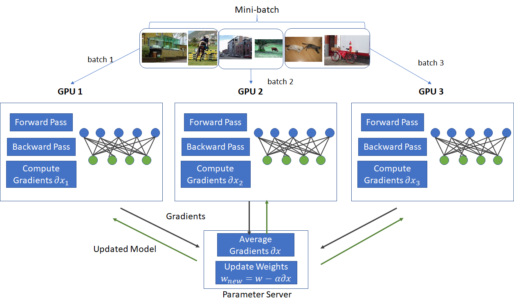

## Table of Contents

## What is Replicated Data Parallel in the context of machine learning?

Replicated Data Parallel is a technique used in machine learning to speed up the training of large models by using multiple computers or GPUs at the same time. In this method, the same model is copied onto each device, and each device processes a different part of the data. After processing their part of the data, the devices share the results with each other to update the model. This way, the training can be done much faster because the work is divided among many devices.

One key advantage of Replicated Data Parallel is that it can make use of the increasing availability of powerful computing resources. By spreading the workload across multiple GPUs or machines, it helps in handling large datasets and complex models that would otherwise take a very long time to train on a single device. However, this method also requires careful management of how the data and updates are shared among the devices to ensure that all copies of the model stay in sync and the training remains efficient.

## How does Replicated Data Parallel differ from traditional Data Parallelism?

Replicated Data Parallel and traditional Data Parallelism both aim to speed up machine learning model training by using multiple devices, but they do it in slightly different ways. In traditional Data Parallelism, the model is split into different parts, and each part is sent to a different device. Each device then works on its part of the model with the entire dataset. After processing, the devices combine their results to update the whole model. This method can be complex because it requires careful management of how the model is split and how the results are combined.

On the other hand, Replicated Data Parallel takes a simpler approach. Here, the entire model is copied onto each device, and each device works on a different part of the data. After processing their part of the data, the devices share their results to update all copies of the model. This method is easier to manage because the model stays the same on all devices, and only the data is divided. However, it requires more memory because each device needs to hold a full copy of the model.

Both methods have their advantages and challenges. Traditional Data Parallelism can be more memory-efficient since each device only needs to hold a part of the model, but it can be harder to implement and manage. Replicated Data Parallel, while requiring more memory, is often easier to set up and can lead to faster training times because the model updates are simpler to synchronize across devices.

## What are the main benefits of using Replicated Data Parallel for training machine learning models?

Replicated Data Parallel makes training [machine learning](/wiki/machine-learning) models faster by using many computers or GPUs at the same time. In this method, the same model is copied onto each device, and each device works on a different part of the data. Because the work is split up, the training can be done much quicker than if it was done on just one device. This is especially helpful when you have a lot of data or a very complex model that would take too long to train otherwise.

Another big benefit is that Replicated Data Parallel is easier to set up and manage compared to other methods. In traditional Data Parallelism, you have to split the model into parts and send each part to a different device, which can be tricky. But with Replicated Data Parallel, you just copy the whole model to each device and divide the data. This makes it simpler to keep all the devices working together and updating the model correctly. Even though it uses more memory because each device needs a full copy of the model, the simplicity and speed can make it worth it for many machine learning projects.

## Can you explain how PyTorch's DistributedDataParallel (DDP) implements Replicated Data Parallel?

PyTorch's DistributedDataParallel (DDP) is a way to use Replicated Data Parallel to train machine learning models faster. In DDP, the same model is copied onto each device, like a GPU or a computer. Each device then works on a different part of the data. After working on their part, the devices share what they learned with each other to update the model. This sharing happens in a smart way that makes sure all the copies of the model stay the same, which is important for training to work well.

DDP makes it easy to use many devices at the same time. It takes care of dividing the data and keeping all the devices working together. This means you don't have to worry about the tricky parts of splitting the model or making sure everything stays in sync. Even though each device needs to hold a full copy of the model, which uses more memory, the speed and simplicity of DDP can make it a great choice for training big models quickly.

## What role does BAGUA play in enhancing Replicated Data Parallel training?

BAGUA is a tool that helps make training machine learning models faster by improving how Replicated Data Parallel works. It does this by using smart ways to share the work and updates between devices. BAGUA can handle different kinds of data and models, which makes it very flexible. It also helps to use the memory and computing power of the devices more efficiently, so the training can be done even quicker.

One of the main ways BAGUA helps is by using advanced methods to make sure the model updates from different devices are combined in the best way possible. This means the model can learn faster and more accurately. BAGUA also makes it easier to use many devices at the same time, which can be tricky without the right tools. By making the process simpler and more efficient, BAGUA helps researchers and engineers train big models faster and with less trouble.

## How does ByteScheduler optimize the performance of Replicated Data Parallel training?

ByteScheduler is a tool that makes Replicated Data Parallel training faster by figuring out the best way to send data between devices. In Replicated Data Parallel, the same model is copied onto each device, and each device works on a different part of the data. After working on their part, the devices need to share what they learned to update the model. ByteScheduler helps by making sure this sharing happens quickly and efficiently. It looks at things like how busy the network is and how fast the devices can send and receive data, and then it decides the best way to move the data around. This means the training can go faster because the devices spend less time waiting for each other.

ByteScheduler also helps by making sure that the devices are used in the best way possible. It can change how the data is divided and sent based on what is happening during the training. For example, if one device is working slower than the others, ByteScheduler can adjust so that device gets less work to do. This helps keep all the devices busy and working together smoothly. By making these smart choices, ByteScheduler can make Replicated Data Parallel training much faster and more efficient.

## What challenges might one face when implementing Replicated Data Parallel, and how can they be mitigated?

When implementing Replicated Data Parallel, one of the main challenges is managing the memory needed to store a full copy of the model on each device. This can be a problem if you're working with very large models or if your devices don't have a lot of memory. Another challenge is making sure that all the devices stay in sync. If the devices don't share their updates correctly, the model might not train well, and you could end up with different versions of the model on different devices.

To mitigate these challenges, you can use tools like PyTorch's DistributedDataParallel (DDP) which helps manage the synchronization of model updates across devices. DDP makes it easier to keep all the devices working together without having to write a lot of code yourself. For memory issues, you can try using model parallelism alongside data parallelism. This means splitting the model into smaller parts and spreading them across devices, which can help if you're running out of memory. Tools like BAGUA and ByteScheduler can also help by making the process more efficient and by figuring out the best way to share data and updates between devices.

## How does DABMD contribute to the efficiency of Replicated Data Parallel in distributed training environments?

DABMD, which stands for Dynamic Adaptive Batch-size and Micro-batch Decomposition, helps make Replicated Data Parallel training faster and more efficient in distributed environments. It does this by changing the size of the batches and breaking them down into smaller parts called micro-batches. By doing this, DABMD can make sure that the devices are used in the best way possible. It looks at how fast each device is working and how much memory it has, and then it decides the best way to split up the data and the work. This means the training can go faster because the devices spend less time waiting for each other and can keep working smoothly.

Another way DABMD helps is by making sure that the model updates are shared efficiently across all devices. It uses smart methods to figure out the best way to send the updates so that all the devices stay in sync. This is important because if the devices don't share their updates correctly, the model might not train well. By making these smart choices, DABMD can make Replicated Data Parallel training much faster and more efficient, even when you're using many devices at the same time.

## What are some best practices for scaling machine learning models using Replicated Data Parallel?

When scaling machine learning models using Replicated Data Parallel, it's important to start by choosing the right tools and frameworks. PyTorch's DistributedDataParallel (DDP) is a good choice because it makes it easy to copy the model onto each device and manage how they share updates. Tools like BAGUA and ByteScheduler can also help by making the training process more efficient. They do this by figuring out the best way to send data between devices and adjusting the work based on how fast each device is working. This helps to make sure that the devices are used in the best way possible and that the training goes as fast as it can.

Another important practice is to pay attention to memory usage. Since each device needs to hold a full copy of the model, you might run into memory issues with very large models. To solve this, you can use model parallelism alongside data parallelism. This means splitting the model into smaller parts and spreading them across devices, which can help if you're running out of memory. Also, make sure to keep all the devices in sync. If the devices don't share their updates correctly, the model might not train well. Using tools like DABMD can help by changing the size of the batches and breaking them down into smaller parts, which can make the training faster and more efficient.

## Can you discuss a case study where Replicated Data Parallel significantly improved training efficiency?

In a case study at a tech company, Replicated Data Parallel was used to train a large language model much faster than before. The company was working on a model to help with language translation, and the model was too big and complex to train quickly on one device. By using Replicated Data Parallel, they copied the model onto eight GPUs and split the training data among them. Each GPU worked on its part of the data, and then they shared their updates to keep the model in sync. This approach cut the training time from weeks to just a few days, which was a big improvement.

The company used PyTorch's DistributedDataParallel (DDP) to manage the training process. DDP made it easy to keep all the GPUs working together without having to write a lot of code. They also used ByteScheduler to make the data sharing between GPUs even faster. ByteScheduler looked at how busy the network was and how fast the GPUs could send and receive data, and then it decided the best way to move the data around. This made the training even quicker and more efficient. In the end, the company was able to train their language model much faster and start using it to help with translations sooner than they expected.

## How do you monitor and debug Replicated Data Parallel training processes?

Monitoring and debugging Replicated Data Parallel training processes can be tricky because you're working with many devices at the same time. One good way to keep an eye on things is by using tools like TensorBoard or PyTorch's built-in logging features. These tools let you see how the model is doing on each device and can show you graphs and numbers that help you understand if everything is working right. If something goes wrong, you can look at these logs to figure out what's happening. For example, if one device is slower than the others, you might see that in the logs and then you can try to fix it.

Debugging can be a bit harder because you need to make sure all the devices are working together correctly. If the model updates aren't shared right, the model might not train well. You can use tools like PyTorch's DistributedDataParallel (DDP) to help with this. DDP has features that can tell you if there are problems with how the devices are sharing updates. If you find a problem, you might need to change how the data is split up or how the devices talk to each other. Sometimes, you might need to write some code to check things more closely. For example, you could write a script to check if all the devices have the same version of the model at different points in the training. This can help you catch and fix problems before they get too big.

## What future developments or research directions are anticipated in the field of Replicated Data Parallel?

Future developments in Replicated Data Parallel are likely to focus on making training even faster and more efficient. Researchers are working on new ways to share data and updates between devices more quickly. They are also looking into how to use less memory while still being able to train big models. One exciting area is the use of advanced algorithms to automatically adjust the size of batches and how the work is split up. This could help make sure that all devices are used in the best way possible, no matter how fast they are or how much memory they have. Tools like BAGUA and ByteScheduler are already helping with this, but there is still a lot of room for improvement.

Another important direction is making Replicated Data Parallel easier to use for everyone. Right now, setting up and managing these systems can be hard and require a lot of technical knowledge. Future research might focus on creating simpler tools and frameworks that can handle all the tricky parts automatically. This would make it easier for more people to use Replicated Data Parallel to train their models quickly. There is also interest in combining Replicated Data Parallel with other techniques like model parallelism to get the best of both worlds. This could lead to even faster training times and the ability to handle even bigger and more complex models.