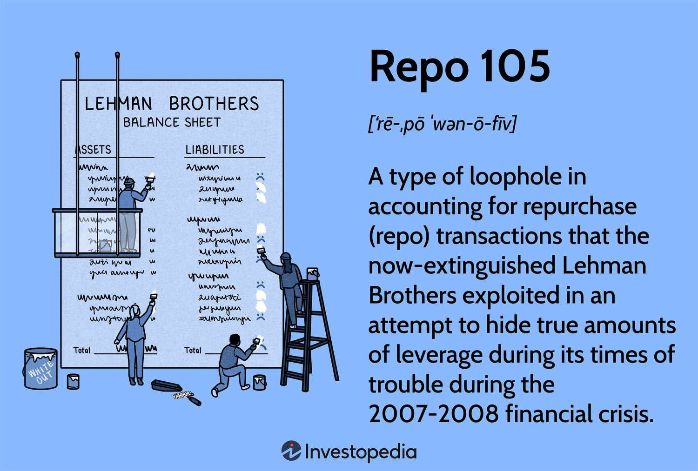

The world of finance is continually evolving, offering a range of practices designed to enhance financial position and investment efficacy. These practices often aim to optimize returns, manage risk, and improve operational efficiency. However, some approaches, such as Repo 105 and algorithmic trading, have ignited significant debates surrounding ethics, transparency, and regulatory oversight.

Repo 105, a financial maneuver employed by Lehman Brothers, typifies controversial accounting practices that obscure a company’s true financial position. It raises critical questions about the integrity and transparency of financial reporting, particularly its role in contributing to misleading financial disclosures. By temporarily removing assets from balance sheets, Repo 105 arguably manipulated crucial financial metrics, thus impacting stakeholder decision-making and trust.

Algorithmic trading, on the other hand, represents a technological advancement in financial markets. It leverages sophisticated algorithms to execute trades at unprecedented speeds, often exceeding human capabilities. While it enhances market liquidity and operational efficiency, it introduces new challenges such as potential market manipulation and systemic risks. The rise of algorithmic trading necessitates comprehensive and adaptive regulatory frameworks to preserve market integrity.

Understanding these practices is imperative for industry professionals and investors striving to navigate the complexities of the current financial landscape. As the sector continues to evolve, ensuring the integrity of financial practices while promoting innovation and efficiency remains a significant concern for maintaining investor confidence and market stability.

## Table of Contents

## Understanding Repo 105 and Its Accounting Implications

Repo 105 was a controversial accounting practice employed by Lehman Brothers to temporarily improve their balance sheet appearances by reducing reported leverage. At its core, Repo 105 transactions involved selling securities to a counterparty with the commitment to repurchase them shortly afterward, typically within a few days. Although legally structured as sales, these transactions were essentially borrowed funds, as the underlying assets were always intended to be repurchased. Yet, due to accounting rules, these transactions allowed Lehman Brothers to classify the deals as sales rather than financings. This temporary classification as sales led to the assets being removed from the balance sheet, thus improving financial metrics like leverage ratios.

Under normal conditions, repurchase agreements (repos) are treated as secured loans, and the securities involved remain on the balance sheet, with the cash received recorded as a liability. However, the trick with Repo 105 was leveraging a loophole grounded in the specific interpretations of accounting standards—principally those under Financial Accounting Standards Board (FASB) guidelines and international accounting rules. By booking these transactions as sales, Lehman Brothers was able to present a stronger financial position in its financial statements, especially during fiscal quarter ends, when investors and analysts closely scrutinize financial performance.

This type of financial maneuvering exposed significant deficiencies in existing accounting rules and practices, concerning the transparency of domestic and international financial reporting. Post the 2008 financial crisis, the revelations regarding Repo 105 transactions and their consequential role in Lehman Brothers’ collapse precipitated calls for reforms. Regulatory bodies worldwide recognized the necessity of closing loopholes that allowed off-balance-sheet transactions to obscure true financial conditions.

Consequently, accounting standard-setters, such as the FASB, undertook efforts to enhance transparency around such transactions. Revised guidance was issued to improve the recognition, measurement, and disclosure requirements related to repurchase agreements and similar financial arrangements. Moreover, these changes aimed to eliminate ambiguities in the distinction between sales and financing, ensuring that similar exploitations could not occur without investor and regulatory oversight. The scrutiny of such practices post-crisis marked a decisive shift towards more stringent financial disclosures and aligned accounting practices with genuine financial health representation.

## Controversies and Regulatory Reactions to Repo 105

The disclosure of Repo 105 practices by Lehman Brothers in 2008 had significant repercussions on the global financial landscape. This accounting maneuver, designed to temporarily remove assets from the balance sheet, provided an artificially enhanced view of Lehman Brothers' financial stability. The practice raised profound ethical concerns regarding the transparency and accuracy of financial reporting. Stakeholders, including investors, regulators, and the wider financial community, were deeply concerned as they realized that Lehman Brothers had manipulated financial statements to present a healthier financial position than was factual.

The core issue resided in Lehman's utilization of the Repo 105 transaction—a type of repurchase agreement. In these transactions, Lehman Brothers would sell securities with a promise to repurchase them shortly thereafter. By classifying these transactions as sales instead of financing arrangements, the firm temporarily removed the liabilities from their balance sheets. This distortion resulted in lower leverage ratios and masked the firm's true financial risk.

In response to the scandal, regulatory authorities worldwide recognized an urgent need to tighten oversight of financial reporting, especially concerning off-balance-sheet transactions. The existing guidance under the Financial Accounting Standards Board (FASB) and the International Financial Reporting Standards (IFRS) came under intense scrutiny. As a reaction to the shortcomings exposed by Repo 105, the regulators implemented several crucial reforms:

1. **Enhanced Disclosure Requirements**: Regulators mandated more rigorous disclosure of repurchase agreements and similar off-balance-sheet activities. Financial institutions were required to provide more detailed information on these transactions, ensuring stakeholders could assess the associated risks more accurately.

2. **Reform of Accounting Standards**: FASB issued new standards, namely Statement No. 166 and 167, which altered the accounting treatment of repos and improved the transparency of financial reporting. These changes aimed to prevent firms from exploiting similar accounting loopholes in the future.

3. **Stricter Regulatory Oversight**: Regulatory agencies, such as the U.S. Securities and Exchange Commission (SEC), intensified their oversight of financial statements and accounting practices. This included more frequent inspections and reviews of registered entities to detect and deter any manipulative activities promptly.

4. **Focus on Corporate Governance**: The scandal highlighted weaknesses in corporate governance structures within financial institutions. As a result, companies were encouraged to strengthen their governance frameworks to ensure better oversight of accounting and reporting practices.

Despite these reforms, the debate on financial ethics persists. Critics argue that while rules can be tightened, true transparency arises from a culture of ethical financial practices beyond regulatory compliance. The lessons from Repo 105 continue to influence the dialogue around financial integrity, emphasizing the need for ongoing vigilance to protect investor interests and ensure market stability.

## The Role of Algorithmic Trading in Modern Finance

Algorithmic trading has become a significant facet of modern financial markets, characterized by the use of complex algorithms and meticulous mathematical models to automate and optimize trading decisions. This form of trading leverages computational power to execute a large [volume](/wiki/volume-trading-strategy) of transactions at high speed and with remarkable precision, often surpassing the capabilities of manual trading. 

**Enhancement of Market Liquidity and Efficiency**

The automation of trading processes through [algorithmic trading](/wiki/algorithmic-trading) has substantial implications for market [liquidity](/wiki/liquidity-risk-premium) and efficiency. By executing trades rapidly and systematically, algorithmic trading contributes to the continuous provision of liquidity in the markets. This increased liquidity ensures tighter bid-ask spreads, allowing for more accurate reflections of asset prices and enabling market participants to buy or sell assets with greater ease and reduced transaction costs.

Moreover, algorithmic trading strategies can swiftly incorporate large volumes of market data, reacting instantaneously to market conditions. For instance, statistical [arbitrage](/wiki/arbitrage) strategies exploit price discrepancies between correlated financial instruments, restoring equilibrium to the markets and enhancing price efficiency.

**Concerns: Fairness, Transparency, and Systemic Risks**

Despite its advantages, algorithmic trading raises concerns about fairness and transparency. The predominant use of high-frequency trading ([HFT](/wiki/high-frequency-trading-strategies)) by some market participants affords them advantages over others, potentially leading to an uneven playing field. These traders, utilizing latency advantages, can execute trades faster than those without similar technological capabilities. While efficient in theory, these practices often lead to debates over market fairness.

Furthermore, the opaque nature of certain algorithms poses transparency issues. Understanding and monitoring these algorithms is challenging, which complicates regulatory oversight and risk management. The sheer scale of algorithmic trades can sometimes lead to unintended consequences, such as the infamous "Flash Crash" of 2010, where automated trading systems exacerbated market [volatility](/wiki/volatility-trading-strategies) and resulted in dramatic price swings within minutes.

**Regulatory Framework and Market Integrity**

To address these issues, developing robust regulatory frameworks is essential. Regulators aim to ensure market integrity and protect investors by enforcing transparency and fairness in trading practices. This involves implementing measures such as circuit breakers to prevent mass sell-offs, imposing restrictions on the use of certain trading strategies, and requiring detailed oversight of trading algorithms.

Understanding algorithmic trading's intricate mechanisms helps policymakers align financial regulations with technological advancements. Ensuring the responsible development and implementation of trading algorithms will be crucial for maintaining a balanced and resilient financial system that supports both innovation and market stability.

## Lessons Learned and the Future of Financial Practices

The failures and controversies associated with Repo 105 highlight critical lessons for strengthening financial oversight and regulatory frameworks. Repo 105 involved classifying repurchase agreements as sales, temporarily removing liabilities from balance sheets. This practice masked true leverage, leading to misleading financial statements. Such manipulation ultimately eroded investor confidence and underscored the necessity for stringent financial regulations. Regulatory bodies have since advanced disclosure requirements and tightened rules against off-balance-sheet transactions to prevent similar exploits. 

Similarly, the evolution of algorithmic trading necessitates advancing technological regulatory policies to address emerging challenges in the financial sector. Algorithmic trading offers significant advantages in terms of speed and efficiency, contributing to liquidity and market stability. However, it also introduces potential risks, such as market manipulation and systemic failures. The flash crash of May 6, 2010, exemplifies these risks, when algorithmic trading systems exacerbated market volatility. To mitigate such risks, regulators are focusing on improving algorithm transparency and establishing fail-safes to protect against rapid market shifts.

As financial markets progress, there is an increased demand for robust corporate governance, ethical standards, and transparent financial reporting practices. Regulators and industry leaders alike are emphasizing the importance of strong oversight mechanisms and adopting best practices for risk management. By fostering an environment of accountability and transparency, markets can better protect investor interests.

Investment in innovative technological solutions is crucial to address gaps in regulation prompted by rapid advancements in trading technologies. Emerging fields, like [machine learning](/wiki/machine-learning) and [artificial intelligence](/wiki/ai-artificial-intelligence), present both opportunities and challenges for market participants and regulatory bodies. Adequate regulatory frameworks must be adapted continually to keep pace with these innovations, ensuring they enhance rather than hinder market integrity.

In conclusion, ongoing innovation in financial regulations is essential to safeguarding investor interests and maintaining global financial stability. By learning from past failures and anticipating future challenges, the financial industry can cultivate a more resilient and trustworthy environment conducive to sustainable growth.

## References & Further Reading

[1]: Valukas, A. R. (2010). ["Lehman Brothers Holdings Inc. Chapter 11 Proceedings Examiner's Report."](https://www.jenner.com/en/news-insights/news/lehman-brothers-holdings-inc-chapter-11-proceedings-examiner-s-report) 

[2]: Financial Accounting Standards Board (FASB). (2009). ["Statement of Financial Accounting Standards No. 166: Accounting for Transfers of Financial Assets."](https://www.fdic.gov/resources/regulations/federal-register-publications/2009/09c21ad48.pdf) 

[3]: Financial Accounting Standards Board (FASB). (2009). ["Statement of Financial Accounting Standards No. 167: Amendments to FASB Interpretation No. 46(R)."](https://www.fdic.gov/resources/regulations/federal-register-publications/2009/09c21ad48.pdf) 

[4]: Harris, L. (2015). ["Transaction Costs, Trade Throughs, and Riskless Principal Trading in Corporate Bond Markets."](https://papers.ssrn.com/sol3/papers.cfm?abstract_id=2661801) Journal of Finance.

[5]: Aldridge, I. (2013). ["High-Frequency Trading: A Practical Guide to Algorithmic Strategies and Trading Systems."](https://www.amazon.com/High-Frequency-Trading-Practical-Algorithmic-Strategies/dp/1118343506) 

[6]: U.S. Securities and Exchange Commission (2010). ["Findings Regarding the Market Events of May 6, 2010."](https://www.sec.gov/news/studies/2010/marketevents-report.pdf) 

[7]: Narang, R. K. (2013). ["Inside the Black Box: The Simple Truth About Quantitative Trading."](https://www.amazon.com/Inside-Black-Box-Quantitative-Trading/dp/0470432063) 

[8]: Patterson, S. (2012). ["Dark Pools: The Rise of A.I. Trading Machines and the Looming Threat to Wall Street."](https://archive.org/details/darkpoolsriseofa0000patt)