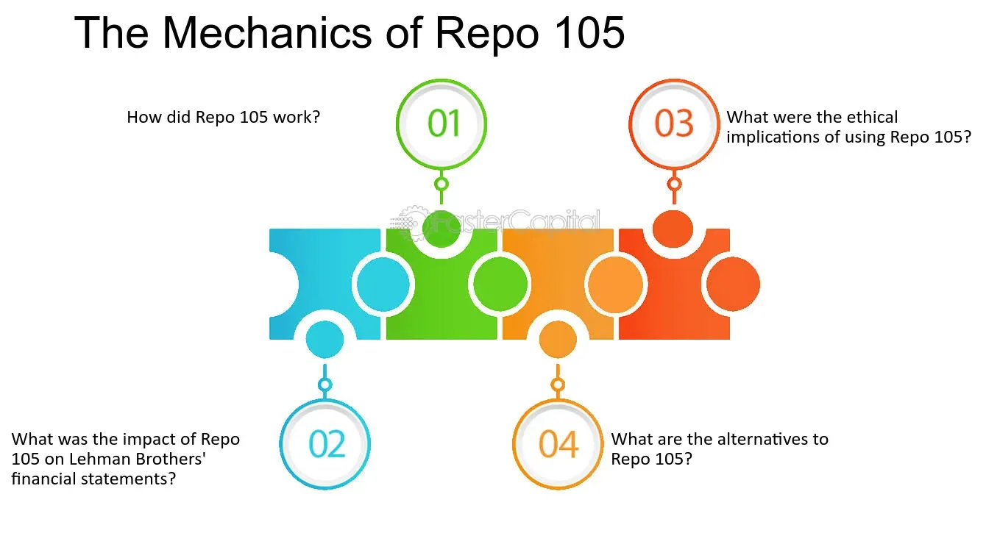

## Table of Contents

## What is Repo 105?

Repo 105 is a type of financial transaction that was used by Lehman Brothers, a large bank, before it failed in 2008. It's like a short-term loan where a company gives securities to another company and gets them back after a short time. The tricky part is that Lehman Brothers used Repo 105 to make their financial situation look better than it really was. They would move a lot of money off their books right before they had to report their finances, so it looked like they had less debt.

This practice was controversial because it was seen as a way to hide how much debt Lehman Brothers really had. By using Repo 105, they could temporarily reduce the amount of money they appeared to owe, which made their financial statements look healthier. However, once the truth came out, it showed that Lehman Brothers was in much worse shape than they had been letting on, which contributed to their collapse and the broader financial crisis.

## How does Repo 105 differ from a standard repurchase agreement?

Repo 105 is different from a standard repurchase agreement, or "repo," mainly in how it is treated on the books. In a standard repo, a company borrows money by giving securities to another company and agrees to buy them back later. This is seen as a loan on the company's balance sheet, so it shows up as both an asset (the securities) and a liability (the money they owe). With Repo 105, Lehman Brothers treated it as a sale instead of a loan. This meant they could take the money they got off their balance sheet, making it look like they had less debt.

The key difference is in the accounting treatment and the intent behind it. Standard repos are straightforward and used for short-term borrowing. Repo 105 was used by Lehman Brothers to temporarily reduce their reported debt levels, especially around the time they had to report their financials. This practice was controversial because it was seen as a way to hide the true amount of debt the company had, making their financial health appear better than it actually was.

## What is the primary purpose of using Repo 105?

The main reason Lehman Brothers used Repo 105 was to make their financial situation look better than it really was. They did this by treating these transactions as sales instead of loans. This allowed them to temporarily move a large amount of money off their balance sheet, which made it seem like they had less debt when they reported their finances to the public.

This practice was especially used around the times when Lehman Brothers had to show their financial statements. By doing this, they could present a healthier financial picture to investors and regulators. However, this was controversial because it hid the true amount of debt the company had, which contributed to their eventual collapse and the broader financial crisis.

## Can you explain the basic mechanism of Repo 105?

Repo 105 is a type of financial deal that Lehman Brothers used to make their money problems look smaller. In a Repo 105, Lehman Brothers would give securities to another company and get cash in return. But instead of calling it a loan, they called it a sale. This meant they could take the cash they got off their balance sheet, making it look like they had less debt.

They would do this trick right before they had to show their financial reports to everyone. By doing this, they could make their debt look smaller for a short time. After the reports were out, they would take the securities back by paying the cash plus a little extra. This way, it looked like they were in better financial shape than they really were.

## What are the key parties involved in a Repo 105 transaction?

In a Repo 105 transaction, there are two main parties involved: the company using the Repo 105, which in the famous case was Lehman Brothers, and the other company that agrees to the deal. Lehman Brothers would give securities to the other company and get cash in return. They called this a sale instead of a loan, which let them take the cash off their balance sheet temporarily.

The other company in the Repo 105 deal would hold onto the securities for a short time. At the end of this period, Lehman Brothers would buy back the securities by returning the cash plus a little extra. This other company was usually a bank or financial institution that was willing to go along with the transaction, knowing it was just a short-term arrangement.

## How is Repo 105 used for financial reporting?

Repo 105 is a trick Lehman Brothers used to make their money problems look smaller when they had to show their financial reports. They would give securities to another company and get cash, but they called it a sale instead of a loan. This let them take the cash off their balance sheet, making it look like they had less debt when they reported their finances.

They did this right before they had to show their financial reports to everyone. By doing this, they could make their debt look smaller for a short time. After the reports were out, they would take the securities back by paying the cash plus a little extra. This way, it looked like they were in better financial shape than they really were.

## What are the accounting treatments for Repo 105?

In a Repo 105, Lehman Brothers treated the deal as a sale instead of a loan. When they gave securities to another company and got cash, they took that cash off their balance sheet. This made it look like they had less debt because the cash they got was not counted as a liability. This was different from a normal loan where the cash would stay on the balance sheet as a liability.

They used this trick right before they had to show their financial reports. By calling it a sale, they could make their debt look smaller for a short time. After the reports were out, they would take the securities back by paying the cash plus a little extra. This way, they made their financial health look better than it really was, which was controversial because it hid the true amount of debt they had.

## What are the regulatory concerns associated with Repo 105?

Regulatory concerns about Repo 105 center on how it was used to hide the true financial situation of Lehman Brothers. By treating these transactions as sales instead of loans, Lehman Brothers could make their debt look smaller right before they had to show their financial reports. This practice was seen as misleading because it hid how much debt the company really had. Regulators and investors were worried that this kind of accounting trick could make a company look healthier than it really was, which could lead to big problems if the truth came out.

The use of Repo 105 raised questions about the transparency and integrity of financial reporting. Regulators were concerned that if companies could use such tricks to manipulate their financial statements, it would be hard to trust any financial reports. This could make it difficult for investors to make good decisions and could lead to a loss of confidence in the financial system. After Lehman Brothers collapsed, there was a push for stricter rules to prevent similar practices in the future and to ensure that companies report their financial situation honestly.

## How did Lehman Brothers use Repo 105, and what were the consequences?

Lehman Brothers used Repo 105 to make their financial situation look better than it really was. They would give securities to another company and get cash, but they called it a sale instead of a loan. This let them take the cash off their balance sheet, making it look like they had less debt. They did this right before they had to show their financial reports to everyone. By doing this, they could make their debt look smaller for a short time. After the reports were out, they would take the securities back by paying the cash plus a little extra.

The consequences of using Repo 105 were big. When people found out that Lehman Brothers was hiding how much debt they really had, it made everyone lose trust in them. This was one of the reasons why Lehman Brothers collapsed in 2008, which was a big part of the financial crisis. After that, regulators and investors got worried about how companies report their finances. They wanted stricter rules to make sure companies couldn't use tricks like Repo 105 to hide their true financial situation.

## What are the ethical considerations of using Repo 105?

Using Repo 105 raises big ethical questions. It's wrong to hide the truth about how much money a company owes. Lehman Brothers used Repo 105 to make their debt look smaller when they showed their financial reports. This was not honest because it made people think the company was in better shape than it really was. When the truth came out, it hurt a lot of people who trusted the company's reports.

The use of Repo 105 also made people question if they could trust any financial reports. If companies can use tricks to make their numbers look better, it's hard for investors to make good choices. This can lead to big problems in the economy, like what happened when Lehman Brothers collapsed. It's important for companies to be honest about their finances so everyone can make fair and smart decisions.

## How has the use of Repo 105 evolved post-financial crisis?

After the big financial crisis in 2008, people started paying more attention to tricks like Repo 105. They made new rules to stop companies from hiding their debt the way Lehman Brothers did. These rules say that companies have to be more open about their financial deals. They can't call something a sale if it's really a loan, like Lehman Brothers did with Repo 105. This helps everyone see the true financial situation of a company.

Even though new rules were made, some people worry that companies might still find new ways to make their financial reports look better. They might use different tricks that are hard to spot. That's why it's important for people who watch over companies to keep looking closely at their reports. They need to make sure that companies are being honest and not hiding their real financial situation.

## What are the alternatives to Repo 105 for managing balance sheets?

Companies can use other ways to manage their balance sheets instead of using tricks like Repo 105. One way is to pay off their debts. If a company can pay back some of what they owe, it will show up as less debt on their balance sheet. Another way is to sell assets they don't need. If they sell something they own, like a building or equipment, they can use the money to pay down their debts or keep it as cash, which can make their financial situation look better.

Another option is to use a regular repurchase agreement, or repo. In a repo, a company borrows money by giving securities to another company and agrees to buy them back later. This is treated as a loan on the balance sheet, so it's more honest than calling it a sale like with Repo 105. Companies can also improve their balance sheets by finding ways to make more money, like increasing sales or cutting costs. This can help them pay off debts and show a healthier financial picture without using tricks.

## References & Further Reading

[1]: Valukas, A. R. (2010). ["Lehman Brothers Holdings Inc. Chapter 11 Proceedings Examiner's Report."](https://www.jenner.com/en/news-insights/news/lehman-brothers-holdings-inc-chapter-11-proceedings-examiner-s-report) 

[2]: Financial Accounting Standards Board (FASB). (2009). ["Statement of Financial Accounting Standards No. 166: Accounting for Transfers of Financial Assets."](https://www.fdic.gov/resources/regulations/federal-register-publications/2009/09c21ad48.pdf) 

[3]: Financial Accounting Standards Board (FASB). (2009). ["Statement of Financial Accounting Standards No. 167: Amendments to FASB Interpretation No. 46(R)."](https://www.fdic.gov/resources/regulations/federal-register-publications/2009/09c21ad48.pdf) 

[4]: Harris, L. (2015). ["Transaction Costs, Trade Throughs, and Riskless Principal Trading in Corporate Bond Markets."](https://papers.ssrn.com/sol3/papers.cfm?abstract_id=2661801) Journal of Finance.

[5]: Aldridge, I. (2013). ["High-Frequency Trading: A Practical Guide to Algorithmic Strategies and Trading Systems."](https://www.amazon.com/High-Frequency-Trading-Practical-Algorithmic-Strategies/dp/1118343506) 

[6]: U.S. Securities and Exchange Commission (2010). ["Findings Regarding the Market Events of May 6, 2010."](https://www.sec.gov/news/studies/2010/marketevents-report.pdf) 

[7]: Narang, R. K. (2013). ["Inside the Black Box: The Simple Truth About Quantitative Trading."](https://www.amazon.com/Inside-Black-Box-Quantitative-Trading/dp/0470432063) 

[8]: Patterson, S. (2012). ["Dark Pools: The Rise of A.I. Trading Machines and the Looming Threat to Wall Street."](https://archive.org/details/darkpoolsriseofa0000patt)