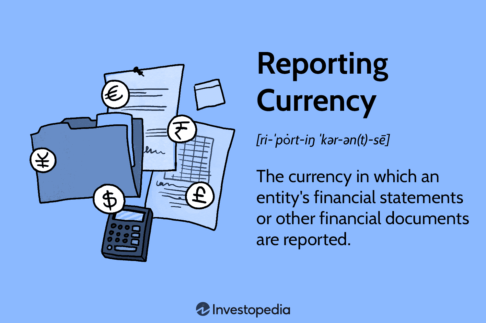

In today's globalized economy, the integration of financial reporting, currency exchange, and algorithmic trading plays a crucial role in financial management. The ability of multinational companies to effectively manage financial metrics across different currencies is paramount to their success and sustainability. This necessitates precise currency translation methods, which ensure that financial statements are accurate and comparable, irrespective of the volatility and fluctuations in currency values.

Financial reporting serves as the backbone of informed decision-making, providing stakeholders with a clear view of a company's financial health. For multinational corporations, the complexity of handling multiple currencies can distort this view if not managed correctly. Accurate currency exchange reporting is essential in this context, as it involves converting financial data from various currencies into a single, consistent reporting currency. This conversion requires methodologies like the temporal method, which translates monetary items at the exchange rate as of the balance sheet date, and the current rate method, which uses the prevailing exchange rate at the financial statement date for translating all items. These methods ensure that the financial information reflects not only the correct value but also the economic environment in which the entity operates.



Simultaneously, algorithmic trading has revolutionized financial markets by executing trades with high speed and precision, often surpassing traditional manual trading methods. By leveraging algorithms, traders can take advantage of market inefficiencies, execute strategies at remarkable speeds, and manage trading risks more proficiently.

This article will explore how these elements—financial reporting, currency exchange, and algorithmic trading—intersect and influence modern finance. By examining their integration, we aim to highlight the opportunities and challenges that they present in achieving accurate financial management and strategic oversight. This intersection is not just a convergence of methodologies but a transformative approach to navigating the complexities of global financial markets.

## Table of Contents

## Understanding Financial Reporting and Currency Exchange

Financial reporting serves as a critical component in conveying accurate financial information to stakeholders, including investors, regulators, and management. The choice of reporting currency is pivotal, as it forms the basis of financial analysis and strategic decision-making for multinational companies. These companies operate in diverse markets, typically dealing with multiple currencies. Consequently, they must consolidate financial data into a single reporting currency, necessitating precise currency translation methodologies.

Currency exchange reporting is the process of translating financial data from various foreign currencies into a primary reporting currency to ensure consistency and comparability. This translation involves reconciling and adjusting financial statements, considering fluctuating exchange rates. Two predominant methods used in currency translation are the temporal method and the current rate method, each serving distinct financial reporting needs and adhering to different accounting principles.

The temporal method, also known as the historical rate method, uses exchange rates that were in effect at the time the original transaction occurred for items measured at historical cost, like inventory and fixed assets. Monetary items, such as cash or receivables, are translated at the exchange rate in effect on the balance sheet date. This method can lead to translation gains or losses, which are typically recognized in the profit and loss account. The temporal method aligns with the matching principle in accounting, ensuring that expenses and revenues associated with non-monetary assets are recorded using the same historical exchange rates.

In contrast, the current rate method, often applicable under International Financial Reporting Standards (IFRS), translates all assets and liabilities at the current exchange rate prevailing on the balance sheet date. Equity components are translated at historical exchange rates, and revenue and expenses are translated at the exchange rate on the transaction date or an average rate for the period. Any resulting translation adjustments are recognized in a separate component of equity known as the translation reserve or accumulated other comprehensive income. This method reflects the economic realities reflected in exchange rate changes and supports the representation of a company's consolidated financial position under the concept of financial statement presentation.

Accurate financial reporting, facilitated by these currency translation methodologies, is fundamental in providing stakeholders a clear perspective on a company's financial health, ensuring compliance with regulatory requirements, and aiding in strategic financial planning. Financial statement users rely on the consistency and reliability of the translated figures to assess performance, make investment decisions, and manage risks associated with foreign currency exposure. As global markets become increasingly interconnected, the importance of precise currency translation in financial reporting cannot be understated.

## Algorithmic Trading: The Modern Approach

Algorithmic trading is a financial innovation that leverages computer programs to execute orders in financial markets at exceptionally high speeds and accuracy levels. This approach has revolutionized trading by minimizing human intervention and enabling decisions to be made based on complex mathematical and statistical models. The efficiencies and precision offered by [algorithmic trading](/wiki/algorithmic-trading) often surpass traditional trading methods that rely heavily on human intuition and reaction times.

### Strategies in Algorithmic Trading

1. **Market Making**: This strategy involves providing liquidity to markets by simultaneously placing buy and sell limit orders. Market makers earn profits by capturing the difference between the bid-ask spread. An algorithm dynamically adjusts prices based on market conditions to maintain spreads and manage inventory risks.

2. **Arbitrage**: Arbitrage exploits price discrepancies between correlated instruments or markets. An algorithm identifies opportunities where an asset is priced differently across markets and executes simultaneous buy and sell orders to capture the price differential. This requires high-speed execution to manage the small margins effectively.

3. **Trend Following**: This strategy aims to capitalize on market movements by following established market trends. Algorithms analyze historical price data to identify trends and make trading decisions that align with them. The success of trend-following strategies depends on identifying trends accurately and responding swiftly to changes.

### Benefits and Challenges

#### Benefits

- **Speed and Efficiency**: Algorithms can process large volumes of data and execute trades in microseconds, significantly faster than human traders. This speed allows for capturing fleeting market opportunities.

- **Precision**: Algorithmic trading minimizes human errors and biases, facilitating more accurate execution based on predefined criteria.

- **Cost Reduction**: By automating the trading process, companies can reduce transaction costs and optimize resource allocation.

- **Scalability**: Algorithms can handle multiple trades across various assets and markets simultaneously, enhancing scalability without increased manpower.

#### Challenges

- **Technical Failures and Bugs**: Algorithmic systems are prone to glitches and software bugs, which can result in substantial financial losses if not mitigated effectively.

- **Market Impact**: High-frequency trading can lead to market disruptions, such as flash crashes where rapid sell-offs lead to significant price drops.

- **Regulatory Scrutiny**: Due to their complexity and impact, algorithmic trading systems are subject to rigorous regulatory scrutiny to ensure fair market practices.

- **Complexity of Development**: Designing robust trading algorithms requires advanced programming skills, financial knowledge, and continuous monitoring and refinement.

The continuous evolution of algorithmic trading emphasizes the importance of integrating technological and regulatory considerations to maintain stability and efficiency in modern financial markets.

## Integrating Financial Reporting, Currency Exchange, and Algorithmic Trading

Integrating financial reporting, currency exchange, and algorithmic trading offers a refined approach to financial management, enabling organizations to enhance accuracy and gain strategic insights. This synthesis addresses the challenge of aligning financial data across different currencies with the speed and precision of algorithmic trading, thereby optimizing operational efficiency.

To synchronize financial reporting with currency exchange, businesses use currency translation methods such as the current rate method, where assets and liabilities are translated at the current exchange rate. This process ensures that financial statements reflect the true economic impact of foreign operations in terms of domestic currency. Algorithmic trading, which operates through pre-programmed instructions, can provide real-time data concerning market trends and exchange rates. This data is beneficial in refining currency translation processes, allowing businesses to report and forecast financial metrics swiftly and accurately.

Algorithmic trading can influence both financial reporting and currency risk management through strategies like [arbitrage](/wiki/arbitrage), where traders exploit price differentials in different markets. For instance, if an algorithm identifies discrepancies in currency exchange rates across various platforms, a business can execute trades to capitalize on these differences. This not only enhances revenue potential but also mitigates currency risk by stabilizing exposure to volatile currencies. The immediate availability of such data through algorithmic systems can be integrated into financial reports, enabling real-time adjustments and more informed decision-making.

The convergence of these elements is further supported by advanced technologies, including [machine learning](/wiki/machine-learning) and data analytics, which enhance data processing capabilities. An algorithmic model, for example, may utilize Python to automate data assimilation and prediction tasks. Consider the following simple Python script utilizing a machine learning library to predict exchange rates based on historical data:

```python
from sklearn.linear_model import LinearRegression
import numpy as np

# Sample historical data: exchange rates from t-4 to t (for simplicity)
X_train = np.array([[1.1, 1.2, 1.15], [1.2, 1.25, 1.22], [1.15, 1.18, 1.19]])
y_train = np.array([1.3, 1.28, 1.25])

model = LinearRegression()
model.fit(X_train, y_train)

# Predicting the exchange rate for a new set of days
X_new = np.array([[1.19, 1.21, 1.22]])
predicted_rate = model.predict(X_new)

print(f"Predicted exchange rate: {predicted_rate[0]:.2f}")
```

This approach not only forecasts future currency movements but also informs financial reporting by offering predictive insights that can be incorporated into strategy planning. By marrying algorithmic insights with thorough financial reporting, companies can effectively manage currency risks, optimize trading strategies, and ensure the precision of their financial statements. Such integration provides businesses a competitive edge, helping them navigate the complexities of global finance with greater confidence and agility.

## The Role of Technology in Financial Strategy Implementation

Technology continues to drive significant advancements in financial strategy implementation, particularly through the adoption of machine learning and data analytics. These innovations provide powerful tools for enhancing risk management and optimizing trade execution.

Machine learning algorithms have profoundly affected financial markets, enabling systems to analyze vast datasets to identify patterns and trends that human traders may overlook. By processing historical data, machine learning models can predict future price movements, assess risk levels, and make informed decisions that optimize returns. For example, predictive models such as decision trees and neural networks can be used to forecast stock prices or evaluate credit risks. This has led to more precise risk management strategies that are adaptive to changing market conditions.

Data analytics further complements machine learning by providing insights that can improve decision-making processes. Large datasets can be analyzed to identify correlations and causations between different financial variables, allowing firms to make data-driven decisions. For instance, sentiment analysis performed on news articles and social media can provide real-time market sentiment indicators that influence trading strategies.

Algorithmic trading systems have also benefited from technological advancements. High-frequency trading ([HFT](/wiki/high-frequency-trading-strategies)), a subset of algorithmic trading, relies heavily on technology to execute trades within microseconds, leveraging small price discrepancies that occur over brief timespans. Low-latency networks and sophisticated algorithms are crucial for the success of HFT operations.

Moreover, technology plays a pivotal role in the integration and performance of financial reporting systems. Automation of data processing and financial computations enables companies to produce timely and accurate reports. Distributed ledger technology, including blockchain, enhances transparency and reduces the potential for errors and fraud in financial reporting.

Integration of these technologies requires a robust IT infrastructure. Cloud computing offers scalable resources that can handle extensive data processing demands, supporting both analytical tasks and storage needs. Cloud-based platforms enable financial institutions to deploy machine learning models and data analytics tools efficiently, reducing the total cost of ownership and increasing flexibility.

In summary, the introduction of technology in financial strategy implementation enhances efficiency, accuracy, and reliability across various financial processes. Companies leveraging these technological advancements can achieve superior risk assessment, more strategic trade executions, and comprehensive financial reporting. Continued innovation in machine learning, data analytics, and related technologies promises ongoing improvements and adaptations in financial strategy, necessitating that professionals stay abreast of these developments to maintain a competitive edge.

## Conclusion

The convergence of financial reporting, currency exchange, and algorithmic trading brings both opportunities and challenges to the financial sector. A well-integrated approach allows organizations to effectively manage complex market dynamics, ensuring both operational resilience and financial sustainability. By synchronizing financial reporting across multiple currencies with the high-speed operations of algorithmic trading, companies can optimize currency risk management, improve the accuracy of financial statements, and leverage real-time data insights for strategic decision-making.

Financial reporting benefits from integrating currency exchange by ensuring consistent and reliable data representation, which is crucial for accurate stakeholder communication and strategic planning. Moreover, the precision and speed offered by algorithmic trading platforms enhance transaction efficiency and market responsiveness, providing a competitive edge in today’s fast-paced financial markets. These technologies not only improve the execution of trades but also offer a vast array of data, which, when combined with advanced analytics, can unearth actionable insights that drive business growth.

As these fields continue to evolve, continual advancements in technology and methodology will necessitate ongoing adaptation and learning for financial professionals. Machine learning and AI, for example, are already transforming both algorithmic trading and financial reporting by automating processes and enhancing predictive capabilities. Organizations must invest in these technological advancements to remain competitive and effectively manage the increasing complexity of global financial operations.

In conclusion, while the integration of financial reporting, currency exchange, and algorithmic trading poses certain challenges — particularly in terms of technological infrastructure and skills — it also offers significant potential for improving financial management and strategic prowess. As the financial landscape becomes more sophisticated, organizations committed to harnessing these opportunities will be best positioned to succeed in an ever-changing market environment.

## References & Further Reading

International Financial Statement Analysis by Thomas R. Robinson, Elaine Henry, and Wendy L. Pirie provides comprehensive insights into the processes involved in analyzing and interpreting financial statements across international borders. This resource emphasizes the complexities introduced by differences in accounting standards and the role of currency translation methods, such as the current rate method, in producing accurate and meaningful financial reports. It serves as a vital tool for understanding the principles of financial reporting and managing currency risk in a globalized economy.

Risk Management and Financial Institutions by John C. Hull delves into the intricacies of risk management practices and the operations of financial institutions. This book covers the various types of risks faced by these entities, including [interest rate](/wiki/interest-rate-trading-strategies) risk, market risk, and credit risk, with a detailed examination of how algorithmic trading strategies such as arbitrage and [market making](/wiki/market-making) can be utilized to mitigate these risks. Hull's work offers a thorough exploration of the frameworks and tools available to financial professionals to manage and adapt to the evolving landscape of financial risk.

Currency Risk Management: A Handbook for Financial Managers by Donna G. Howe provides practical strategies for managing currency exposure and minimizing financial risk. This handbook outlines a variety of currency hedging techniques and offers guidance on implementing effective currency risk management policies. It aligns well with the challenges faced by multinational organizations in financial reporting and currency translation, offering insights into how technology and real-time data from algorithmic trading systems can enhance currency risk management practices.

