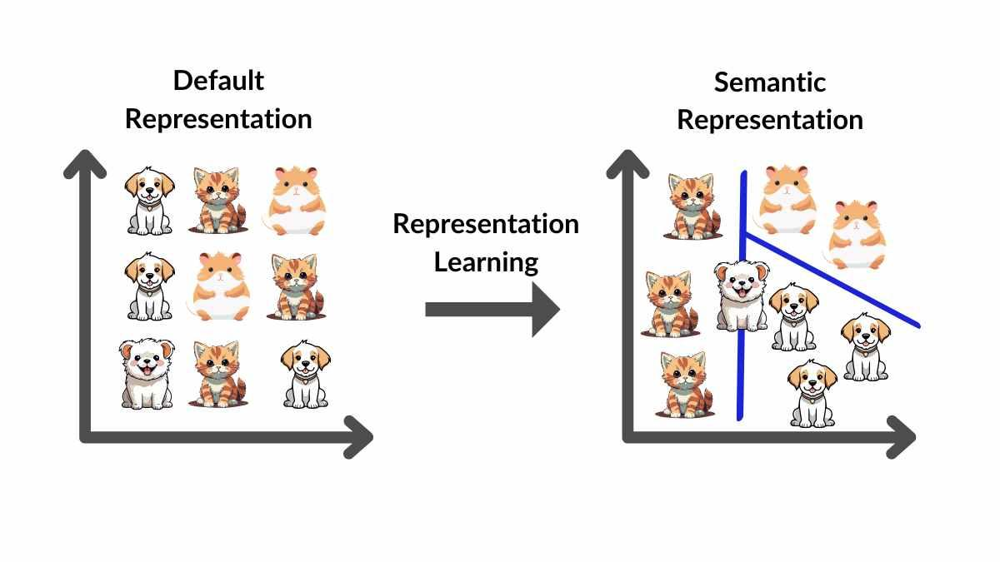

## Table of Contents

## What is Representation Learning in the context of Machine Learning?

Representation learning is a part of machine learning where computers learn to understand and use data in a way that's easier for them to work with. Imagine you have a big pile of different toys, and you want to sort them. Instead of looking at each toy one by one, you could group them by color or size. This grouping makes it easier to handle the toys. In machine learning, representation learning does something similar. It takes raw data, like pictures or sounds, and changes it into a form that's easier for the computer to understand and use.

One common way to do representation learning is through neural networks. These are systems inspired by how our brains work, where data passes through layers of connected 'neurons'. Each layer can change the data a little bit, making it more useful. For example, if you're trying to recognize different animals in pictures, the first layer might look for edges and shapes, the next layer might combine these to recognize parts of animals like ears or tails, and deeper layers might put these parts together to identify the whole animal. This way, the computer learns to represent the data in a way that's more meaningful for the task it's trying to do.

Representation learning is important because it helps computers handle complex data more efficiently. By learning good representations, computers can perform better on tasks like recognizing speech, understanding text, or identifying objects in images. This makes technologies like voice assistants, translation apps, and self-driving cars work better and more reliably. Overall, representation learning helps machines understand the world in a way that's closer to how humans do, making them more useful and effective.

## How does Representation Learning differ from traditional feature engineering?

Representation learning and traditional feature engineering both aim to make data easier for computers to understand, but they do it in different ways. In traditional feature engineering, people manually create features from the data. For example, if you want a computer to recognize faces, you might tell it to look at the distance between eyes or the shape of the nose. This process relies a lot on human knowledge and can be time-consuming because you need to think about what features are important for the task.

On the other hand, representation learning lets the computer figure out the features by itself. It uses algorithms, often within neural networks, to learn what parts of the data are important. For instance, the computer might learn to recognize edges and shapes in images without being told to do so. This approach can find patterns that humans might not think of and can handle large amounts of data more efficiently. By letting the computer learn from the data, representation learning can adapt to new tasks more easily than traditional feature engineering.

## What are some common techniques used in Representation Learning?

One common technique in representation learning is autoencoders. Autoencoders are special types of neural networks that learn how to compress data into a smaller form and then reconstruct it. They do this by having an encoder part that squashes the data into a smaller representation, and a decoder part that tries to rebuild the original data from this smaller version. By training the autoencoder to minimize the difference between the original and reconstructed data, it learns to find the most important features of the data. This technique is useful for tasks like denoising images or finding hidden patterns in data.

Another technique is called word embeddings, which is often used in natural language processing. Word embeddings turn words into numbers in a way that captures their meaning. For example, words that are similar in meaning, like "dog" and "puppy," will have numbers that are close to each other. One popular method for creating word embeddings is Word2Vec, which can be trained to predict a word based on its surrounding words or to predict the surrounding words based on a given word. This helps computers understand text better and can be used in tasks like translating languages or answering questions.

A third technique is convolutional neural networks (CNNs), which are very good at working with images. CNNs have layers that can detect patterns like edges or textures in parts of an image. As the data moves through the layers, the network can start to recognize more complex patterns, like shapes or objects. For example, in a picture of a cat, the first layers might pick up on whiskers or ears, while deeper layers might put these together to recognize the whole cat. This makes CNNs powerful tools for tasks like image recognition and object detection.

## Can you explain the concept of embeddings in Representation Learning?

Embeddings are a way to turn things like words, images, or sounds into numbers that computers can understand and work with easily. Imagine you want to tell a computer about different animals. Instead of just using the names "dog," "cat," and "elephant," you can turn these words into numbers. These numbers, or embeddings, are special because they show how similar or different the words are. For example, the numbers for "dog" and "puppy" would be close to each other because they are related, while "dog" and "elephant" would be farther apart because they are different.

In representation learning, embeddings help computers find patterns and relationships in data. For example, in language, word embeddings can help a computer understand that "king" is to "man" what "queen" is to "woman." This kind of understanding can make tasks like translating languages or answering questions much easier. Embeddings are not just for words; they can be used for images too. For instance, an image of a cat can be turned into numbers that show its features, like the shape of its ears or the color of its fur. By using embeddings, computers can learn to recognize and work with complex data more effectively.

## What is the role of neural networks in Representation Learning?

Neural networks play a big role in representation learning because they help computers understand and use data better. They do this by passing data through layers of connected 'neurons'. Each layer changes the data a little bit, making it easier for the computer to work with. For example, if you show a [neural network](/wiki/neural-network) a picture of a dog, the first layer might look for edges and shapes, the next layer might combine these to see parts of the dog like its ears or tail, and deeper layers might put these parts together to recognize the whole dog. This way, the neural network learns to turn raw data into a form that's more useful for tasks like recognizing objects in pictures.

One way neural networks help with representation learning is through autoencoders. An autoencoder is a special kind of neural network that learns to compress data into a smaller form and then reconstruct it. It has two parts: an encoder that squashes the data into a smaller representation, and a decoder that tries to rebuild the original data from this smaller version. By training the autoencoder to make the reconstructed data as close as possible to the original data, it learns to find the most important features of the data. This technique is helpful for tasks like cleaning up noisy images or finding hidden patterns in data.

Another important use of neural networks in representation learning is creating embeddings. Embeddings turn things like words or images into numbers that computers can understand and work with easily. For example, word embeddings can show how similar or different words are. If you have words like "dog" and "puppy," their embeddings would be close to each other because they are related. Neural networks, like those used in Word2Vec, can learn these embeddings by looking at how words are used together in sentences. This helps computers understand text better and can be used in tasks like translating languages or answering questions.

## How does Masked Image Modeling (MIM) contribute to Representation Learning?

Masked Image Modeling (MIM) is a technique that helps computers learn better representations of images. Imagine you're trying to solve a puzzle, but some pieces are missing. MIM works in a similar way by hiding parts of an image and then asking the computer to fill in the missing parts. By doing this, the computer learns to understand the whole image better, even when some parts are not visible. This method helps the computer focus on the important features of the image, like shapes and patterns, which are useful for tasks like recognizing objects or understanding scenes.

MIM is especially useful because it can learn from large amounts of data without needing labels. This means the computer can improve its understanding of images just by looking at a lot of them, without someone telling it what each image shows. This makes MIM a powerful tool for representation learning because it can find patterns and relationships in images that might be hard for humans to see. By using MIM, computers can get better at tasks like image classification, object detection, and even generating new images, making them more helpful in real-world applications.

## What is ViLBERT and how does it apply Representation Learning to vision and language tasks?

ViLBERT, which stands for Vision-and-Language BERT, is a model that helps computers understand both pictures and words at the same time. It's like teaching a computer to read a book with pictures, where it can understand the story by looking at both the text and the images. ViLBERT uses representation learning to turn both the pictures and the words into numbers that the computer can understand. These numbers, or embeddings, help the computer see how the pictures and words are related. For example, if you show ViLBERT a picture of a dog and the word "dog," it can learn that they go together.

ViLBERT works by having two separate parts: one for understanding pictures and one for understanding words. The picture part, called the vision stream, breaks down the image into smaller pieces and learns to recognize important parts like shapes and colors. The word part, called the language stream, looks at the text and learns to understand the meaning of words and sentences. These two streams then come together and learn to connect the pictures and words. By doing this, ViLBERT can do tasks like answering questions about pictures or describing what's happening in an image. This makes it a powerful tool for tasks that need both vision and language, like helping visually impaired people understand their surroundings or improving how computers can interact with humans.

## Can you describe how VideoBERT uses Representation Learning for video understanding?

VideoBERT is a model that helps computers understand videos by using representation learning. It turns both the video clips and the words that go with them into numbers, called embeddings, that the computer can understand. These embeddings help the computer see how the video and the words are related. For example, if you show VideoBERT a [clip](/wiki/clip) of a dog playing and the word "dog," it can learn that they go together. By doing this, VideoBERT can understand what is happening in the video and connect it to what people are saying about it.

VideoBERT works by breaking down the video into smaller parts, called frames, and learning to recognize important things in them, like objects and actions. At the same time, it looks at the words and learns to understand their meaning. These two parts then come together and learn to connect the video and the words. By using representation learning, VideoBERT can do tasks like describing what is happening in a video or answering questions about it. This makes it a powerful tool for understanding videos and can be used in things like helping people find videos they want to watch or making videos more accessible to people with hearing or vision problems.

## What is Playstyle Distance and how does it utilize Representation Learning in gaming?

Playstyle Distance is a way to measure how different or similar two players' ways of playing a game are. It uses representation learning to turn each player's actions and choices in the game into numbers, called embeddings. These numbers help the computer see how close or far apart the players' styles are. For example, if two players both like to explore every corner of a game world, their playstyle embeddings would be close to each other. But if one player likes to rush through the game and the other likes to take their time, their embeddings would be farther apart.

In gaming, Playstyle Distance can be used to match players with similar styles for better teamwork or to help game designers understand how people play their games. By using representation learning, the computer can learn from lots of players' data without needing to be told exactly what to look for. This makes it easier to find patterns and group players by their playstyles. For example, a game might use Playstyle Distance to suggest new friends or teammates who play in a similar way, making the game more fun and enjoyable for everyone.

## How does CV-MIM enhance Representation Learning in computer vision?

CV-MIM, which stands for Computer Vision Masked Image Modeling, is a technique that helps computers learn better about pictures. It does this by hiding parts of an image and then asking the computer to fill in the missing parts. By doing this, the computer learns to understand the whole picture better, even when some parts are not visible. This method helps the computer focus on the important parts of the picture, like shapes and patterns, which are useful for tasks like recognizing objects or understanding what's happening in a scene.

CV-MIM is especially useful because it can learn from a lot of pictures without needing labels. This means the computer can improve its understanding of pictures just by looking at a lot of them, without someone telling it what each picture shows. By using CV-MIM, computers can get better at tasks like sorting pictures into categories, finding objects in pictures, and even creating new pictures. This makes computers more helpful in real-world applications, like helping doctors read medical images or making self-driving cars safer by better understanding the road.

## What are the challenges faced in scaling Representation Learning models?

Scaling representation learning models can be tough because they need a lot of data and computing power. As these models get bigger, they need more examples to learn from. This means you have to gather a huge amount of data, which can be hard and expensive. Also, bigger models need more powerful computers to train them. This can make it costly and slow to improve the models, especially if you don't have access to the latest technology.

Another challenge is making sure the models work well for everyone. When you train a model on a large dataset, it might not understand things that are important to different groups of people. For example, if the data mostly comes from one part of the world, the model might not work as well for people in other places. This can lead to unfair results, where the model is good for some people but not for others. So, it's important to make sure the data used to train the model is varied and includes examples from many different backgrounds.

## What are the future directions and potential advancements in Representation Learning?

In the future, representation learning could become even better at understanding all kinds of data, like pictures, words, and sounds, all at the same time. Imagine a computer that can watch a movie and understand the story just like a person does. This could happen by making models that learn from different types of data together, not just one at a time. These models might use new ways to turn data into numbers, called embeddings, that show how different things are related. For example, a model could learn that the word "dog" goes with the sound of a dog barking and a picture of a dog, all at once. This could help computers do things like translate languages better, understand videos, or even help people who can't see or hear.

Another big step forward could be making representation learning models work well with less data and less powerful computers. Right now, these models need a lot of examples to learn from, which can be hard to get. But in the future, new methods might let computers learn from smaller sets of data. This would make it easier and cheaper to use these models in more places, like on phones or in small businesses. Also, scientists might find new ways to make these models learn faster and use less energy. This could help make technology more friendly to the environment and more accessible to everyone.