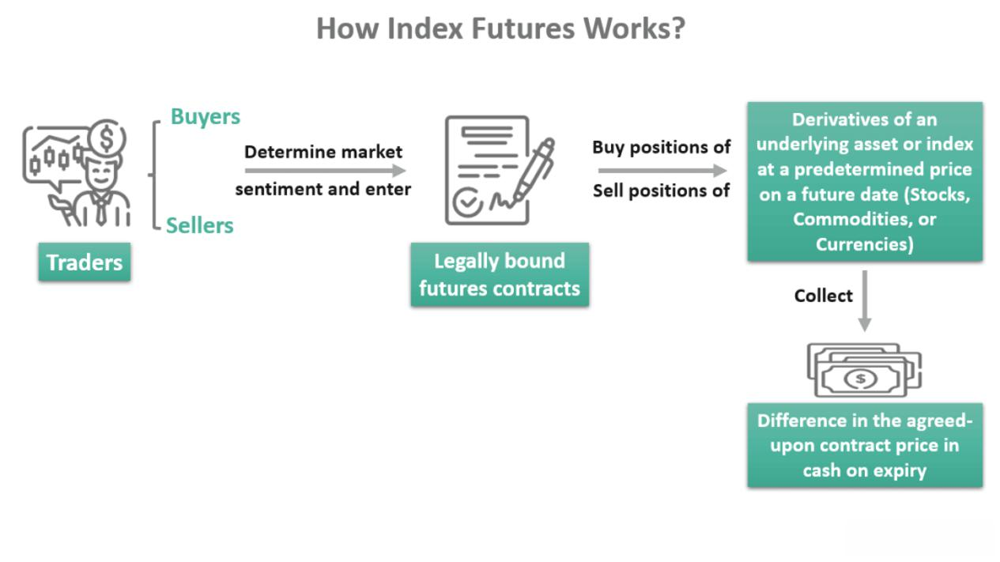

## Table of Contents

## What are index futures contracts?

Index futures contracts are agreements to buy or sell a financial index at a set price on a future date. They are based on stock market indices like the S&P 500 or the Dow Jones Industrial Average. These contracts allow investors to bet on the future direction of the market without actually owning the stocks in the index. For example, if you think the market will go up, you can buy an index futures contract, and if the market does go up, you can sell the contract for a profit.

These contracts are commonly used by investors for hedging and speculation. Hedging means using futures to protect against potential losses in other investments. For instance, if you own a lot of stocks and are worried the market might fall, you can sell index futures to offset any losses in your stock portfolio. On the other hand, speculators use index futures to try to make money from market movements. They don't own the underlying stocks but trade futures contracts based on their predictions of market trends. Index futures are traded on exchanges and are standardized, meaning they have set sizes and expiration dates.

## How do index futures contracts work?

Index futures contracts are like bets on what a stock market index, like the S&P 500, will do in the future. When you buy an index futures contract, you're agreeing to buy the value of that index at a certain price on a specific date. If you think the market will go up, you buy the futures contract. If the market does go up by the time the contract expires, you can sell the contract for more than you paid for it, making a profit. If the market goes down, you lose money because you have to buy the index at a higher price than its current value.

These contracts are also used for something called hedging. Imagine you own a lot of stocks and you're worried the market might fall. You can sell an index futures contract to protect yourself. If the market does fall, the money you lose on your stocks can be made up by the profit you make on the futures contract. This way, you're not as affected by the market going down. Index futures are traded on big exchanges, and they have set sizes and dates when they end, so everyone knows what they're getting into.

## What is the purpose of trading index futures?

People trade index futures for two main reasons: to make money by betting on where they think the market will go, and to protect their other investments from market drops. When someone thinks the market will go up, they can buy an index futures contract. If they're right and the market does go up, they can sell the contract for more than they paid and make a profit. But if they're wrong and the market goes down, they lose money.

The other big reason is to hedge, which means to protect other investments. Imagine you own a lot of stocks and you're worried the market might fall. You can sell an index futures contract to balance out any losses in your stock portfolio. If the market does go down, the money you lose on your stocks can be made up by the profit you make on the futures contract. This way, you're not as affected by the market going down.

## Who typically trades index futures contracts?

Index futures contracts are usually traded by two main groups: big investors like hedge funds and institutional investors, and individual traders. Hedge funds and institutional investors use these contracts a lot because they have a lot of money to invest and they want to manage their risk. They might buy or sell index futures to protect their other investments or to make money from guessing where the market will go. These big investors have the resources and knowledge to handle the ups and downs of the futures market.

Individual traders also trade index futures, but they might do it for different reasons. Some of them are trying to make money by guessing the market's direction, just like the big investors. Others might use index futures to add variety to their investments. Trading index futures can be risky, so individual traders need to understand the market well and be ready for big changes in their investments. Both groups, big investors and individual traders, play important roles in the futures market, making it active and liquid.

## How are index futures contracts priced?

Index futures contracts are priced based on what people think the stock market index will be worth in the future. This guess is influenced by things like how the market is doing right now, interest rates, and how long it is until the contract ends. If people think the market will go up, the price of the futures contract will be higher. If they think it will go down, the price will be lower.

The price of an index futures contract also has to take into account the cost of holding the stocks in the index until the contract ends. This is called the cost of carry, and it includes things like interest rates and any dividends the stocks might pay. The futures price is usually the current value of the index, plus the cost of carry, minus any dividends that would be paid out before the contract ends. This way, the futures price reflects what it would cost to buy the index now and hold it until the contract's expiration date.

## What are the risks associated with trading index futures?

Trading index futures can be risky because the market can go up or down a lot. If you buy a futures contract thinking the market will go up, but it goes down instead, you can lose a lot of money. The futures market moves fast, and small changes in the market can lead to big changes in the price of your contract. This means you need to watch the market closely and be ready to act quickly.

Another risk is something called leverage. When you trade futures, you only need to put down a small amount of money to control a big contract. This can make your profits bigger if you're right, but it also makes your losses bigger if you're wrong. If the market moves against you, you might have to put in more money to keep your position, and if you can't, you could lose everything you put in. It's important to understand these risks and only trade with money you can afford to lose.

## How can index futures be used for hedging?

Index futures can be used for hedging to protect other investments from market drops. Imagine you own a lot of stocks and you're worried the market might go down. You can sell an index futures contract to balance out any losses in your stock portfolio. If the market does go down, the money you lose on your stocks can be made up by the profit you make on the futures contract. This way, you're not as affected by the market going down.

Hedging with index futures is like buying insurance for your investments. You might not make as much money if the market goes up, but you're safer if it goes down. It's a way to keep your investments stable, even when the market is unpredictable. By using index futures to hedge, you can sleep better at night knowing your portfolio is protected.

## What are the differences between index futures and other types of futures contracts?

Index futures are different from other types of futures contracts because they are based on a stock market index, like the S&P 500, instead of a single commodity or asset. Other futures contracts might be for things like oil, gold, or corn. When you trade an index futures contract, you're betting on the direction of the whole market, not just one thing. This makes index futures more about the overall market's performance rather than the price of a specific item.

Another difference is how index futures are used. While commodity futures are often used by businesses to lock in prices for things they need or produce, index futures are mainly used by investors for hedging and speculation. Hedging with index futures helps investors protect their stock portfolios from market drops. Speculating with index futures means trying to make money by guessing where the market will go. So, while commodity futures are more about managing the costs of physical goods, index futures are more about managing investment risks and opportunities.

## How do margin requirements affect trading index futures?

Margin requirements are important when trading index futures because they decide how much money you need to start and keep trading. When you trade index futures, you don't have to pay the full price of the contract right away. Instead, you put down a smaller amount called the initial margin. This lets you control a big contract with less money, which is called trading on margin. But if the market moves against you and the value of your contract goes down, you might need to add more money to your account to meet the maintenance margin. If you can't, your position might be closed, and you could lose money.

These margin requirements can affect how much risk you take when trading index futures. Because you're using less money to control a bigger contract, the potential for both gains and losses is higher. If the market goes your way, you can make more money with less upfront cost. But if it goes against you, you could lose more than you put in. It's important to understand these requirements and manage your money carefully to avoid big losses.

## What are the key factors that influence the value of index futures?

The value of index futures is mainly influenced by what people think the stock market will do in the future. If people think the market will go up, the price of the futures contract will be higher. If they think it will go down, the price will be lower. This guess is based on how the market is doing right now, interest rates, and how long it is until the contract ends. The futures price also has to take into account the cost of holding the stocks in the index until the contract ends, which is called the cost of carry. This includes things like interest rates and any dividends the stocks might pay.

Another big factor is the overall mood of the market. If there's a lot of good news and people feel confident, they might be more willing to buy futures contracts, pushing the price up. But if there's bad news or uncertainty, people might sell their contracts, causing the price to go down. Economic reports, company earnings, and even world events can change how people feel about the market, which in turn affects the value of index futures.

## How do regulatory changes impact the trading of index futures?

Regulatory changes can have a big impact on trading index futures. When rules change, it can affect how much money traders need to start and keep trading, which is called margin requirements. If the rules make margin requirements higher, traders might have to put more money into their accounts, and this can make trading more expensive and less appealing. Also, new rules might limit how much traders can buy or sell, or they might change the way trades are reported. This can make the market less active and harder to predict.

Changes in regulations can also affect how safe and fair the market feels. If new rules make the market seem safer, more people might want to trade index futures, which can make the market more active and liquid. But if the rules seem too strict or confusing, it might scare some traders away. Overall, regulatory changes can change how people trade, how much they trade, and even how much they trust the market.

## What advanced strategies can be employed when trading index futures?

When trading index futures, one advanced strategy is called spreading. This means buying and selling different futures contracts at the same time to make money from the difference in their prices. For example, you might buy a futures contract that expires in one month and sell a contract that expires in three months. If the price difference between these contracts changes in your favor, you can make a profit. Spreading can be less risky than just buying or selling one contract because it helps balance out the ups and downs of the market.

Another strategy is called scalping. This is when traders buy and sell futures contracts very quickly, trying to make small profits from tiny changes in the market. Scalpers need to watch the market closely and act fast. They might trade many times in a day, hoping that all the small profits add up to a big gain. This strategy can be exciting but also stressful because it requires a lot of attention and quick decisions.

A third strategy is using options on index futures. Options give you the right, but not the obligation, to buy or sell a futures contract at a set price before a certain date. Traders can use options to protect their futures positions or to make money from their guesses about where the market will go. For example, if you own a futures contract and you're worried the market might go down, you can buy a put option to limit your losses. Using options can add more ways to make money and protect your investments, but it also makes trading more complex.

## References & Further Reading

[1]: Hull, J. C. (2015). ["Options, Futures, and Other Derivatives."](https://www.semanticscholar.org/paper/Options%2C-Futures%2C-and-Other-Derivatives-Hull/89bdee500c8623864fc9eb7a471546aa713acc44) Pearson Education.

[2]: Malkiel, B. G. (2019). ["A Random Walk Down Wall Street: The Time-Tested Strategy for Successful Investing"](https://yourknowledgedigest.org/wp-content/uploads/2020/04/a-random-walk-down-wall-street.pdf) W. W. Norton & Company.

[3]: Aldridge, I. (2013). ["High-Frequency Trading: A Practical Guide to Algorithmic Strategies and Trading Systems"](https://www.amazon.com/High-Frequency-Trading-Practical-Algorithmic-Strategies/dp/1118343506) Wiley.

[4]: Lopez de Prado, M. (2018). ["Advances in Financial Machine Learning"](https://www.amazon.com/Advances-Financial-Machine-Learning-Marcos/dp/1119482089) Wiley.

[5]: Chan, E. (2017). ["Machine Trading: Deploying Computer Algorithms to Conquer the Markets"](https://github.com/ftvision/quant_trading_echan_book) Wiley Trading.