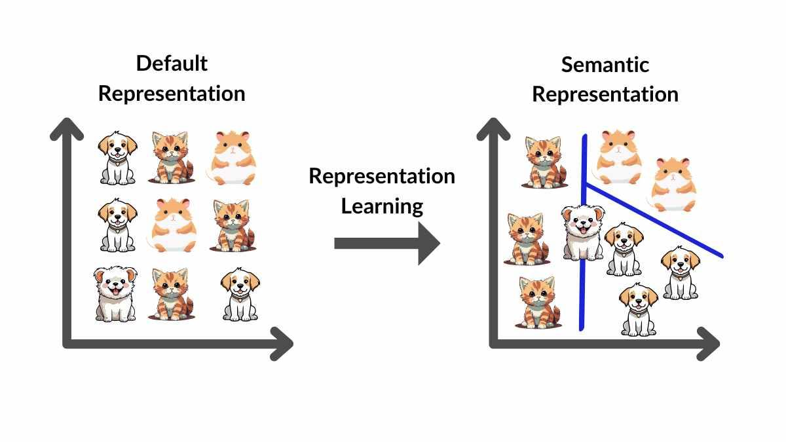

## Table of Contents

## What is representation in the context of machine learning?

In machine learning, representation refers to how data is described or formatted so that a computer can understand and process it. Think of it like translating information into a language that machines can work with. For example, when you want to teach a computer to recognize pictures of cats, you need to represent the images in a way that the computer can analyze. This often involves converting the images into numbers, like pixel values, that can be fed into a machine learning model.

The way data is represented can greatly affect how well a machine learning model performs. If the representation is good, the model can learn more effectively and make better predictions. For instance, if you're trying to predict house prices, representing the data with features like the number of bedrooms, the size of the house, and its location can help the model understand what affects the price. On the other hand, if the data is represented poorly, the model might struggle to find meaningful patterns and make accurate predictions. Choosing the right representation is a crucial step in building successful machine learning systems.

## Why is representation important in machine learning models?

Representation is important in machine learning because it helps the computer understand the data better. When data is represented well, it's easier for a machine learning model to find patterns and make predictions. For example, if you're trying to teach a computer to recognize different types of fruits, you need to represent the images in a way that the computer can analyze, like turning the pictures into numbers that show the color and shape of the fruit. If the representation is good, the model can learn more effectively and make better guesses about new fruits it sees.

If the data is not represented well, the model might have a hard time figuring out what's important. Imagine trying to predict house prices using only the color of the house as a feature. That wouldn't be very helpful because the color doesn't tell you much about the price. But if you represent the house with features like the number of bedrooms, the size of the house, and its location, the model can understand what affects the price better. So, choosing the right way to represent data is a big part of making machine learning models work well.

## How does data representation affect the performance of machine learning algorithms?

Data representation plays a crucial role in how well machine learning algorithms perform. When data is represented in a way that captures the important features clearly, the algorithm can learn patterns more easily. For example, if you're trying to predict whether it will rain, using features like humidity, temperature, and cloud cover will help the algorithm understand the weather better. But if you only use the day of the week as a feature, the algorithm might struggle to make accurate predictions because the day of the week doesn't tell you much about the weather.

On the other hand, poor data representation can lead to poor performance. If the features chosen don't reflect the important aspects of the problem, the algorithm might miss out on key patterns. For instance, if you're trying to classify animals and you represent them only by their weight, the algorithm might not be able to tell the difference between a heavy dog and a heavy cat. Good data representation helps the algorithm see the differences and similarities that matter, making it more effective at learning and predicting.

## What are some common types of data representations used in machine learning?

In machine learning, one common type of data representation is numerical representation. This is where data is turned into numbers that a computer can understand. For example, images can be represented as pixel values, where each pixel has a number that shows how bright or dark it is. Text can be turned into numbers too, like counting how often certain words appear. Numbers are easy for computers to work with, so this type of representation is used a lot.

Another type of data representation is categorical representation. This is used for data that can be put into different groups or categories, like types of fruits or colors. These categories can be turned into numbers using methods like one-hot encoding, where each category gets its own column, and a 1 is put in the column that matches the category. For example, if you have apples, bananas, and oranges, you might have three columns, and if the fruit is an apple, the first column would have a 1, and the others would have 0s.

There are also more complex types of data representations, like embeddings. Embeddings are used to represent things like words or users in a way that captures their relationships. For example, in natural language processing, words can be represented as vectors in a high-dimensional space, where words that have similar meanings are closer together. This helps the machine learning model understand the context and meaning of words better.

## Can you explain the difference between feature representation and data representation?

Feature representation and data representation are closely related but have some key differences. Data representation is about how the raw data is formatted or structured so that a computer can process it. For example, when you take a picture, the data representation might be the pixel values that make up the image. This is the first step in getting the data ready for a machine learning model. Think of it like translating the data into a language that the computer can understand.

Feature representation, on the other hand, is about how the data is described using specific features or characteristics that are important for the machine learning task. For instance, if you're trying to predict house prices, the features might be the number of bedrooms, the size of the house, and its location. These features are chosen because they help the model understand what affects the price. Feature representation is a more refined step that comes after data representation, where you pick out the parts of the data that are most useful for the model to learn from.

## How do you choose the right representation for a machine learning problem?

Choosing the right representation for a machine learning problem starts with understanding the problem you're trying to solve. Think about what kind of data you have and what you want the model to learn. For example, if you're trying to predict whether it will rain, you might want to use features like humidity, temperature, and cloud cover because these things affect the weather. It's important to pick features that capture the important parts of the problem. Sometimes, you might need to try different representations to see which one works best. This can involve experimenting with different ways of turning your data into numbers or using different types of features.

Once you have an idea of what features might be important, you can start to refine your representation. This might mean turning categorical data into numbers using methods like one-hot encoding, or using more complex techniques like embeddings to capture relationships between things like words or users. It's also helpful to look at how other people have solved similar problems and see what representations they used. Remember, the goal is to make the data easy for the machine learning model to understand and learn from. By choosing the right representation, you can help your model perform better and make more accurate predictions.

## What are the challenges associated with high-dimensional data representation?

High-dimensional data representation can be tricky because it involves dealing with a lot of features at the same time. When you have many features, it can be hard for the machine learning model to find the important patterns. This is called the "curse of dimensionality." Imagine you're trying to find a friend in a crowded room. If the room is small, it's easy, but if the room is huge, it's much harder. In the same way, when you have a lot of dimensions, the model has to search through a much larger space to find the patterns it needs. This can make the model take longer to train and can sometimes lead to overfitting, where the model learns the training data too well and doesn't work as well on new data.

Another challenge with high-dimensional data is that it can be hard to visualize and understand. When you have more than three dimensions, you can't easily draw a picture of the data. This makes it harder to see what's going on and to explain the model to other people. To deal with this, people often use techniques like dimensionality reduction, which means finding a way to represent the data using fewer dimensions. For example, Principal Component Analysis (PCA) is a common method that tries to keep the most important information while reducing the number of dimensions. By using these techniques, you can make the data easier to work with and help the model perform better.

## How does representation learning differ from traditional feature engineering?

Representation learning and traditional feature engineering are two different ways to get data ready for machine learning models. In traditional feature engineering, people manually pick out the features they think are important for the model to learn from. For example, if you're trying to predict house prices, you might choose features like the number of bedrooms, the size of the house, and its location. This can work well, but it takes a lot of time and expertise to figure out which features are the best ones to use. Also, if the problem changes or if you want to use the model for something different, you might have to start over and pick new features.

Representation learning, on the other hand, lets the computer figure out the best way to represent the data by itself. Instead of people choosing the features, the machine learning model learns to find the important patterns in the data. This can be done using techniques like neural networks, which can automatically learn to represent the data in a way that helps the model perform better. For example, in image recognition, a neural network might learn to recognize edges and shapes in pictures without being told to do so. This can save a lot of time and can make the model more flexible, because it can adapt to new data or new problems without needing to change the features manually.

## What are some advanced techniques for representation learning in deep learning?

In deep learning, one advanced technique for representation learning is autoencoders. Autoencoders are neural networks that learn how to efficiently compress and encode data, then decode it to reproduce the original input as closely as possible. They work by trying to find a way to represent the data using fewer dimensions, which can help the model understand the most important parts of the data. For example, an autoencoder might take an image, turn it into a smaller set of numbers, and then use those numbers to rebuild the image. This process helps the model learn to focus on the key features of the image, like edges and shapes, without being told what those features are.

Another technique is called generative adversarial networks (GANs). GANs use two neural networks that work together to learn representations of data. One network, called the generator, tries to create new data that looks like the real data, while the other network, called the discriminator, tries to tell the difference between the real data and the fake data made by the generator. As they compete, the generator learns to make better and better representations of the data, and the discriminator gets better at spotting the fakes. This back-and-forth helps both networks learn to understand the important features of the data. For example, a GAN might learn to generate realistic images of faces by figuring out what makes a face look real.

A third technique is transfer learning, where a model trained on one task is used as a starting point for another task. This can be especially useful when you don't have a lot of data for the new task. For example, a model trained to recognize objects in images might be used to help a new model learn to recognize different types of animals. The idea is that the first model has already learned good ways to represent images, so the new model can use those representations as a starting point and then fine-tune them for the new task. This can save a lot of time and help the new model learn faster and perform better.

## How can unsupervised learning be used to improve data representation?

Unsupervised learning can help improve data representation by finding patterns in the data without anyone telling it what to look for. One way it does this is through clustering, where the algorithm groups similar data points together. For example, if you have a bunch of pictures of different animals, the algorithm might group all the pictures of cats together and all the pictures of dogs together. This helps the computer understand the important features that make a cat a cat and a dog a dog, without needing to be told what those features are. By doing this, the algorithm can create a better representation of the data that captures the key differences and similarities between the different groups.

Another way unsupervised learning can improve data representation is through dimensionality reduction. This means finding a way to represent the data using fewer dimensions while keeping the most important information. A common technique for this is Principal Component Analysis (PCA), which looks for the directions in the data that explain the most variation. For example, if you have a lot of data about different houses, like the number of bedrooms, the size of the house, and its location, PCA might find that the size and location are the most important features for understanding the data. By focusing on these features, the algorithm can create a simpler, but still effective, representation of the data that makes it easier for other machine learning models to use.

## What role does transfer learning play in representation learning?

Transfer learning helps representation learning by using what a model has already learned from one task to help it learn a new task. Imagine you're learning to play the guitar and then you start learning the ukulele. Some of the things you learned on the guitar, like how to read music or strum, can help you learn the ukulele faster. In the same way, a model trained on one task, like recognizing objects in pictures, can use what it learned to help it learn a new task, like recognizing different types of animals. This can save a lot of time and help the new model learn better, especially when there's not a lot of data for the new task.

For example, if you have a model that's good at recognizing general objects in images, you can use it as a starting point to train a new model to recognize specific types of flowers. The first model has already learned good ways to represent images, like edges and shapes, so the new model can start with these representations and then fine-tune them to focus on the details that make a rose different from a tulip. This way, the new model doesn't have to start from scratch and can learn faster and more effectively.

## How can we evaluate the effectiveness of different representation methods in machine learning?

To evaluate the effectiveness of different representation methods in machine learning, you can look at how well the model performs when using each representation. One way to do this is by measuring the model's accuracy, which is how often it makes the right predictions. For example, if you're trying to classify pictures of cats and dogs, you can see how many times the model correctly identifies a cat or a dog. Another way is to look at the model's error rate, which is how often it makes mistakes. If one representation leads to a lower error rate or higher accuracy than another, it's probably a better way to represent the data.

You can also use cross-validation to compare different representation methods. Cross-validation means splitting your data into different parts and training the model on some of the parts while testing it on the others. This helps you see how well the model works on data it hasn't seen before. If one representation method gives you better results across different splits of the data, it's likely a more effective way to represent your data. By trying out different representations and seeing how they affect the model's performance, you can choose the one that works best for your problem.