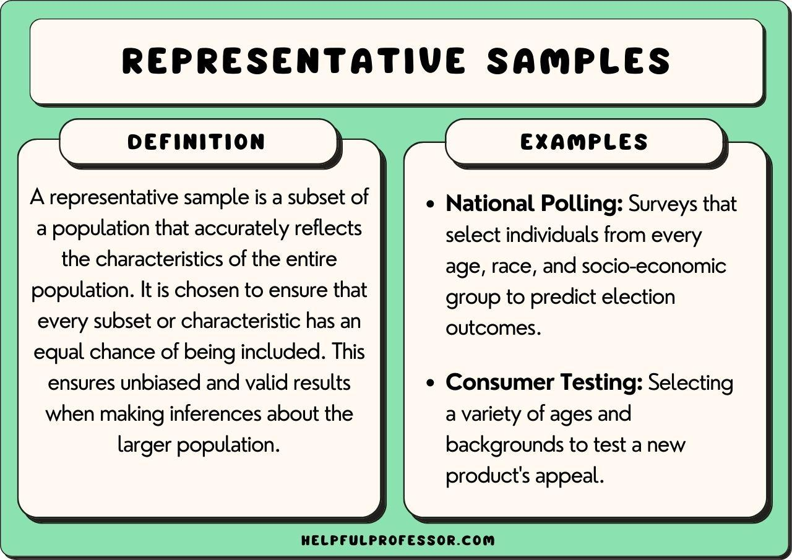

## Table of Contents

## What is a representative sample?

A representative sample is a smaller group of people or items chosen from a larger group, called a population. The idea is to pick this smaller group in a way that it closely matches the larger group in important ways. This means that the sample should have the same mix of characteristics, like age, gender, or income, as the whole population. By doing this, the sample can give us a good idea about what the entire population is like without having to study everyone or everything in it.

Using a representative sample is important because it helps make sure that the results of a study or survey are accurate and can be trusted. If the sample is not representative, the findings might be biased and not reflect the true nature of the population. For example, if you want to know what all the students in a school think about a new rule, you need to make sure your sample includes students from different grades and backgrounds, not just a few friends from one class. This way, the opinions you collect will more likely represent the views of all the students.

## What is a random sample?

A random sample is when you pick people or items from a big group in a way that everyone has an equal chance of being chosen. Imagine you have a big jar of candies and you want to see what flavors are in there. If you close your eyes and pick candies without looking, that's like taking a random sample. Each candy has the same chance of being picked, so your sample should give you a good idea of what the whole jar is like.

Random sampling is important because it helps make sure your sample is fair and not biased. If you only picked candies from the top of the jar, you might miss out on flavors that are at the bottom. By [picking](/wiki/asset-class-picking) randomly, you avoid choosing based on your own preferences or other factors that could skew the results. This way, the sample you get is more likely to represent the whole group accurately.

## How are representative samples and random samples different?

A representative sample is when you pick a smaller group from a bigger group in a way that the smaller group looks a lot like the bigger group. You want the smaller group to have the same mix of things like age, gender, or income as the bigger group. This helps make sure that what you learn from the smaller group can be trusted to tell you about the bigger group. For example, if you want to know what all the people in a city think about a new park, you need to make sure your sample includes people from different parts of the city and different backgrounds.

A random sample is when you pick people or things from a big group in a way that everyone has the same chance of being chosen. It's like picking names out of a hat. This method helps make sure your sample is fair and not biased. If you're studying the health of students in a school, you might pick students randomly so that you don't just get the ones who are easy to find or who volunteer. Random sampling doesn't always guarantee a representative sample, though, because by chance, you might end up with a group that doesn't match the bigger group well.

The main difference between the two is that a representative sample focuses on matching the characteristics of the bigger group, while a random sample focuses on giving everyone an equal chance of being picked. Sometimes, a random sample can also be representative, but it's not guaranteed. If you want to make sure your sample is both random and representative, you might need to use special methods to pick your sample carefully.

## Why is it important to use a representative sample in research?

Using a representative sample in research is important because it helps make sure that the results of the study can be trusted. When a sample is representative, it means that it looks a lot like the whole group you are studying. This way, what you learn from the sample can tell you about the bigger group. If you want to know what all the people in a town think about a new law, you need to make sure your sample includes people from different ages, jobs, and backgrounds. If it doesn't, your results might only show what a small part of the town thinks, and that could be misleading.

A representative sample also helps avoid bias in research. Bias happens when the sample doesn't match the bigger group well, and this can make the results unfair or wrong. For example, if you're studying how much people exercise and you only ask people at a gym, your results won't show what everyone does. By using a representative sample, you can be more sure that your findings are accurate and can be used to make good decisions. This is really important in fields like medicine, politics, and business, where decisions based on research can affect a lot of people.

## Can a random sample also be a representative sample?

Yes, a random sample can also be a representative sample, but it's not guaranteed. When you pick people or things randomly, everyone has an equal chance of being chosen. If you're lucky, the group you pick will look a lot like the bigger group in important ways, like age, gender, or income. This means your random sample would also be representative.

However, sometimes random sampling might not give you a representative sample. By chance, you might end up with a group that doesn't match the bigger group well. For example, if you randomly pick people from a city and end up with mostly young people, your sample won't represent the whole city, which has people of all ages. To make sure your sample is both random and representative, you might need to use special methods to pick your sample carefully.

## What are the methods used to obtain a representative sample?

One way to get a representative sample is by using stratified random sampling. This method involves dividing the big group into smaller groups, or strata, based on important characteristics like age or gender. Then, you pick people randomly from each of these smaller groups. This helps make sure that your sample includes people from all the different parts of the big group in the right amounts. For example, if you want to study the health of a town where 60% of people are adults and 40% are kids, you would pick 60% adults and 40% kids for your sample.

Another method is called cluster sampling. In this method, you divide the big group into smaller groups or clusters, like neighborhoods or schools. Then, you pick some of these clusters randomly and study everyone in them. This can be a good way to get a representative sample if the clusters are similar to each other. For example, if you want to know what people in a city think about a new law, you might pick a few neighborhoods randomly and ask everyone in those neighborhoods. This can save time and money compared to trying to pick people randomly from the whole city.

Sometimes, researchers use a method called systematic sampling. This involves picking every nth person or item from a list of the whole group. For example, if you have a list of all the students in a school and you want a sample of 100 students, you might pick every 10th student on the list. This can be a simple way to get a representative sample if the list is in a random order. But if the list is organized in a way that groups similar people together, like by grade, this method might not give you a good sample.

## What are the methods used to obtain a random sample?

One way to get a random sample is by using simple random sampling. This is when you pick people or things from a big group in a way that everyone has the same chance of being chosen. It's like drawing names out of a hat. You can do this by using a computer to pick numbers randomly or by writing names on pieces of paper and picking them without looking. This method is good because it's fair and helps avoid choosing based on your own preferences.

Another method is called systematic sampling. In this method, you pick every nth person or item from a list of the whole group. For example, if you have a list of all the students in a school and you want a sample of 100 students, you might pick every 10th student on the list. This can be a simple way to get a random sample if the list is in a random order. But if the list is organized in a way that groups similar people together, like by grade, this method might not give you a good sample.

## How does sample size affect the representativeness of a sample?

Sample size can affect how well a sample represents the whole group. A bigger sample usually gives a better picture of the whole group because it's more likely to include different kinds of people or things. If you're studying what people in a city think about a new park, a small sample might miss out on some groups, like older people or families with kids. A larger sample is more likely to include these groups, making the sample more representative.

However, even a big sample can be unrepresentative if it's not chosen carefully. For example, if you pick people randomly but end up with mostly young adults, your sample won't represent the whole city well, no matter how big it is. So, while a larger sample can help, it's also important to use the right methods to make sure the sample matches the bigger group in important ways.

## What are the potential biases in random sampling?

Random sampling is a good way to pick a sample because it gives everyone an equal chance of being chosen. But sometimes, even with random sampling, biases can sneak in. One kind of bias is called selection bias. This happens if some people or things are more likely to be picked than others. For example, if you're studying people in a city and you pick names from a list, but the list only includes people who are registered to vote, you might miss out on people who don't vote. This can make your sample not represent the whole city well.

Another bias that can happen in random sampling is non-response bias. This happens when some people who are picked don't want to be part of the study. If the people who don't respond are different from the people who do, this can change your results. For example, if you're asking people about their health and the people who are sick are less likely to answer, your sample might seem healthier than the whole group really is. To avoid these biases, it's important to check your sample carefully and try to include everyone who should be part of it.

## How can you assess whether a sample is truly representative?

To check if a sample is truly representative, you need to compare it to the whole group you're studying. Look at things like age, gender, income, and other important characteristics. Make sure the sample has the same mix of these things as the bigger group. For example, if you're studying a town where 50% of people are women, your sample should also be about 50% women. You can use numbers and charts to see if your sample matches the bigger group well.

Another way to assess if a sample is representative is by looking at the results of your study. If the findings make sense and match what you know about the whole group, that's a good sign. For example, if your sample says that most people in a town like a new park, but you know from other sources that people don't go there much, your sample might not be representative. Talking to experts or doing more research can help you figure out if your sample is a good match for the bigger group.

## What statistical techniques are used to compare representative and random samples?

To compare representative and random samples, researchers often use statistical techniques like chi-square tests and t-tests. A chi-square test helps see if the characteristics in your sample, like age or gender, match the bigger group well. For example, if your town has 60% adults and 40% kids, a chi-square test can tell you if your sample has the same mix. If the test shows a big difference, your sample might not be representative. A t-test, on the other hand, is used to compare the averages of two groups. If you want to know if the average income in your sample is close to the average income in the whole group, a t-test can help you find out.

Another technique is analysis of variance (ANOVA), which can compare more than two groups at once. If you have different groups in your sample, like people from different neighborhoods, ANOVA can help you see if these groups are similar to the whole group in important ways. By using these statistical techniques, researchers can check if their sample is a good match for the bigger group and if the results of their study can be trusted.

## In what scenarios might a researcher prefer a random sample over a representative sample, and vice versa?

A researcher might prefer a random sample when they want to make sure everyone in the bigger group has an equal chance of being picked. This is important when they want to avoid bias and keep things fair. For example, if they're studying the health of people in a city, they might use a random sample to make sure they don't just pick people from one part of the city or who are easy to reach. Random sampling is also simpler and can be faster to do, which is helpful when time and money are limited.

On the other hand, a researcher might choose a representative sample when they need to make sure their results can be trusted to tell them about the whole group. This is important in studies where the mix of people in the sample really matters. For example, if they're studying what people in a town think about a new law, they need a sample that includes people from different ages, jobs, and backgrounds. A representative sample helps make sure the findings are accurate and can be used to make good decisions that affect everyone in the group.

## References & Further Reading

[1]: Bergstra, J., Bardenet, R., Bengio, Y., & Kégl, B. (2011). ["Algorithms for Hyper-Parameter Optimization."](https://dl.acm.org/doi/10.5555/2986459.2986743) Advances in Neural Information Processing Systems 24.

[2]: ["Advances in Financial Machine Learning"](https://www.amazon.com/Advances-Financial-Machine-Learning-Marcos/dp/1119482089) by Marcos Lopez de Prado

[3]: ["Evidence-Based Technical Analysis: Applying the Scientific Method and Statistical Inference to Trading Signals"](https://www.amazon.com/Evidence-Based-Technical-Analysis-Scientific-Statistical/dp/0470008741) by David Aronson

[4]: ["Machine Learning for Algorithmic Trading"](https://github.com/stefan-jansen/machine-learning-for-trading) by Stefan Jansen

[5]: ["Quantitative Trading: How to Build Your Own Algorithmic Trading Business"](https://www.amazon.com/Quantitative-Trading-Build-Algorithmic-Business/dp/1119800064) by Ernest P. Chan