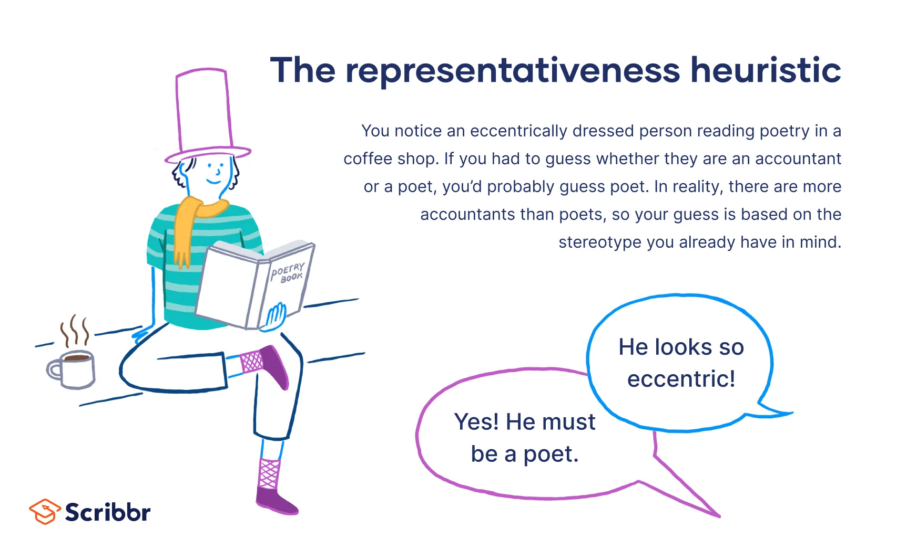

## Table of Contents

## What is representativeness bias?

Representativeness bias is when people judge the likelihood of something based on how much it looks like a typical example, instead of using all the facts. For example, if someone thinks all librarians are quiet and introverted, they might assume a quiet person they meet is a librarian, even if they have no other evidence.

This kind of thinking can lead to mistakes because it ignores important details. It's like assuming all big dogs are aggressive just because some are. By focusing too much on stereotypes or typical examples, people can miss out on understanding the full picture and make wrong guesses about others or situations.

## Can you provide an example of representativeness bias in everyday life?

Imagine you're at a party and you meet someone who is wearing glasses and carrying a book. You might quickly think they are a typical "nerd" because they fit the stereotype of what a nerd looks like. You might assume they love studying and aren't interested in sports or fun activities, even though you don't know anything else about them. This is representativeness bias because you're judging them based on how much they match your idea of a nerd, not on who they really are.

Another example is when people think all older people are bad with technology. If you see an older person struggling with a smartphone, you might think, "Oh, they're just like all old people, they can't handle technology." But maybe that person just got the phone and hasn't learned how to use it yet. By assuming they fit the stereotype of older people being bad with tech, you're not considering other reasons they might be struggling. This is representativeness bias because you're using a general idea to judge a specific situation without all the facts.

## How does representativeness bias affect decision-making?

Representativeness bias can make our decisions less accurate because we rely too much on stereotypes or typical examples. When we make choices based on how much something looks like what we expect, we might ignore important details that don't fit our assumptions. For example, if a manager is hiring and sees a candidate who looks like their idea of a "successful employee," they might choose that person without considering other important skills or experiences the candidate might lack.

This bias can lead to mistakes in many areas of life, like investing, where people might pick stocks based on recent performance without looking at the bigger picture. In everyday life, it can affect how we judge people or situations. If we think all quiet people are shy, we might miss out on getting to know someone who is quiet but very outgoing once you get to know them. By understanding representativeness bias, we can try to make better decisions by looking at all the facts, not just the ones that fit our expectations.

## What are the key characteristics that lead to representativeness bias?

Representativeness bias happens when we think something is more likely just because it looks like what we expect. It's like thinking all tall people must be good at basketball because they fit the image of a basketball player. This bias comes from our brains wanting to make quick judgments based on what we already know, so we use stereotypes or typical examples to decide things fast. But this can make us miss important details that don't fit our assumptions.

Another key thing about representativeness bias is that it makes us ignore other information that might be important. For example, if we see someone who looks like a typical "nerd," we might not notice their other skills or interests that don't match that stereotype. This can lead to mistakes in how we judge people or make decisions. By understanding this bias, we can try to look at all the facts, not just the ones that fit our expectations, and make better choices.

## How can representativeness bias be distinguished from other cognitive biases?

Representativeness bias is different from other cognitive biases because it's about judging things based on how much they look like what we expect. For example, if someone looks like a typical "nerd," we might assume they are good at math and not interested in sports. This bias makes us focus on stereotypes and ignore other important details. It's like thinking all big dogs are aggressive because some are, without considering that the big dog you meet might be friendly.

Other biases work differently. For example, confirmation bias is when we look for information that supports what we already believe and ignore things that don't. If you think all big dogs are aggressive, confirmation bias would make you remember times when big dogs were aggressive and forget the times they were friendly. Availability bias is another one, where we think things are more likely because they're easier to remember. If you heard a lot about big dogs being aggressive recently, you might think all big dogs are aggressive because those stories are fresh in your mind. Representativeness bias is unique because it's about how much something matches our idea of what it should be, not about seeking out certain information or relying on what's easy to remember.

## What are the psychological theories behind representativeness bias?

Representativeness bias comes from how our brains try to make quick judgments. One psychological theory behind it is the heuristic theory, which says we use mental shortcuts to make decisions faster. When we see something that looks like our idea of what it should be, we assume it fits that category. For example, if someone looks like a typical "nerd," we might think they're good at math because they fit that stereotype. This shortcut helps us make decisions quickly, but it can lead to mistakes if we ignore other important details.

Another theory is the categorization theory, which explains that we group things into categories to understand the world better. When something looks like it belongs to a certain category, we assume it has all the traits of that category. For example, if we see a person wearing glasses and reading a book, we might put them in the "nerd" category and assume they're not interested in sports. This can lead to representativeness bias because we're judging them based on how well they fit into that category, not on who they really are. By understanding these theories, we can see why we make these kinds of judgments and try to be more aware of when we're using them.

## How does representativeness bias impact financial decisions?

Representativeness bias can make people make bad choices with their money. For example, if a company's stock did well last year, someone might think it will do well again this year just because it looks like a good investment. But they might not look at other important things, like if the company's product is still popular or if the economy is doing well. By focusing too much on how the stock did before, they could miss out on other facts that show it might not be a good choice now.

This bias can also make people pick investments based on stereotypes. For instance, if someone thinks all tech companies are always growing, they might invest in a tech stock without checking if that company is actually doing well. They might ignore signs that the company is struggling, just because it fits their idea of a successful tech company. This can lead to losing money because they didn't look at all the information before deciding.

## What are some common misconceptions about representativeness bias?

One common misconception about representativeness bias is that it only affects people who aren't smart or educated. But that's not true. Everyone can fall into this kind of thinking because it's a natural way our brains try to make quick decisions. Even people who know a lot about a subject can still make mistakes if they rely too much on how things look instead of looking at all the facts.

Another misconception is that representativeness bias is the same as other biases, like confirmation bias or availability bias. While they can all lead to wrong decisions, they work differently. Representativeness bias is about judging things based on how much they look like what we expect, not about looking for information that supports what we already believe or relying on what's easy to remember. Understanding these differences can help us be more aware of when we're using representativeness bias and try to make better choices.

## How can one mitigate the effects of representativeness bias in professional settings?

In professional settings, you can reduce the impact of representativeness bias by being more aware of your own thinking. When you're making decisions, like hiring someone or [picking](/wiki/asset-class-picking) a project, take a moment to think about why you're choosing that option. Ask yourself if you're basing your decision on stereotypes or if you're looking at all the facts. For example, if you think someone would be good at a job because they look like they fit the typical image of that role, stop and check their skills and experience to make sure they really are the best choice.

Another way to mitigate representativeness bias is to get input from others. When you're making important decisions, talk to your team or colleagues and ask for their thoughts. They might see things you missed because they don't have the same stereotypes or expectations. This can help you make more balanced decisions. Also, using clear criteria and data to make choices can help. For example, if you're hiring, use a list of specific skills and experiences you need, and judge everyone based on that list, not on how they look or what you expect them to be like.

## What role does representativeness bias play in statistical reasoning and probability judgments?

Representativeness bias can make people bad at understanding statistics and probabilities. It happens when we think something is more likely just because it looks like what we expect. For example, if a coin has come up heads five times in a row, we might think tails is more likely next because we expect the coin to even out. But really, each flip is still 50/50, no matter what happened before. By focusing on what looks typical, we miss the real chances and make wrong guesses.

This bias also affects how we see patterns in data. If we see a small sample that looks like a bigger group, we might think it's a good representation of the whole group. For instance, if we survey a few people who all like a new product, we might think everyone will like it, even if we haven't asked enough people. By relying on how much the sample looks like what we expect, we ignore other important information and can make bad decisions based on incomplete data.

## How have experimental studies demonstrated the effects of representativeness bias?

Experimental studies have shown how representativeness bias can lead us to make wrong guesses about things. In one famous study by psychologists Amos Tversky and Daniel Kahneman, they asked people to guess if a person named Linda was more likely to be a bank teller or a bank teller who was active in the feminist movement. Most people said Linda was more likely to be the feminist bank teller because she fit the stereotype of a feminist. But the truth is, it's more likely she's just a bank teller because that group includes all bank tellers, even the feminists. This study shows how we can make mistakes by focusing too much on how things look instead of the real chances.

Another study looked at how people judge the likelihood of events based on small samples. Researchers found that people often think a small group is a good example of a bigger group if it looks like what they expect. For example, if a few people in a small survey all like a new product, people might think everyone will like it, even if they haven't asked enough people. This can lead to wrong decisions because we're relying on how much the small group looks like what we expect, not on all the facts. These studies help us see how representativeness bias can trick us into making bad choices by focusing too much on stereotypes and typical examples.

## What are the advanced strategies for overcoming representativeness bias in complex decision-making scenarios?

In complex decision-making scenarios, one advanced strategy to overcome representativeness bias is to use structured decision-making processes. This means setting up clear steps and criteria for making choices. For example, if you're deciding which project to fund, you could make a list of what's important, like cost, potential impact, and team experience. Then, you judge each project based on those criteria, not on how much it looks like a typical good project. By focusing on specific facts and data, you can make sure you're not just going with what seems right at first glance.

Another strategy is to use diverse teams and seek out different perspectives. When people from different backgrounds and experiences work together, they can see things in different ways. This can help spot when someone is relying too much on stereotypes or typical examples. For instance, if everyone on a team thinks a certain type of person is always good at a job, someone from a different background might point out that this isn't always true. By listening to these different views, you can make more balanced decisions and avoid the traps of representativeness bias.

## What is the impact of representativeness bias on algorithmic trading?

Representativeness bias poses significant challenges to [algorithmic trading](/wiki/algorithmic-trading) by influencing the way algorithms are developed and how they function in dynamic market environments. When coding trading algorithms, developers may inadvertently adopt strategies that closely imitate past successes, without adequately accounting for current market variables that diverge from historical norms. This approach can hinder the algorithm’s ability to adapt to new conditions, making it susceptible to performance issues.

This bias often leads to an overreliance on recent market trends, with algorithms projecting those trends to persist into the future despite evidence of potential change. For instance, an algorithm might consistently forecast upward trends because of a short-term bullish market, ignoring the variability and possible downturns indicated by other economic factors. The formula used by such algorithms might look something like this:

$$
\text{Predicted Value} = \alpha \times \text{Historical Trend} + \beta \times \text{Current Indicator}
$$

In this equation, a high value of $\alpha$ relative to $\beta$ emphasizes historical trends over current indicators, highlighting potential bias towards representativeness.

Furthermore, algorithms affected by representativeness bias may overestimate the probability of certain outcomes based solely on historical data patterns, which can be detrimental in atypical market scenarios. For example, if an algorithm predicts stock price movements based exclusively on patterns seen in a historical bull market, it may underperform or incur losses when unexpected variables like geopolitical events or sudden policy changes arise.

By focusing primarily on surface-level resemblances and past patterns, this bias can obscure crucial economic indicators and [statistics](/wiki/bayesian-statistics) that are essential for informed decision-making. For effective algorithmic trading, these cues should be integrated into the model to allow for a comprehensive analysis of prevailing conditions.

Understanding representativeness bias and acknowledging its repercussions are critical for optimizing algorithmic strategy development. Developers can achieve more data-informed and accurate strategies by counterbalancing this bias, thereby enhancing the overall reliability and robustness of trading outcomes.

## What are strategies to mitigate representativeness bias?

To reduce the influence of representativeness bias on algorithmic trading, several effective strategies can be implemented. These strategies enhance the objectivity and reliability of trading algorithms by ensuring a more data-driven approach rather than simply drawing parallels with past events.

First, incorporating comprehensive statistical analysis into algorithmic models is crucial. This involves using advanced statistical techniques and models that evaluate current data in its entirety. By focusing on statistical relationships and distributions rather than superficial similarities, traders can make more informed decisions. Techniques such as regression analysis, time series analysis, and [machine learning](/wiki/machine-learning) can help in crafting algorithms that respond to real-time data more accurately. For example, a linear regression model can be used to understand the relationship between different economic indicators and stock prices:

$$

Y = \beta_0 + \beta_1X_1 + \beta_2X_2 + \ldots + \beta_nX_n + \epsilon 
$$

where $Y$ is the dependent variable (like stock price), $\beta_0$ is the intercept, $\beta_1, \beta_2, \ldots, \beta_n$ are the coefficients, $X_1, X_2, \ldots, X_n$ are the independent variables (like economic indicators), and $\epsilon$ is the error term.

Second, diversifying data sources and integrating various perspectives helps mitigate the dependence on familiar patterns. By incorporating diverse datasets and viewpoints, traders can develop a well-rounded view of the market, thereby minimizing the likelihood of biased judgments. Different data sources may offer unique insights into market trends and anomalies, which can be overlooked if relying solely on a limited set of data.

Another significant strategy is slowing down the decision-making process. Implementing mechanisms that introduce intentional delays or checkpoints can provide the algorithm with more time to analyze and verify the data before executing trades. This approach allows for more thorough reflection on the data, reducing the risks associated with impulsive decisions driven by cognitive biases.

Finally, by implementing these measures, traders can enhance the accuracy and reliability of their algorithmic trading systems. Through rigorous statistical analysis, data diversification, and paced decision-making, algorithms can be made more resilient to biases, ultimately leading to more successful trading outcomes. Employing these strategies not only improves the robustness of trading algorithms but also aligns trading practices with a more empirical, evidence-based framework.

## References & Further Reading

[1]: Tversky, A., & Kahneman, D. (1974). ["Judgment under Uncertainty: Heuristics and Biases."](https://www2.psych.ubc.ca/~schaller/Psyc590Readings/TverskyKahneman1974.pdf) Science, 185(4157), 1124-1131.

[2]: Barberis, N., & Thaler, R. (2003). ["A Survey of Behavioral Finance."](https://www.nber.org/papers/w9222) In Handbook of the Economics of Finance (Vol. 1, pp. 1053-1128). Elsevier.

[3]: Kahneman, D., & Tversky, A. (1983). ["Extensional versus intuitive reasoning: The conjunction fallacy in probability judgment."](https://psycnet.apa.org/record/1984-03110-001) Psychological Review, 90(4), 293.

[4]: Golec, J., & Tamarkin, M. (1998). ["Bettors Love Skewness, Not Risk, at the Horse Track."](https://papers.ssrn.com/sol3/papers.cfm?abstract_id=58548) Journal of Political Economy, 106(1), 205-225.

[5]: Brynjolfsson, E., & McAfee, A. (2014). ["The Second Machine Age: Work, Progress, and Prosperity in a Time of Brilliant Technologies."](https://psycnet.apa.org/record/2014-07087-000) W.W. Norton & Company.